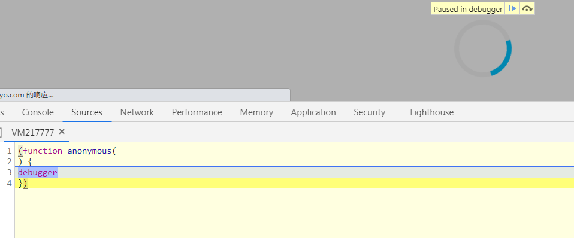
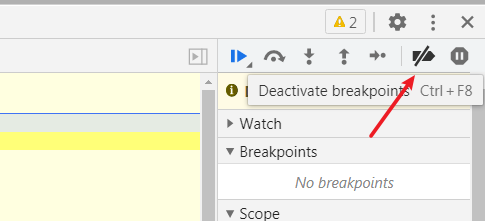
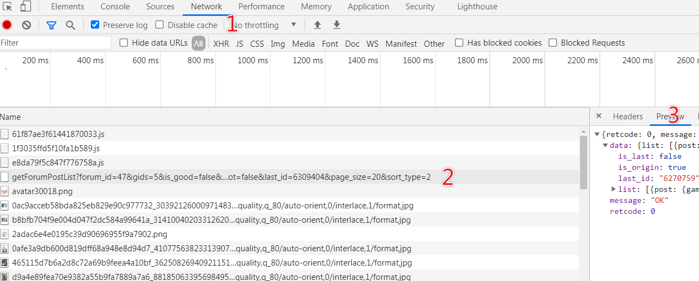
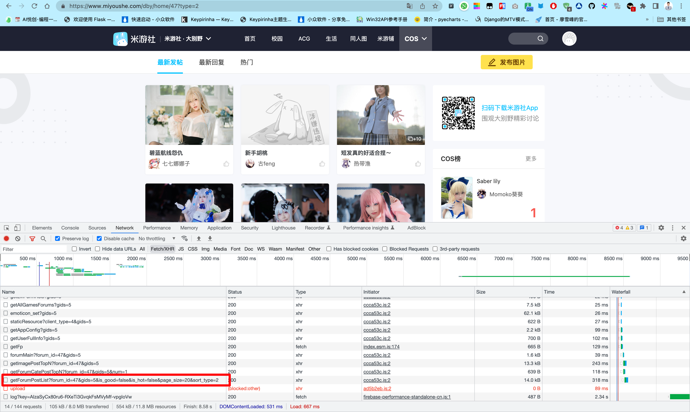
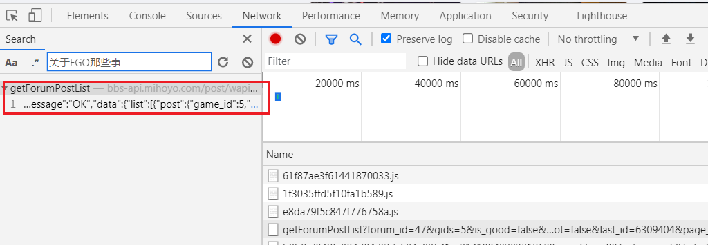
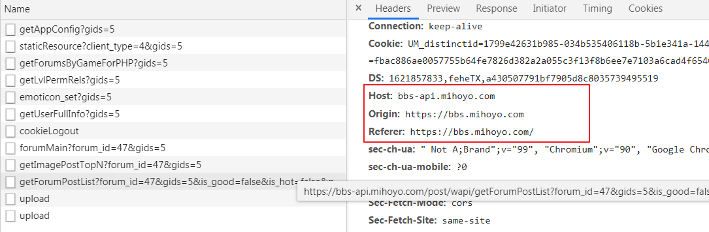
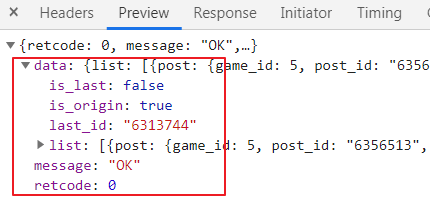
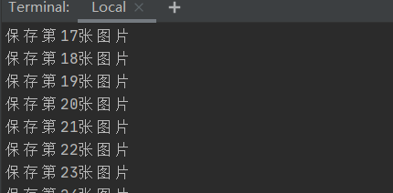
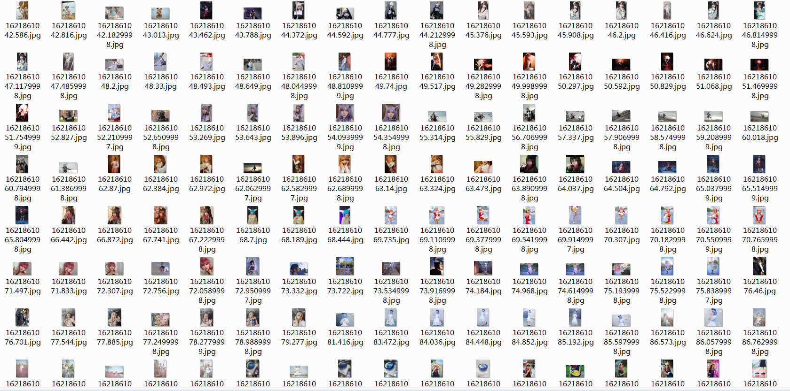

## 0. coser 美图，用 Python 给她续上，再爬 2000 张

你好，我悦创。

上一篇文章中有朋友说，为什么不用 BS4（一款爬虫解析框架）？答：会使用的，还没到时间。

爬虫 800 例系列教程，每篇博客都是一个实操案例，整个学习过程是循序渐进的，在初期阶段，我们将使用 `requests` 库与 `re` 模块进行爬虫编写。

而且，为了让课程更加有趣，我们将在爬**美图**的路上停留一段时间。

所以看到本文的朋友，可以点赞、收藏、关注啦。

## 1. 目标数据源分析

### 1.1 本次待抓取的目标地址为：

[https://bbs.mihoyo.com/dby/home/47?type=2](https://bbs.mihoyo.com/dby/home/47?type=2)


该页面为图片列表页，采用下拉浏览器刷新形式进行数据加载。

分析该页面数据，需要借助谷歌浏览器自带的开发者工具，通过 F12 唤醒开发者工具。

此时第一个问题出现，该网站使用 JS 调试禁止用户唤醒开发者工具。

即网页 JS 注入了下述代码：

```javascript
(function anonymous() {
  debugger;
});
```

添加该反爬手段之后，打开开发者工具如下图所示。



解决办法非常简单，禁用浏览器 JS 调试，点击开发者工具右侧所示按钮，即可屏蔽该反爬手段。



### 1.2 抓取目标：

抓取该网站的图片，目标 3000 张。

### 1.3 用到的 Python 框架为：

requests 库、json 模块。

### 1.4 其它技术栈补充：

JSON 格式数据解析「教程链接之后添加，你可以记得提醒」

### 1.5 目标网站地址规则：

获取列表页数据规则，通过开发者工具中 `Network` 视图配合滑动浏览器滚轮操作。





上图 `1/2/3` 分别是点击步骤，滚动浏览器，寻找数据接口，在 `Network` 视图下捕获浏览器向网站服务器发送的所有数据请求，并查阅浏览器响应。

为获取接口，可进行反复测试，直到确定数据所在接口，即在位置 3 的视图中，找到网页中的图片地址或者文字。

快速检索接口方式，在开发者工具窗口中，按下 Ctrl+F 按键，唤醒检索工具，输入待查询文字，回车搜索，可直接定位到接口地址。



以上步骤是检索数据接口常用的手段之一，在后续的博客中会反复提及，请务必掌握。

最终得到的数据接口如下：

```python
https://bbs-api.mihoyo.com/post/wapi/getForumPostList?forum_id=47&gids=5&is_good=false&is_hot=false&last_id=6309404&page_size=20&sort_type=2
```

该接口通过 `GET` 形式访问，其中参数中可依据名字进行猜测：

- `page_size`：每页数据量，默认是 20；
- `forum_id`：板块 ID，与 URL 地址一致，为 47；
- `is_good`：未知含义；
- `is_hot`：是否热门；
- `last_id`：上一条数据 ID；
- `sort_type`：排序类型；
- `gids`：未知含义。

继续针对图片详情页进行分析，打开任意详情页。

[https://bbs.mihoyo.com/dby/article/6270759](https://bbs.mihoyo.com/dby/article/6270759)

该页面详情页地址，只有最后的数字 `6270759` 发生了变化，并且该数字可以在列表页接口获取到。

通过开发者工具继续捕获接口，得到图片详情页也是基于接口进行数据返回，筛选后得到的接口如下。

```python
https://bbs-api.mihoyo.com/post/wapi/getPostFull?gids=5&post_id=6270759&read=1
```

目标数据源分析完毕，就可以进行基本的需求描述了。

## 2. 整理需求如下

1. 列表页面无法批量生成，需要指定一个起始 ID，下一次的抓取基于该 ID 值；
2. 基于列表页接口返回，直接拼接详情页接口；
3. 抓取详情页图片数据；
4. 保存数据；
5. 得到 3000 张图片之后，开始欣赏。

## 3. 代码实现时间

本次待爬取的目标网站在编码过程中，发现网站验证了请求头，这是一种最基本的反爬手段。

在代码文件中，首先编写通用请求函数，将请求头中的 `HOST` 提取出来，默认 `HOST` 设置为 `bbs-api.mihoyo.com`，该值可通过开发者工具获取，获取方式可参考代码之后图示。

```python
# 请求函数
def request_get(url, ret_type="text", timeout=5, encoding="utf-8", host="bbs-api.mihoyo.com"):
    headers = {
        "User-Agent": "Mozilla/5.0 (Windows NT 6.1; Win64; x64) AppleWebKit/537.36 (KHTML, like Gecko) Chrome/90.0.4430.93 Safari/537.36",
        "Origin": "https://bbs.mihoyo.com",
        "Referer": "https://bbs.mihoyo.com/",
        "Host": host
    }
    res = requests.get(url=url, headers=headers, timeout=timeout)
    res.encoding = encoding
    if ret_type == "text":
        return res.text

    elif ret_type == "image":
        return res.content

    elif ret_type == "json":
        return res.json()
```




上述代码增加了 `JSON` 格式的数据返回，对于该格式的数据，你可以参考 Python 字典知识进行操作。

## 4. 从起始种子开始抓起

使用上文获取到的列表页数据，列表页地址通过 `f-strings` 形式进行格式化，你也可以使用其它形式，例如 `"".format()` 或者 `%` 语法进行格式化字符串。

`main` 函数的起始值，使用你获取到的值即可，也可以使用下述我提供给你的值。

```python
# 抓取函数
def main(last_id):
    # 起始页面
    url = f"https://bbs-api.mihoyo.com/post/wapi/getForumPostList?forum_id=47&gids=5&is_good=false&last_id={last_id}&is_hot=false&page_size=20&sort_type=2"
    res_json = request_get(url, ret_type="json", timeout=5)
    if res_json["retcode"] == 0:
        for item in res_json["data"]["list"]:
            # 抓取内页数据
            detail(item["post"]["post_id"])

if __name__ == '__main__':
    main(6356513)
```

该接口返回的 `JSON` 数据格式如下，重要参数为 `retcode`、`last_id`、`list`，数据都存在 `list` 中。



## 5. 调用图片内页接口

上述代码最终的目的是得到 `post_id` 值，因该值是后续接口的必备参数。完善 `detail` 函数，代码如下：

```python
# 保存图片
def save_image(image_src):
    content = request_get(image_src, "image", host="upload-bbs.mihoyo.com")
    with open(f"{str(time.time())}.jpg", "wb") as f:
        f.write(content)
        global total
        total += 1
        print(f"保存第{total}张图片")


# 抓取内页数据
def detail(post_id):
    url = f"https://bbs-api.mihoyo.com/post/wapi/getPostFull?gids=5&post_id={post_id}&read=1"
    res_json = request_get(url, ret_type="json", timeout=5)
    if res_json["retcode"] == 0:
        image_list = res_json["data"]["post"]["image_list"]
        for img in image_list:
            img_url = img["url"]
            if (img_url.find("weigui")) < 0:
                save_image(img_url)
```

声明一个全局变量 `total`，用于记录爬取图片总数，在获取图片数据时，发现存在部分 Coser 图片违规，估计尺度过大的原因，返回的图片链接包含字符串 `weigui.jpg`，故针对性进行数据清洗。

```python
global total

if __name__ == '__main__':
    global total
    total = 0
    main(6356513)
```

## 6. 迭代爬取

此时代码只爬取一页数据，无法达到我们的 3000 张图片目标，修改 `main` 函数，实现简单递归。

```python
# 抓取函数
def main(last_id):
    # 起始页面
    url = f"https://bbs-api.mihoyo.com/post/wapi/getForumPostList?forum_id=47&gids=5&is_good=false&last_id={last_id}&is_hot=false&page_size=20&sort_type=2"
    res_json = request_get(url, ret_type="json", timeout=5)
    if res_json["retcode"] == 0:
        for item in res_json["data"]["list"]:
            # 抓取内页数据
            detail(item["post"]["post_id"])

    if res_json["data"]["last_id"] != "":
        return main(res_json["data"]["last_id"])
```

运行代码，此时图片一张一张的存储到了我们电脑中，爬取过程中为防止超时，建议自行添加 `try-catch` 跳过错误。





## 7. 完整代码

```python
import requests
import time

global total


# 请求函数
def request_get(url, ret_type="text", timeout=5, encoding="utf-8", host="bbs-api.mihoyo.com"):
    headers = {
        "User-Agent": "Mozilla/5.0 (Windows NT 6.1; Win64; x64) AppleWebKit/537.36 (KHTML, like Gecko) Chrome/90.0.4430.93 Safari/537.36",
        "Origin": "https://bbs.mihoyo.com",
        "Referer": "https://bbs.mihoyo.com/",
        "Host": host
    }
    res = requests.get(url=url, headers=headers, timeout=timeout)
    res.encoding = encoding
    if ret_type == "text":
        return res.text

    elif ret_type == "image":
        return res.content

    elif ret_type == "json":
        return res.json()


# 保存图片
def save_image(image_src):
    content = request_get(image_src, "image", host="upload-bbs.mihoyo.com")
    with open(f"{str(time.time())}.jpg", "wb") as f:
        f.write(content)
        global total
        total += 1
        print(f"保存第{total}张图片")


# 抓取内页数据
def detail(post_id):
    url = f"https://bbs-api.mihoyo.com/post/wapi/getPostFull?gids=5&post_id={post_id}&read=1"
    res_json = request_get(url, ret_type="json", timeout=5)
    if res_json["retcode"] == 0:
        image_list = res_json["data"]["post"]["image_list"]
        for img in image_list:
            img_url = img["url"]
            if (img_url.find("weigui")) < 0:
                save_image(img_url)


# 抓取函数
def main(last_id):
    # 起始页面
    url = f"https://bbs-api.mihoyo.com/post/wapi/getForumPostList?forum_id=47&gids=5&is_good=false&last_id={last_id}&is_hot=false&page_size=20&sort_type=2"
    res_json = request_get(url, ret_type="json", timeout=5)
    if res_json["retcode"] == 0:
        for item in res_json["data"]["list"]:
            # 抓取内页数据
            detail(item["post"]["post_id"])

    if res_json["data"]["last_id"] != "":
        return main(res_json["data"]["last_id"])


if __name__ == '__main__':
    global total
    total = 0
    main(6356513)
```


::: details 公众号：AI悦创【二维码】


:::

::: info AI悦创·编程一对一

AI悦创·推出辅导班啦，包括「Python 语言辅导班、C++ 辅导班、java 辅导班、算法/数据结构辅导班、少儿编程、pygame 游戏开发」，全部都是一对一教学：一对一辅导 + 一对一答疑 + 布置作业 + 项目实践等。当然，还有线下线上摄影课程、Photoshop、Premiere 一对一教学、QQ、微信在线，随时响应！微信：Jiabcdefh

C++ 信息奥赛题解，长期更新！长期招收一对一中小学信息奥赛集训，莆田、厦门地区有机会线下上门，其他地区线上。微信：Jiabcdefh

方法一：[QQ](http://wpa.qq.com/msgrd?v=3&uin=1432803776&site=qq&menu=yes)

方法二：微信：Jiabcdefh

:::

