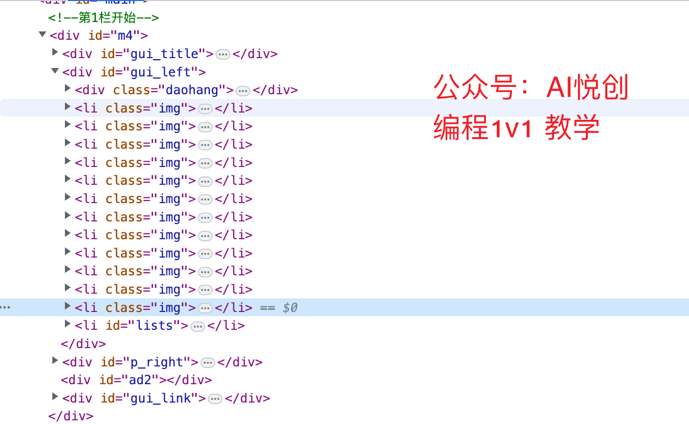
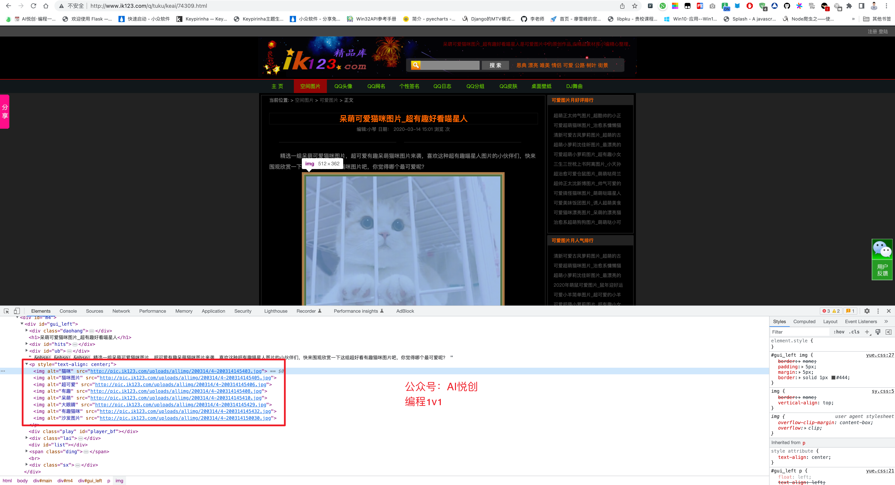

## 1. 目标

1. **爬取目标**
    1. 猫咪图片，[http://p.ik123.com/zt/maomi/68_1.html](http://p.ik123.com/zt/maomi/68_1.html)
2. **使用框架**
    1. requests 库 + re 模块
3. **重点学习内容**
    1. requests 库使用；
    2. re 模块与正则表达式；
    3. 动态获取页码。
4. **页面变化**
    1. 随机点击页码，得到如下所示页码规律。
    2. http://p.ik123.com/zt/maomi/68_1.html
    3. http://p.ik123.com/zt/maomi/68_2.html
    4. http://p.ik123.com/zt/maomi/68_3.html
    5. http://p.ik123.com/zt/maomi/68_{页码}.html

5. **详情页所在源码位置**

通过开发者工具，可以便捷得到详情页地址所在 HTML 标签，每页合计 12 条数据，关键标签分别如下图所示。



- `li class = "img"` 详情页所在标签；
- `li class = "lists"` 分页所在标签。

6. **详情页图片**

点击任意[猫咪图片](http://www.ik123.com/q/tuku/keai/74309.html)，进入详情页，查看源码，很容易找到图片标签。



简单分析已经完成，接下来对分析过程进行一下基本梳理。

## 2. 整理需求如下

1. 访问列表起始页，得到总页数；
2. 基于总页数，生成待爬取列表；
3. 依次爬取列表页数据，获取所有详情页数据；
4. 爬取详情页中猫咪图片；
5. 保存图片。

## 3. 代码实现时间

### 3.1 使用任意页，换取总页码

该步骤只需要通过 `requests` 抓取网页源码，然后通过正则表达式匹配分页部分标签即可。

```python
import requests
import re

HEADERS = {
    "User-Agent": "Mozilla/5.0 (Windows NT 6.1; Win64; x64) AppleWebKit/537.36 (KHTML, like Gecko) Chrome/90.0.4430.93 Safari/537.36"
}


# 获取分页
def get_pagesize(html):
    # 编写简单的正则表达式 <a href='68_(\d+).html'>末页</a>
    pagesize = re.search("<a href='68_(\d+).html'>末页</a>", html)
    if pagesize is not None:
        return pagesize.group(1)
    else:
        return 0


# 获取待抓取列表
def get_wait_list(url):
    wait_urls = []
    try:
        res = requests.get(url=url, headers=HEADERS, timeout=5)
        res.encoding = "gb2312"
        html_text = res.text
        pagesize = int(get_pagesize(html_text))
        if pagesize > 0:
            print(f"获取到{pagesize}页数据")
            # 生成待抓取列表
            for i in range(1, pagesize + 1):
                wait_urls.append(f"http://p.ik123.com/zt/maomi/68_{i}.html")
        return wait_urls

    except Exception as e:
        print("异常", e)


if __name__ == '__main__':
    start_url = "http://p.ik123.com/zt/maomi/68_1.html"
    wait_urls = get_wait_list(url=start_url)
    print(wait_urls)
```

### 3.2 **获取所有详情页地址**

本步骤只需要循环上述代码中 `wait_urls` 即可。

```python
# 正则匹配详情页链接
def format_detail(html):
    # 多次模拟得到正则表达式 <a class=preview href="(.*?)"
    # 注意单引号与双引号嵌套
    detail_urls = re.findall('<a class=preview href="(.*?)"', html)
    return detail_urls


# 获取所有详情页链接数据
def get_detail_list(url):
    try:
        res = requests.get(url=url, headers=HEADERS, timeout=5)
        res.encoding = "gb2312"
        html_text = res.text
        return format_detail(html_text)

    except Exception as e:
        print("获取详情页异常", e)


if __name__ == '__main__':
    start_url = "http://p.ik123.com/zt/maomi/68_1.html"
    wait_urls = get_wait_list(url=start_url)
    detail_list = []
    for url in wait_urls:
        print(f"正在抓取{url}")
        detail_list.extend(get_detail_list(url))

    print(f"获取到{len(detail_list)}条详情页")
```

等待 20 秒所有，即可得到内容。

### 3.3 爬取内页猫咪数据

下面就是本爬虫的最后一步了，进入详情页获取内页图片。

本步骤也可以拆分成两步，先获取猫咪的图片地址，最后在进行消耗资源的图片抓取。

本案例只展示到抓取到的猫咪图地址，最后爬取图片交给你来完成啦。

最终的完整代码如下，关键代码，已经备注注释。

```python
import requests
import re

HEADERS = {
    "User-Agent": "Mozilla/5.0 (Windows NT 6.1; Win64; x64) AppleWebKit/537.36 (KHTML, like Gecko) Chrome/90.0.4430.93 Safari/537.36"
}


# 获取分页
def get_pagesize(html):
    # 编写简单的正则表达式 <a href='68_(\d+).html'>末页</a>
    pagesize = re.search("<a href='68_(\d+).html'>末页</a>", html)
    if pagesize is not None:
        return pagesize.group(1)
    else:
        return 0


# 获取待抓取列表
def get_wait_list(url):
    wait_urls = []
    try:
        res = requests.get(url=url, headers=HEADERS, timeout=5)
        res.encoding = "gb2312"
        html_text = res.text
        pagesize = int(get_pagesize(html_text))
        if pagesize > 0:
            print(f"获取到{pagesize}页数据")
            # 生成待抓取列表
            for i in range(1, pagesize + 1):
                wait_urls.append(f"http://p.ik123.com/zt/maomi/68_{i}.html")
        return wait_urls

    except Exception as e:
        print("获取分页异常", e)


# 正则匹配详情页链接
def format_detail(html):
    # 多次模拟得到正则表达式 <a class=preview href="(.*?)"
    # 注意单引号与双引号嵌套
    detail_urls = re.findall('<a class=preview href="(.*?)"', html)
    return detail_urls


# 获取所有详情页链接数据
def get_detail_list(url):
    try:
        res = requests.get(url=url, headers=HEADERS, timeout=5)
        res.encoding = "gb2312"
        html_text = res.text
        return format_detail(html_text)

    except Exception as e:
        print("获取详情页异常", e)


def format_mao_img(html):
    # 匹配猫咪图正则表达式 
    mao_img_urls = re.findall('', html)
    return mao_img_urls


# 获取猫咪图片地址
def get_mao_img(detail_url):
    try:
        res = requests.get(url=detail_url, headers=HEADERS, timeout=5)
        res.encoding = "gb2312"
        html_text = res.text
        return format_mao_img(html_text)

    except Exception as e:
        print("获取猫咪图片异常", e)


if __name__ == '__main__':
    start_url = "http://p.ik123.com/zt/maomi/68_1.html"
    wait_urls = get_wait_list(url=start_url)
    detail_list = []
    for url in wait_urls:
        print(f"正在抓取{url}")
        detail_list.extend(get_detail_list(url))

    print(f"获取到{len(detail_list)}条详情页")
    mao_imgs = []
    for index, mao_detail in enumerate(detail_list):
        if len(mao_detail) > 0:
            print(f"正抓取第{index}页数据")
            mao_imgs.extend(get_mao_img(mao_detail))
            # 以下代码测试用
            if len(mao_imgs) > 100:
                break

    print(f"获取到{len(mao_imgs)}条猫咪图")
    print(mao_imgs[:5])
```


::: details 公众号：AI悦创【二维码】


:::

::: info AI悦创·编程一对一

AI悦创·推出辅导班啦，包括「Python 语言辅导班、C++ 辅导班、java 辅导班、算法/数据结构辅导班、少儿编程、pygame 游戏开发」，全部都是一对一教学：一对一辅导 + 一对一答疑 + 布置作业 + 项目实践等。当然，还有线下线上摄影课程、Photoshop、Premiere 一对一教学、QQ、微信在线，随时响应！微信：Jiabcdefh

C++ 信息奥赛题解，长期更新！长期招收一对一中小学信息奥赛集训，莆田、厦门地区有机会线下上门，其他地区线上。微信：Jiabcdefh

方法一：[QQ](http://wpa.qq.com/msgrd?v=3&uin=1432803776&site=qq&menu=yes)

方法二：微信：Jiabcdefh

:::

