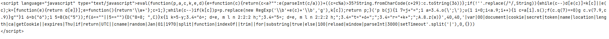
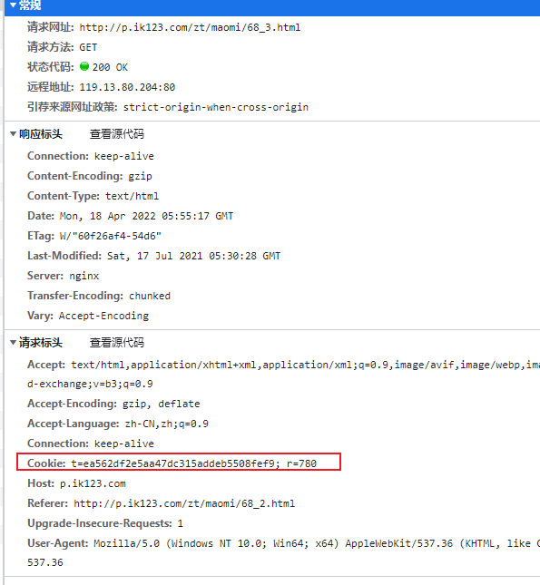
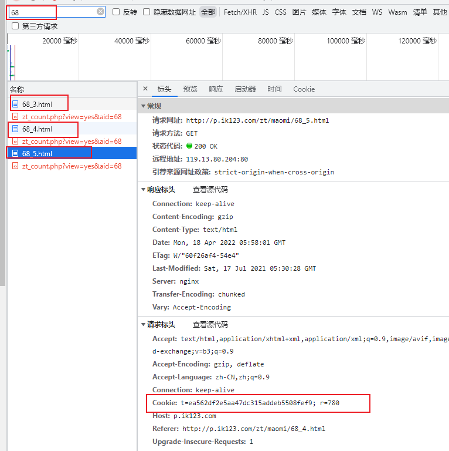
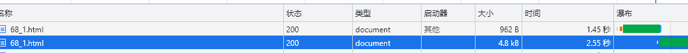
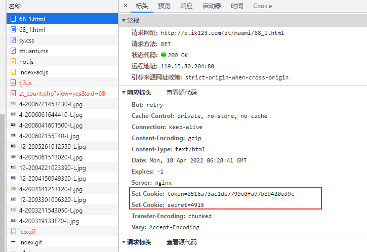
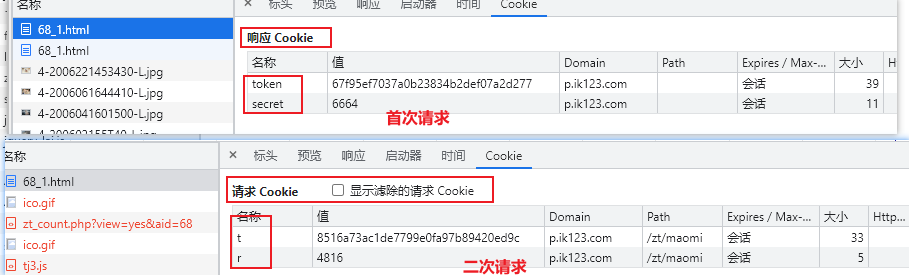
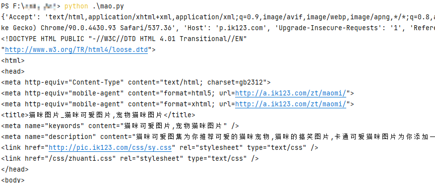

## 1. ⛳️ 实战场景

前段时间，悦创发过一篇博客《Python 千猫图，简单技术满足你的收集控》，结果发出来没多久，大家的热情就把人家的网站给弄的苦不堪言，然后加上了参数加密，也就是反爬了。

作为一个对自己博客可用性非常上新的作者，我必须让爬虫再次运行起来，所以本篇博客就为你带来这个站点的反反爬途径。

::: info 问题

很多朋友反馈的是第一步就无法获取列表数据了，我们先看一下这个地方。

:::

原代码简化之后，如下所示：

```python
import requests
import re

HEADERS = {
    "User-Agent": "Mozilla/5.0 (Windows NT 6.1; Win64; x64) AppleWebKit/537.36 (KHTML, like Gecko) Chrome/90.0.4430.93 Safari/537.36"
}


# 获取待抓取列表
def get_wait_list(url):
    res = requests.get(url=url, headers=HEADERS, timeout=5)
    res.encoding = "gb2312"
    html_text = res.text
    print(html_text)


if __name__ == '__main__':
    start_url = "http://p.ik123.com/zt/maomi/68_1.html"
    wait_urls = get_wait_list(url=start_url)
```

代码运行之后，并没有得到网页源码，而是获取到一段 JS 脚本，具体如下所示。



JS 可以先放在一遍，先用开发者工具分析一下请求头中，是否有一些加密相关的参数。

简单对比之后发现，请求头中只在 Cookie 中增加了一个参数，具体如下图所示。



为了寻找该值的来源，还需要多次点击分页链接，查看该值是否产生过变化，N 次测试之后，得到如下结论:在短时间内，或一定时间内，这个值无变化。

测试的时候，注意勾选保留日志，否则日志会因为页面跳转丢失。



那接下来就要找到该值的计算方式，即值是如何出现的。

由于该请求是 GET 形式，而且加密形式是依赖 Cookie 实现的，所以需要找到 `set-cookie` 的位置，经过反复请求，得到如下内容。



如果出现上图效果，需要两个步骤：

1. 删除已经生成的 cookie；
2. 网络请求保留日志；



结论，一个简单的二次请求，反爬逻辑。

## ⛳️ 实战编码

接下来我们拿第一页进行实战，通过首次请求获取 COOKIE，二次请求携带 COOKIE 的形式进行操作。

对于 COOKIE 的操作，可以直接在请求头中设置，也可以使用 `requests.cookies.RequestsCookieJar()`，还可以使用 `requests.utils.dict_from_cookiejar(cookiejar)` 实现，具体根据自己的熟悉程度操作即可。

```python
import requests

HEADERS = {
    'Accept': 'text/html  复制 ACCEPT 头',
    "User-Agent": "Mozilla/5.0 你的UA",
    "Host": 'p.ik123.com',
    'Upgrade-Insecure-Requests': '1',
    'Referer': 'http://p.ik123.com/zt/maomi/68_1.html'
}


def get_cookie(url):
    res = requests.get(url=url, headers=HEADERS, timeout=5)
    res.encoding = "gb2312"
    cookiejar = res.cookies
    c_dict = requests.utils.dict_from_cookiejar(cookiejar)
    return c_dict['secret'], c_dict['token']


# 获取待抓取列表
def get_wait_list(url):
    secret, token = get_cookie(url)
    HEADERS['Cookie'] = 't=' + token + '; r=' + secret + ''
    print(HEADERS)
    res = requests.get(url=url, headers=HEADERS, timeout=5)
    res.encoding = "gb2312"
    print(res.text)


if __name__ == '__main__':
    start_url = "http://p.ik123.com/zt/maomi/68_1.html"
    wait_urls = get_wait_list(url=start_url)
```

请求头中的 COOKIE 参数，注意名称的变化。



响应的 COOKIE 是 `token` 和 `secret` ，请求的是 `t` 和 `r`。

但上述代码依旧无法得到正确的数据，按理来说已经得到相应的请求加密条件了，数据不应该无法得到。

经过多次测试，发现目标站点竟然把 COOKIE 中的 `secret` 在请求中，减少了 100。

修改代码如下所示：

```python
secret, token = get_cookie(url)
    secret = int(secret) - 100
    HEADERS['Cookie'] = 't=' + token + '; r=' + str(secret) + ''
    print(HEADERS)
```

再次运行代码，这个小案例猫咪图片的反爬就被我们成功的的拿下了。



没想到在 Python 爬虫的第 3 例，就碰到一个棘手的反爬，有趣有趣。


::: details 公众号：AI悦创【二维码】


:::

::: info AI悦创·编程一对一

AI悦创·推出辅导班啦，包括「Python 语言辅导班、C++ 辅导班、java 辅导班、算法/数据结构辅导班、少儿编程、pygame 游戏开发」，全部都是一对一教学：一对一辅导 + 一对一答疑 + 布置作业 + 项目实践等。当然，还有线下线上摄影课程、Photoshop、Premiere 一对一教学、QQ、微信在线，随时响应！微信：Jiabcdefh

C++ 信息奥赛题解，长期更新！长期招收一对一中小学信息奥赛集训，莆田、厦门地区有机会线下上门，其他地区线上。微信：Jiabcdefh

方法一：[QQ](http://wpa.qq.com/msgrd?v=3&uin=1432803776&site=qq&menu=yes)

方法二：微信：Jiabcdefh

:::

