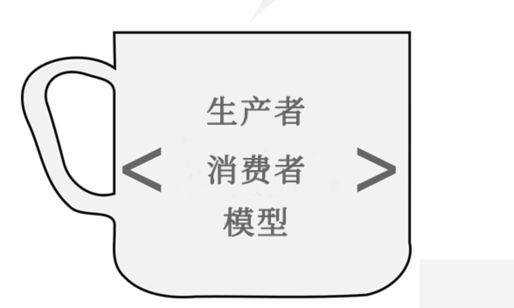
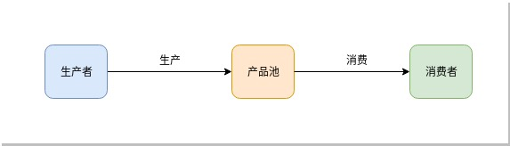
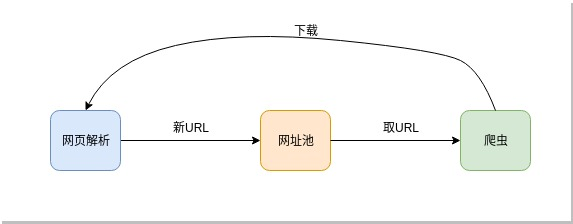

你好，我是悦创。

对于比较大型的爬虫来说，URL 管理的管理是个核心问题，管理不好，就可能重复下载，也可能遗漏下载。这里，我们设计一个 URL  Pool 来管理 URL。
这个 URL Pool 就是一个生产者-消费者模式：

依葫芦画瓢，URLPool 就是这样的

我们从网址池的使用目的出发来设计网址池的接口，它应该具有以下功能：

- 往池子里面添加 URL；
- 从池子里面取 URL 以下载；
- 池子内部要管理 URL 状态；

前面我提到 URL 的状态有以下 4 中：

- 已经下载成功
- 下载多次失败无需再下载
- 正在下载
- 下载失败要再次尝试

前两个是永久状态，也就是已经下载成功的不再下载，多次尝试后仍失败的也就不再下载，它们需要永久存储起来，以便爬虫重启后，这种永久状态记录不会消失，已经成功下载的 URL 不再被重复下载。永久存储的方法有很多种：

- 比如，直接写入文本文件，但它不利于查找某个 URL 是否已经存在文本中；
- 比如，直接写入 MySQL 等关系型数据库，它利用查找，但是速度又比较慢；
- 比如，使用 `key-value` 数据库，查找和速度都符合要求，是不错的选择！

我们这个 URL Pool 选用 LevelDB 来作为 URL 状态的永久存储。LevelDB 是 Google 开源的一个 `key-value` 数据库，速度非常快，同时自动压缩数据。我们用它先来实现一个 UrlDB 作为永久存储数据库。

欢迎关注我公众号：AI悦创，有更多更好玩的等你发现！

::: details 公众号：AI悦创【二维码】

:::

::: info AI悦创·编程一对一

AI悦创·推出辅导班啦，包括「Python 语言辅导班、C++ 辅导班、java 辅导班、算法/数据结构辅导班、少儿编程、pygame 游戏开发、Linux、Web」，全部都是一对一教学：一对一辅导 + 一对一答疑 + 布置作业 + 项目实践等。当然，还有线下线上摄影课程、Photoshop、Premiere 一对一教学、QQ、微信在线，随时响应！微信：Jiabcdefh

C++ 信息奥赛题解，长期更新！长期招收一对一中小学信息奥赛集训，莆田、厦门地区有机会线下上门，其他地区线上。微信：Jiabcdefh

方法一：[QQ](http://wpa.qq.com/msgrd?v=3&uin=1432803776&site=qq&menu=yes)

方法二：微信：Jiabcdefh

:::

