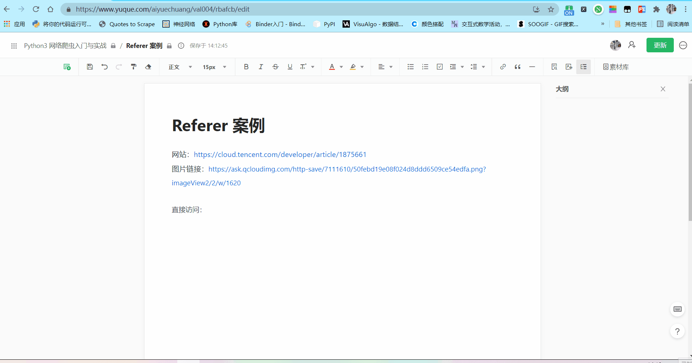
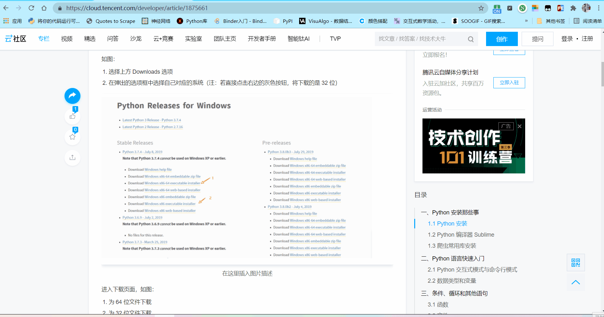
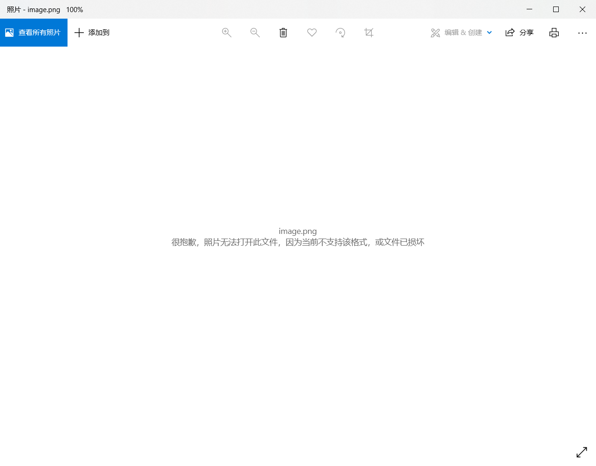
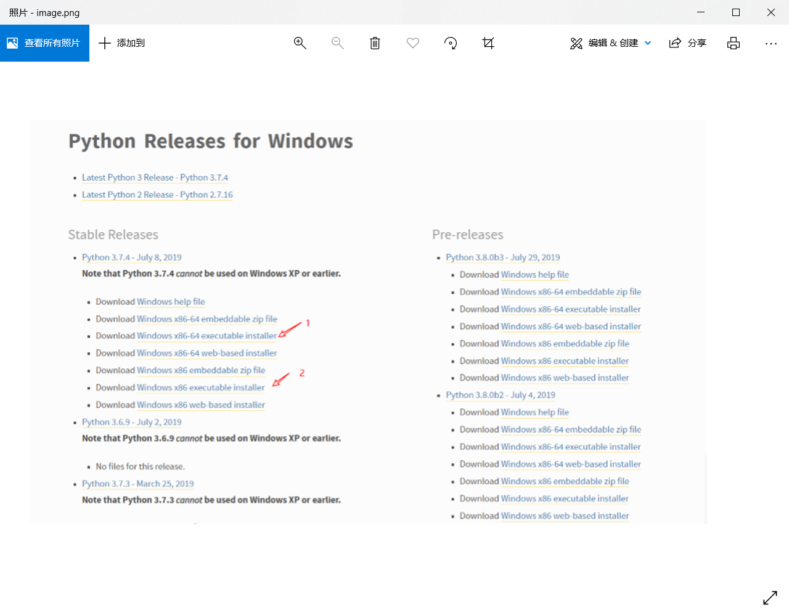

网站：[https://cloud.tencent.com/developer/article/1875661](https://cloud.tencent.com/developer/article/1875661)
图片链接：[https://ask.qcloudimg.com/http-save/7111610/50febd19e08f024d8ddd6509ce54edfa.png?imageView2/2/w/1620](https://ask.qcloudimg.com/http-save/7111610/50febd19e08f024d8ddd6509ce54edfa.png?imageView2/2/w/1620)

直接访问：





不加 headers：

```python
import requests

url = "https://ask.qcloudimg.com/http-save/7111610/50febd19e08f024d8ddd6509ce54edfa.png?imageView2/2/w/1620"

html = requests.get(url).content
with open("image.png", mode="wb") as f:
    f.write(html)
```


加上 headers：

```python
import requests

url = "https://ask.qcloudimg.com/http-save/7111610/50febd19e08f024d8ddd6509ce54edfa.png?imageView2/2/w/1620"

headers = {
    "User-Agent": "Mozilla/5.0 (Windows NT 10.0; Win64; x64) AppleWebKit/537.36 (KHTML, like Gecko) Chrome/93.0.4577.63 Safari/537.36",
    "Referer": "https://cloud.tencent.com/",
}
html = requests.get(url, headers=headers).content
with open("image.png", mode="wb") as f:
    f.write(html)
```


欢迎关注我公众号：AI悦创，有更多更好玩的等你发现！

::: details 公众号：AI悦创【二维码】


:::

::: info AI悦创·编程一对一

AI悦创·推出辅导班啦，包括「Python 语言辅导班、C++ 辅导班、java 辅导班、算法/数据结构辅导班、少儿编程、pygame 游戏开发」，全部都是一对一教学：一对一辅导 + 一对一答疑 + 布置作业 + 项目实践等。当然，还有线下线上摄影课程、Photoshop、Premiere 一对一教学、QQ、微信在线，随时响应！微信：Jiabcdefh

C++ 信息奥赛题解，长期更新！长期招收一对一中小学信息奥赛集训，莆田、厦门地区有机会线下上门，其他地区线上。微信：Jiabcdefh

方法一：[QQ](http://wpa.qq.com/msgrd?v=3&uin=1432803776&site=qq&menu=yes)

方法二：微信：Jiabcdefh

:::


