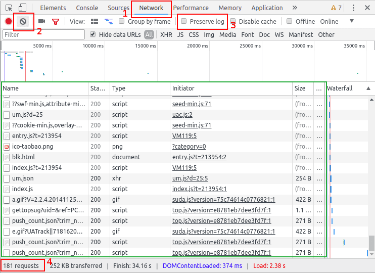
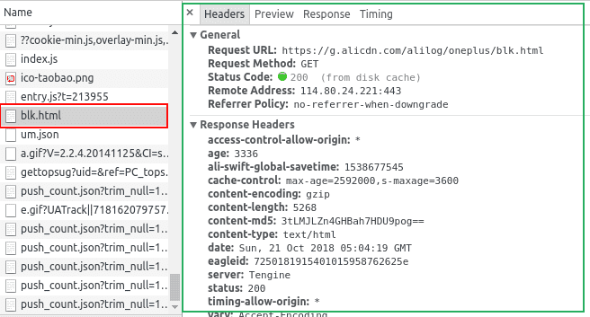

你好，我是悦创。

浏览器打开网页的过程就是爬虫获取数据的过程，两者是一样一样的。浏览器渲染的网页是丰富多彩的数据集合，而爬虫得到的是网页的源代码 html。

有时候，我们不能在网页的 html 代码里面找到想要的数据，但是浏览器打开的网页上面却有这些数据。这就是浏览器通过 ajax 技术异步加载（偷偷下载）了这些数据。

你们禁不住要问：那么该如何看到浏览器偷偷下载的那些数据呢？

答案就是谷歌 Chrome 浏览器的 F12 快捷键，也可以通过鼠标右键菜单“检查”（Inspect）打开 Chrome 自带的开发者工具，开发者工具会出现在浏览器网页的左侧或者是下面（可调整），它的样子就是这样的：

让我们简单了解一下它如何使用：

## 谷歌 Chrome 抓包

### 1. 最上面一行菜单

- 左上角箭头 用来点击查看网页的元素
- 第二个手机、平板图标是用来模拟移动端显示网页
- Elements 查看渲染后的网页标签元素 **提醒** 是渲染后（包括异步加载的图片、数据等）的完整网页的 html，不是最初下载的那个 html。
- Console 查看 JavaScript 的 console log 信息，写网页时比较有用
- Sources 显示网页源码、CSS、JavaScript 代码
- Network 查看所有加载的请求，**对爬虫很有帮助**

后面的暂且不管。

### 2. 重要区域

图中红框的两个按钮比较有用，编号为 2 的是清空请求记录；编号 3 的是保持记录，这在网页有**重定向**的时候很有用

图中绿色区域就是加载完整个网页，浏览器的全部请求记录，包括网址、状态、类型等。写爬虫时，我们就要在这里寻找线索，提炼金矿。

最下面编号为4的红框显示了加载这个网页，一共请求了181次，数量是多么地惊人，让人不禁心疼起浏览器来。

点击一条请求的网址，右侧就会出现新的窗口显示该条请求的相信信息：

图中左边红框就是点击的请求网址；绿框就是详情窗口。

详情窗口包括，Headers（请求头）、Preview（预览响应）、Response（服务器响应内容）和Timing（耗时）。

Preview、Response 帮助我们查看该条请求是不是有爬虫想要的数据；

Headers帮助我们在爬虫中重建http请求，以便爬虫得到和浏览器一样的数据。

了解和熟练使用Chrome的开发者工具，小猿们就如虎添翼可以顺利写出自己的爬虫啦。

欢迎关注我公众号：AI悦创，有更多更好玩的等你发现！

::: details 公众号：AI悦创【二维码】

:::

::: info AI悦创·编程一对一

AI悦创·推出辅导班啦，包括「Python 语言辅导班、C++ 辅导班、java 辅导班、算法/数据结构辅导班、少儿编程、pygame 游戏开发」，全部都是一对一教学：一对一辅导 + 一对一答疑 + 布置作业 + 项目实践等。当然，还有线下线上摄影课程、Photoshop、Premiere 一对一教学、QQ、微信在线，随时响应！微信：Jiabcdefh

C++ 信息奥赛题解，长期更新！长期招收一对一中小学信息奥赛集训，莆田、厦门地区有机会线下上门，其他地区线上。微信：Jiabcdefh

方法一：[QQ](http://wpa.qq.com/msgrd?v=3&uin=1432803776&site=qq&menu=yes)

方法二：微信：Jiabcdefh

:::

