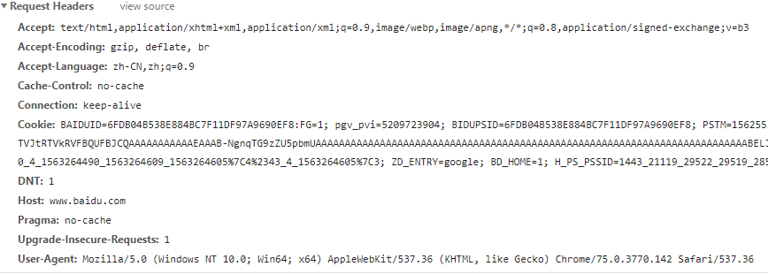
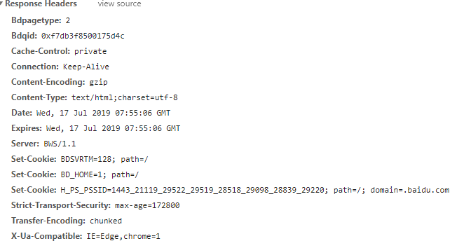

### 1. HTTP 与 HTTPS

超文本传输协议 HTTP 协议被用于在 Web 浏览器和网站服务器之间传递信息，HTTP 协议以明文方式发送内容，不提供任何方式的数据加密，如果攻击者截取了 Web 浏览器和网站服务器之间的传输报文，就可以直接读懂其中的信息，因此，HTTP 协议不适合传输一些敏感信息，比如：信用卡号、密码等支付信息。

为了解决HTTP协议的这一缺陷，需要使用另一种协议：安全套接字层超文本传输协议 HTTPS，为了数据传输的安全，HTTPS 在 HTTP的基础上加入了 SSL 协议，SSL 依靠证书来验证服务器的身份，并为浏览器和服务器之间的通信加密。

HTTPS 和 HTTP 的区别主要如下：

1）https 协议需要到 ca 申请证书，一般免费证书较少，因而需要一定费用。

2）http 是超文本传输协议，信息是明文传输，https 则是具有安全性的 ssl 加密传输协议。

3）http 和 https 使用的是完全不同的连接方式，用的端口也不一样，前者是 80，后者是 443。

4）http 的连接很简单，是无状态的；HTTPS 协议是由 `SSL+HTTP` 协议构建的可进行加密传输、身份认证的网络协议，比 http 协议安全。

### 2. 请求头

通常我们请求网页的时候点开开发者工具会出现如下内容，我们来具体讨论一下各项含义。

Request URL：我们请求的页面URL

Requests Method：页面的请求方式

Status Code：相应状态码

Remote Address：我们访问国内网站使用的IP地址

Referrer Policy：用于过滤Referer内容，这里的意思是当发生降级的时候不传递referer报头

下面是常见的HTTP状态码：

200 请求成功

301 永久移动

302 暂时移动

304 内容未修改

400 客户端请求错误

403 客户端的请求被服务器拒绝

404 页面丢失

405 客户端请求的方法错误

500 服务器内部错误

502 远程服务器响应无效

Accept：表示客户端会接受的文本

Accept-Encoding：表示客户端可以接受的编码方式

Accept-Language：表示客户端可以接受的语言

Cache-Control：客户端是否使用缓存

Connection：客户端请求连接时长，这里是长连接

Cookie：保存在客户端本地的可被服务端识别身份的数据

Host：客户端请求的主机

User-Agent：客户端使用什么终端访问

DNT：表示客户端是否允许网站追踪，这里是1可以追踪

Upgrade-Insecure-Request：表示客户端优先接受加密响应

Program：HTTP1.0用来向后兼容只支持HTTP1.0的缓存服务器

Cache-Control：服务器指定缓存方式，这里表示代理服务器不能缓存，只能用户缓存

Connection：当前事务结束后是否关闭连接

Content-Encoding：内容编码方式

Content-Type：返回的数据类型

Expires：在此日期之后，相应失效

Server：服务器处理信息的软件信息

Set-Cookie：服务器给客户端设置cookies

Strict-Transport-Security：在这个时间内发起的请求都使用HTTPS

Transfer-Encoding：数据以块的方式发送

### 3. Cookies

Cookies是存储在你电脑上的一些数据，因为HTTP是面向无连接的，也就是每一个请求和响应都是单独分开的，有时候我们需要保存用户的状态，比如你在网站一直在线，就需要使用cookie记录你的信息，下一次请求时候网站会识别你的本地cookie来验证你的身份。

Cookies以键值对形似存在，也就是key=value。

### 4. HTML

HTML就是编写前端页面使用的代码，一般用来搭建网站骨架，而渲染用css，实现网页交互使用Js。

### 5. json

Json是一种轻量级的数据交换格式，一般用来搭建网站API。

Json语法：

数据是键值对

数据由逗号分隔

大括号保存对象

方括号保存数组

{“name”:”python”}就是一个json对象

### 6. Ajax

Ajax是异步执行js网络请求的意思。一般来说，我们提交一个表单，一旦用户点击submit，浏览器就会刷新一下。Ajax是不让页面刷新，用户依然同留在当前页面，同时后台发出新的请求，收到数据之后，通过js刷新页面，这样用户就感觉自己一直在当前页面，但是数据却可以不断刷新。比如查看百度图片，就可以看到图片不断刷新。
