## 1. BeautifulSoup 库的基础操作

你好，我是悦创。

你以前是不是有这些问题？

1. 能抓怎样的数据？
2. 怎样来解析？
3. 为什么我抓到的和浏览器看到的不一样？
4. 怎样解决 JavaScript 渲染的问题？
5. 可以怎样保存数据？

我想以上的问题或多或少你在有些迷茫，或不是很理解。接下来就带你进入 **BeautifulSoup** 库的基础操作。

这里为了照顾绝大多数的零基础或者基础不扎实的童鞋，我主要讲解 **BeautifulSoup** 库基础操作，纳尼 (⊙o⊙)？不讲上面几点？别急，上面的几个问题我会简单地回答，之后的 **专栏** 会分享给大家的，欢迎持续关注！

### 1.1 能抓怎样的数据？

*   网页文本：如 HTML 文档、JSON 格式文本等。
*   图片：获取到的是二进制文件，保存为图片格式。
*   视频：同为二进制文件，保存为视频格式即可。
*   其他：只要是能请求到的，都能获取。

### 1.2 怎样来解析？

*   直接处理
*   JSON 解析
*   正则表达式
*   BeautifulSoup
*   PyQuery
*   XPath

### 1.3 为什么我抓到的和浏览器看到的不一样？

动态加载和 JS 等技术渲染，所以不一样。

### 1.4 怎样解决 JavaScript 渲染的问题？

*   分析 Ajax 请求
*   Selenium/WebDriver
*   Splash
*   PyV8、Ghost.py

### 1.5 可以怎样保存数据？

*   文本：纯文本、JSON、XML 等
*   关系型数据库：如 MySQL、Oracle、SQL Server 等具有结构化表结构形式存储
*   非关系型数据库：如 MongoDB、Redis 等 Key-Value 形式存储
*   二进制文件：如图片、视频、音频等直接保存成特定格式即可

好，解决上面的问题。我们来讲一下 **BeautifulSoup**。

## 2. Beautiful Soup

### 2.1 Beautiful Soup 介绍

> [https://www.crummy.com/software/BeautifulSoup/bs4/doc/](https://www.crummy.com/software/BeautifulSoup/bs4/doc/)

爬虫利器，出色的解析工具。

安装前面也讲过，我们回顾一下代码：

```python
# 安装方式，在命令行中输入  
pip install lxml
pip install beautifulsoup4
# pip install lxml beautifulsoup4

# Mac用户输入
pip3 install lxml
pip3 install beautifulsoup4
# pip3 install lxml beautifulsoup4
```

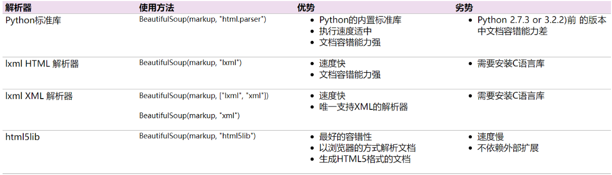

注意如何导入时的模块名称：

```python
from bs4 import BeautifulSoup
```

我们需要的是 bs4 里的 BeautifulSoup 模块。

一个例子：`prettify()` 格式化输出

```python
from bs4 import BeautifulSoup
import requests

url = "https://www.crummy.com/software/BeautifulSoup/bs4/doc/"
response = requests.get(url)
html = response.text
# print(html)

soup = BeautifulSoup(html, "lxml")
print(soup.prettify())
```

### 2.2 BeautifulSoup 快速开始

废话不多说，我们还是通过一个例子来进行详细的讲解。代码如下：

```python
from bs4 import BeautifulSoup
import requests

url = "https://baidu.com"
header = {
    'User-Agent': 'Mozilla/5.0 (Windows NT 10.0; Win64; x64) AppleWebKit/537.36 (KHTML, like Gecko) Chrome/75.0.3770.100 Safari/537.36'}
req = requests.get(url, headers=header)
soup = BeautifulSoup(req.text, 'lxml')
title = soup.title
print(title)
```

```python
soup = BeautifulSoup(req.text,'lxml')
```

使用 BeautifulSoup 解析我们使用 Requests 爬取到的网页内容 `req.text`，并且使用 lxml 解析器对其进行解析。

这是我们使用 BeautifulSoup 框架时最常用的一行代码。如果你实在是不了解其内在机制的话（没事，刚刚入门）。

通过这行代码，我们能够得到一个 BeautifulSoup 的对象 。接下来我们所有的网页获取都是操作这个对象来进行处理。BeautifulSoup 将复杂的 HTML 代码解析为了一个树形结构。每个节点都是可操作的 Python 对象，常见的有四种。

四大对象种类：

*   Tag
*   NavigableString
*   BeautifulSoup
*   Comment

接下来我们对其进行一一介绍。

### 2.3 Tag

Tag 就是 HTML 中的一个个标签。

**注意：**返回的是第一个符合要求的标签（即使 HTML 中有多个符合要求的标签）。

这个标签也是我前面写道的网页基础！

例如：

```python
title = soup.title
```

上述代码是获取网站的标题。运行后得到的结果是： 

```python
<title>百度一下，你就知道</title>
```

Bingo！我们可以直接通过 `soup.tag` 获取对应的 HTML 中的标签信息！

让我们看一下 HTML 网页中的一个比较特别的 Tag。

```html
<meta name="keywords" content="少儿编程一对一,Python 1v1,AI悦创,一对一,Python,编程一对一,C++,Java,AI,人工智能,黄家宝,Python一对一教学,Python辅导">
<meta name="description" content="AI悦·Python一对一辅导,Java一对一辅导,爬虫一对一教学,编程一对一教学,少儿编程一对一,人工智能,黄家宝,全网3000+学员,值得信赖。">
```

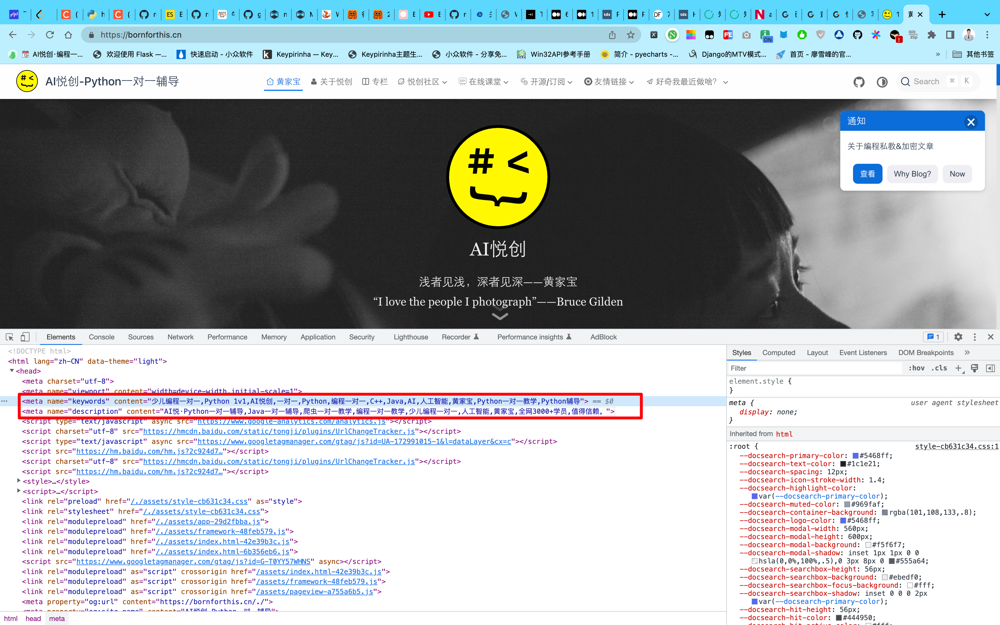

一般来说，description 和 keywords 是一个网页的关键信息之一。具体的，如果你只是想获取这个网页的大概内容，那么我们可以直接获取这两个标签中的信息就可以了。我们可以运行如下代码：

```python
from bs4 import BeautifulSoup
import requests

url = "https://bornforthis.cn"
header = {
    'User-Agent': 'Mozilla/5.0 (Windows NT 10.0; Win64; x64) AppleWebKit/537.36 (KHTML, like Gecko) Chrome/75.0.3770.100 Safari/537.36'}
req = requests.get(url, headers=header)
req.encoding = req.apparent_encoding
soup = BeautifulSoup(req.text, 'lxml')
title = soup.title
description = soup.find(attrs={"name": "description"})
keywords = soup.find(attrs={"name": "keywords"})
print(title)
print(description)
print(keywords)
```

运行结果： 

```python
<title>黄家宝 | AI悦创-Python一对一辅导</title>
<meta content="AI悦·Python一对一辅导,Java一对一辅导,爬虫一对一教学,编程一对一教学,少儿编程一对一,人工智能,黄家宝,全网3000+学员,值得信赖。" name="description"/>
<meta content="少儿编程一对一,Python 1v1,AI悦创,一对一,Python,编程一对一,C++,Java,AI,人工智能,黄家宝,Python一对一教学,Python辅导" name="keywords"/>
```

你会发现上面获取到的内容是都带有标签的。 

### 2.4 NavigableString

希望你可以自行敲这些代码感受感受： 

```python
from bs4 import BeautifulSoup
import requests

url = "https://www.crummy.com/software/BeautifulSoup/bs4/doc/"
req = requests.get(url)
soup = BeautifulSoup(req.text, 'lxml')
print(soup.prettify())
print("### title ###")
print(soup.text)
print("### head ###")
print(soup.head)
print("### a ###")
print(soup.a)
```

- `attrs`：获取标签的元素属性
- `get()` 方法：获取标签的某个属性值

可以通过修改字典的方式对这些属性和内容等进行修改、删除等操作。

```python
from bs4 import BeautifulSoup
import requests

url = "https://www.crummy.com/software/BeautifulSoup/bs4/doc/"
req = requests.get(url)
soup = BeautifulSoup(req.text, 'lxml')
print("### a ###")
print(soup.a)
print(soup.a.attrs)
print(soup.a['title'])
soup.a['title'] = "a new title"
print(soup.a.get('title'))
```
NavigableString 获取某个标签里面的内容：

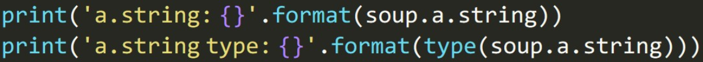

```python
from bs4 import BeautifulSoup
import requests

url = "https://www.crummy.com/software/BeautifulSoup/bs4/doc/"
req = requests.get(url)
soup = BeautifulSoup(req.text, 'lxml')
print("### a ###")
print(soup.a)
print(soup.a.string)
```

由上面的代码你可以看到，既然能够获取到标签，那么如何获取标签的内容呢？很简单，细心的小伙伴肯定能发现我上面加了 string 就可以啦！

### 2.5 Comment

Comment 对象是一个特殊类型的 NavigableString 对象，但是当它出现在 HTML 文档中时，如果不对 Comment 对象进行处理，那么我们在后续的处理中可能会出现问题。**HTML 中可以用来添加一段暂不通过网页渲染出来的内容**。

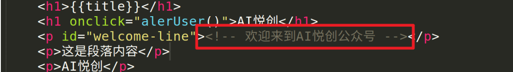

接下来我们来观察这个 HTML：

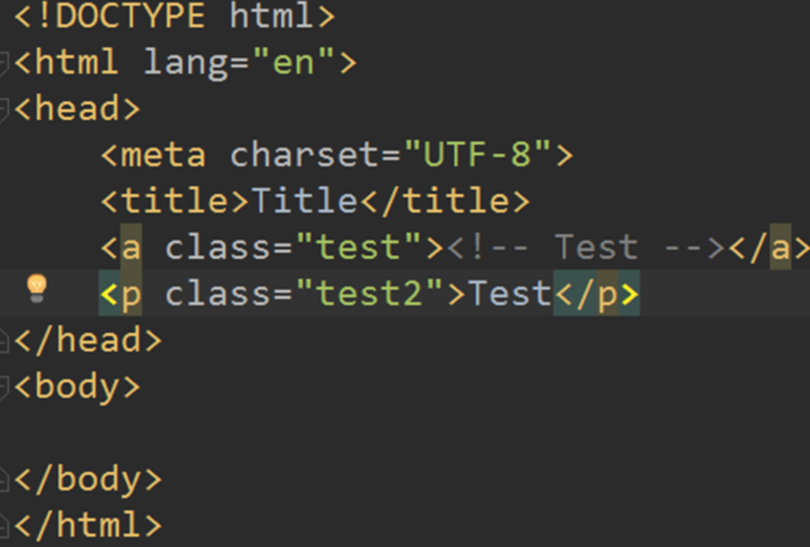

做出如下操作： 

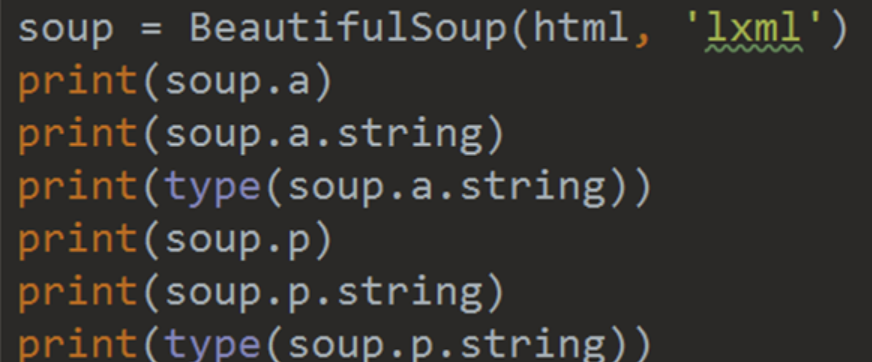

我们来看看输出结果是： 

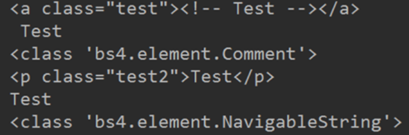

我们会发现其中，有个 comment。

### 2.5 BeautifulSoup

BeautifulSoup 对象表示的是一个文档的全部内容。大部分时候，可以把它当作 Tag 对象，它支持**遍历文档树**和**搜索文档树**中描述的大部分的方法。代码如下：

```python
print(type(soup))
print(soup.name)
print(soup.attrs)
```

**文档树——直接子节点**

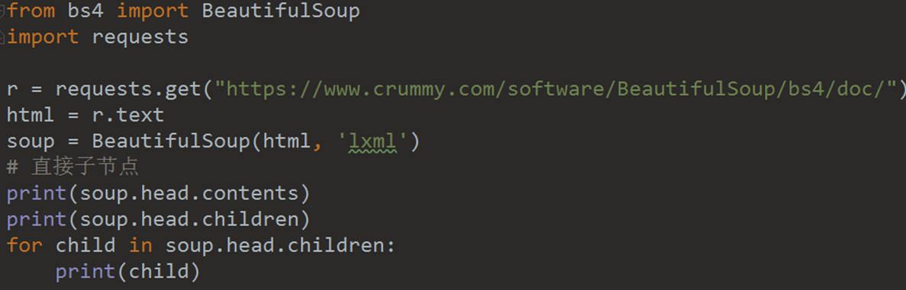

```python
from bs4 import BeautifulSoup
import requests

url = "https://www.crummy.com/software/BeautifulSoup/bs4/doc/"
req = requests.get(url)
soup = BeautifulSoup(req.text, 'lxml')
# 直接字节点
print(soup.head.contents)
print(soup.head.children)
print("-" * 100)
for child in soup.head.children:
    print(child)
```

注意观察 `.contents` 和 `.children` 的区别。

```python
/Users/huangjiabao/GitHub/SourceCode/MacBookPro16-Code/PythonCoder/PythonCoderVenv/bin/python /Users/huangjiabao/GitHub/SourceCode/MacBookPro16-Code/PythonCoder/StudentCoder/07cava/bs4_code/demo.py 
['\n', <meta charset="utf-8"/>, '\n', <meta content="width=device-width, initial-scale=1.0" name="viewport"/>, '\n', <title>Beautiful Soup Documentation — Beautiful Soup 4.9.0 documentation</title>, '\n', <link href="_static/classic.css" rel="stylesheet" type="text/css"/>, '\n', <link href="_static/pygments.css" rel="stylesheet" type="text/css"/>, '\n', <script data-url_root="./" id="documentation_options" src="_static/documentation_options.js"></script>, '\n', <script src="_static/jquery.js"></script>, '\n', <script src="_static/underscore.js"></script>, '\n', <script src="_static/doctools.js"></script>, '\n', <script src="_static/language_data.js"></script>, '\n', <link href="genindex.html" rel="index" title="Index"/>, '\n', <link href="search.html" rel="search" title="Search"/>, '\n']
<list_iterator object at 0x10f98d000>
----------------------------------------------------------------------------------------------------


<meta charset="utf-8"/>


<meta content="width=device-width, initial-scale=1.0" name="viewport"/>


<title>Beautiful Soup Documentation — Beautiful Soup 4.9.0 documentation</title>


<link href="_static/classic.css" rel="stylesheet" type="text/css"/>


<link href="_static/pygments.css" rel="stylesheet" type="text/css"/>


<script data-url_root="./" id="documentation_options" src="_static/documentation_options.js"></script>


<script src="_static/jquery.js"></script>


<script src="_static/underscore.js"></script>


<script src="_static/doctools.js"></script>


<script src="_static/language_data.js"></script>


<link href="genindex.html" rel="index" title="Index"/>


<link href="search.html" rel="search" title="Search"/>


Process finished with exit code 0
```


希望大家认真观看上面的脑图。

## 3. 文档树——所有子孙节点

.descendants 把某个标签内的所有子孙节点都列出来，可以通过 for 循环来进行处理：

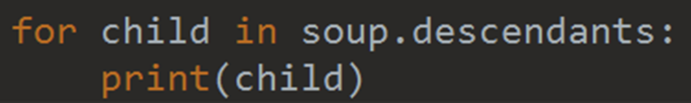

## 4. 文档树——节点内容

### 4.1 stripped_strings

`soup.a.string` 与 `soup.p.string` 的输出是一样的。

注意：如果 tag 包含有多个（能够调用 `.string` 的）节点，`.string` 方法会返回什么？None。

**注意！空格和换行都算一个节点！**

如果想要获得一个 tag 下面的多个内容，我们该如何操作？

`.strings` 或者 `.stripped_strings`：

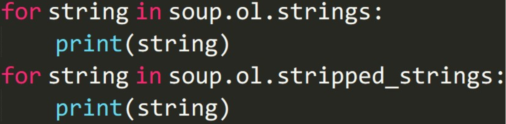

`.strings` 与 `.stripped_strings` 区别：`.stripped_strings` 可以去除多余空白内容。

## 5. 搜索文档树——find_all

代码如下：

```python
print(soup.find_all('a'))
```

`find_all()` 里可以直接填的参数：

- 标签名称，比如 a, p, h1 等
- 列表，比如 [‘a’, ‘p’]
- True，找出所有子节点
- 正则表达式

**keyward 参数：**

> find_all (标签内属性名 = 属性值)

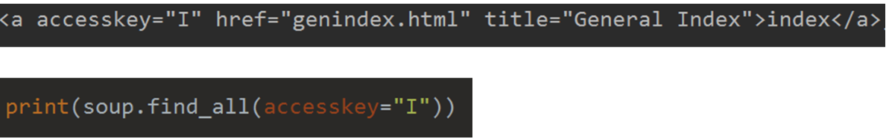

如果要找 class 请注意写成 class_ 因为 class 是 Python 自带的关键词。

## 6. CSS 选择器

代码如下：

```python
soup.select('title')
soup.find_all('title')

soup.select('a')
soup.find_all('a')

soup.select('.fooyer')
soup.find_all(True, class_ = 'footer')

soup.select('p #link')
soup.find_all('p', id = 'link')

soup.select('head > title')
soup.head.find_all('title')

soup.select('a[href = "www.baidu.com"]')
soup.find_all('a', href = 'www.baidu.com')
soup.select() 筛选元素, 返回的是 list
```

语法规则：

*   标签名不加任何修饰
*   class 名前加点 `.`
*   id 名前加 `#`

## 7. BeautifulSoup 实战

上面涉及到了太多的理论知识，实在是“太过枯燥”。我个人比较喜欢实战，不过理论也是很重要滴，现在让我们在实战中学习 BeautifulSoup 吧！

::: code-tabs#python

@tab Code1

```python
from bs4 import BeautifulSoup
import requests
from EasyDB import Mongodb

def req(url):
    try:
        headers = {
            'User-Agent': 'Mozilla/5.0 (Windows NT 10.0; Win64; x64) AppleWebKit/537.36 (KHTML, like Gecko) Chrome/75.0.3770.100 Safari/537.36'}
        response = requests.get(url, headers=headers)
        if response.status_code == 200:
            return response.text
        return ''
    except requests.RequestException as e:
        return e


def parse(html):
    soup = BeautifulSoup(html, 'lxml')
    # print(soup.prettify())
    con = soup.select(".box_con #list dl dd")
    # print(con)
    # print(type(con))
    for c in con:
        p = "<dd></dd>"
        if str(c) == p:
            continue
        title = c.string
        # print(c)
        href = c.a.get("href")
        # print(href)
        yield {
            "title": title,
            "href": href
        }


def main():
    url = "https://www.xbiquge.so/book/54523/"
    html = req(url)
    if not html:
        pass
    mongodb = Mongodb("biquge", "biqugecontent")
    for d in parse(html):
        mongodb.insert(d)


if __name__ == '__main__':
    main()
```

@tab Code2

```python {29-32}
from bs4 import BeautifulSoup
import requests
from EasyDB import Mongodb

def req(url):
    try:
        headers = {
            'User-Agent': 'Mozilla/5.0 (Windows NT 10.0; Win64; x64) AppleWebKit/537.36 (KHTML, like Gecko) Chrome/75.0.3770.100 Safari/537.36'}
        response = requests.get(url, headers=headers)
        if response.status_code == 200:
            return response.text
        return ''
    except requests.RequestException as e:
        return e


def parse(html):
    soup = BeautifulSoup(html, 'lxml')
    # print(soup.prettify())
    con = soup.select(".box_con #list dl dd")
    # print(con)
    # print(type(con))
    for c in con:
        # p = "<dd></dd>"
        # if str(c) == p:
        #     continue
        title = c.string
        # print(c)
        middle = c.a
        if not middle:
            continue
        href = middle.get('href')
        # print(href)
        # print(href)
        yield {
            "title": title,
            "href": href
        }


def main():
    url = "https://www.xbiquge.so/book/54523/"
    html = req(url)
    if not html:
        pass
    parse(html)
    mongodb = Mongodb("biquge", "biqugecontent")
    for d in parse(html):
        mongodb.insert(d)


if __name__ == '__main__':
    main()
```

:::

::: details 旧版教程

我们今天爬取的网站是**糗事百科**：https://www.qiushibaike.com。

我们要爬取这个网站的文字笑话。

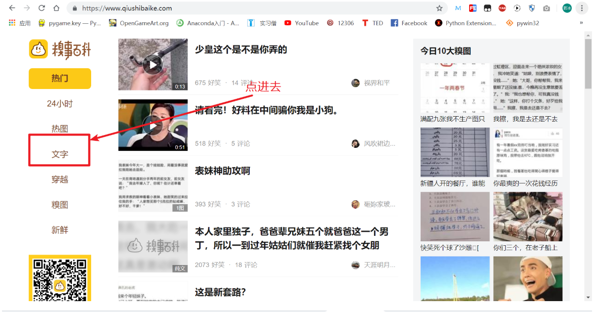

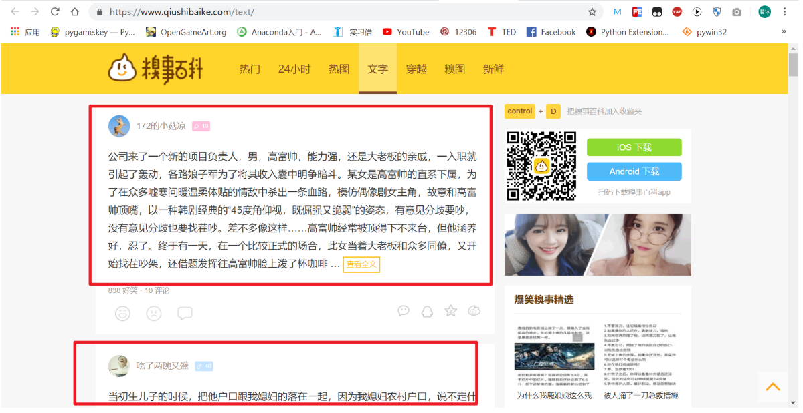

这里的一条条笑话，就是我们要爬取的内容。

**1. 分析爬取网页 URL 规律**

因为，我们要抓取好几页，所以先分析一下这个网页中文字的 URL 规律：

- 第一页：https://www.qiushibaike.com/text/
- 第二页：https://www.qiushibaike.com/text/page/2/
- 第三页：https://www.qiushibaike.com/text/page/3/

很直观，文本中的网页变化就是 page 之后的数字所以我们可以用 for 循环来操作。

一个小知识点： 

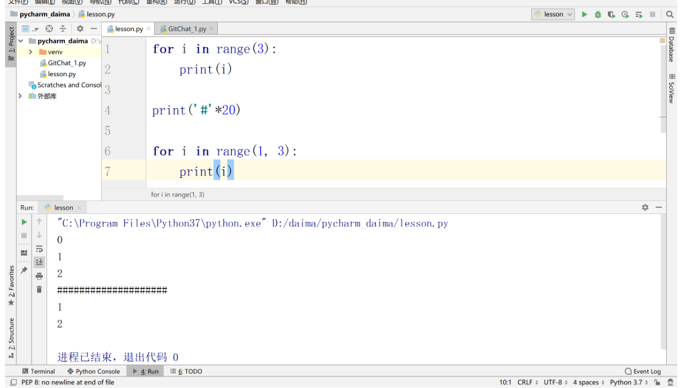

基础操作运行如下代码：

```python
import requests
from bs4 import BeautifulSoup

header = {'User-Agent': 'Mozilla/5.0 (Windows NT 10.0; Win64; x64) AppleWebKit/537.36 (KHTML, like Gecko) Chrome/75.0.3770.100 Safari/537.36'}
url = 'https://www.qiushibaike.com'

for page in range(1,2):
    req = requests.get(url + f'/text/page/{page}/', headers = header)
    soup = BeautifulSoup(req.text, 'lxml')
    title = soup.title.string
    # print(soup)
    print(title)
```

Sublime Text3 运行代码的快捷键是 Control + B： 

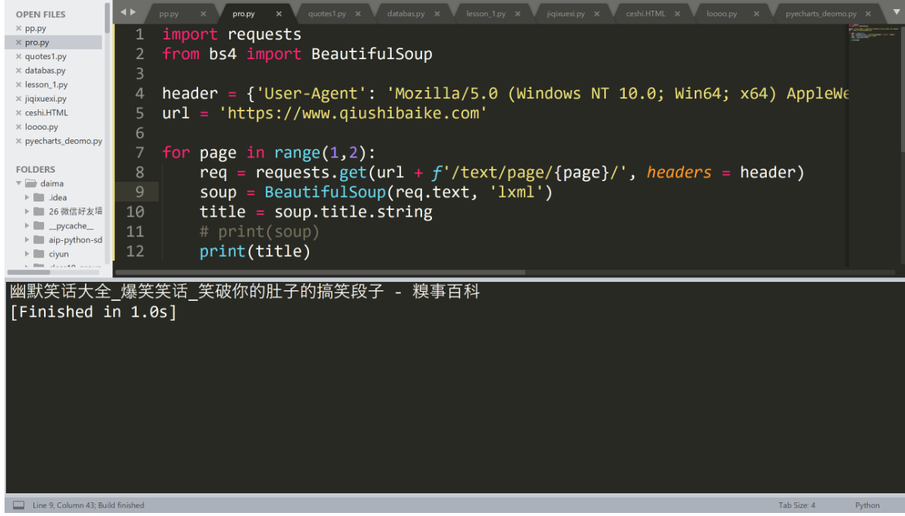

**2. 用 select() 函数定位指定的信息** 

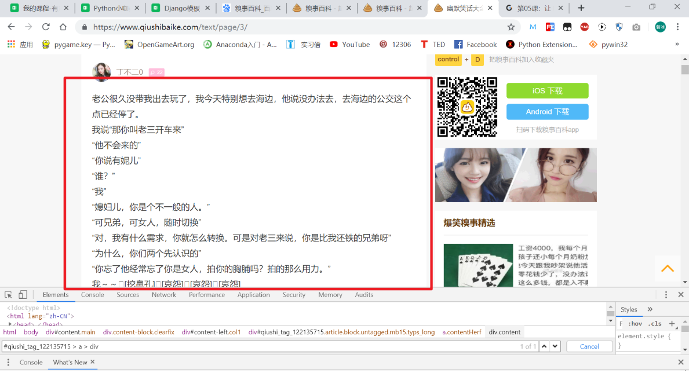

如上图所示，我们想要爬取右上角的“这个笑话内容”，该怎么操作呢？

代码如下：

```python
laugh_text = soup.select('#qiushi_tag_122135715 > a > div')
```

在 Tag 或 BeautifulSoup 对象的 .select() 方法中传入字符串参数，即可使用 CSS 选择器的语法找到 Tag。

使用 .select() 方法可以帮我们定位到指定的 Tag。那么，我们该如何确定这个指定的位置呢？让我们看一下 GIF 图片吧！ 


具体地，我们首先将鼠标放在所要定位的文字上，接下来，进行如下操作：

1.  右击鼠标，选择 “检查”
2.  在弹出的检测台中，选定对应的文字
3.  使用定位器，看 GIF 我定位我想要的数据的操作
4.  接下来我们分析一下，并写 CSS 选择器

我们发现，它在一个 div 里面的 `class = content` 下面中的 span 标签里面。所以，我们这么写 CSS 写入代码试一试：
```
.content span
```
运行如下代码：

```python
import requests
from bs4 import BeautifulSoup

header = {'User-Agent': 'Mozilla/5.0 (Windows NT 10.0; Win64; x64) AppleWebKit/537.36 (KHTML, like Gecko) Chrome/75.0.3770.100 Safari/537.36'}
url = 'https://www.qiushibaike.com'

for page in range(1,2):
    req = requests.get(url + f'/text/page/{page}/', headers = header)
    soup = BeautifulSoup(req.text, 'lxml')
    laugh_text = soup.select('.content span')
    print(laugh_text)
    # title = soup.title.string
    # print(soup)
    # print(title)
```

我们来运行试一试： 

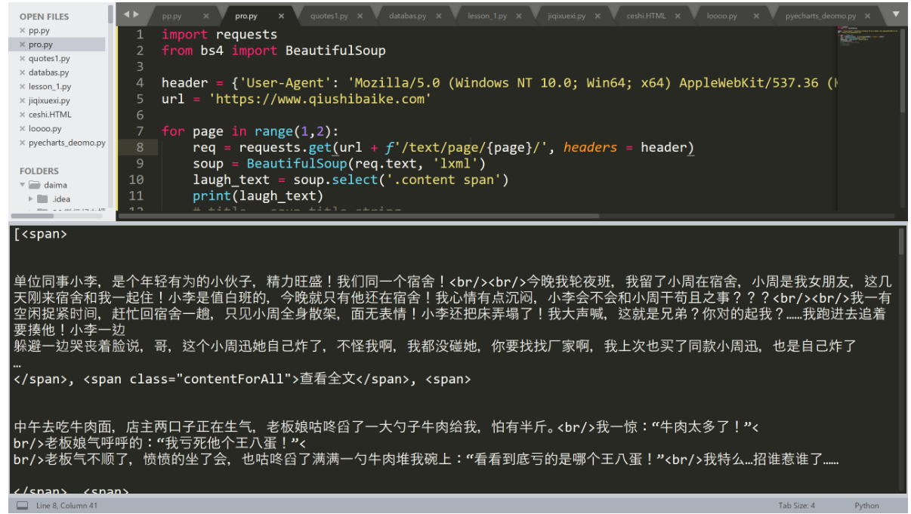

如果只想得到 Tag 中包含的文本内容，那么可以用 get_text() 方法，这个方法获取到 Tag 中包含的所有文版内容包括子孙 Tag 中的内容。

我们加入 get_text() 试一试，代码如下：

```python
import requests
from bs4 import BeautifulSoup

header = {'User-Agent': 'Mozilla/5.0 (Windows NT 10.0; Win64; x64) AppleWebKit/537.36 (KHTML, like Gecko) Chrome/75.0.3770.100 Safari/537.36'}
url = 'https://www.qiushibaike.com'

for page in range(1,5):
    req = requests.get(url + f'/text/page/{page}/', headers = header)
    soup = BeautifulSoup(req.text, 'lxml')
    laugh_text = soup.select('.content span')
    # 因为得到的是一个列表，所以需要用 for 循环遍历
    for laugh in laugh_text:
        print(laugh.get_text())
    # print(laugh_text)
    # title = soup.title.string
    # print(soup)
    # print(title)
```

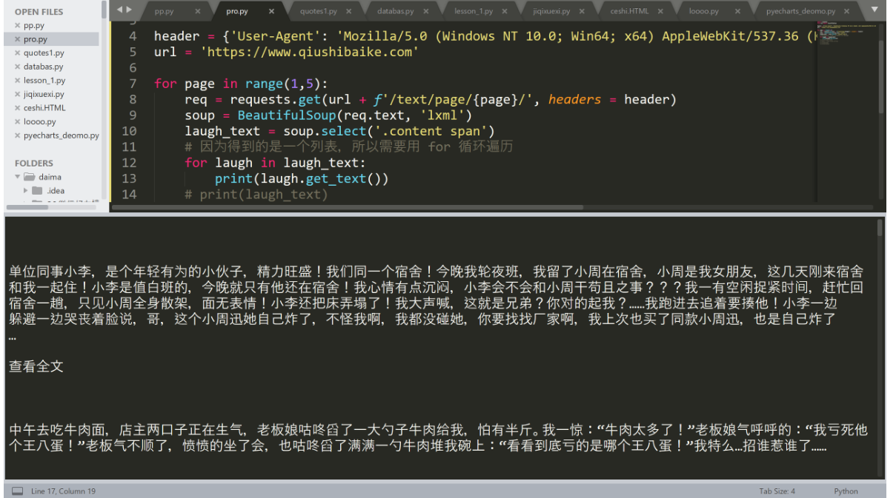

当然我们还可以直接用 text、strings、stripped_string，都是可以的。

**3. 使用 .get() 获取指定属性**

假设 HTML 中有如下的代码：

```html
<a class="sister" href="http://example.com/tillie" id="link3">Tillie</a>
```

我们如何获取到里面的文字呢？没错，直接使用 .get_text() 函数就可以了。

那么，如果我们只想获取它的 URL 地址呢？或者它所对应的 class 名字呢？这就需要我们使用 .get() 函数。

先用 select 选择到，然后使用 get：

```python
# .get("class")
# .get("href")
```

**实战总结**

1.  如何获取网页信息在 HTML 中对应的位置，如何使用 Chrome 浏览器获取到对应的 selector
2.  .get_text() 函数的使用
3.  当然，我们还可以使用 text、strings、stripped_string
4.  `.get()` 函数的使用
5.  一定要浏览 [BeautifulSoup 的官方文档](https://www.crummy.com/software/BeautifulSoup/bs4/doc/index.zh.html#get-text)

:::

::: details 公众号：AI悦创【二维码】


:::

::: info AI悦创·编程一对一

AI悦创·推出辅导班啦，包括「Python 语言辅导班、C++ 辅导班、java 辅导班、算法/数据结构辅导班、少儿编程、pygame 游戏开发、Linux、Web全栈」，全部都是一对一教学：一对一辅导 + 一对一答疑 + 布置作业 + 项目实践等。当然，还有线下线上摄影课程、Photoshop、Premiere 一对一教学、QQ、微信在线，随时响应！微信：Jiabcdefh

C++ 信息奥赛题解，长期更新！长期招收一对一中小学信息奥赛集训，莆田、厦门地区有机会线下上门，其他地区线上。微信：Jiabcdefh

方法一：[QQ](http://wpa.qq.com/msgrd?v=3&uin=1432803776&site=qq&menu=yes)

方法二：微信：Jiabcdefh

:::


