## 1. 数据库和 sqlite 介绍

### 1.1 什么是数据库

数据库是“**按照数据结构来组织、存储和管理数据的仓库**”，是一个长期存储在计算机内的、有组织的、有共享的、统一管理的数据集合。

数据库是以一定方式储存在一起、能与多个用户共享、具有尽可能小的冗余度、与应用程序彼此独立的数据集合，可视为电子化的文件柜。

### 1.2 有哪些数据库

#### 1.2.1 数据库类型

大型数据库：[甲骨文Oracle](https://baike.baidu.com/item/甲骨文公司/430115?fromtitle=Oracle&fromid=301207&fr=aladdin)。

分布式数据库：[HBase](https://baike.baidu.com/item/HBase/7670213?fr=aladdin)。

中型数据库：[SqlServer](https://baike.baidu.com/item/SqlServer/463101?fr=aladdin)、[Mysql](https://baike.baidu.com/item/MySQL/471251)、[MariaDB](https://baike.baidu.com/item/mariaDB/6466119?fr=aladdin)、[PostgreSQL](https://baike.baidu.com/item/PostgreSQL/530240?fr=aladdin)、[Redis](https://baike.baidu.com/item/Redis/6549233) 等。

小型数据库：[Sqlite](https://baike.baidu.com/item/SQLite/375020?fr=aladdin)、[Access](https://baike.baidu.com/item/Microsoft%20Office%20Access/7748166?fromtitle=access&fromid=10275&fr=aladdin) 。

#### 1.2.2 如何选择

大集团：Oracle、HBase。

发展中公司：PostgreSQL、Mysql。

app 的临时数据库：Sqlite。

#### 1.2.3 Sqlite

- 方便携带、易于操作、随时创建、Python 原生支持的小型数据库文件。
- 轻型的数据库，遵守 ACID 的关系型数据库管理系统，它包含在一个相对小的 C 库中。
- `D.RichardHipp` 建立的公有领域项目。
- 设计目标是嵌入式的，而且已经在很多嵌入式产品中使用了它，它占用资源非常的低，在嵌入式设备中，可能只需要几百 K 的内存就够了。
- 支持 Windows/Linux/Unix 等等主流的操作系统。
- 能够跟很多程序语言相结合，比如 Tcl、C#、PHP、Java 等，还有 ODBC 接口。
- 比起 Mysql、PostgreSQL 这两款开源的世界著名数据库管理系统来讲，它的处理速度比他们都快。
- 第一个 Alpha 版本诞生于 2000年5月。 至 2015年已经有 15 个年头，SQLite 也迎来了一个版本 SQLite 3 已经发布。
- Python 自带 sqlite3 这个库，方便且直接的创建和读取 sqlite3 数据库。

## 2. sqlite 创建表格

### 2.1 sqlitestudio 介绍

本节内容的目的，是教大家如何在非代码的情况下，创建 sqlite3 数据库文件和表格编辑操作。

既然不写代码，就肯定需要借助软件来操作。本节课对应的源码中，准备好了 windows、macos、linux 三个系统的 sqlitestudio 软件，如下图：

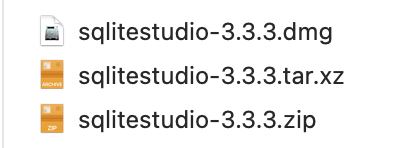

> windows 使用 zip；macos 使用 dmg；linux 使用 tar.xz；

sqlitestudio 是一款绿色软件，安装你的操作系统所对应的 sqlitestudio 软件，然后执行，就可以得到启动界面。

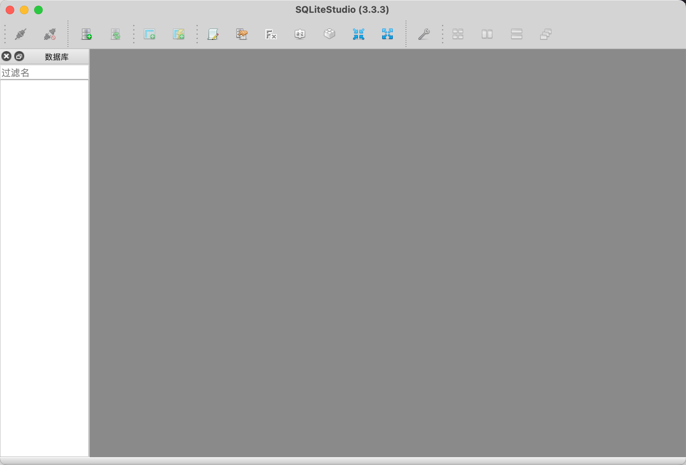

### 2.2 新建  sqlite 数据库文件

点击左上角的数据库，选择添加数据库，则会弹框，让你选择某个数据库文件，或者创建一个新的 sqlite 文件

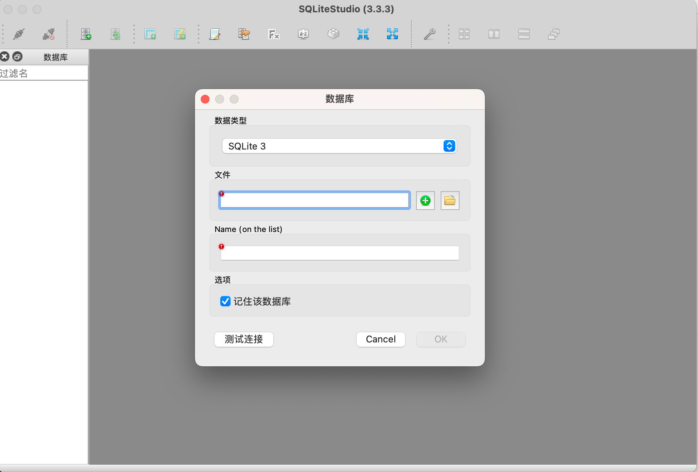

点击黄色的文件夹，是指打开某个存在的 sqlite 文件。

点击 `绿色的+` ，是新建一个 sqlite 文件，并且你也需要指定存储的具体位置。

选择在三个 sqlitestudio 安装包旁边，新建一个名为 `first.db` 的文件，如下截图：


并且，文件也有对应的生成。

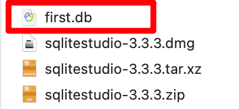

### 2.3 新增数据

回到 sqlitestudio 软件界面，打开刚新建的 `first.db` ，里面什么都没有，表格是空的，现在来新建一个表格。

鼠标右键点击 Tables，然后选择新建表格，在新出的界面中，写表格名、字段名和字段类型，如下图：

**方法一：**


**方法二：**

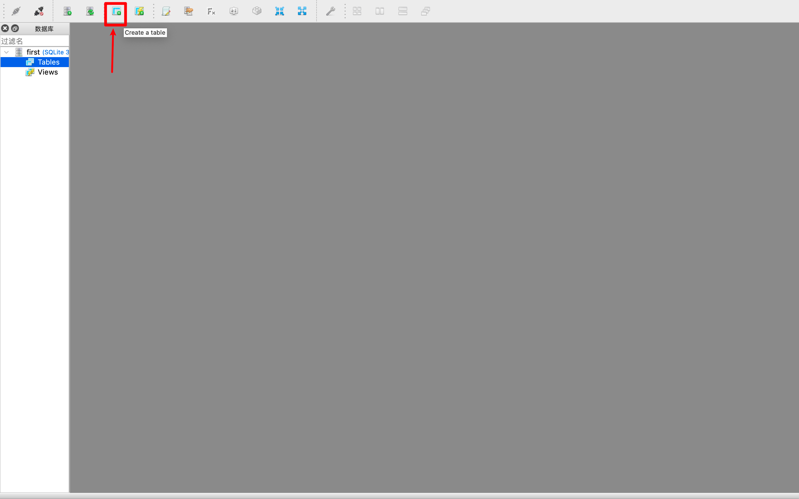

---

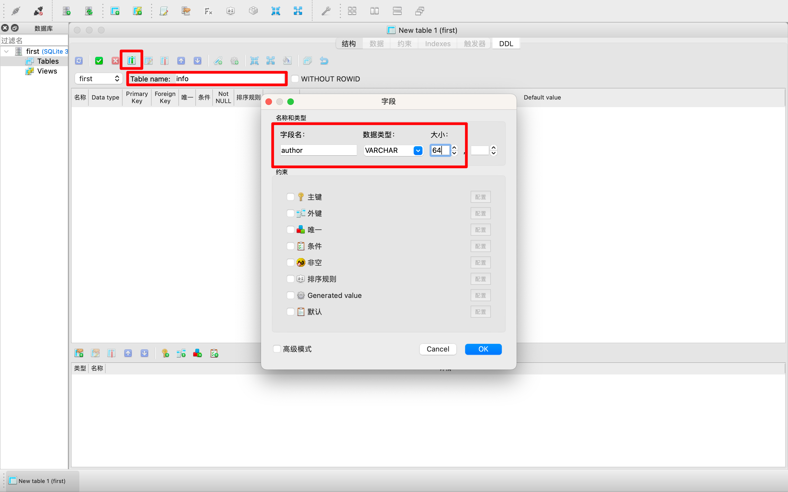

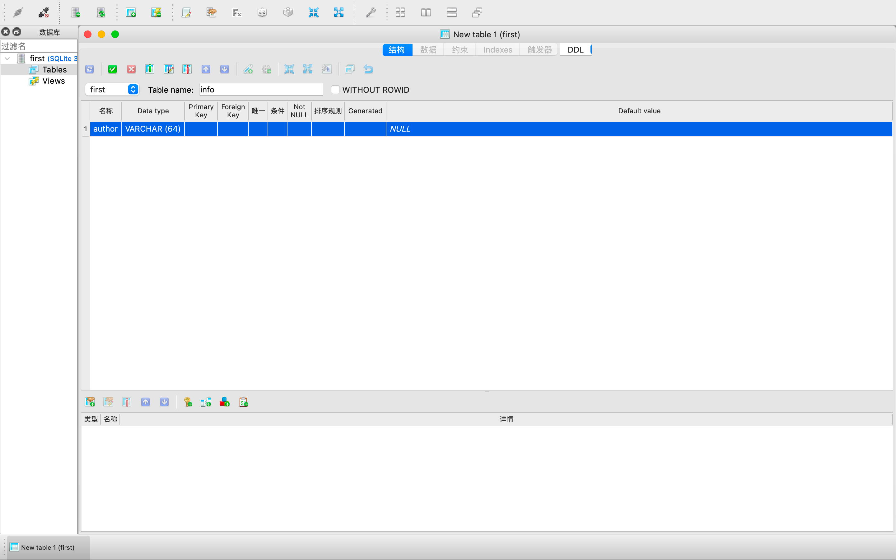

Table Name 表格名，输入具体名称。最上方框中的那个按钮，是增列字段的按钮，点击按钮弹出中间的字段信息，输入字段名、类型、大小等。

这里写了id title content author 四个字段信息，然后点击绿色的勾，保存表格即可。


保存了文件，重新刷新页面，就可以查看数据栏，如下：

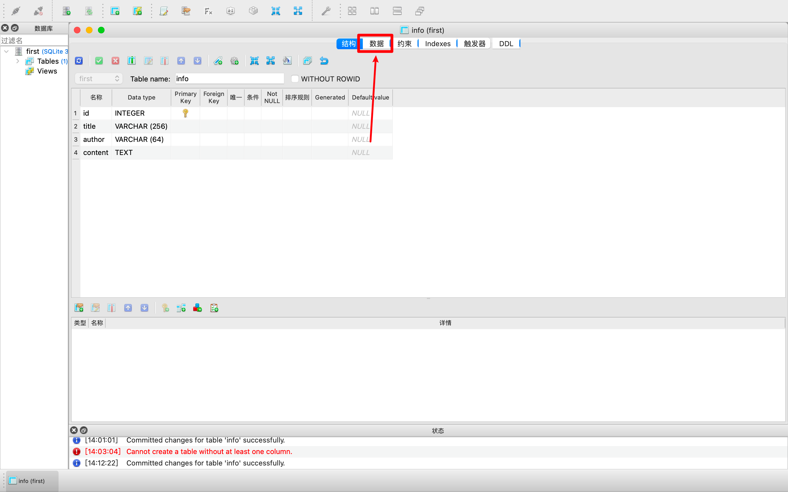

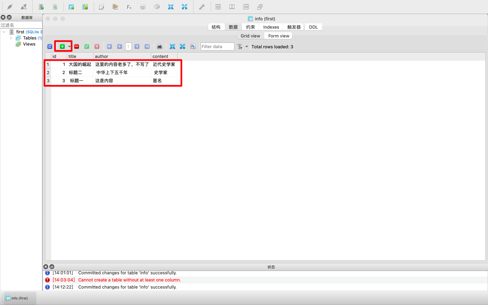

点击`绿色的+`号，然后增加几条数据，方便我们下节课的代码练习。图中有三条。

sqlitestudio 也要保留，方便我们下节课，查看代码练习的数据变化结果。

## 3. Python 链接和操作 sqlite

### 3.1 链接和查询代码

Python 自身携带 sqlite 库，不需要额外安装，直接使用即可。导入代码：

```python
import sqlite3
```

导入代码之后，将 `first.db` 文件，放到代码文件旁边。这里用的是 py，所以是把 py 和 `first.db` 文件放一起，不放一起就只能使用绝对路径。如下图：


然后使用 sqlite3 库，链接 `first.db` 文件，代码 `firstdb = sqlite3.connect('first.db')`

正常运行后，写查询语句，从数据库中读取全部数据，如下代码：

```python
# 查询语句
query_sql = "select * from info"
for result in firstdb.execute(query_sql):
    print(result)
```

完整代码：

```python
# -*- coding: utf-8 -*-
# @Time    : 2022/7/17 14:36
# @Author  : AI悦创
# @FileName: main.py
# @Software: PyCharm
# @Blog    ：http://www.aiyc.top
# @公众号   ：AI悦创
import sqlite3

firstdb = sqlite3.connect("first.db")

# 查询语句
query_sql = "select * from info"
for result in firstdb.execute(query_sql):
    print(result)
# firstdb.execute(): Executes an SQL statement./执行 SQL 语句。
print(list(firstdb.execute(query_sql)))
```

输出结构效果图：


这是最简单的查询语句。数据库都是支持查询、删除、增加、更新操作的。

### 3.2 删除数据操作

删除操作，将数据从数据库中移除，关键词 delete，先删除一条数据，如下代码：

```python
# 删除特定数据
delete_sql = "delete from info where id = 1"

firstdb.execute(delete_sql)
firstdb.commit()

# 查询并输出
query_sql = "select * from info"
for result in firstdb.execute(query_sql):
    print(result)
```

运行结果如下图：

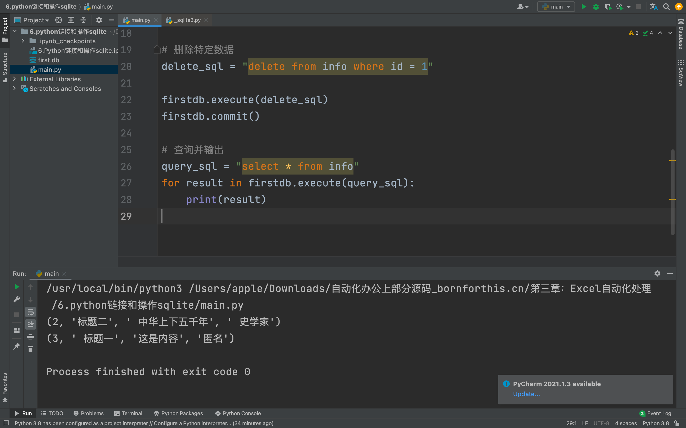


### 3.3 插入更多数据

增加的操作，关键词 add，使用 for 循环，先批量的增加一些数据：

```python
# 插入数据
insert_sql = "insert into info(title, content, author) values ('第{}个标题', '随机的第{}个内容', '匿名')"
for i in range(10, 20):
    sql = insert_sql.format(i, i * 2)
    firstdb.execute(sql)
    firstdb.commit()

# 查询并输出
query_sql = "select * from info"
for result in firstdb.execute(query_sql):
    print(result)
```

for 循环，从 10 循环到 20，不含 20，然后全部执行 sql 语句和提交到数据库。最后查询全部数据，看下有没有增多，如下结果图：

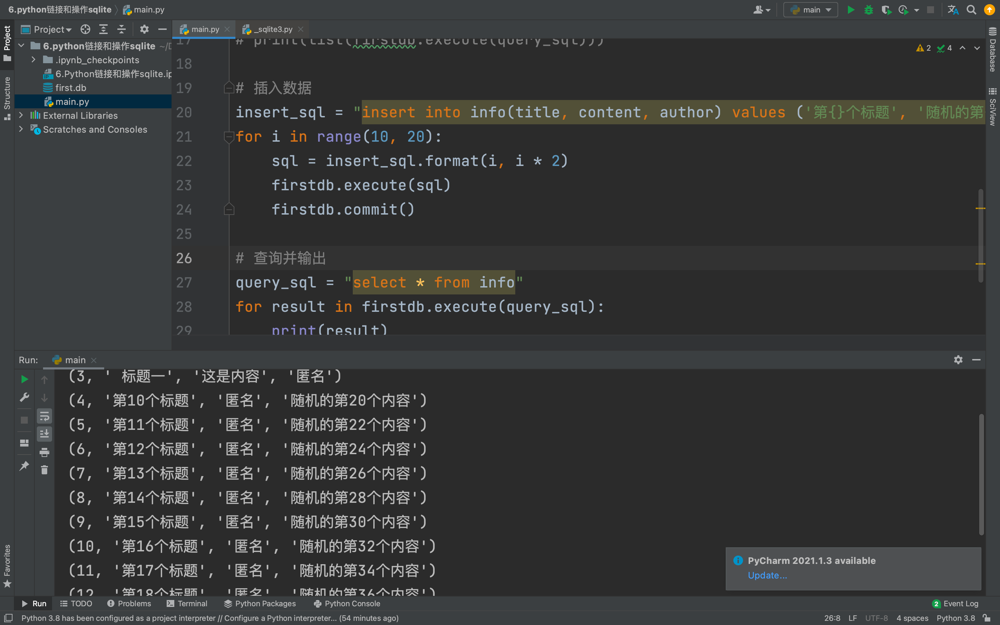

## 3.4 更新数据操作

数据有增加，最后更新数据，关键词 update，做个条件更新，id 大于等于 4 的数据，设置 author 为“不匿名”，如下代码：

```python
# 更新数据
update_sql = "update info set author = '不匿名' where id >= 4"
firstdb.execute(update_sql)

# 查询并输出
query_sql = "select * from info"
for result in firstdb.execute(query_sql):
    print(result)
```

最后的结果图如下：

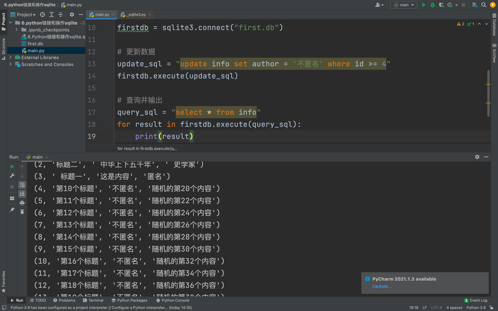

以上就是 Python 操作 sqlite 的全部代码了。

**【多选题】小练习**

数据库支持哪些操作？

- [x] 查询数据
- [x] 新增数据
- [x] 更新数据
- [x] 删除数据

> 该数据库是单数据库操作，不要打开多个，这样有可能会锁死。


::: details 公众号：AI悦创【二维码】


:::

::: info AI悦创·编程一对一

AI悦创·推出辅导班啦，包括「Python 语言辅导班、C++ 辅导班、java 辅导班、算法/数据结构辅导班、少儿编程、pygame 游戏开发、Linux、Web全栈」，全部都是一对一教学：一对一辅导 + 一对一答疑 + 布置作业 + 项目实践等。当然，还有线下线上摄影课程、Photoshop、Premiere 一对一教学、QQ、微信在线，随时响应！微信：Jiabcdefh

C++ 信息奥赛题解，长期更新！长期招收一对一中小学信息奥赛集训，莆田、厦门地区有机会线下上门，其他地区线上。微信：Jiabcdefh

方法一：[QQ](http://wpa.qq.com/msgrd?v=3&uin=1432803776&site=qq&menu=yes)

方法二：微信：Jiabcdefh

:::


