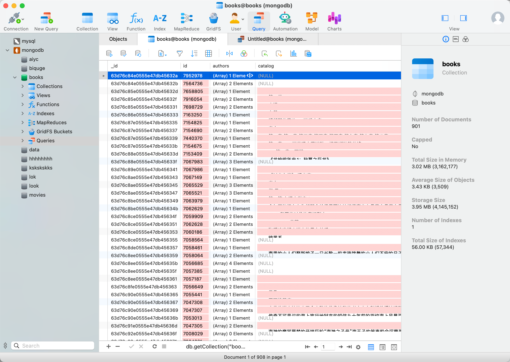
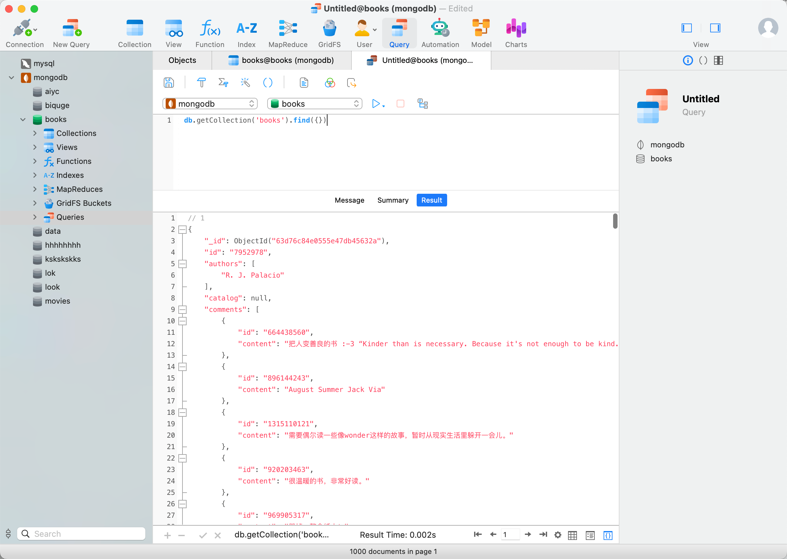

你好，我是悦创。

在上一课时我们介绍了异步爬虫的基本原理和 asyncio 的基本用法，另外在最后简单提及了 aiohttp 实现网页爬取的过程，这一课是我们来介绍一下 aiohttp 的常见用法，以及通过一个实战案例来介绍下使用 aiohttp 完成网页异步爬取的过程。

## 1. aiohttp

前面介绍的 asyncio 模块内部实现了对 TCP、UDP、SSL 协议的异步操作，但是对于 HTTP 请求的异步操作来说，我们就需要用到 aiohttp 来实现了。

aiohttp 是一个基于 asyncio 的异步 HTTP 网络模块，它既提供了服务端，又提供了客户端。其中我们用服务端可以搭建一个支持异步处理的服务器，用于处理请求并返回响应，类似于 Django、Flask、Tornado 等一些 Web 服务器。而客户端我们就可以用来发起请求，就类似于 requests 来发起一个 HTTP 请求然后获得响应，但 requests 发起的是同步的网络请求，而 aiohttp 则发起的是异步的。

本课时我们就主要来了解一下 aiohttp 客户端部分的使用。

## 2. 基本使用

### 2.1 基本实例

首先我们来看一个基本的 aiohttp 请求案例，代码如下：

```python
import aiohttp
import asyncio


async def fetch(session, url):
    async with session.get(url) as response:
        return await response.text(), response.status


async def main():
    async with aiohttp.ClientSession() as session:
        html, status = await fetch(session, 'https://bornforthis.cn')
        print(f'html: {html[:100]}...')
        print(f'status: {status}')


if __name__ == '__main__':
    loop = asyncio.get_event_loop()
    loop.run_until_complete(main())
```

在这里我们使用 aiohttp 来爬取了我的个人博客，获得了源码和响应状态码并输出，运行结果如下：

```python
html: <!DOCTYPE html>
<html lang="zh-CN" data-theme="light">
<head>
<meta charset="utf-8" />
<meta name="v...
status: 200
```

这里网页源码过长，只截取输出了一部分，可以看到我们成功获取了网页的源代码及响应状态码 200，也就完成了一次基本的 HTTP 请求，即我们成功使用 aiohttp 通过异步的方式进行了网页的爬取，当然这个操作用之前我们所讲的 requests 同样也可以做到。

我们可以看到其请求方法的定义和之前有了明显的区别，主要有如下几点：

- 首先在导入库的时候，我们除了必须要引入 aiohttp 这个库之外，还必须要引入 asyncio 这个库，因为要实现异步爬取需要启动协程，而协程则需要借助于 asyncio 里面的事件循环来执行。除了事件循环，asyncio 里面也提供了很多基础的异步操作。
- 异步爬取的方法的定义和之前有所不同，在每个异步方法前面统一要加 async 来修饰。
- with as 语句前面同样需要加 async 来修饰，在 Python 中，with as 语句用于声明一个上下文管理器，能够帮我们自动分配和释放资源，而在异步方法中，with as 前面加上 async 代表声明一个支持异步的上下文管理器。
- 对于一些返回 coroutine 的操作，前面需要加 await 来修饰，如 response 调用 text 方法，查询 API 可以发现其返回的是 coroutine 对象，那么前面就要加 await；而对于状态码来说，其返回值就是一个数值类型，那么前面就不需要加 await。所以，这里可以按照实际情况处理，参考官方文档说明，看看其对应的返回值是怎样的类型，然后决定加不加 await 就可以了。
- 最后，定义完爬取方法之后，实际上是 main 方法调用了 fetch 方法。要运行的话，必须要启用事件循环，事件循环就需要使用 asyncio 库，然后使用 `run_until_complete` 方法来运行。

::: warning 注意

注意在 Python 3.7 及以后的版本中，我们可以使用 `asyncio.run(main())` 来代替最后的启动操作，不需要显式声明事件循环，run 方法内部会自动启动一个事件循环。但这里为了兼容更多的 Python 版本，依然还是显式声明了事件循环。

:::

### 2.2 URL 参数设置

对于 URL 参数的设置，我们可以借助于 params 参数，传入一个字典即可，示例如下：

```python
import aiohttp
import asyncio


async def main():
    params = {'name': 'AI悦创', 'age': 25}
    async with aiohttp.ClientSession() as session:
        async with session.get('https://httpbin.org/get', params=params) as response:
            print(await response.text())


if __name__ == '__main__':
    asyncio.get_event_loop().run_until_complete(main())
```

运行结果如下：

```python
{
  "args": {
    "age": "25", 
    "name": "AI\u60a6\u521b"
  }, 
  "headers": {
    "Accept": "*/*", 
    "Accept-Encoding": "gzip, deflate", 
    "Host": "httpbin.org", 
    "User-Agent": "Python/3.10 aiohttp/3.8.3", 
    "X-Amzn-Trace-Id": "Root=1-63d749f1-46e3ed0115a3687c5c400570"
  }, 
  "origin": "59.58.158.123", 
  "url": "https://httpbin.org/get?name=AI\u60a6\u521b&age=25"
}
```

这里可以看到，其实际请求的 URL 为 [https://httpbin.org/get?name=AI\u60a6\u521b&age=25](https://httpbin.org/get?name=AI\u60a6\u521b&age=25)，其 URL 请求参数就对应了 params 的内容。

### 2.3 其他请求类型

另外 aiohttp 还支持其他的请求类型，如 POST、PUT、DELETE 等等，这个和 requests 的使用方式有点类似，示例如下：

```python
session.post('http://httpbin.org/post', data=b'data')
session.put('http://httpbin.org/put', data=b'data')
session.delete('http://httpbin.org/delete')
session.head('http://httpbin.org/get')
session.options('http://httpbin.org/get')
session.patch('http://httpbin.org/patch', data=b'data')
```

### 2.4 POST 数据

对于 POST 表单提交，其对应的请求头的 Content-type 为 `application/x-www-form-urlencoded`，我们可以用如下方式来实现，代码示例如下：

```python
import aiohttp
import asyncio


async def main():
    data = {'name': 'AI悦创', 'age': 25}
    async with aiohttp.ClientSession() as session:
        async with session.post('https://httpbin.org/post', data=data) as response:
            print(await response.text())


if __name__ == '__main__':
    asyncio.get_event_loop().run_until_complete(main())
```

运行结果如下：

```python
{
  "args": {}, 
  "data": "", 
  "files": {}, 
  "form": {
    "age": "25", 
    "name": "AI\u60a6\u521b"
  }, 
  "headers": {
    "Accept": "*/*", 
    "Accept-Encoding": "gzip, deflate", 
    "Content-Length": "32", 
    "Content-Type": "application/x-www-form-urlencoded", 
    "Host": "httpbin.org", 
    "User-Agent": "Python/3.10 aiohttp/3.8.3", 
    "X-Amzn-Trace-Id": "Root=1-63d74aa1-1e674659655691c0779fcc5d"
  }, 
  "json": null, 
  "origin": "59.58.158.123", 
  "url": "https://httpbin.org/post"
}
```

对于 POST JSON 数据提交，其对应的请求头的 `Content-type` 为 `application/json`，我们只需要将 post 方法的 data 参数改成 json 即可，代码示例如下：

::: code-tabs#python

@tab 核心代码

```python
async def main():
    data = {'name': 'AI悦创', 'age': 25}
    async with aiohttp.ClientSession() as session:
        async with session.post('https://httpbin.org/post', json=data) as response:
            print(await response.text())
```

@tab 运行代码

```python
import aiohttp
import asyncio


async def main():
    data = {'name': 'AI悦创', 'age': 25}
    async with aiohttp.ClientSession() as session:
        async with session.post('https://httpbin.org/post', json=data) as response:
            print(await response.text())


if __name__ == '__main__':
    asyncio.get_event_loop().run_until_complete(main())
```

:::

运行结果如下：

```python
{
  "args": {}, 
  "data": "{\"name\": \"AI\\u60a6\\u521b\", \"age\": 25}", 
  "files": {}, 
  "form": {}, 
  "headers": {
    "Accept": "*/*", 
    "Accept-Encoding": "gzip, deflate", 
    "Content-Length": "37", 
    "Content-Type": "application/json", 
    "Host": "httpbin.org", 
    "User-Agent": "Python/3.10 aiohttp/3.8.3", 
    "X-Amzn-Trace-Id": "Root=1-63d74c4a-7a919d6334abe9bf53bae9c1"
  }, 
  "json": {
    "age": 25, 
    "name": "AI\u60a6\u521b"
  }, 
  "origin": "59.58.158.123", 
  "url": "https://httpbin.org/post"
}
```

### 2.5 响应字段

对于响应来说，我们可以用如下的方法分别获取响应的状态码、响应头、响应体、响应体二进制内容、响应体 JSON 结果，代码示例如下：

::: code-tabs#python

@tab Code

```python
import aiohttp
import asyncio


async def main():
    data = {'name': 'AI悦创', 'age': 25}
    async with aiohttp.ClientSession() as session:
        async with session.post('https://httpbin.org/post', data=data) as response:
            print('status:', response.status)
            print('headers:', response.headers)
            print('body:', await response.text())
            print('bytes:', await response.read())
            print('json:', await response.json())


if __name__ == '__main__':
    asyncio.get_event_loop().run_until_complete(main())
```

@tab Run Result

```python
status: 200
headers: <CIMultiDictProxy('Date': 'Mon, 30 Jan 2023 06:40:52 GMT', 'Content-Type': 'application/json', 'Content-Length': '511', 'Connection': 'keep-alive', 'Server': 'gunicorn/19.9.0', 'Access-Control-Allow-Origin': '*', 'Access-Control-Allow-Credentials': 'true')>
body: {
  "args": {}, 
  "data": "", 
  "files": {}, 
  "form": {
    "age": "25", 
    "name": "AI\u60a6\u521b"
  }, 
  "headers": {
    "Accept": "*/*", 
    "Accept-Encoding": "gzip, deflate", 
    "Content-Length": "32", 
    "Content-Type": "application/x-www-form-urlencoded", 
    "Host": "httpbin.org", 
    "User-Agent": "Python/3.10 aiohttp/3.8.3", 
    "X-Amzn-Trace-Id": "Root=1-63d76674-4b3e1f9503f8b46e01c4ac59"
  }, 
  "json": null, 
  "origin": "59.58.158.123", 
  "url": "https://httpbin.org/post"
}

bytes: b'{\n  "args": {}, \n  "data": "", \n  "files": {}, \n  "form": {\n    "age": "25", \n    "name": "AI\\u60a6\\u521b"\n  }, \n  "headers": {\n    "Accept": "*/*", \n    "Accept-Encoding": "gzip, deflate", \n    "Content-Length": "32", \n    "Content-Type": "application/x-www-form-urlencoded", \n    "Host": "httpbin.org", \n    "User-Agent": "Python/3.10 aiohttp/3.8.3", \n    "X-Amzn-Trace-Id": "Root=1-63d76674-4b3e1f9503f8b46e01c4ac59"\n  }, \n  "json": null, \n  "origin": "59.58.158.123", \n  "url": "https://httpbin.org/post"\n}\n'
json: {'args': {}, 'data': '', 'files': {}, 'form': {'age': '25', 'name': 'AI悦创'}, 'headers': {'Accept': '*/*', 'Accept-Encoding': 'gzip, deflate', 'Content-Length': '32', 'Content-Type': 'application/x-www-form-urlencoded', 'Host': 'httpbin.org', 'User-Agent': 'Python/3.10 aiohttp/3.8.3', 'X-Amzn-Trace-Id': 'Root=1-63d76674-4b3e1f9503f8b46e01c4ac59'}, 'json': None, 'origin': '59.58.158.123', 'url': 'https://httpbin.org/post'}
```

:::

这里我们可以看到有些字段前面需要加 await，有的则不需要。其原则是，如果其返回的是一个 coroutine 对象（如 async 修饰的方法），那么前面就要加 await，具体可以看 aiohttp 的 API，其链接为：[https://docs.aiohttp.org/en/stable/client_reference.html](https://docs.aiohttp.org/en/stable/client_reference.html)。

### 2.6 超时设置

对于超时的设置，我们可以借助于 ClientTimeout 对象，比如这里我要设置 1 秒的超时，可以这么来实现：

```python
import aiohttp
import asyncio


async def main():
    timeout = aiohttp.ClientTimeout(total=1)
    async with aiohttp.ClientSession(timeout=timeout) as session:
        async with session.get('https://httpbin.org/get') as response:
            print('status:', response.status)


if __name__ == '__main__':
    asyncio.get_event_loop().run_until_complete(main())
```

如果在 1 秒之内成功获取响应的话，运行结果如下：

```python
200
```

如果超时的话，会抛出 TimeoutError 异常，其类型为 `asyncio.TimeoutError`，我们再进行异常捕获即可。

```python
Traceback (most recent call last):
  File "/Users/huangjiabao/GitHub/SourceCode/MacBookPro16-Code/PythonCoder/StudentCoder/25-dhy/demo.py", line 13, in <module>
    asyncio.get_event_loop().run_until_complete(main())
  File "/opt/homebrew/Cellar/python@3.10/3.10.8/Frameworks/Python.framework/Versions/3.10/lib/python3.10/asyncio/base_events.py", line 649, in run_until_complete
    return future.result()
  File "/Users/huangjiabao/GitHub/SourceCode/MacBookPro16-Code/PythonCoder/StudentCoder/25-dhy/demo.py", line 8, in main
    async with session.get('https://httpbin.org/get') as response:
  File "/Users/huangjiabao/GitHub/SourceCode/MacBookPro16-Code/PythonCoder/PythonCoderVenv/lib/python3.10/site-packages/aiohttp/client.py", line 1141, in __aenter__
    self._resp = await self._coro
  File "/Users/huangjiabao/GitHub/SourceCode/MacBookPro16-Code/PythonCoder/PythonCoderVenv/lib/python3.10/site-packages/aiohttp/client.py", line 560, in _request
    await resp.start(conn)
  File "/Users/huangjiabao/GitHub/SourceCode/MacBookPro16-Code/PythonCoder/PythonCoderVenv/lib/python3.10/site-packages/aiohttp/client_reqrep.py", line 894, in start
    with self._timer:
  File "/Users/huangjiabao/GitHub/SourceCode/MacBookPro16-Code/PythonCoder/PythonCoderVenv/lib/python3.10/site-packages/aiohttp/helpers.py", line 720, in __exit__
    raise asyncio.TimeoutError from None
asyncio.exceptions.TimeoutError
```

另外 ClientTimeout 对象声明时还有其他参数，如 connect、socket_connect 等，详细说明可以参考官方文档：[https://docs.aiohttp.org/en/stable/client_quickstart.html#timeouts](https://docs.aiohttp.org/en/stable/client_quickstart.html#timeouts)。

### 2.7 并发限制

由于 aiohttp 可以支持非常大的并发，比如上万、十万、百万都是能做到的，但这么大的并发量，目标网站是很可能在短时间内无法响应的，而且很可能瞬时间将目标网站爬挂掉。所以我们需要控制一下爬取的并发量。

在一般情况下，我们可以借助于 asyncio 的 Semaphore 来控制并发量，代码示例如下：

```python
import asyncio
import aiohttp

CONCURRENCY = 5
URL = 'https://www.baidu.com'
semaphore = asyncio.Semaphore(CONCURRENCY)
session = None


async def scrape_api():
    async with semaphore:
        print('scraping', URL)
        async with session.get(URL) as response:
            await asyncio.sleep(1)
            return await response.text()


async def main():
    global session
    session = aiohttp.ClientSession()
    scrape_index_tasks = [asyncio.ensure_future(scrape_api()) for _ in range(10000)]
    await asyncio.gather(*scrape_index_tasks)


if __name__ == '__main__':
    asyncio.get_event_loop().run_until_complete(main())
```

在这里我们声明了 CONCURRENCY 代表爬取的最大并发量为 5，同时声明爬取的目标 URL 为百度。接着我们借助于 Semaphore 创建了一个信号量对象，赋值为 semaphore，这样我们就可以用它来控制最大并发量了。

**怎么使用呢？**

我们这里把它直接放置在对应的爬取方法里面，使用 `async with` 语句将 semaphore 作为上下文对象即可。这样的话，信号量可以控制进入爬取的最大协程数量，最大数量就是我们声明的 CONCURRENCY 的值。

在 main 方法里面，我们声明了 10000 个 task，传递给 gather 方法运行。倘若不加以限制，这 10000 个 task 会被同时执行，并发数量太大。但有了信号量的控制之后，同时运行的 task 的数量最大会被控制在 5 个，这样就能给 aiohttp 限制速度了。

在这里，aiohttp 的基本使用就介绍这么多，更详细的内容还是推荐你到官方文档查阅，链接：[https://docs.aiohttp.org/en/stable/](https://docs.aiohttp.org/en/stable/)。

## 3. 爬取实战

上面我们介绍了 aiohttp 的基本用法之后，下面我们来根据一个实例实现异步爬虫的实战演练吧。

本次我们要爬取的网站是：[https://dynamic5.scrape.center/](https://dynamic5.scrape.center/)，页面如图所示。


这是一个书籍网站，整个网站包含了数千本书籍信息，网站是 JavaScript 渲染的，数据可以通过 Ajax 接口获取到，并且接口没有设置任何反爬措施和加密参数，另外由于这个网站比之前的电影案例网站数据量大一些，所以更加适合做异步爬取。

本课时我们要完成的目标有：

- 使用 aiohttp 完成全站的书籍数据爬取。
- 将数据通过异步的方式保存到 MongoDB 中。

在本课时开始之前，请确保你已经做好了如下准备工作：

- 安装好了 Python（最低为 Python 3.6 版本，最好为 3.7 版本或以上），并能成功运行 Python 程序。
- 了解了 Ajax 爬取的一些基本原理和模拟方法。
- 了解了异步爬虫的基本原理和 asyncio 库的基本用法。
- 了解了 aiohttp 库的基本用法。
- 安装并成功运行了 MongoDB 数据库，并安装了异步存储库 motor。

> 注：这里要实现 MongoDB 异步存储，需要异步 MongoDB 存储库，叫作 motor，安装命令为：`pip3 install motor`

### 3.1 页面分析

在之前我们讲解了 Ajax 的基本分析方法，本课时的站点结构和之前 Ajax 分析的站点结构类似，都是列表页加详情页的结构，加载方式都是 Ajax，所以我们能轻松分析到如下信息：

- 列表页的 Ajax 请求接口格式为：`https://dynamic5.scrape.center/api/book/?limit=18&offset={offset}`，limit 的值即为每一页的书的个数，offset 的值为每一页的偏移量，其计算公式为 `offset = limit * (page - 1)` ，如第 1 页 offset 的值为 0，第 2 页 offset 的值为 18，以此类推。
- 列表页 Ajax 接口返回的数据里 results 字段包含当前页 18 本书的信息，其中每本书的数据里面包含一个字段 id，这个 id 就是书本身的 ID，可以用来进一步请求详情页。
- 详情页的 Ajax 请求接口格式为：`https://dynamic5.scrape.center/api/book/{id}`，id 即为书的 ID，可以从列表页的返回结果中获取。

如果你掌握了 Ajax 爬取实战一课时的内容话，上面的内容应该很容易分析出来。如有难度，可以复习下之前的知识。

### 3.2 实现思路

其实一个完善的异步爬虫应该能够充分利用资源进行全速爬取，其思路是维护一个动态变化的爬取队列，每产生一个新的 task 就会将其放入队列中，有专门的爬虫消费者从队列中获取 task 并执行，能做到在最大并发量的前提下充分利用等待时间进行额外的爬取处理。

但上面的实现思路整体较为烦琐，需要设计爬取队列、回调函数、消费者等机制，需要实现的功能较多。由于我们刚刚接触 aiohttp 的基本用法，本课时也主要是了解 aiohttp 的实战应用，所以这里我们将爬取案例的实现稍微简化一下。

在这里我们将爬取的逻辑拆分成两部分，第一部分为爬取列表页，第二部分为爬取详情页。由于异步爬虫的关键点在于并发执行，所以我们可以将爬取拆分为两个阶段：

- 第一阶段为所有列表页的异步爬取，我们可以将所有的列表页的爬取任务集合起来，声明为 task 组成的列表，进行异步爬取。
- 第二阶段则是拿到上一步列表页的所有内容并解析，拿到所有书的 id 信息，组合为所有详情页的爬取任务集合，声明为 task 组成的列表，进行异步爬取，同时爬取的结果也以异步的方式存储到 MongoDB 里面。

因为两个阶段的拆分之后需要串行执行，所以可能不能达到协程的最佳调度方式和资源利用情况，但也差不了很多。但这个实现思路比较简单清晰，代码实现也比较简单，能够帮我们快速了解 aiohttp 的基本使用。

### 3.3 基本配置

首先我们先配置一些基本的变量并引入一些必需的库，代码如下：

```python
import asyncio
import aiohttp
import logging

logging.basicConfig(level=logging.INFO,
                    format='%(asctime)s - %(levelname)s: %(message)s')
INDEX_URL = 'https://dynamic5.scrape.center/api/book/?limit=18&offset={offset}'
DETAIL_URL = 'https://dynamic5.scrape.center/api/book/{id}'
PAGE_SIZE = 18
PAGE_NUMBER = 100
CONCURRENCY = 5
```

在这里我们导入了 asyncio、aiohttp、logging 这三个库，然后定义了 logging 的基本配置。接着定义了 URL、爬取页码数量 `PAGE_NUMBER`、并发量 `CONCURRENCY` 等信息。

### 3.4 爬取列表页

首先，第一阶段我们就来爬取列表页，还是和之前一样，我们先定义一个通用的爬取方法，代码如下：

```python
semaphore = asyncio.Semaphore(CONCURRENCY)
session = None


async def scrape_api(url):
    async with semaphore:
        try:
            logging.info('scraping %s', url)
            async with session.get(url) as response:
                return await response.json()
        except aiohttp.ClientError:
            logging.error('error occurred while scraping %s', url, exc_info=True)
```

在这里我们声明了一个信号量，用来控制最大并发数量。

接着我们定义了 `scrape_api` 方法，该方法接收一个参数 url。首先使用 async with 引入信号量作为上下文，接着调用了 session 的 get 方法请求这个 url，然后返回响应的 JSON 格式的结果。另外这里还进行了异常处理，捕获了 ClientError，如果出现错误，会输出异常信息。

接着，对于列表页的爬取，实现如下：

```python
async def scrape_index(page):
    url = INDEX_URL.format(offset=PAGE_SIZE * (page - 1))
    return await scrape_api(url)
```

这里定义了一个 `scrape_index` 方法用于爬取列表页，它接收一个参数为 page，然后构造了列表页的 URL，将其传给 `scrape_api` 方法即可。这里注意方法同样需要用 async 修饰，调用的 `scrape_api` 方法前面需要加 await，因为 `scrape_api` 调用之后本身会返回一个 coroutine。另外由于 `scrape_api` 返回结果就是 JSON 格式，因此 `scrape_index` 的返回结果就是我们想要爬取的信息，不需要再额外解析了。

好，接着我们定义一个 main 方法，将上面的方法串联起来调用一下，实现如下：

```python
import json


async def main():
    global session
    session = aiohttp.ClientSession()
    scrape_index_tasks = [asyncio.ensure_future(scrape_index(page)) for page in range(1, PAGE_NUMBER + 1)]
    results = await asyncio.gather(*scrape_index_tasks)
    logging.info('results %s', json.dumps(results, ensure_ascii=False, indent=2))


if __name__ == '__main__':
    asyncio.get_event_loop().run_until_complete(main())
```

这里我们首先声明了 session 对象，即最初声明的全局变量，将 session 作为全局变量的话我们就不需要每次在各个方法里面传递了，实现比较简单。

接着我们定义了 `scrape_index_tasks`，它就是爬取列表页的所有 task，接着我们调用 asyncio 的 gather 方法并传入 task 列表，将结果赋值为 results，它是所有 task 返回结果组成的列表。

最后我们调用 main 方法，使用事件循环启动该 main 方法对应的协程即可。

运行结果如下：

```python
2023-01-30 14:56:41,739 - INFO: scraping https://dynamic5.scrape.center/api/book/?limit=18&offset=0
2023-01-30 14:56:41,744 - INFO: scraping https://dynamic5.scrape.center/api/book/?limit=18&offset=18
2023-01-30 14:56:41,744 - INFO: scraping https://dynamic5.scrape.center/api/book/?limit=18&offset=36
2023-01-30 14:56:41,744 - INFO: scraping https://dynamic5.scrape.center/api/book/?limit=18&offset=54
2023-01-30 14:56:41,744 - INFO: scraping https://dynamic5.scrape.center/api/book/?limit=18&offset=72
2023-01-30 14:56:42,068 - INFO: scraping https://dynamic5.scrape.center/api/book/?limit=18&offset=90
2023-01-30 14:56:42,601 - INFO: scraping https://dynamic5.scrape.center/api/book/?limit=18&offset=108
2023-01-30 14:56:42,688 - INFO: scraping https://dynamic5.scrape.center/api/book/?limit=18&offset=126
2023-01-30 14:56:43,296 - INFO: scraping https://dynamic5.scrape.center/api/book/?limit=18&offset=144
2023-01-30 14:56:43,874 - INFO: scraping https://dynamic5.scrape.center/api/book/?limit=18&offset=162
2023-01-30 14:56:44,200 - INFO: scraping https://dynamic5.scrape.center/api/book/?limit=18&offset=180
2023-01-30 14:56:44,273 - INFO: scraping https://dynamic5.scrape.center/api/book/?limit=18&offset=198
2023-01-30 14:56:44,791 - INFO: scraping https://dynamic5.scrape.center/api/book/?limit=18&offset=216
2023-01-30 14:56:44,958 - INFO: scraping https://dynamic5.scrape.center/api/book/?limit=18&offset=234
2023-01-30 14:56:45,730 - INFO: scraping https://dynamic5.scrape.center/api/book/?limit=18&offset=252
2023-01-30 14:56:45,733 - INFO: scraping https://dynamic5.scrape.center/api/book/?limit=18&offset=270
```

可以看到这里就开始异步爬取了，并发量是由我们控制的，目前为 5，当然也可以进一步调高并发量，在网站能承受的情况下，爬取速度会进一步加快。

最后 results 就是所有列表页得到的结果，我们将其赋值为 results 对象，接着我们就可以用它来进行第二阶段的爬取了。

### 3.5 爬取详情页

第二阶段就是爬取详情页并保存数据了，由于每个详情页对应一本书，每本书需要一个 ID，而这个 ID 又正好存在 results 里面，所以下面我们就需要将所有详情页的 ID 获取出来。

在 main 方法里增加 results 的解析代码，实现如下：

```python
ids = []
for index_data in results:
   if not index_data: continue
   for item in index_data.get('results'):
       ids.append(item.get('id'))
```

这样 ids 就是所有书的 id 了，然后我们用所有的 id 来构造所有详情页对应的 task，来进行异步爬取即可。

那么这里再定义一个爬取详情页和保存数据的方法，实现如下：

```python
from motor.motor_asyncio import AsyncIOMotorClient

MONGO_CONNECTION_STRING = 'mongodb://localhost:27017'
MONGO_DB_NAME = 'books'
MONGO_COLLECTION_NAME = 'books'
client = AsyncIOMotorClient(MONGO_CONNECTION_STRING)
db = client[MONGO_DB_NAME]
collection = db[MONGO_COLLECTION_NAME]


async def save_data(data):
    logging.info('saving data %s', data)
    if data:
        return await collection.update_one({
            'id': data.get('id')
        }, {
            '$set': data
        }, upsert=True)


async def scrape_detail(id):
    url = DETAIL_URL.format(id=id)
    data = await scrape_api(url)
    await save_data(data)
```

这里我们定义了 `scrape_detail` 方法用于爬取详情页数据并调用 `save_data` 方法保存数据，`save_data` 方法用于将数据库保存到 MongoDB 里面。

在这里我们用到了支持异步的 MongoDB 存储库 motor，MongoDB 的连接声明和 pymongo 是类似的，保存数据的调用方法也是基本一致，不过整个都换成了异步方法。

好，接着我们就在 main 方法里面增加 `scrape_detail` 方法的调用即可，实现如下：

```python
scrape_detail_tasks = [asyncio.ensure_future(scrape_detail(id)) for id in ids]
await asyncio.wait(scrape_detail_tasks)
await session.close()
```

在这里我们先声明了 `scrape_detail_tasks`，即所有详情页的爬取 task 组成的列表，接着调用了 asyncio 的 wait 方法调用执行即可，当然这里也可以用 gather 方法，效果是一样的，只不过返回结果略有差异。最后全部执行完毕关闭 session 即可。

一些详情页的爬取过程运行如下：

```python
2023-01-30 15:04:04,651 - INFO: scraping https://dynamic5.scrape.center/api/book/7952978
2023-01-30 15:04:04,652 - INFO: scraping https://dynamic5.scrape.center/api/book/7916054
2023-01-30 15:04:04,652 - INFO: scraping https://dynamic5.scrape.center/api/book/7698729
2023-01-30 15:04:04,652 - INFO: scraping https://dynamic5.scrape.center/api/book/7658805
2023-01-30 15:04:04,653 - INFO: scraping https://dynamic5.scrape.center/api/book/7564736
2023-01-30 15:04:06,009 - INFO: saving data {'id': '7952978', 'comments': [{'id': '664438560', 'content': "把人变善良的书 :-3 “Kinder than is necessary. Because it's not enough to be kind. One should be kinder than needed.”"}, {'id': '896144243', 'content': 'August Summer Jack Via'}, {'id': '1315110121', 'content': '需要偶尔读一些像wonder这样的故事，暂时从现实生活里躲开一会儿。'}, {'id': '920203463', 'content': '很温暖的书，非常好读。'}, {'id': '969905317', 'content': '哭掉一整盒纸巾！'}, {'id': '2300338204', 'content': '简俗易懂，每个人的心理活动都很真实，但也很好的贴合形象，我最爱Olivia和Nate。'}, {'id': '2288246818', 'content': 'Always try to be a little kinder than necessary.'}, {'id': '2283172522', 'content': '一路流畅读下来，爽的不行\n而且书毕竟比电影充实得多'}, {'id': '2266562543', 'content': '❤️Kinder than is necessary. \n善良不仅仅是人类与生俱来的品质\n选择善良更是人类的伟大之处'}, {'id': '2255357424', 'content': 'Via部分一开始我就启动了哭泣模式。虽然比电影好看，但明天要再刷一遍电影😭'}], 'name': 'Wonder', 'authors': ['R. J. Palacio'], 'translators': [], 'publisher': 'Knopf Books for Young Readers', 'tags': ['英文原版', '治愈系', '小说', '励志', '英语', '美国', '外国文学', '校园'], 'url': 'https://book.douban.com/subject/7952978/', 'isbn': '9780375969027', 'cover': 'https://img1.doubanio.com/view/subject/l/public/s27252687.jpg', 'page_number': 320, 'price': 'USD 18.99', 'score': '8.8', 'introduction': 'I won\'t describe what I look like. Whatever you\'re thinking, it\'s probably worse.  August Pullman was born with a facial deformity that, up until now, has prevented him from going to a mainstream school. Starting 5th grade at Beecher Prep, he wants nothing more than to be treated as an ordinary kid—but his new classmates can’t get past Auggie’s extraordinary face.  WONDER , now a #1 New York Times  bestseller and included on the Texas Bluebonnet Award master list, begins from Auggie’s point of view, but soon switches to include his classmates, his sister, her boyfriend, and others. These perspectives converge in a portrait of one community’s struggle with empathy, compassion, and acceptance. "Wonder is the best kids\' book of the year," said Emily Bazelon, senior editor at Slate.com and author of  Sticks and Stones: Defeating the Culture of Bullying and Rediscovering the Power of Character and Empathy . In a world where bullying among young people is an epidemic, this is a refreshing new narrative full of heart and hope.  R.J. Palacio  has called her debut novel “a meditation on kindness” —indeed, every reader will come away with a greater appreciation for the simple courage of friendship. Auggie is a hero to root for, a diamond in the rough who proves that   you can’t blend in when you were born to stand out.   Join the conversation:  #thewonderofwonder  From the Hardcover edition.', 'catalog': None, 'published_at': '2012-02-13T16:00:00Z', 'updated_at': '2020-03-21T16:55:24.424804Z'}
2023-01-30 15:04:06,011 - INFO: scraping https://dynamic5.scrape.center/api/book/7440370
2023-01-30 15:04:06,394 - INFO: saving data {'id': '7916054', 'comments': [{'id': '816731548', 'content': '云烟过眼，从来无常，绿茵浓浓，如月吩咐，我操这个心做什么？'}, {'id': '875928217', 'content': '精致，有浮生六记的味道。《也谈文艺与复兴》一篇比较特别。'}, {'id': '943342029', 'content': '董桥的文字，我喜欢。'}, {'id': '853751777', 'content': '看的第一本董桥，我想说的是，这种小包装的书真是好舒服，我要买几本其它人的，董桥的就算了。'}, {'id': '2162670094', 'content': '老牌文人的回忆录，故纸堆的写作要读得适量，不然会很暮气沉沉。'}, {'id': '1994143437', 'content': '寡淡得有些过份。'}, {'id': '1989694262', 'content': '就是爱读董桥，八卦也多'}, {'id': '1900797237', 'content': '呵护记忆，体贴遗憾。古稀老人追忆去岁年华，老友种种，终是遗憾。谈及文艺复兴，说不如破开，我修我的文艺，你唱你的复兴。'}, {'id': '1886564872', 'content': '千番世味家风，字字清白好。'}], 'name': '清白家风', 'authors': ['\n            董桥', '海豚简装'], 'translators': [], 'publisher': '海豚出版社', 'tags': ['董桥', '散文', '随笔', '*北京·海豚出版社*', '语言随笔杂感', '中国文学', '海豚出版社', '文学'], 'url': 'https://book.douban.com/subject/7916054/', 'isbn': '9787511007230', 'cover': 'https://img9.doubanio.com/view/subject/l/public/s27250764.jpg', 'page_number': 127, 'price': '15.00', 'score': '7.5', 'introduction': '', 'catalog': '\n        小记\n        无灯无月何妨(l}\n        那些名字那些人(6)\n        杨花满路春归了((11)\n        胡适还是回台湾好(16)\n        想起傅先生(23)\n        溥先生的杖头小手卷(28\n        拜访兰香玉(33 )\n        扇子有情(38)\n        坚道有个管先生(43)\n        写给刘若英的新书(49)\n        西园一枝(54)\n        记戴立克(59)\n        李子不甜(65)\n        钱穆字幅的联想(71)\n        伤逝(76 )\n        清白家风(81)\n        妮香记(87 )\n        张秀本色(93 )\n        也谈文艺与复兴(99 )\n        书香(110 )\n        在春风里(119 )\n     · · · · · ·    ', 'published_at': '2014-04-20T16:00:00Z', 'updated_at': '2020-03-21T16:50:24.831994Z'}
2023-01-30 15:04:06,394 - INFO: scraping https://dynamic5.scrape.center/api/book/7163250
2023-01-30 15:04:06,726 - INFO: saving data {'id': '7698729', 'comments': [{'id': '542102072', 'content': '文笔不行'}, {'id': '1553406002', 'content': '。。精彩的故事第一部已经讲完了 到最后纯靠zuo戏扯完全篇。烂尾典范'}, {'id': '620040204', 'content': '就是抄筱原千绘的，但不好看。'}, {'id': '521875368', 'content': '结局太狗尾了。。。'}, {'id': '723741755', 'content': '高中的时候好喜欢看穿越小说的 哈哈哈哈哈哈'}, {'id': '2286825971', 'content': '还算圆满了哈哈哈哈。'}, {'id': '2185394006', 'content': '小学看的'}, {'id': '2273277712', 'content': '很喜欢《法老的宠妃》，再会亦不忘却往生——'}, {'id': '2164780482', 'content': '呵呵(；一_一)'}, {'id': '2162362560', 'content': '虽然狗血 但这样的题材真的很戳我😅'}], 'name': '法老的宠妃 终结篇（上下册）', 'authors': ['\n            悠世', '法老的宠妃'], 'translators': [], 'publisher': '江苏文艺出版社', 'tags': ['法老的宠妃', '穿越', '埃及', '小说', '悠世', '言情', '爱情', '熬夜的原因'], 'url': 'https://book.douban.com/subject/7698729/', 'isbn': '9787539947143', 'cover': 'https://img1.doubanio.com/view/subject/l/public/s7027218.jpg', 'page_number': 512, 'price': '45.00元', 'score': '7.2', 'introduction': '', 'catalog': '\n        上册\n        第一章 艾薇的决心\n        第二章 孤独的假面\n        第三章 提雅男爵\n        第四章 缘起\n        第五章 因果\n        第六章 男爵宅邸\n        第七章 二百三十八年\n        第八章 与那萨尔的相遇\n        第九章 代尔麦地那\n        第十章 热风\n        第十一章 她的身份\n        第十二章 转生\n        第十三章 帝王的心\n        第十四章 艾薇公主的回归\n        第十五章厄运的预兆\n        第十六章 可米托尔\n        第十七章 尤阿拉斯礼冠\n        第十八章 画像\n        第十九章 神秘的使者\n        第二十章 危险的逼近\n        第二十一章 合作\n        第二十二章 分歧\n        第二十三章 拉玛之死\n        第二十四章 层层逼近\n        第二十五章 暗夜的再会\n        第二十六章 时空的复制品\n        第二十七章 爱情的痕迹\n        第二十八章 前往亚述的冒险\n        第二十九章 再会那萨尔\n        下册\n        第三十章 记忆的碎片\n        第三十一章 承诺\n        第三十二章 埃及的厚礼\n        第三十三章 薇\n        第三十四章 他的意图\n        第三十五章 真相\n        第三十六章 沧海桑田\n        第三十七章 用心\n        第三十八章 宿命前夜\n        第三十九章 宿命I\n        第四十章 宿命II\n        第四十一章 后来\n        最终章 再会亦不忘却往生\n        《法老的宠妃 前传》\n        番外 三日王后\n        番外 曙光\n     · · · · · ·    ', 'published_at': '2012-01-20T16:00:00Z', 'updated_at': '2020-03-21T16:56:03.423831Z'}
2023-01-30 15:04:06,727 - INFO: scraping https://dynamic5.scrape.center/api/book/7154825
2023-01-30 15:04:06,727 - INFO: saving data {'id': '7564736', 'comments': [], 'name': '那些年，我们一起追的女孩', 'authors': ['\n            九把刀', '九把刀作品集·现代版'], 'translators': [], 'publisher': '现代出版社', 'tags': ['九把刀', '青春', '那些年，我们一起追的女孩', '小说', '台湾', '爱情', '我们一起追的女孩', '看过电影后读原著，剧情有点不同'], 'url': 'https://book.douban.com/subject/7564736/', 'isbn': '9787802444621', 'cover': 'https://img9.doubanio.com/view/subject/l/public/s7049425.jpg', 'page_number': 279, 'price': '28.00元', 'score': '8.2', 'introduction': '', 'catalog': None, 'published_at': '2012-01-20T16:00:00Z', 'updated_at': '2020-03-21T16:54:17.591371Z'}
2023-01-30 15:04:06,728 - INFO: scraping https://dynamic5.scrape.center/api/book/7154690
```

最后我们观察下，爬取到的数据也都保存到 MongoDB 数据库里面了，如图所示：



```shell
db.getCollection('books').find({})
```



## 4. 总结

本课时的内容较多，我们了解了 aiohttp 的基本用法，然后通过一个实例讲解了 aiohttp 异步爬虫的具体实现。学习过程我们可以发现，相比普通的单线程爬虫来说，使用异步可以大大提高爬取效率，后面我们也可以多多使用。

本课时代码：[https://github.com/AndersonHJB/crawler-column](https://github.com/AndersonHJB/crawler-column) 。

::: details 公众号：AI悦创【二维码】


:::

::: info AI悦创·编程一对一

AI悦创·推出辅导班啦，包括「Python 语言辅导班、C++ 辅导班、java 辅导班、算法/数据结构辅导班、少儿编程、pygame 游戏开发、Linux、Web全栈」，全部都是一对一教学：一对一辅导 + 一对一答疑 + 布置作业 + 项目实践等。当然，还有线下线上摄影课程、Photoshop、Premiere 一对一教学、QQ、微信在线，随时响应！微信：Jiabcdefh

C++ 信息奥赛题解，长期更新！长期招收一对一中小学信息奥赛集训，莆田、厦门地区有机会线下上门，其他地区线上。微信：Jiabcdefh

方法一：[QQ](http://wpa.qq.com/msgrd?v=3&uin=1432803776&site=qq&menu=yes)

方法二：微信：Jiabcdefh

:::


