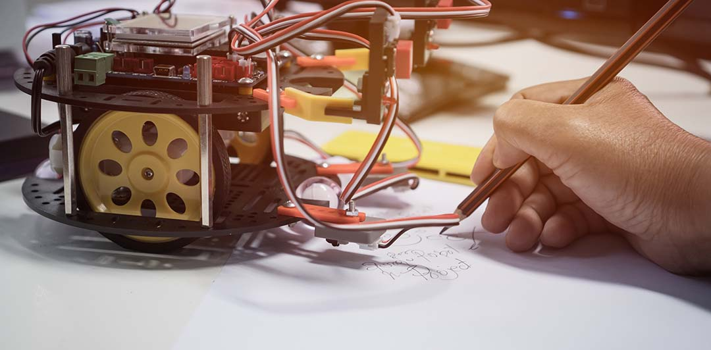

你好，我是悦创。

算法对你来说，可能是购物网站上推荐的“猜你喜欢”，是汽车导航规划的“最佳路线”，是餐厅里的自动点菜服务。在人机互动时代，你享受着算法带来的种种便利。

作为一个普通消费者，你不需要懂算法，不需要知道算法是怎么工作的，享受算法的便利就好了。但如果换一个身份，你是生产者呢？

人类提高效率的历史，是一部工具进化史。原始人用棍棒，农业时代用铁器，工业时代用蒸汽机。每一次工具的进化，最先解锁工具秘密的人，都会率先实现巨大提升。

而我们已经身处智能时代。无论你从事什么工作，不管是跟计算机直接相关的研发，还是表面看是跟人打交道的销售、咨询、教育、服务和管理，人机互动已经无处不在。而算法，就是智能机器的最大秘密。

你可能会说，我又不是程序员，我不会写代码啊。你别担心，“懂算法”，并不是说你要知道关于算法的细节，你得会 Java，会 Python 才行，不是这样。我们要掌握的，是算法思维，是算法的逻辑和工作原理。

欢迎关注我公众号：AI悦创，有更多更好玩的等你发现！

::: details 公众号：AI悦创【二维码】

:::

::: info AI悦创·编程一对一

AI悦创·推出辅导班啦，包括「Python 语言辅导班、C++ 辅导班、java 辅导班、算法/数据结构辅导班、少儿编程、pygame 游戏开发」，全部都是一对一教学：一对一辅导 + 一对一答疑 + 布置作业 + 项目实践等。当然，还有线下线上摄影课程、Photoshop、Premiere 一对一教学、QQ、微信在线，随时响应！微信：Jiabcdefh

C++ 信息奥赛题解，长期更新！长期招收一对一中小学信息奥赛集训，莆田、厦门地区有机会线下上门，其他地区线上。微信：Jiabcdefh

方法一：[QQ](http://wpa.qq.com/msgrd?v=3&uin=1432803776&site=qq&menu=yes)

方法二：微信：Jiabcdefh

:::

