::: warning 

本系列，你可以在我网站免费学习，但是切勿 copy 分发。本系列为书稿，我的爬虫系统会全天检索。被我找到，我必维权和告之，不死不休。

你学习本系列有问题，可以评论区和加我微信，拉你进交流群。微信：Jiabcdefh

:::

你好，我是悦创。

我们先来看看今天要学习的内容：

- 列表、集合、元组、字典
- 链表

## 1. 你真的了解这四个数据类型吗？

- 列表/list
- 元组/tuple
- 字典/dict
- 集合/set

### 1.1 列表 VS. 元组

1. 可变与不可变

2. 选择存储策略

    a. 存储经纬度用：元组

    b. 存储用户访问：列表

#### 1.1.1 列表和元组存储方式的差异

前面说了，**列表和元组最重要的区别就是，列表是动态的、可变的，而元组是静态的、不可变的。** 这样的差异，势必会影响两者存储方式。我们可以来看下面的例子：

```python
l = [1, 2, 3]  # 直接创建列表，会比后期使用 append 节省空间
l.__sizeof__()
64
tup = (1, 2, 3)
tup.__sizeof__()
48
```

**你可以看到，对列表和元组，我们放置了相同的元素，但是元组的存储空间，却比列表要少 16 字节。这是为什么呢？**

**1 int = 8 字节**

**1 字节 = 8 位**

事实上，由于列表是动态的，所以它需要存储指针，来指向对应的元素（上述例子中，对于 int 型，8 字节）。

另外，由于列表可变，所以**需要额外存储已经分配的长度大小**（8 字节），这样才可以实时追踪列表空间的使用情况，当空间不足时，及时分配额外空间。

> 对于静态大数据的存储，元组更加合适

```python
l = []
l.__sizeof__() // 空列表的存储空间为 40 字节
40
l.append(1)
l.__sizeof__() 
72 // 加入了元素 1 之后，列表为其分配了可以存储 4 个元素的空间 (72 - 40)/8 = 4，可以存储 4 个 int
l.append(2) 
l.__sizeof__()
72 // 由于之前分配了空间，所以加入元素2，列表空间不变
l.append(3)
l.__sizeof__() 
72 // 同上
l.append(4)
l.__sizeof__() 
72 // 同上
l.append(5)
l.__sizeof__() 
104 // 加入元素5之后，列表的空间不足，所以又额外分配了可以存储 4 个元素的空间，也就是 72 + 4 * 8 = 104
```

上面的例子，大概描述了列表空间分配的过程。

我们可以看到，为了减小每次增加 / 删减操作时空间分配的开销，Python 每次分配空间时都会额外多分配一些，这样的机制（over-allocating）保证了其操作的高效性：**增加 / 删除的时间复杂度均为 O(1)。**

但是对于元组，情况就不同了。**元组长度大小固定，元素不可变，所以存储空间固定。**

**看了前面的分析，你也许会觉得，这样的差异可以忽略不计。但是想象一下，如果列表和元组存储元素的个数是一亿，十亿甚至更大数量级时，你还能忽略这样的差异吗？**

#### 1.1.2 列表和元组的性能

通过学习列表和元组存储方式的差异，我们可以得出结论：**元组要比列表更加轻量级一些，所以总体上来说，元组的性能速度要略优于列表。**

另外，**Python 会在后台，对静态数据做一些资源缓存（resource caching）。通常来说，因为垃圾回收机制的存在，如果一些变量不被使用了，Python 就会回收它们所占用的内存，返还给操作系统，以便其他变量或其他应用使用。**

但是对于一些**静态变量**，比如**元组**，**如果它不被使用并且占用空间不大时，Python 会暂时缓存这部分内存。**这样，下**次我们再创建同样大小的元组时，Python 就可以不用再向操作系统发出请求，去寻找内存，而是可以直接分配之前缓存的内存空间，这样就能大大加快程序的运行速度。**

下面的例子，是计算初始化一个相同元素的列表和元组分别所需的时间。我们可以看到，元组的初始化速度，要比列表快 5 倍。

```python
python3 -m timeit 'x=(1,2,3,4,5,6)'
20000000 loops, best of 5: 9.97 nsec per loop
python3 -m timeit 'x=[1,2,3,4,5,6]'
5000000 loops, best of 5: 50.1 nsec per loop
```

但如果是**索引操作**的话，两者的速度差别非常小，几乎可以忽略不计。

```python
python3 -m timeit -s 'x=[1,2,3,4,5,6]' 'y=x[3]'
10000000 loops, best of 5: 22.2 nsec per loop
python3 -m timeit -s 'x=(1,2,3,4,5,6)' 'y=x[3]'
10000000 loops, best of 5: 21.9 nsec per loop
```

当然，如果你想要增加、删减或者改变元素，那么列表显然更优。原因你现在肯定知道了，那就是对于元组，你必须得通过新建一个元组来完成。

#### 1.1.3 列表和元组的使用场景

那么列表和元组到底用哪一个呢？根据上面所说的特性，我们具体情况具体分析。

1. 如果存储的数据和数量不变，比如你有一个函数，需要返回的是一个地点的经纬度，然后直接传给前端渲染，那么肯定选用元组更合适。

```python
def get_location():
    ..... 
    return (longitude, latitude)
```

2. 如果存储的数据或数量是可变的，比如社交平台上的一个日志功能，是统计一个用户在一周之内看了哪些用户的帖子，那么则用列表更合适。

```python
viewer_owner_id_list = [] # 里面的每个元素记录了这个viewer一周内看过的所有owner的id
records = queryDB(viewer_id) # 索引数据库，拿到某个viewer一周内的日志
for record in records:
    viewer_owner_id_list.append(record.id)
```

#### 1.1.4 思考题

想创建一个空的列表，我们可以用下面的 A、B 两种方式，请问它们在效率上有什么区别吗？我们应该优先考虑使用哪种呢？可以说说你的理由。

```python
# 创建空列表
# option A
empty_list = list()

# option B
empty_list = []
```

> 区别主要在于 list() 是一个 function call，Python  的  function call 会创建 stack，并且进行一系列参数检查的操作，比较 expensive，反观 [] 是一个内置的 C 函数，可以直接被调用，因此效率高。

### 1.2 字典 VS. 集合

- 字典：键对值
- 集合：值


## 2. 任务「统计一片文章词频」

目标文本：[I_Have_a_Dream.txt](https://github.com/AndersonHJB/BornforthisData/blob/main/column/data-structure/MakerYue/week1-python-basics-and-linked-lists/I_Have_a_Dream.txt)

解决代码如下，不过代码主要为了解决问题，优化后的代码，也会提供。**本任务主要是为了让你熟悉各个数据类型的用法。**

```python
# -*- coding: utf-8 -*-
# @Time    : 2021/5/11 9:42 下午
# @Author  : AI悦创
# @FileName: words_count_main.py
# @Software: PyCharm
# @Blog    ：http://www.aiyc.top
# @公众号   ：AI悦创
words = []


def find_word_count(words):
    word_count = {}
    # 1.0
    # for word in set(words):
    # 	word_count[word] =  0
    # for word in  words:
    # 	word_count[word] += 1
    for word in words:
        if word in word_count:
            word_count[word] += 1
        else:
            word_count[word] = 1
    return word_count


with open('I_Have_a_Dream.txt', mode='r', encoding='utf-8') as f:
    """
    f.read() -> type: <class 'str'>
    f.readline() -> type: <class 'str'> -> Read a line
    f.readlines() -> type: <class 'list'> -> Read all
    """
    lines = f.readlines()
    for line in lines:
        line = line.replace(',', '')
        line = line.replace(':', '')
        line = line.replace('?', '')
        line = line.replace('!', '')
        line = line.replace('"', '')
        line = line.replace('\n', '')
        line = line.replace('”', '')
        line = line.replace('.', '')
        line = line.replace(';', '')
        line = line.replace('“', '')
        for word in line.split(' '):
            if word: words.append(word)

if __name__ == '__main__':
    print(len(words))
    print(len(set(words)))
    r = find_word_count(words)
    print(r)
```

**补充：** 不推荐使用如下方式访问文件：

```python
f = open("text.txt", "w")
f.read()
f.close()
```


## 3. 链表

在我们接触的 Python 中的列表，其实就是可以做成链表的形式使用的。

```python
L = [3, 5, 6]
L.append(7)
```

**如何自己实现一个类似的结构呢？**可以**查询元素、添加元素、插入元素、删除元素**

那我们先来简单的、系统的了解一下链表的定义。与数组相似，**链表**也是一种线性数据结构。这里有一个例子：

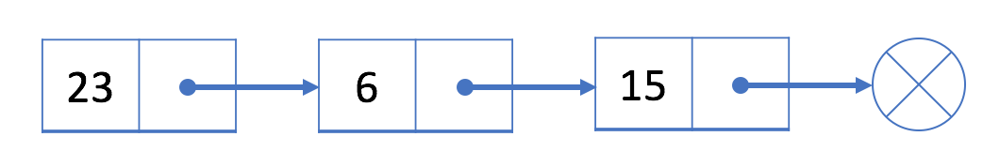

正如你所看到的，**链表中的每个元素实际上是一个单独的对象，而所有对象都通过每个元素中的引用字段链接在一起。**

链表有两种类型：**单链表**和**双链表**。上面给出的例子是一个单链表，这里有一个双链表的例子：

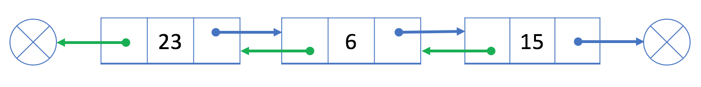

不过，我这里主要讲解当链表结构。链表是一种线性数据结构，它通过引用字段将所有分离的元素链接在一起。

**其实，不就类似我们的铁链。**

### 3.1 定义一个最简单的链表

```python
class IntList(object):
    def __init__(self):
        """
        first:存自己本身的数据
        rest:存下一个节点，也就下一个节点是谁
        """
        self.first = None
        self.rest = None
```

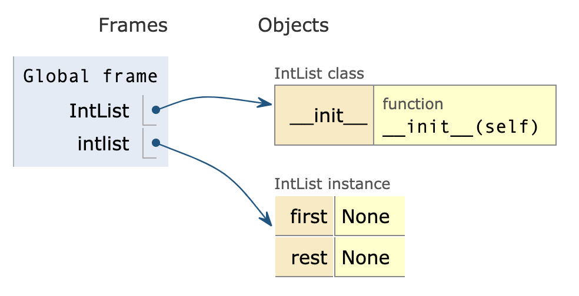

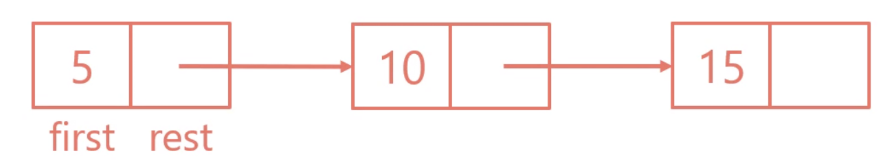

```python
l1 = IntList()
l1.first = 5

l2 = IntList()
l2.first = 10

l3 = IntList()
l3.first = 15
```

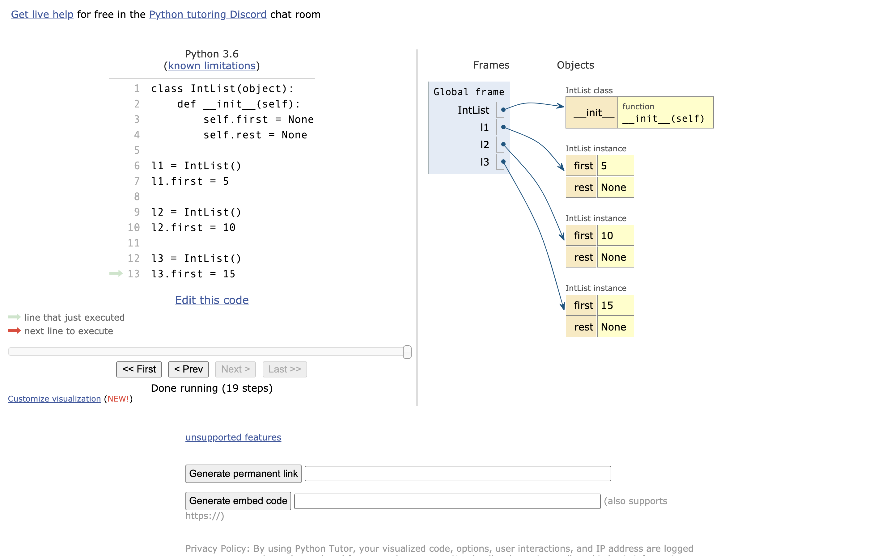


**<span style="color:orange">上面代码其实就可以理解为，创建了每一节车厢，那我们该如何吧车厢链接起来呢？</span>**

```python
l1.rest = l2
l2.rest = l3
# 正好使用两行代码连在一起了，也就是火车的两个铁链
# PS: 如果你这么写的话：l1.rest = l2.first > 注意：这将不是链接一个车厢，而是连接一个 Value。
# 所以：l1.rest = l2 才是连接车厢
```

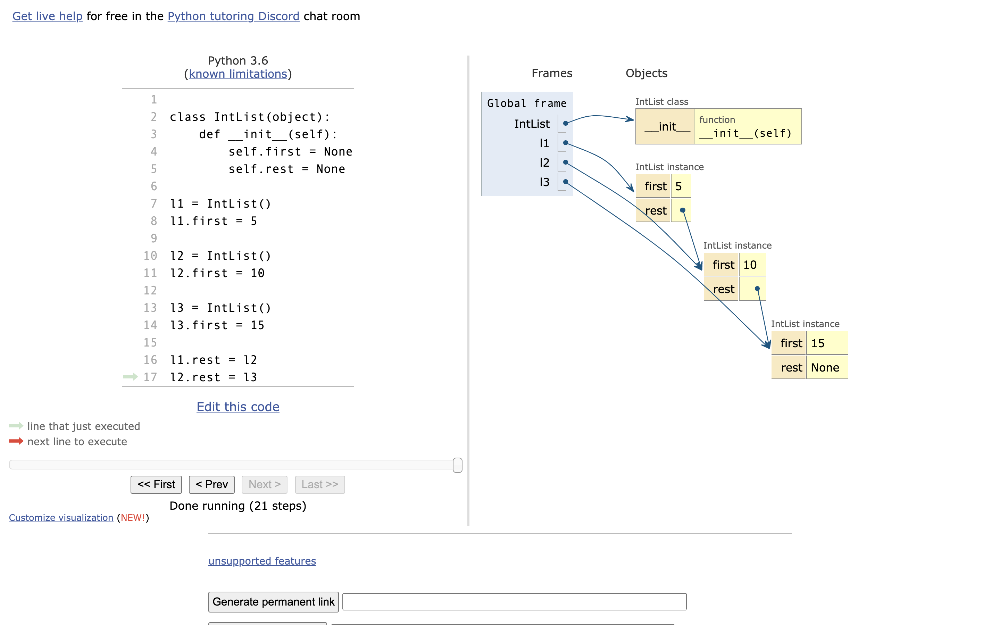

但是，要是像下面代码这样写是不行的。**<span style="color:orange">这就好像，我们的火车一节连着一节，连的是一整个车厢不是就一部分。其中，lx.first 是一个值。</span>**

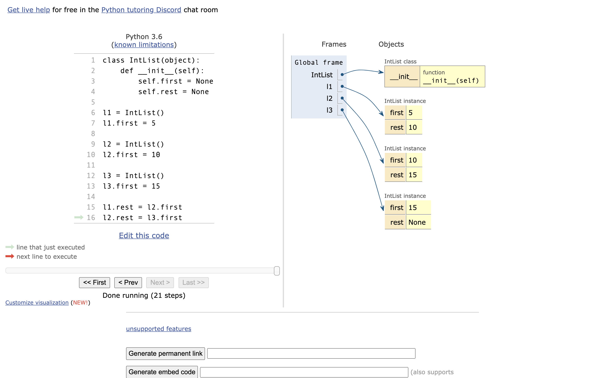

> 可以使用：[http://pythontutor.com/](http://pythontutor.com/) 来讲解

**那我们如何输出数据呢？**

```python
print("第一节车厢：{}".format(l1.first))
print("第二节车厢：{}".format(l1.rest.first))
print("第三节车厢：{}".format(l1.rest.rest.first))
```

### 3.2 「改进」如何只用一个 l 来操作呢？

::: code-tabs

@tab Code1

```python
class IntList(object):
    def __init__(self):
        self.first = None
        self.rest = None


l = IntList()
l.first = 5
l.rest = None

l.rest = IntList()
l.rest.first = 10
l.rest.rest = None

l.rest.rest = IntList()
l.rest.rest.first = 15
```

@tab Code2

```python
class IntList(object):
    def __init__(self):
        self.first = None
        self.rest = None


l = IntList()
l.first = 5
l.rest = IntList()
l.rest.first = 10
l.rest.rest = IntList()
l.rest.rest.first = 15
```

:::

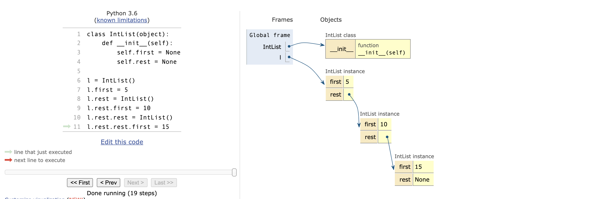

### 3.3 问题

不知道，大家有没有发现，如果这么写的话。我们要写 10 节车厢或者以上的话不得写死了。

```python
class IntList(object):
    def __init__(self):
        self.first = None
        self.rest = None


l = IntList()
l.first = 5
l.rest = None

l.rest = IntList()
l.rest.first = 10
l.rest.rest = None

l.rest.rest = IntList()
l.rest.rest.first = 15

l.rest.rest.rest = IntList()
l.rest.rest.rest.first = 20

l.rest.rest.rest.rest = IntList()
l.rest.rest.rest.rest.first = 25
```

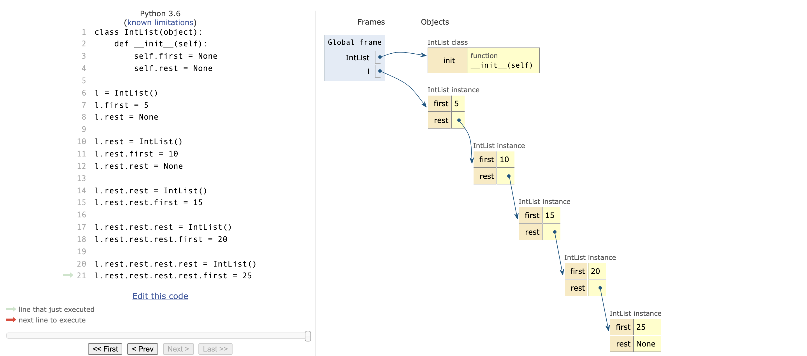

所以，我们虽然实现了链表的结构，但是不完美。我们可以再进一步的去改进一下。

**首先，我们肯定不希望之后还是要写一堆 rest 这样肯定是超级麻烦的。**

### 3.4 改进代码

```python
class IntList(object):
    def __init__(self, first, rest):
        self.first = first
        self.rest = rest


l1 = IntList(5, None)
l2 = IntList(10, l1)
l3 = IntList(15, l2)
```

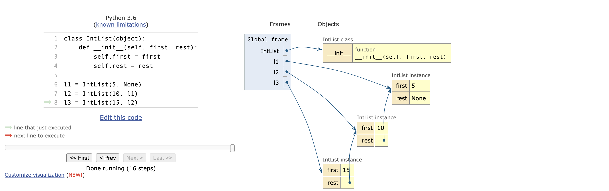

当然，我们也可以就用一个 l：

```python
class IntList(object):
    def __init__(self, first, rest):
        self.first = first
        self.rest = rest


l = IntList(5, None)
l = IntList(10, l)
l = IntList(15, l)
```

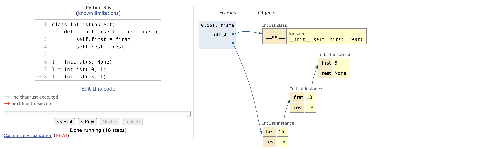


这样写，肯定比之前的书写要简洁。但是又出现问题了，就是我们每一个衔接的数据是显示出来了，但这个问题我们后面解决。接下来，我们先来添加个 size 函数。


### 3.5 添加一个 size() 方法，方便用户查询链表的大小

这个地方，需要递归作为前置知识：[01-Python 递归详解](https://www.yuque.com/aiyuechuang/mzg6u8/hzpzzt?singleDoc)

```python
def size(self):
    if self.rest is None:
        return 1
    else:
        return 1 + self.rest.size()
```

::: tabs

@tab 1. 第一次： self.rest()

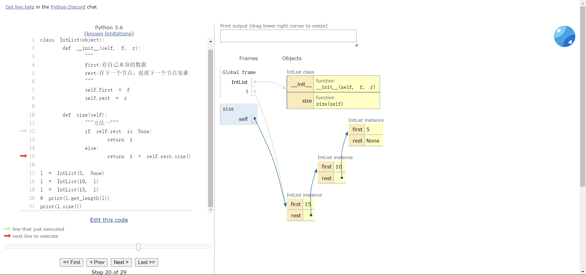

@tab 2. 第二次：self.rest.size() —> self.rest.rest is None

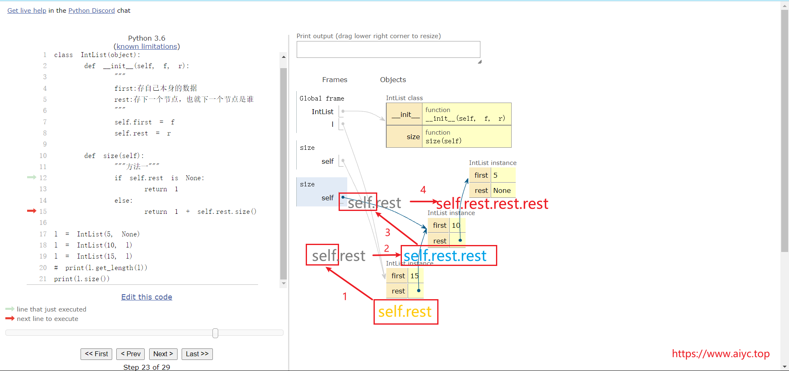

@tab 3. self.rest.rest.size() —> self.rest.rest.rest is None

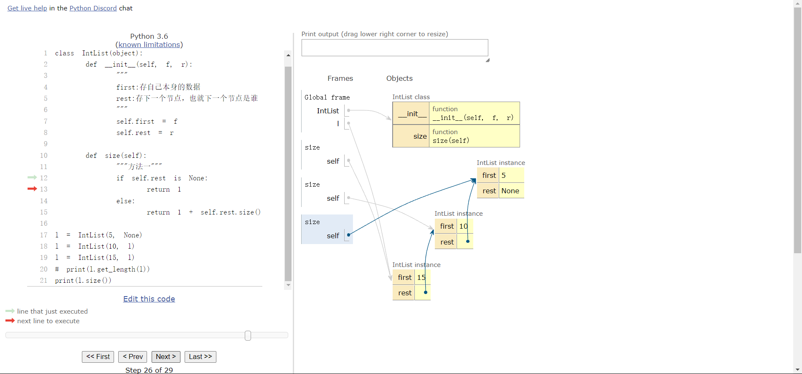

@tab 接下来，上 GIF

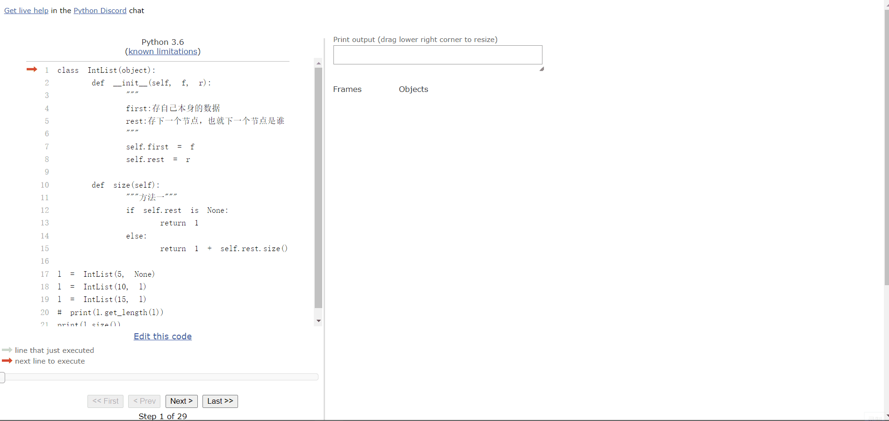

:::

### 3.6 不使用递归如何实现？

```python
def get_length(self, linked):
    """方法二"""
    length = 0
    while linked:
        length += 1
        linked = linked.rest
    return length
```

不过上面写的虽然实现了，但是总体来说有点奇怪，在调用的时候：

```python
print(l.get_length(l)) # 这样调用有点奇怪
```

所以，进行改进：

```python
def iterative_size(self):
    # l == self 抽象理解
    p = self
    total_size = 0
    while p is not None:
        total_size += 1
        p = p.rest
    return total_size
```

这样调用就很自然了：

```python
print(l.iterative_size())
```

### 3.7 改进

添加一个 **get()** 方法，方便用户查询某个元素：

```python
def get(self, index):
    if index == 0:
        return self.first
    else:
        return self.rest.get(index - 1)
```

```python
def get_index(self, index):
    '''第二种查询方法'''
    if index < 0:
        return -1
    node = self
    for _ in range(index):
        node = node.rest
    return node.first
```

### 3.8 Question


**<span style="color:orange">现在的链表更像是一个“没穿衣服的”数据结构。</span>**

内部数据也是直接爆露出来的，

有些地方也是看起来很奇怪。

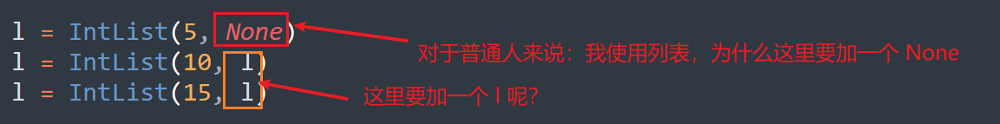

### 3.9 增加 IntNode() & SLList() 类

None 和 l 应该是内部的数据，不应该让外部的人看见的。

```python
class IntNode(object):
    def __init__(self, item, next):
        self.item = item
        self.next = next


class SLList(object):
    def __init__(self, x):
        self.first = IntNode(x, None)
```

我们可以对比一下：

```python
l = SLList(10)
# l = IntList(5, None) 比之前的好
```

但是目前不能添加多个车厢（链表），添加多个链表的数据都会被覆盖：

```python
l = SLList(5)
l = SLList(10)
l = SLList(15)
```

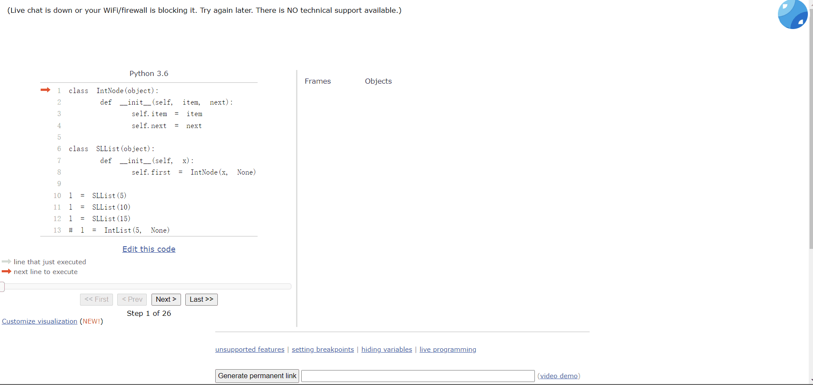

### 3.10 添加 add_first()

所以，我们需要添加一个函数来添加数据。

```python
def add_first(self, x):
    self.first = IntNode(x, self.first)
```

这样，我们添加数据就是：

```python
l = SLList(5)
l.add_first(10)
l.add_first(15)
```

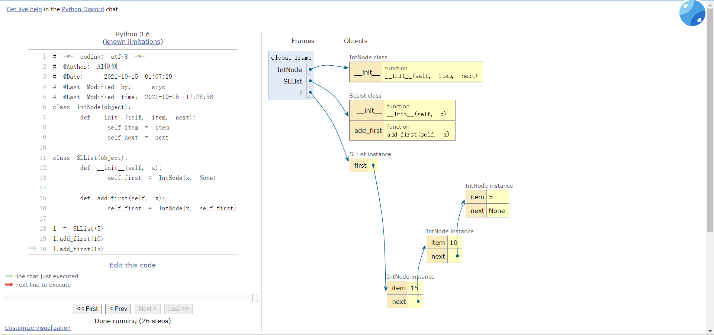

### 3.11 添加 get_first() 获取第一个元素

SLList 新增加一个方法叫 `get_first()` ，用来让用户获取当前链表第一个元素：

```python
def get_first(self):
    return self.first.item
```

### 3.12 比较一下

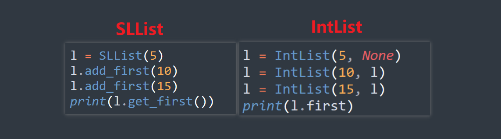

::: code-tabs

@tab IntList

```python
# filename: compare.py
class IntList(object):
    def __init__(self, f, r):
        """
        first:存自己本身的数据
        rest:存下一个节点，也就下一个节点是谁
        """
        self.first = f
        self.rest = r

    def size(self):
        """方法一"""
        # l == self 抽象理解
        if self.rest is None:
            return 1
        else:
            return 1 + self.rest.size()

    def get_length(self, linked):
        """方法二"""
        length = 0
        while linked:
            length += 1
            linked = linked.rest
        return length

    def iterative_size(self):
        # l == self 抽象理解
        p = self
        total_size = 0
        while p is not None:
            total_size += 1
            p = p.rest
        return total_size

    def get(self, index):
        if index == 0:
            return self.first
        else:
            return self.rest.get(index - 1)


l1 = IntList(5, None)
l2 = IntList(10, l1)
l3 = IntList(15, l2)
print(l1.first)
print(l2.first)
print(l3.first)
```

@tab IntNode&SLList

```python
# -*- coding: utf-8 -*-
# @Time    : 2023/12/14 19:50
# @Author  : AI悦创
# @FileName: 3.9 IntNode&SLList.py
# @Software: PyCharm
# @Blog    ：https://bornforthis.cn/
# Created by Bornforthis.
class IntNode(object):
    def __init__(self, item, next):
        self.item = item
        self.next = next


class SLList(object):
    def __init__(self, x):
        self.first = IntNode(x, None)

    def add_first(self, x):
        self.first = IntNode(x, self.first)

    def get_first(self):
        return self.first.item

    # def get(self, index):
    #     if index == 0:
    #         return self.first.item
    #     else:
    #         return self.first.next.get(index - 1)
    def get(self, index, node=None):
        if node is None:
            node = self.first

        if node is None:
            raise IndexError("Index out of bounds")

        if index == 0:
            return node.item
        else:
            return self.get(index - 1, node.next)

    def get_three(self, index):
        """方法三"""
        return self._get_recursive(self.first, index)

    def _get_recursive(self, node, index):
        if node is None:
            raise IndexError("Index out of bounds")
        if index == 0:
            return node.item
        else:
            return self._get_recursive(node.next, index - 1)

    def get_two(self, index):
        """方法二"""
        current_node = self.first
        for i in range(index):
            if current_node.next is None:
                raise IndexError("Index out of bounds")
            current_node = current_node.next
        return current_node.item

    """
    def get(self, index):
        def get_recursive(node, idx):
            if idx == 0:
                return node.item
            else:
                return get_recursive(node.next, idx - 1)

        if self.first is None:
            raise IndexError("Index out of bounds")
        return get_recursive(self.first, index)
    """

    def get_length(self):
        length = 0
        current_node = self.first
        while current_node:
            length += 1
            current_node = current_node.next
        return length

    """
    def get_length(self):
        def length_recursive(node):
            if not node:  # 基本案例：到达链表末尾
                return 0
            else:
                return 1 + length_recursive(node.next)  # 递归步骤

        return length_recursive(self.first)
    """


# l = SLList(10)
# l = IntList(5, None) 比之前的好
# l = SLList(5)
# l = SLList(10)
# l = SLList(15)
l = SLList(5)
l.add_first(10)
l.add_first(15)
print(l.get(0))
print(l.get(1))
print(l.get(2))
print(l.get_length())
```


:::

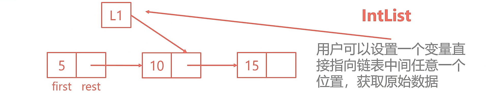

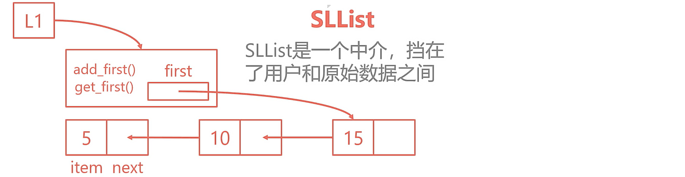

## 4. 然而还是有点问题

如果，我破解出了 SLList 里面的变量的名称，一样可以修改，比如：

```python
l.first.next.next = 8
```

### 4.1 改进-设为私有变量

将 first 变量改为私有变量。

```python
class IntNode(object):
    def __init__(self, item, next):
        self.item = item
        self.next = next


class SLList(object):
    def __init__(self, x):
        self.__first = IntNode(x, None)

    def add_first(self, x):
        self.__first = IntNode(x, self.__first)


l = SLList(5)
l.add_first(10)
l.add_first(15)
# print(l.get_first())
```

class 里的私有变量只能再 class 的内部访问：

```python
print(l.__first)
AttributeError: 'SLList' object has no attribute '__first'
```

### 4.2 为什么要设计私有变量？

**将类的内部细节隐藏起来**

- 用户不需要了解太多类的细节
- 设计者可以拥有更为安全的对于程序的控制全

**以汽车来类比**

- 公共的方法或变量：油门、方向盘
- 私有的方法或变量：燃油管道、旋转阀

### 4.3 改进-add_last() 尾部添加元素

SLList 新增加一个方法叫 `add_last()` ，用来让用户向链表末尾添加一个元素。

```python
def add_last(self, x):
    p = self.__first
    while p.next is not None:
        p = p.next
    p.next = IntNode(x, None)
```

```python
l.add_last(20)
```

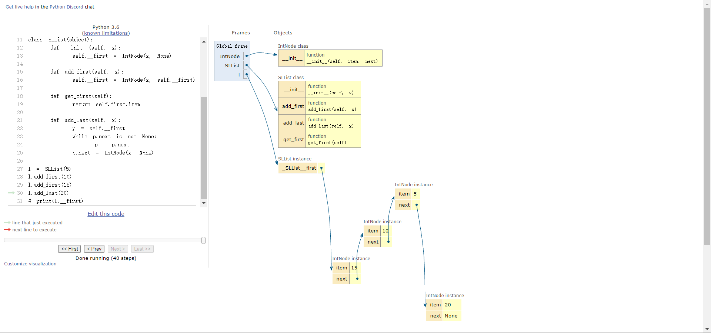

### 4.4 改进-size()

SLList 新增加一个方法叫 `size()` ，用来让用户获取当前链表的长度：

```python
def __size(self, p):
    if p.next is None:
        return 1
    else:
        return 1 + self.__size(p.next)


def size(self):
    return self.__size(self.__first)
```

每次查询 `size()` 都要把整个链表遍历一遍，是不是低效了？

::: tip 技巧

可以在每次有添加链表节点的时候，就进行跟踪 +1。

:::

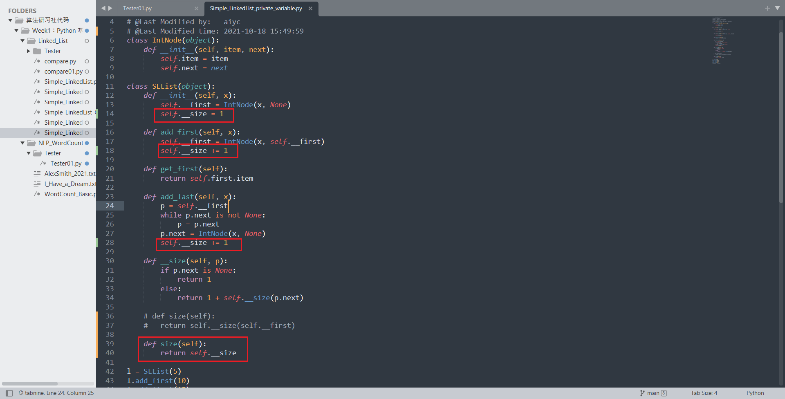

::: details

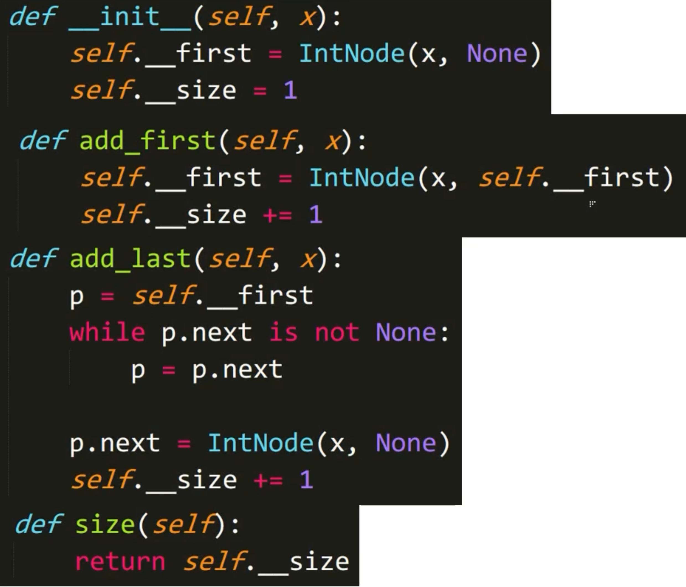

:::

```python
# -*- coding: utf-8 -*-
# @Author: AI悦创
# @Date:   2021-10-15 14:50:07
# @Last Modified by:   aiyc
# @Last Modified time: 2021-10-18 15:49:59
class IntNode(object):
    def __init__(self, item, next):
        self.item = item
        self.next = next


class SLList(object):
    def __init__(self, x):
        self.__first = IntNode(x, None)
        self.__size = 1

    def add_first(self, x):
        self.__first = IntNode(x, self.__first)
        self.__size += 1

    def get_first(self):
        return self.first.item

    def add_last(self, x):
        p = self.__first
        while p.next is not None:
            p = p.next
        p.next = IntNode(x, None)
        self.__size += 1

    def __size(self, p):
        if p.next is None:
            return 1
        else:
            return 1 + self.__size(p.next)

    # def size(self):
    # 	return self.__size(self.__first)

    def size(self):
        return self.__size


l = SLList(5)
l.add_first(10)
l.add_first(15)
l.add_last(20)
# print(l.__first)
```

### 4.5 改进

如果，我希望创建一个空链表呢？

```python
# -*- coding: utf-8 -*-
# @Author: AI悦创
# @Date:   2021-10-18 15:53:48
# @Last Modified by:   aiyc
# @Last Modified time: 2021-10-18 15:58:12
class IntNode(object):
    def __init__(self, item, next):
        self.item = item
        self.next = next


class SLList(object):
    def __init__(self, x=None):
        self.__first = IntNode(x, None)
        self.__size = 1

    def add_first(self, x):
        if self.__first.item is None:
            self.__first.item = x
        else:
            self.__first = IntNode(x, self.__first)
            self.__size += 1

    def get_first(self):
        return self.first.item

    def add_last(self, x):
        p = self.__first
        while p.next is not None:
            p = p.next
        p.next = IntNode(x, None)
        self.__size += 1

    def __size(self, p):
        if p.next is None:
            return 1
        else:
            return 1 + self.__size(p.next)

    # def size(self):
    # 	return self.__size(self.__first)

    def size(self):
        return self.__size


l = SLList()
l.add_first(5)
l.add_first(10)
l.add_first(15)
l.add_last(20)
# print(l.__first)
```

## 5. Week 1: HomeWork

### 5.1 A+B 问题

#### 描述

输入A、B，输出 A+B。

说明：在**描述**这里，会给出试题的意思，以及所要求的目标。

#### 输入

输入的第一行包括两个整数，由空格分隔，分别表示A、B。

说明：**输入描述**是描述在测试你的程序时，所给的输入一定满足的格式。

做题时你应该假设所给的输入是一定满足输入格式的要求的，所以你不需要对输入的格式进行检查。多余的格式检查可能会适得其反，使用你的程序错误。

在测试的时候，系统会自动将输入数据输入到你的程序中，你不能给任何提示。比如，你在输入的时候提示“请输入A、B”之类的话是不需要的，这些多余的输出会使得你的程序被判定为错误。

#### 输出

输出一行，包括一个整数，表示 A+B 的值。A、B 以及  A+B 的和均在 Int 范围内。

说明：**输出描述**是要求你的程序在输出结果的时候必须满足的格式。

在输出时，你的程序必须满足这个格式的要求，不能少任何内容，也不能多任何内容。如果你的内容和输出格式要求的不一样，你的程序会被判断为错误，包括你输出了提示信息、中间调试信息、计时或者统计的信息等。

#### 测试

输入样例 1 

```
12 34
```

输出样例 1

```python
46
```

### 5.2 链表添加元素

#### 描述

给定一组数字，将他们用链表的形式进行存储。另外再给一个数字，将它插入到链表的末尾。输出这个链表。

（记住是用链表来存储，所有人的程序我们都会查看的哦）

#### 输入

一共有两行，第一行是多个数字，以空格隔开，最多 100000 个数字。

第二行是一个数字。

数字均在 int 范围内。

#### 输出

一行输出，数字之间用“`->`”来表示链表方向。比如：`1->2->3->4`

输入样例 1 

```
1 2 3
4
```

输出样例 1

```
1->2->3->4
```

#### 提示

请谨慎考虑是否要使用递归来解决问题


### 5.3 链表中翻转

#### 描述

给定一个**单向**链表，要求将第m位到第n位（从0开始编号位数）的元素翻转过来。

注1：m和n一定都在链表长度内

注2：待翻转的元素包括第m和n位

#### 输入

两行数据

第一行为链表元素，用空格隔开各个元素

第二行有两个数字，分别是 m 和 n

注：链表元素个数最大为 1000

#### 输出

翻转后的链表结果

元素之间用 `->` 表示连接方向

输入样例 1 

```
1 2 3 4 5 6 7
2 5
```

输出样例 1

```
1->2->6->5->4->3->7
```

输入样例 2 

```
1 2 3 4 5 6 7
0 1
```

输出样例 2

```
2->1->3->4->5->6->7
```

#### 提示

一定注意各种边界情况


### 5.4 小明买东西

#### 描述

小明去商店买东西，他手里有一些零花钱，他希望能通过购买商店里的不同商品来正好花完他的零花钱（不然回家就要上交给老妈了）。

现在已知商店里各个商品的价格以及小明手里零花钱的总数，请问小明能够正好花完他的零花钱吗？

#### 输入

一共两行数据。

第一行为一组数字，用空格隔开，表示商店里不同商品的价格。

第二行为小明手里零花钱的总数。

注1：商品和小明零花钱的金额都是整数。

注2：商品数量不超过 25 个。

注3：每个数字代表的商品数量有且只有一个。

#### 输出

如果能够正好花完零花钱输出 True，否则输出 False。

输入样例 1 

```
1 2 3 4 5 6 7 8 9
12
```

输出样例 1

```
True
```

输入样例 2 

```
10 20 30 40
33
```

输出样例 2

```python
False
```


欢迎关注我公众号：AI悦创，有更多更好玩的等你发现！

::: details 公众号：AI悦创【二维码】


:::

::: info AI悦创·编程一对一

AI悦创·推出辅导班啦，包括「Python 语言辅导班、C++ 辅导班、java 辅导班、算法/数据结构辅导班、少儿编程、pygame 游戏开发」，全部都是一对一教学：一对一辅导 + 一对一答疑 + 布置作业 + 项目实践等。当然，还有线下线上摄影课程、Photoshop、Premiere 一对一教学、QQ、微信在线，随时响应！微信：Jiabcdefh

C++ 信息奥赛题解，长期更新！长期招收一对一中小学信息奥赛集训，莆田、厦门地区有机会线下上门，其他地区线上。微信：Jiabcdefh

方法一：[QQ](http://wpa.qq.com/msgrd?v=3&uin=1432803776&site=qq&menu=yes)

方法二：微信：Jiabcdefh

:::


[WS](./week1-solution.md)
