::: warning 

本系列，你可以在我网站免费学习，但是切勿 copy 分发。本系列为书稿，我的爬虫系统会全天检索。被我找到，我必维权和告之，不死不休。

你学习本系列有问题，可以评论区和加我微信，拉你进交流群。微信：Jiabcdefh

:::

你好，我是悦创。

今天我们将学习：

- 链表2
- 抽象数据结构
- 栈结构

我们先来看看上节课的代码：

```python
# -*- coding: utf-8 -*-
# @Time    : 2023/12/7 17:04
# @Author  : AI悦创
# @FileName: linked3.py
# @Software: PyCharm
# @Blog    ：https://bornforthis.cn/
# Created by Bornforthis.
class IntNode(object):
    def __init__(self, item, next):
        self.item = item
        self.next = next


class SLList(object):
    def __init__(self, x):
        self.__first = IntNode(x, None)
        self.__length = 1

    def add_first(self, x):
        self.__first = IntNode(x, self.__first)
        self.__length += 1

    def get_first(self):
        return self.__first.item

    def add_last(self, x):
        p = self.__first
        while p.next is not None:
            p = p.next
        p.next = IntNode(x, None)
        self.__length += 1

    def __size(self, p):
        """
        循环获取链表长度
        """
        if p.next is None:
            return 1
        else:
            return 1 + self.__size(p.next)

    def size(self):
        return self.__length


if __name__ == '__main__':
    l = SLList(15)
    l.add_first(10)
    l.add_first(5)
    print(l.get_first())
    l.add_last(20)
    print(l.size())
```

## 1. 尾部添加数据优化

::: tip

有时候在每次重复找最后一个的时候，不妨换一个思路想想，我直接跟踪尾部，在需要添加尾部的时候，直接添加，那不是更快么～

:::

我们可以通过在 `SLList` 类中跟踪链表的尾部来提高在链表尾部添加元素的效率。

在当前的实现中，每次调用 `add_last` 方法时，都需要遍历整个链表来找到最后一个节点，这会导致操作的时间复杂度为 $O(n)$。通过维护一个指向链表最后一个节点的引用，我们可以直接访问尾部节点，将新节点添加到链表的末尾，从而将 `add_last` 方法的时间复杂度降低到 $O(1)$。

::: code-tabs

@tab Sample Code

```python {13,18-21}
# -*- coding: utf-8 -*-
# @Time    : 2023/12/7 17:19
# @Author  : AI悦创
# @FileName: Linked4.py
# @Software: PyCharm
# @Blog    ：https://bornforthis.cn/
# Created by Bornforthis.
#---snip---
class SLList(object):
    def __init__(self, x):
        self.__first = IntNode(x, None)
        self.__length = 1
        self.__last = self.__first  # 新增属性，指向链表的最后一个节点

    #---snip---

    def add_last(self, x):
        new_node = IntNode(x, None)
        self.__last.next = new_node  # 在链表末尾添加新节点
        self.__last = new_node  # 更新__last引用
        self.__length += 1

#---snip---
```

@tab 完整代码

```python
# -*- coding: utf-8 -*-
# @Time    : 2023/12/7 17:19
# @Author  : AI悦创
# @FileName: Linked4.py
# @Software: PyCharm
# @Blog    ：https://bornforthis.cn/
# Created by Bornforthis.
class IntNode(object):
    def __init__(self, item, next):
        self.item = item
        self.next = next


class SLList(object):
    def __init__(self, x):
        self.__first = IntNode(x, None)
        self.__length = 1
        self.__last = self.__first  # 新增属性，指向链表的最后一个节点

    def add_first(self, x):
        self.__first = IntNode(x, self.__first)
        self.__length += 1

    def get_first(self):
        return self.__first.item

    def add_last(self, x):
        # p = self.__first
        # while p.next is not None:
        #     p = p.next
        # p.next = IntNode(x, None)
        # self.__length += 1
        new_node = IntNode(x, None)
        self.__last.next = new_node  # 在链表末尾添加新节点
        self.__last = new_node  # 更新__last引用
        self.__length += 1

    def __size(self, p):
        """
        循环获取链表长度
        """
        if p.next is None:
            return 1
        else:
            return 1 + self.__size(p.next)

    def size(self):
        return self.__length


if __name__ == '__main__':
    l = SLList(15)
    l.add_first(10)
    l.add_first(5)
    print(l.get_first())
    l.add_last(20)
    print(l.size())
```

:::

## 2. 创建一个空链表

### 2.1 缘由

我们之前实现的链表其实缺了点灵魂，为什么这么说呢？

我们先看看我们原本的列表创建方法：

```python
lst = []
lst.append(5)
lst.append(10)
lst.append(15)
lst.append(20)
```

可以看见，我们不需要在创建链表的时候传入数据，那我们能不能也实现同样的效果呢？

### 2.2 设置默认值

首先，我们先恢复代码到上节课的代码，然后再把优化的 `add_last` 代码逻辑添加进去。

::: code-tabs

@tab Sample Code

```python {2-8}
class SLList(object):
    def __init__(self, x=None):
        if x is None:
            self.__first = None
            self.__length = 0
        else:
            self.__first = IntNode(x, None)
            self.__length = 1
```

@tab All Code

```python
# -*- coding: utf-8 -*-
# @Time    : 2023/12/7 17:35
# @Author  : AI悦创
# @FileName: Linked5.py
# @Software: PyCharm
# @Blog    ：https://bornforthis.cn/
# Created by Bornforthis.
class IntNode(object):
    def __init__(self, item, next):
        self.item = item
        self.next = next


class SLList(object):
    def __init__(self, x=None):
        if x is None:
            self.__first = None
            self.__length = 0
        else:
            self.__first = IntNode(x, None)
            self.__length = 1

    def add_first(self, x):
        self.__first = IntNode(x, self.__first)
        self.__length += 1

    def get_first(self):
        return self.__first.item

    def add_last(self, x):
        p = self.__first
        while p.next is not None:
            p = p.next
        p.next = IntNode(x, None)
        self.__length += 1

    def __size(self, p):
        """
        循环获取链表长度
        """
        if p.next is None:
            return 1
        else:
            return 1 + self.__size(p.next)

    def size(self):
        return self.__length


if __name__ == '__main__':
    l = SLList(15)
    l.add_first(10)
    l.add_first(5)
    print(l.get_first())
    l.add_last(20)
    print(l.size())
```

:::

### 2.3 测试

我们来运行测试看看：

```python {2}
if __name__ == '__main__':
    l = SLList()
    l.add_first(10)
    l.add_first(5)
    print(l.get_first())
    l.add_last(20)
    print(l.size())
```

运行正常。

那么我们把 `add_last()` 提前运行一下：

```python {2-3}
if __name__ == '__main__':
    l = SLList()
    l.add_last(20)
    l.add_first(10)
    l.add_first(5)
    print(l.get_first())
    print(l.size())

Traceback (most recent call last):
  File "/Users/huangjiabao/GitHub/iMac/Pycharm/StudentCoder/数据结构/Week1/Linked6.py", line 52, in <module>
    l.add_last(20)
  File "/Users/huangjiabao/GitHub/iMac/Pycharm/StudentCoder/数据结构/Week1/Linked6.py", line 32, in add_last
    while p.next is not None:
AttributeError: 'NoneType' object has no attribute 'next'
```

运行直接报错，所以我们在修改上面的代码时候，其它代码还是需要同步修改的。

### 2.4 改进

> Add_last() 方法出问题了！

**为什么报错呢？**

```python
def add_last(self, x):
    p = self.__first
    while p.next is not None:
        p = p.next
    p.next = IntNode(x, None)
    self.__length += 1
```

因为在我们创建一个空链表的时候，`self.__first` 的值是 None。

所以，`p.next == self.__first.next == None.next ` 显然肯定报错的，None 怎么可能存在 next 呢？

#### 2.4.1 一种解决方案

```python {3-6}
def add_last(self, x):
    p = self.__first
    if p is None:
        self.__first = IntNode(x, None)
        self.__length += 1
        return
    while p.next is not None:
        p = p.next
    p.next = IntNode(x, None)
    self.__length += 1
```

虽然，上面是可以解决的。也从功能上实现了这个方法，但是我们开始学数据结构和算法之后，应该要知道这样实现好不好，优不优美。——也就是程序如何更加优雅，更加简洁，减少程序复杂。

**为什么，上面的方法不优雅。**

上面的解决方法，只是使用 if 针对这种特例来解决、来判断。扩展想一想，现在一种情况你用 if，那么未来更多种情况，是不是还得写更多的 if 呢？虽然说我们解决的问题，但是在出 bug 的时候，我们 debug 就会变得非常麻烦。另外，这个项目给别人看也是很复杂的。——所以说，尽量不要让我们的程序出现一些特例。

不是说完全的不要用，而是尽量的避免它。

按上面的说法之后，我们如何改进呢？

#### 2.4.2 更优雅的方法

思考🤔本质上导致这个问题的原因是什么？出问题的原因在于上面？——这里本质的问题是 **<span style="color:orange">空链表和非空链表的第一个元素不一样</span>**

那知道原因之后，我们如何解决呢？


——**<span style="color:orange">加一个哨兵在最前面</span>**

不管空不空，我们都在第一个加一个元素在那里。

也就是第一个不算数据，但是从这个开始，往后面的人才算数据。「也就是不管你是空链表还是非空链表，第一位都是我们哨兵同志」

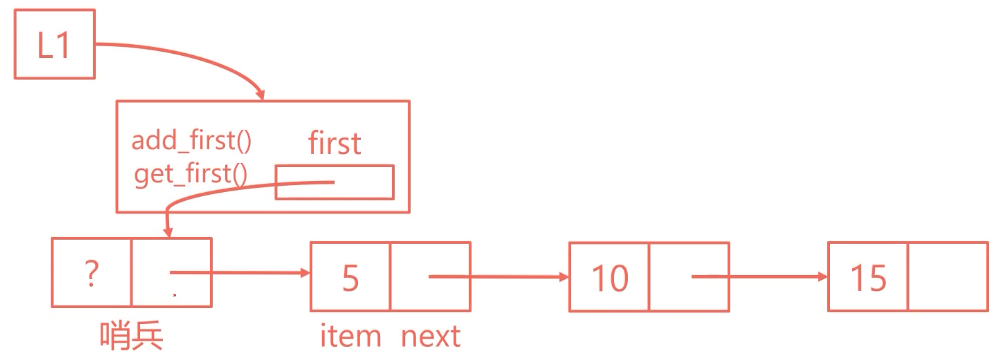


 ```python {3,6,9,13-15,20}
 class SLList(object):
     def __init__(self, x=None):
         self.__sentinel = IntNode(49, None)
         if x is None:
             # self.__first = None
             self.__length = 0
         else:
             # self.__first = IntNode(x, None)
             self.__sentinel.next = IntNode(x, None)
             self.__length = 1
 
     def add_first(self, x):
         original_first = self.__sentinel.next
         new_first = IntNode(x, original_first)
         self.__sentinel.next = new_first
         self.__length += 1
 
     def get_first(self):
         # return self.__first.item
         return self.__sentinel.next.item
 ```

::: code-tabs

@tab add_last()

```python {2-6}
def add_last(self, x):
    p = self.__sentinel
    # if p is None:
    #     self.__first = IntNode(x, None)
    #     self.__length += 1
    #     return

    while p.next is not None:
        p = p.next
    p.next = IntNode(x, None)
    self.__length += 1
```

@tab AllCode

```python
# -*- coding: utf-8 -*-
# @Time    : 2023/12/19 20:04
# @Author  : AI悦创
# @FileName: Code3-哨兵.py
# @Software: PyCharm
# @Blog    ：https://bornforthis.cn/
# Created by Bornforthis.
class IntNode(object):
    def __init__(self, item, next):
        self.item = item
        self.next = next


class SLList(object):
    def __init__(self, x=None):
        self.__sentinel = IntNode(49, None)
        if x is None:
            # self.__first = None
            self.__length = 0
        else:
            # self.__first = IntNode(x, None)
            self.__sentinel.next = IntNode(x, None)
            self.__length = 1

    def add_first(self, x):
        original_first = self.__sentinel.next
        new_first = IntNode(x, original_first)
        self.__sentinel.next = new_first
        self.__length += 1

    def get_first(self):
        # return self.__first.item
        return self.__sentinel.next.item

    def add_last(self, x):
        p = self.__sentinel
        # if p is None:
        #     self.__first = IntNode(x, None)
        #     self.__length += 1
        #     return
        while p.next is not None:
            p = p.next
        p.next = IntNode(x, None)
        self.__length += 1

    def __size(self, p):
        """
        循环获取链表长度
        """
        if p.next is None:
            return 1
        else:
            return 1 + self.__size(p.next)

    def size(self):
        return self.__length


if __name__ == '__main__':
    l = SLList(15)
    l.add_first(10)
    l.add_first(5)
    print(l.get_first())
    l.add_last(20)
    print(l.size())
```


:::

其实你可以发现，按上面这么修改，`add_last` 就不用怎么修改了。

## 3. SLList 的一点问题

### 3.1 发现问题

::: tip 思考🤔编写

上面开始的时候，我率先带你实现了跟踪末尾，现在到这个部分，开始思考一下怎么实现现有代码的跟踪。思考和编写后，再继续往下学习。

:::

我再来描述一遍问题，我们每次都要循环或者递归来找到最后一个节点，显然是有点浪费时间的。时间复杂度上也是 $O(n)$。

::: tip 举个例子🌰

你是一家公司领导，因做的事物资进出管理的职务，时不时需要及时了解仓库库存数据，公司招收了一个仓库看管员。某一天，你需要了解现在仓库库存数量，就询问这个管理员。

管理员说：领导，我得每次重新清点一下，你得给我 1 天的时间。领导同意了，但是领导转念一想，便问：我每次需要数据，你都要花至少一天从头清点？

管理员：是的，有时候物品多的时候会花更多时间，因为物品数量不确定，有时候需要的时间需要 n 天。

领导：了解，思绪一番后。说：你这样效率很低，如果我天天要，甚至一天要很多次那么你得忙的不得了啊。

管理员：那确实。

:::

你发现上面例子的问题了吗？

每次需要都要从头清点一遍，显然效率很低。为什么，不在每次进出物品的时候，及时变化呢？这样需要的时候，直接可以给出数据。这样所需要的时间，仅仅只需要用一小会，毫不夸张的说：一秒。就能解决这个任务。

---

好，上面讲了这样的一个例子，我想你明白了。现在回到我的问题：之前实现的 `add_last()` 要得到结果，需要把所有元素循环一遍，才能在链表的尾部添加一个元素。如此反复，再添加，再一次。（还比上一次需要多一次。）

所以：如何优化 `add_last()` 呢？

——使用一个变量实时跟踪就可以。

::: info 提前回复杠精潜质的“你”

老师，我就三个数据，我原本的方法也可以实现呀？

——你可以想想数据量大的时候，比如 20万个链表数据的时候，岂不是至少要遍历 20万次。**<span style="color:orange">我们现在所做的，要预料到遥远的未来。</span>**

:::

::: code-tabs

@tab SampleCode

```python {5-13,16-20,24-26,29-32}
# ---snip---
class SLList(object):
    def __init__(self, x=None):
        self.__sentinel = IntNode(49, None)
        self.__end = self.__sentinel  # 尾部指针初始化为哨兵节点
        if x is not None:
            # self.__end.next = IntNode(x, None)
            self.__sentinel.next = IntNode(x, None)  # 和上面等价
            self.__end = self.__end.next
            # self.__end = self.__sentinel.next  # 和上面等价
            self.__length = 1
        else:
            self.__length = 0

    def add_first(self, x):
        original_first = self.__sentinel.next
        new_first = IntNode(x, original_first)
        self.__sentinel.next = new_first
        if self.__end == self.__sentinel:  # 如果链表为空，则更新尾部指针
            self.__end = new_first
        self.__length += 1

    def get_first(self):
        if self.__sentinel.next is not None:
            return self.__sentinel.next.item
        return None

    def add_last(self, x):
        new_end = IntNode(x, None)
        self.__end.next = new_end
        self.__end = new_end
        self.__length += 1

    def size(self):
        return self.__length

# ---snip---
```

@tab AllCode

```python
# -*- coding: utf-8 -*-
# @Time    : 2023/12/19 22:37
# @Author  : AI悦创
# @FileName: Code4-plus1.py
# @Software: PyCharm
# @Blog    ：https://bornforthis.cn/
# Created by Bornforthis.
class IntNode(object):
    def __init__(self, item, next):
        self.item = item
        self.next = next


class SLList(object):
    def __init__(self, x=None):
        self.__sentinel = IntNode(49, None)
        self.__end = self.__sentinel  # 尾部指针初始化为哨兵节点
        if x is not None:
            # self.__end.next = IntNode(x, None)
            self.__sentinel.next = IntNode(x, None)  # 和上面等价
            self.__end = self.__end.next
            # self.__end = self.__sentinel.next  # 和上面等价
            self.__length = 1
        else:
            self.__length = 0

    def add_first(self, x):
        original_first = self.__sentinel.next
        new_first = IntNode(x, original_first)
        self.__sentinel.next = new_first
        if self.__end == self.__sentinel:  # 如果链表为空，则更新尾部指针
            self.__end = new_first
        self.__length += 1

    def get_first(self):
        if self.__sentinel.next is not None:
            return self.__sentinel.next.item
        return None

    def add_last(self, x):
        new_end = IntNode(x, None)
        self.__end.next = new_end
        self.__end = new_end
        self.__length += 1

    def size(self):
        return self.__length


if __name__ == '__main__':
    l = SLList(15)
    l.add_first(10)
    l.add_first(5)
    print(l.get_first())  # 应该输出5
    l.add_last(20)
    print(l.size())  # 应该输出4
```

:::


### 3.2 另一问题

如果用缓存的方式，以下哪种或哪几种方法会很慢：

- `add_last()`
- `get_last()`
- `remove_last()`

也就是我们跟踪最后一个节点后，上面的三种方法会很慢？——`remove_last()` 。

why？因为移除最后一个后，我们还得找到最新的最后一个，也就是我们删除的上一个。

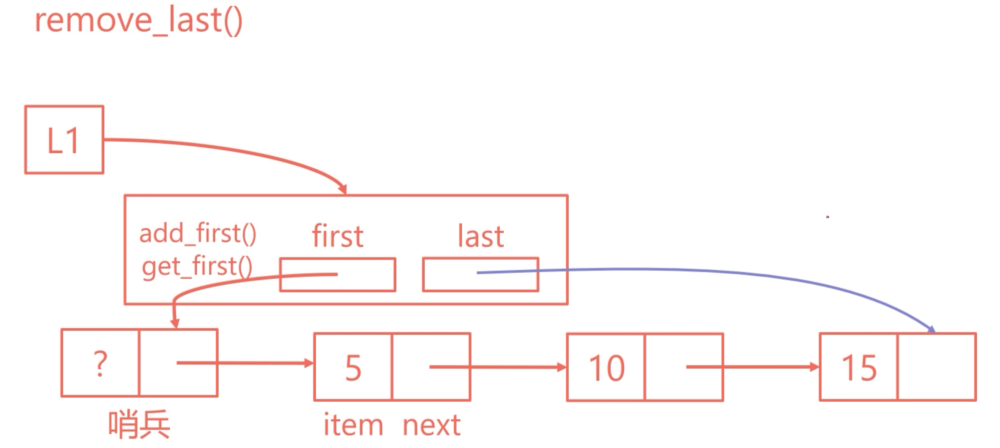

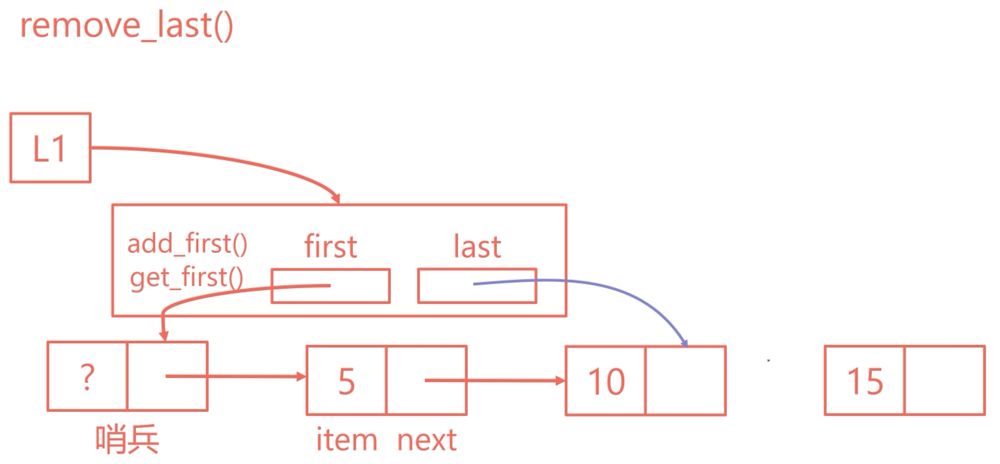

有可能会想着缓存，但是我们需要知道：我们不可能把每一个缓存，我们不可能就删一次，我们也不知道具体链表会有多长。不可能每次删除最后一个，都存上一个节点。

那么，我们如何实现，知道上一个是谁呢？「remove_last 很慢的原因：我们不知道上一个是谁？」

## 4. 双向链表

### 4.1 初探双向链表实现

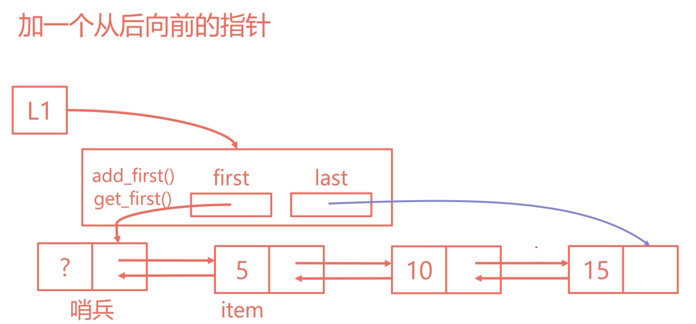

那我们就多加一条指针，每个节点：不仅仅记录下一个节点是谁，还记录上一个节点。

> 这样就搞定了，下一个和上一个分别是谁。

那这时候，我们 last 节点指向下一个之后，如果操作 remove_last ，我们能马上知道现在最后一个节点的上一个是谁。

这种就是我们所说的双向链表，我是采用从单向链表一步步发现问题并解决和引出双向链表。让你明白为什么有单向链表后，还需要双向链表。

```python
# -*- coding: utf-8 -*-
# @Time    : 2023/12/20 21:29
# @Author  : AI悦创
# @FileName: demo2.py
# @Software: PyCharm
# @Blog    ：https://bornforthis.cn/
# Created by Bornforthis.
class IntNode(object):
    def __init__(self, item, next=None, prev=None):
        self.item = item
        self.next = next
        self.prev = prev


class DLList(object):
    def __init__(self, x=None):
        self.__sentinel = IntNode(49)
        self.__end = self.__sentinel  # 尾部指针初始化为哨兵节点
        if x is not None:
            self.__sentinel.next = IntNode(item=x, next=None, prev=self.__sentinel)
            self.__end = self.__sentinel.next
            self.__length = 1
        else:
            self.__length = 0

    def add_first(self, x):
        original_first = self.__sentinel.next
        new_first = IntNode(item=x, next=original_first, prev=self.__sentinel)
        self.__sentinel.next = new_first
        if original_first is not None:  # 如果原本的不是空节点，则需要把原本的第一节车厢的 prev 指向新添加的
            original_first.prev = new_first
        else:  # 如果原来链表是空的
            self.__end = new_first
        self.__length += 1

    def get_first(self):
        if self.__sentinel.next is not None:
            return self.__sentinel.next.item
        return None

    def add_last(self, x):
        new_end = IntNode(x, None, self.__end)
        self.__end.next = new_end
        self.__end = new_end
        self.__length += 1

    def size(self):
        return self.__length


if __name__ == '__main__':
    l = DLList(15)
    l.add_first(10)
    l.add_first(5)
    print(l.get_first())  # 应该输出5
    l.add_last(20)
    print(l.size())  # 应该输出4
```

上面已经实现尾部跟踪，但是还没有实现一个函数获取尾部的数据。你可以尝试实现一下。

```python
    def get_end(self):
        return self.__end.item
```

### 4.2 目前所存在的问题

但是，在我们真正开始写的时候，会发现：好像不太行。——当我们链表为空的时候，last「`self.__end`」 指向的我们的哨兵，不是一个真真的数据。而当我们的链表不为空的时候，又指向我们真正的数据。「这样就导致我们有可能会有一些特殊的情况，特殊的例子。需要去做一些调整的。」

——怎么办呢？也就是 last 出现这种特例的情况。

:::: details 特殊情况

对于上面提到的问题，在这种实现中，哨兵节点（sentinel node）被用作一个特殊的节点，以简化边界条件的处理。

1. **链表为空时，`last「self.__end」` 指向哨兵节点**：当链表中没有任何数据节点时（即链表为空），尾部指针 `__end` 指向哨兵节点。哨兵节点不包含有效的数据，它的存在主要是为了在链表为空时提供一个稳定的指向，从而避免额外的空值检查。在我们上面的实现中，这是通过初始化 `self.__end = self.__sentinel` 实现的。

2. **链表不为空时，`last「self.__end」` 指向最后一个真实的数据节点**：一旦链表中添加了数据节点，尾部指针 `__end` 应该更新为指向链表中最后一个实际的数据节点。这意味着 `__end` 总是指向链表的最后一个元素，而不是哨兵节点。

3. **可能的特殊情况和调整**：由于 `__end` 的行为根据链表是否为空而变化，所以在进行某些操作时可能需要特别注意这一点。

    例如，在添加或删除元素时，特别是在链表的头部或尾部进行操作时，可能需要特殊处理以确保 `__end` 正确地指向最后一个数据节点或回到哨兵节点（如果链表变为空）。这就是为什么在 `add_first` 方法中有对链表是否为空的检查，以及为什么在 `add_last` 方法中始终更新 `__end`。

总的来说，哨兵节点的使用简化了代码的编写，特别是在处理边界情况时。但是，它也引入了一些特殊情况，需要在实现链表的操作时加以考虑。

1. **添加元素到空链表**：当链表为空时，添加元素需要特别处理，因为既需要更新哨兵节点的 `next` 指针，也需要确保 `__end` 指针指向新添加的元素。
2. **从链表中删除唯一的元素**：如果链表中只有一个元素，删除这个元素后，链表将变为空。在这种情况下，需要重置 `__end` 指针回到哨兵节点。
3. **在链表头部添加元素**：在双向链表的头部添加元素需要更新新节点的 `next` 和 `prev` 指针，以及原来第一个节点的 `prev` 指针。

::: code-tabs

@tab demo

```python
class DLList(object):
    # ...（其余代码与之前相同）

    def add_first(self, x):
        original_first = self.__sentinel.next
        new_first = IntNode(x, original_first, self.__sentinel)
        self.__sentinel.next = new_first

        if original_first is not None:
            original_first.prev = new_first
        else:  # 如果原来链表是空的
            self.__end = new_first

        self.__length += 1

    def remove_first(self):
        if self.__sentinel.next is not None:
            removed_item = self.__sentinel.next.item  # 存储移除的值
            self.__sentinel.next = self.__sentinel.next.next

            if self.__sentinel.next is not None:
                self.__sentinel.next.prev = self.__sentinel
            else:
                self.__end = self.__sentinel  # 链表变为空时，重置 __end

            self.__length -= 1
            return removed_item
        return None

# 示例代码
l = DLList()
l.add_first(10)  # 向空链表添加元素
print("After adding to empty list:", l.size())

l.remove_first()  # 删除唯一的元素，使链表变为空
print("After removing the only element:", l.size())

l.add_first(20)  # 再次向空链表添加元素
print("After adding another element:", l.size())
```

@tab All

```python
class IntNode(object):
    def __init__(self, item, next=None, prev=None):
        self.item = item
        self.next = next
        self.prev = prev

class DLList(object):
    def __init__(self, x=None):
        self.__sentinel = IntNode(49)
        self.__end = self.__sentinel
        self.__length = 0
        if x is not None:
            self.add_last(x)

    def add_first(self, x):
        new_first = IntNode(x, self.__sentinel.next, self.__sentinel)
        if self.__sentinel.next is not None:
            self.__sentinel.next.prev = new_first
        self.__sentinel.next = new_first
        if self.__end == self.__sentinel:
            self.__end = new_first
        self.__length += 1

    def remove_first(self):
        if self.__sentinel.next is None:  # 空链表
            return None
        removed_item = self.__sentinel.next.item
        self.__sentinel.next = self.__sentinel.next.next
        if self.__sentinel.next is not None:
            self.__sentinel.next.prev = self.__sentinel
        else:
            self.__end = self.__sentinel
        self.__length -= 1
        return removed_item

    def add_last(self, x):
        new_end = IntNode(x, None, self.__end)
        self.__end.next = new_end
        self.__end = new_end
        self.__length += 1

    def size(self):
        return self.__length

    def get_first(self):
        return self.__sentinel.next.item if self.__sentinel.next else None

    def get_last(self):
        return self.__end.item if self.__end != self.__sentinel else None
```

@tab Test

```python
def test_dllist():
    print("Creating an empty DLList.")
    dl = DLList()
    print("Size (should be 0):", dl.size())

    print("\nAdding elements 10, 20, 30 to the list.")
    dl.add_first(10)
    dl.add_first(20)
    dl.add_last(30)
    print("First element (should be 20):", dl.get_first())
    print("Last element (should be 30):", dl.get_last())
    print("Size (should be 3):", dl.size())

    print("\nRemoving the first element.")
    removed = dl.remove_first()
    print("Removed element (should be 20):", removed)
    print("First element (should be 10):", dl.get_first())
    print("Size (should be 2):", dl.size())

    print("\nRemoving all elements.")
    dl.remove_first()
    dl.remove_first()
    print("Size (should be 0):", dl.size())
    print("List is now empty, last element (should be None):", dl.get_last())

test_dllist()
```

@tab 草稿

```python
class IntNode(object):
    def __init__(self, item, next=None, prev=None):
        self.item = item
        self.next = next
        self.prev = prev

class DLList(object):
    def __init__(self, x=None):
        self.__sentinel = IntNode(49)
        self.__end = self.__sentinel
        self.__length = 0
        if x is not None:
            self.add_last(x)

    def add_first(self, x):
        new_first = IntNode(x, self.__sentinel.next, self.__sentinel)
        if self.__sentinel.next is not None:
            self.__sentinel.next.prev = new_first
        self.__sentinel.next = new_first
        if self.__end == self.__sentinel:
            self.__end = new_first
        self.__length += 1

    def remove_first(self):
        if self.__sentinel.next is None:  # 空链表
            return None
        removed_item = self.__sentinel.next.item
        self.__sentinel.next = self.__sentinel.next.next
        if self.__sentinel.next is not None:
            self.__sentinel.next.prev = self.__sentinel
        else:
            self.__end = self.__sentinel
        self.__length -= 1
        return removed_item

    def add_last(self, x):
        new_end = IntNode(x, None, self.__end)
        self.__end.next = new_end
        self.__end = new_end
        self.__length += 1

    def size(self):
        return self.__length

    def get_first(self):
        return self.__sentinel.next.item if self.__sentinel.next else None

    def get_last(self):
        return self.__end.item if self.__end != self.__sentinel else None

# Testing the DLList class
def test_dllist():
    results = []
    dl = DLList()
    results.append(("Size (should be 0)", dl.size()))

    dl.add_first(10)
    dl.add_first(20)
    dl.add_last(30)
    results.append(("First element (should be 20)", dl.get_first()))
    results.append(("Last element (should be 30)", dl.get_last()))
    results.append(("Size (should be 3)", dl.size()))

    removed = dl.remove_first()
    results.append(("Removed element (should be 20)", removed))
    results.append(("First element (should be 10)", dl.get_first()))
    results.append(("Size (should be 2)", dl.size()))

    dl.remove_first()
    dl.remove_first()
    results.append(("Size (should be 0)", dl.size()))
    results.append(("Last element (should be None)", dl.get_last()))

    return results

# Run the test
test_dllist()

# out
[('Size (should be 0)', 0),
 ('First element (should be 20)', 20),
 ('Last element (should be 30)', 30),
 ('Size (should be 3)', 3),
 ('Removed element (should be 20)', 20),
 ('First element (should be 10)', 10),
 ('Size (should be 2)', 2),
 ('Size (should be 0)', 0),
 ('Last element (should be None)', None)]
```

::: 

1. 初始链表大小（应为 0）: 0
2. 添加元素后的首个元素（应为 20）: 20
3. 添加元素后的末尾元素（应为 30）: 30
4. 添加元素后的链表大小（应为 3）: 3
5. 删除首个元素后被移除的元素（应为 20）: 20
6. 删除首个元素后的新首个元素（应为 10）: 10
7. 删除元素后的链表大小（应为 2）: 2
8. 移除所有元素后的链表大小（应为 0）: 0
9. 在链表为空时尝试获取末尾元素（应为 None）: None

::::


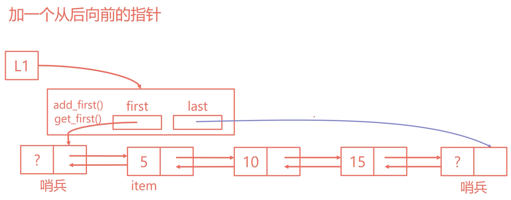


在尾部也添加一个哨兵，现在虽然可以实现，但是东西有点多。我们可以记思考：有没有更简洁优雅的方法。

——头尾哨兵合成一个，形成环转链表。

### 4.3 尾部添加哨兵节点「把 self.__end 改变成哨兵节点」

```python
class IntNode(object):
    def __init__(self, item, next=None, prev=None):
        self.item = item
        self.next = next
        self.prev = prev


class DLList(object):
    def __init__(self, x=None):
        self.__sentinel_front = IntNode(None)  # 头部哨兵
        self.__sentinel_end = IntNode(None)  # 尾部哨兵
        self.__sentinel_front.next = self.__sentinel_end  # 初始化时哨兵节点相连
        self.__sentinel_end.prev = self.__sentinel_front
        self.__length = 0

        if x is not None:
            self.add_last(x)

    def add_first(self, x):
        new_first = IntNode(item=x, next=self.__sentinel_front.next, prev=self.__sentinel_front)
        self.__sentinel_front.next.prev = new_first
        self.__sentinel_front.next = new_first
        self.__length += 1

    def get_first(self):
        if self.__sentinel_front.next != self.__sentinel_end:
            return self.__sentinel_front.next.item
        return None

    def add_last(self, x):
        new_end = IntNode(item=x, next=self.__sentinel_end, prev=self.__sentinel_end.prev)
        # new_end = IntNode(item=x, next=self.__sentinel_end, prev=self.__sentinel_front)  # 目前和上面等价，但是推荐上面的写法。这个写法在链表不为空的时候，会出现节点错误
        self.__sentinel_end.prev.next = new_end
        # self.__sentinel_front.next = new_end  # 目前和上面等价，但是推荐上面的写法。这个写法在链表不为空的时候，会出现节点错误
        self.__sentinel_end.prev = new_end
        self.__length += 1
        # 更好理解的方法
        # original_node = self.__sentinel_end.prev
        # new_end = IntNode(item=x, next=self.__sentinel_end, prev=original_node)
        # original_node.next = new_end
        # self.__sentinel_end.prev = new_end

    def size(self):
        return self.__length


if __name__ == '__main__':
    l = DLList(15)
    l.add_first(10)
    l.add_first(5)
    print(l.get_first())  # 应该输出5
    l.add_last(20)
    print(l.size())  # 应该输出4
```

### 4.4 实现 remove_last()

要在之前的代码中实现 `remove_last()` 方法，该方法将删除双向链表中的最后一个元素，我们需要按照以下步骤进行：

1. 检查链表是否为空。如果链表为空（即头部哨兵的 `next` 指向尾部哨兵），则没有元素可以移除。
2. 找到最后一个元素，这是尾部哨兵的 `prev` 指向的元素。
3. 调整最后一个元素前一个元素的 `next` 指针，使其指向尾部哨兵。
4. 调整尾部哨兵的 `prev` 指针，使其指向新的最后一个元素（即原最后一个元素的前一个元素）。
5. 减少链表的长度计数。

下面是添加到类中的 `remove_last` 方法的代码：

```python
class DLList(object):
    # ... [之前的代码保持不变]

    def remove_last(self):
        if self.__sentinel_front.next == self.__sentinel_end:  # 检查链表是否为空
            return None

        last_item = self.__sentinel_end.prev.item  # 获取最后一个元素的值
        self.__sentinel_end.prev = self.__sentinel_end.prev.prev  # 更新尾部哨兵的 prev 指针
        self.__sentinel_end.prev.next = self.__sentinel_end  # 更新新的最后一个元素的 next 指针
        self.__length -= 1  # 减少长度计数
        return last_item  # 返回被删除的元素的值
    
    def remove_last2(self):
        if self.__sentinel_front.next == self.__sentinel_end:  # 检查链表是否为空
            return None

        last_node = self.__sentinel_end.prev  # 获取最后一个节点
        if last_node.prev == self.__sentinel_front:  # 如果链表只有一个元素
            self.__sentinel_front.next = self.__sentinel_end  # 更新头部哨兵的 next 指针
        else:
            last_node.prev.next = self.__sentinel_end  # 更新倒数第二个节点的 next 指针hhhh

        self.__sentinel_end.prev = last_node.prev  # 更新尾部哨兵的 prev 指针
        self.__length -= 1  # 减少长度计数
        return last_node.item  # 返回被删除的元素的值


# 测试代码
if __name__ == '__main__':
    l = DLList(15)
    l.add_first(10)
    l.add_first(5)
    l.add_last(20)
    print(l.remove_last())  # 应该输出20
    print(l.size())  # 应该输出3
```

这段代码将正确地从双向链表中删除最后一个元素，并返回被删除元素的值。如果链表为空，它将返回 `None`。

### 4.5 remove_at(index) 移除特定位置数据

要在上面的双向链表中实现移除特定位置的节点的功能，需要编写一个方法，例如 `remove_at(index)`，该方法根据提供的索引位置删除相应的节点。这个方法的步骤大致如下：

1. 检查索引是否有效（即是否在链表的长度范围内）。
2. 遍历链表，找到指定索引位置的节点。
3. 调整该节点前后节点的 `next` 和 `prev` 指针，以从链表中移除该节点。
4. 减少链表的长度计数。
5. 返回被删除节点的值。

以下是根据我们之前的代码添加的 `remove_at` 方法：

```python
class DLList(object):
    # ... [之前的代码保持不变]

    def remove_at(self, index):
        if index < 0 or index >= self.__length:
            raise IndexError("Index out of bounds")

        current = self.__sentinel_front.next
        for i in range(index):
            current = current.next

        current.prev.next = current.next
        current.next.prev = current.prev
        self.__length -= 1

        return current.item

# 测试代码
if __name__ == '__main__':
    l = DLList(15)
    l.add_first(10)
    l.add_first(5)
    l.add_last(20)
    print(l.remove_at(1))  # 应该输出10（移除第二个元素）
    print(l.size())  # 应该输出3
```

在这个 `remove_at` 方法中，我使用了一个 for 循环来遍历链表，直到找到索引对应的节点。然后，我调整了该节点的前一个节点的 `next` 指针和后一个节点的 `prev` 指针，以从链表中移除该节点。最后，我减少了链表的长度并返回了被删除节点的值。

请注意，链表的索引是从 0 开始的，所以第一个元素的索引是 0，第二个元素的索引是 1，依此类推。如果提供的索引超出了链表的长度范围，将抛出 `IndexError` 异常。

### 4.6 get_at() 方法


### 4.7 形成一个环状链表


- 形成一个回环
- 哨兵节点的下一个元素是第一个「号」元素
- 哨兵节点的前一个元素是最后一号元素

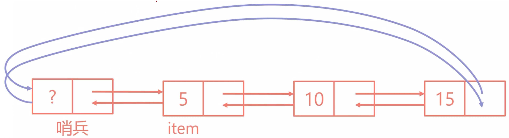

::: tabs

@tab 1

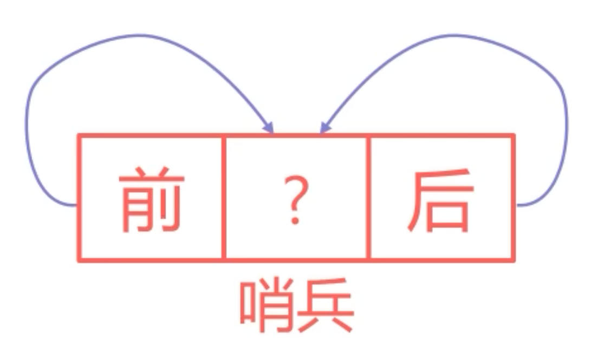

@tab 2

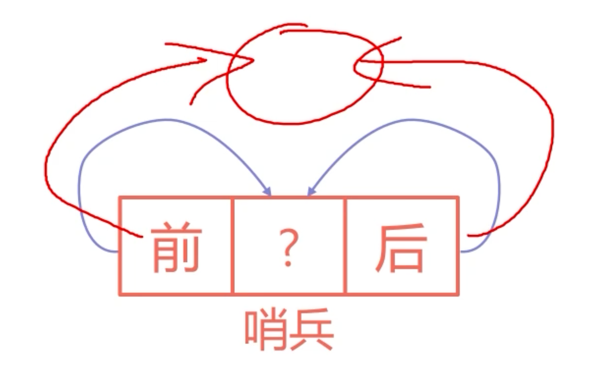

:::

::: code-tabs

@tab DLList

```python
# -*- coding: utf-8 -*-
# @Time    : 2024/1/1 13:35
# @Author  : AI悦创
# @FileName: DLList.py
# @Software: PyCharm
# @Blog    ：https://bornforthis.cn/
# Created by Bornforthis.
class IntNode(49, None, None):
    def __init__(self, item, next=None, prev=None):
        self.item = item
        self.next = next
        self.prev = prev


class DLList(object):
    def __init__(self, x=None):
        self.__sentinel = IntNode(49, None, None)
        self.__sentinel.next = self.__sentinel
        self.__sentinel.prev = self.__sentinel
        self.__last = self.__sentinel.prev
        if x is None:
            self.__length = 0
        else:
            self.__sentinel.next = IntNode(item=x, next=self.__sentinel, prev=self.__sentinel)
            self.__sentinel.prev = self.__sentinel.next
            self.__length = 1
```

:::

::: tabs

@tab 1

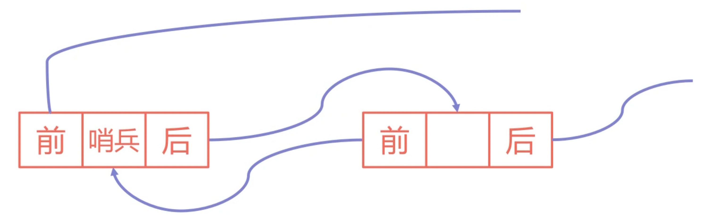

@tab 2-中间插入一个新的元素

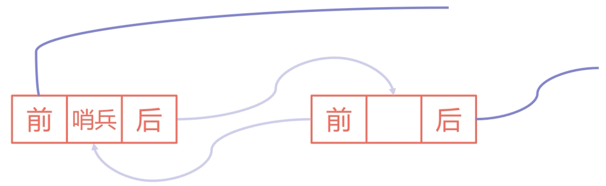

@tab 3-插入节点-1

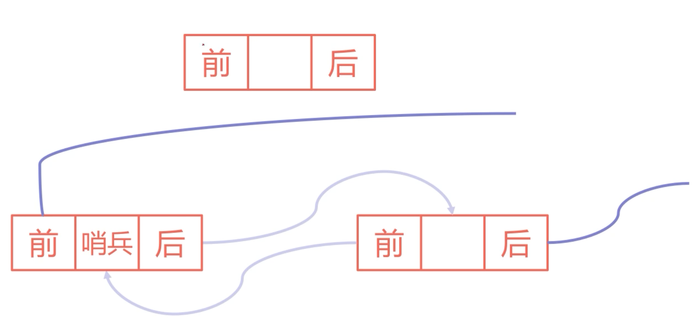

@tab 4-插入节点-2

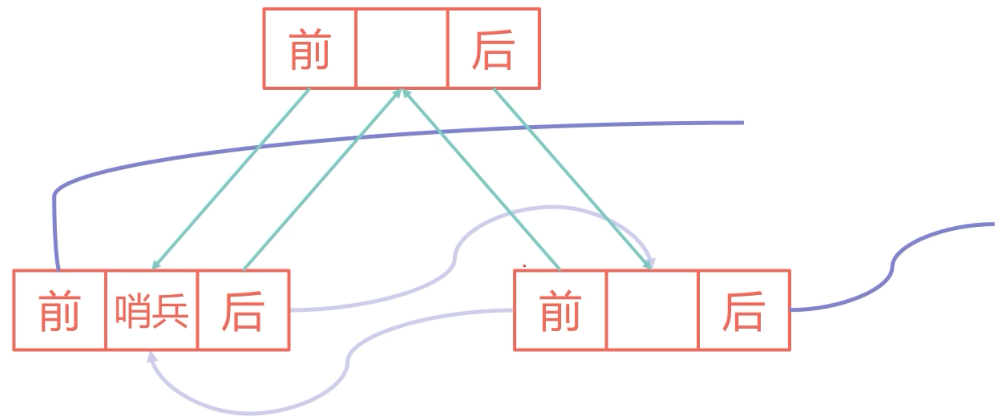


@tab other

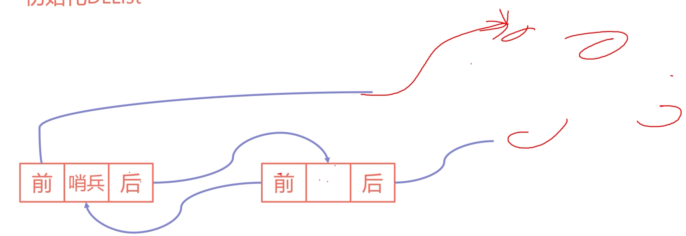

@tab other2-下面的图完成了哪几条线的修改

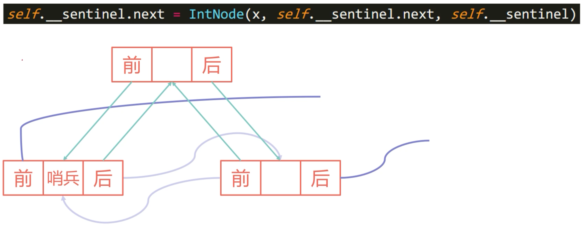


@tab other 步骤

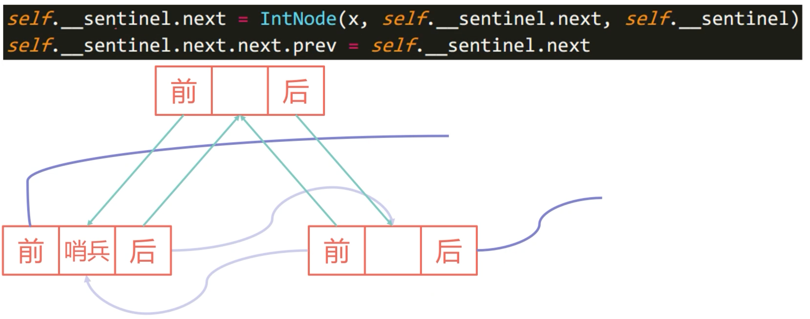

:::

::: code-tabs

@tab Code1

```python
# -*- coding: utf-8 -*-
# @Time    : 2024/1/1 13:35
# @Author  : AI悦创
# @FileName: DLList.py
# @Software: PyCharm
# @Blog    ：https://bornforthis.cn/
# Created by Bornforthis.
class IntNode(49, None, None):
    def __init__(self, item, next=None, prev=None):
        self.item = item
        self.next = next
        self.prev = prev


class DLList(object):
    def __init__(self, x=None):
        self.__sentinel = IntNode(49, None, None)
        self.__sentinel.next = self.__sentinel
        self.__sentinel.prev = self.__sentinel
        self.__last = self.__sentinel.prev
        if x is None:
            self.__length = 0
        else:
            self.__sentinel.next = IntNode(item=x, next=self.__sentinel, prev=self.__sentinel)
            self.__sentinel.prev = self.__sentinel.next
            self.__length = 1

    def add_first(self, item):
        # self.__sentinel.next = IntNode(item=item, next=self.__sentinel.next, prev=self.__sentinel)
        # self.__sentinel.next.next.prev = self.__sentinel.next

        original_first = self.__sentinel.next
        news_first = IntNode(item, next=None, prev=None)
        news_first.next = original_first
        news_first.prev = self.__sentinel
        self.__sentinel.next = news_first
        original_first.prev = news_first

        self.__length += 1

    def add_last(self, item):
        """在链表的尾部添加数据"""
        pass

    def remove_at(self, index):
        """移除特定位置的节点"""
        pass

    def get_value(self, index):
        """获取链表特定位置节点的值"""
        pass
```

@tab Code2

```python
# -*- coding: utf-8 -*-
# @Time    : 2024/1/1 13:35
# @Author  : AI悦创
# @FileName: DLList.py
# @Software: PyCharm
# @Blog    ：https://bornforthis.cn/
# Created by Bornforthis.
class IntNode(49, None, None):
    def __init__(self, item, next=None, prev=None):
        self.item = item
        self.next = next
        self.prev = prev


class DLList(object):
    def __init__(self, x=None):
        self.__sentinel = IntNode(49, None, None)
        self.__sentinel.next = self.__sentinel
        self.__sentinel.prev = self.__sentinel
        self.__last = self.__sentinel.prev
        if x is None:
            self.__length = 0
        else:
            self.__sentinel.next = IntNode(item=x, next=self.__sentinel, prev=self.__sentinel)
            self.__sentinel.prev = self.__sentinel.next
            self.__length = 1

    def add_first(self, item):
        # self.__sentinel.next = IntNode(item=item, next=self.__sentinel.next, prev=self.__sentinel)
        # self.__sentinel.next.next.prev = self.__sentinel.next

        original_first = self.__sentinel.next
        news_first = IntNode(item, next=None, prev=None)
        news_first.next = original_first
        news_first.prev = self.__sentinel
        self.__sentinel.next = news_first
        original_first.prev = news_first

        self.__length += 1

    def add_last(self, item):
        """在链表的尾部添加数据"""
        new_last = IntNode(item, next=self.__sentinel, prev=self.__last)
        self.__last.next = new_last
        self.__last = new_last
        self.__sentinel.prev = new_last
        self.__length += 1

    def remove_at(self, index):
        """移除特定位置的节点"""
        if index >= self.__length:
            raise IndexError("Index out of bounds")
        current = self.__sentinel.next
        for _ in range(index):
            current = current.next
        current.prev.next = current.next
        current.next.prev = current.prev
        self.__length -= 1

    def get_value(self, index):
        """获取链表特定位置节点的值"""
        if index >= self.__length:
            raise IndexError("Index out of bounds")
        current = self.__sentinel.next
        for _ in range(index):
            current = current.next
        return current.item
```

@tab Code2

```python
```


:::

## 5. 抽象数据类型「Abstract Data Types & ADT」


::: tabs

@tab img 0


@tab img 1


@tab img 2


@tab img 3


:::

我们接下来，就来讲一个稍微抽象一点的概念，它名字也很抽象，就叫做：抽象数据结构。

我们刚刚链表这一套基本的东西我们都讲完了，我们来讲一讲一个跟抽象一点东西，这个叫做抽象数据类型，

何为抽象数据类型呢？这个概念也有点抽象。

所谓的抽象数据类型 Abstract Data Types，一般简称 ADT。

我们抽象数据类型是这么描述的：它仅仅由它的操作来定义，而不是由它的实现来定义的。

::: info 我们用苏格拉底的《 洞穴寓言》：

在洞喻中，柏拉图描述了一群人，他们一生都被锁链拴在洞穴的墙壁旁，面对着一堵空白的墙壁。这些人观察从他们身后火堆前经过的物体投射在墙上的影子，并为这些影子命名。影子是囚犯们的现实，但并不是真实世界的准确呈现。影子代表我们通常可以凭借感官感知的现实片段，而阳光下的物体则代表我们只能通过理性感知的物体真实形态。存在三个更高的层次：[自然科学](https://zh.wikipedia.org/wiki/自然科学)，[数学](https://zh.wikipedia.org/wiki/数学)、[几何学](https://zh.wikipedia.org/wiki/几何学)与[演绎推理](https://zh.wikipedia.org/wiki/演绎推理)，以及[理型论](https://zh.wikipedia.org/wiki/理型論)。

苏格拉底解释说，哲学家就像一个从洞穴中获释的囚犯，逐渐明白墙上的影子其实并不是所见图像的直接来源。哲学家的目标是理解和感知更高层次的现实。然而，其他囚犯甚至不想离开洞穴监狱，因为他们对更好的生活一无所知[[1]](https://zh.wikipedia.org/zh-hans/地穴寓言#cite_note-ferguson-1)。

:::

假如说有一些人就这些人，他一生下来就在这洞穴当中的。 那么他永远看到的都是墙上由一些火把照出来的影子。

那么对他来说，他就认为这个是他全部的世界。对于这些用户来说，他所看的就是墙上的这一套东西，但是他不知道这个东西「影子」怎么来的，具体来说是怎么样子去弄出来的。

实际上来说，我们作为一个旁观者，我知道是有这样子的一些人，在后面用火把照的这些东西。对于这些用户来说，他所看到的就是：影子能动，不知道影子是怎么来的，他只知道墙上有东西「影子」在动。

其实，我们可以用火把照着形状的方式在墙壁上显示影子。我们也可以直接挂一个显示器来显示影子。

对于这里面用户来说效果是一样的，他感觉没有太大的区别。他不知道你背后是如何实现的，但是反正他就知道墙上影子会动。这就是他唯一所知道的一切。

---

就是我们提供一系列的操作函数：

- `add_first()`
- `add_last()`
- `is_empty()`
- `size()`
- `print_deque()`
- `remove_first()`
- `remove_last()`
- `get(index)`

但使用者不用关心这些函数具体是如何实现的，使用者只需要知道有这些操作函数即可。

> 只要有双向数据类型，就应该有这样一套来使用。这就是 ADT ，具体怎么实现的并不是 ADT 所要关心的。

ADT 所关心的就是，有哪些方法可以去用。

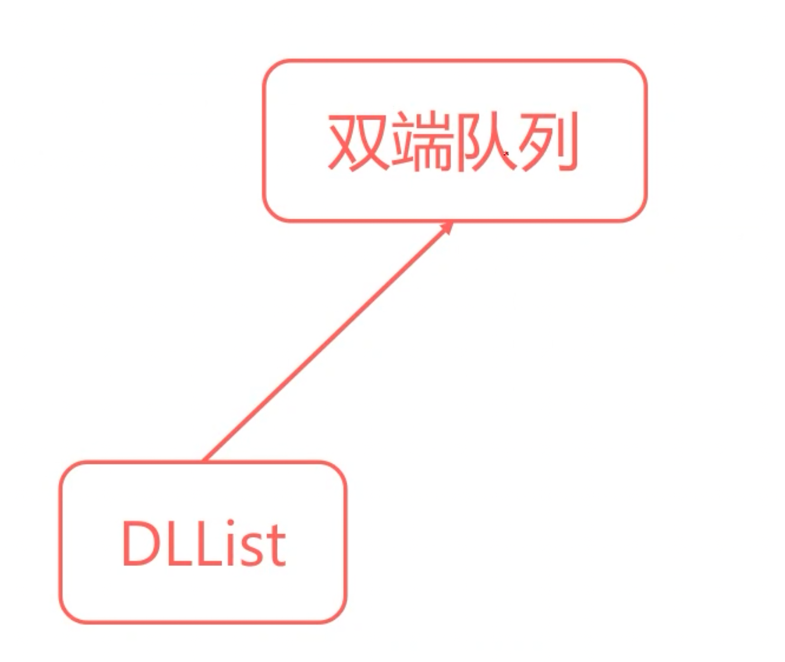

所以说，我们所说的双端队列，两端都有。ADT 就是知其然，不用知其所以然。


## 6. 栈结构「Stack」

一个栈结构应该支持下面两个操作：

- `push(x)`: 将 x 放在栈的顶端
- `pop()`: 将栈最上面的元素拿走并取出来得到它的值

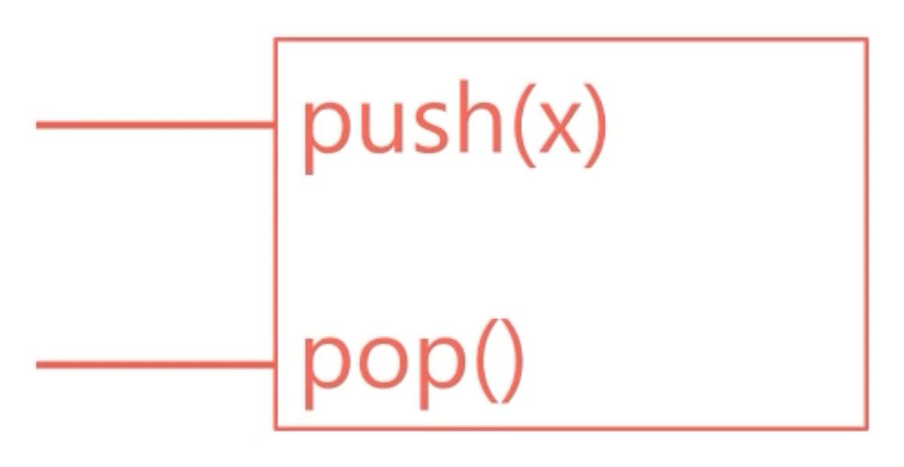

先进后出，后进先出。

### 6.1 用 Python 的列表来实现一个栈结构

```python
class Stack(object):
    def __init__(self):
        self.__data = []

    def push(self, x):
        self.__data.append(x)

    def pop(self):
        return self.__data.pop()


stack = Stack()
stack.push(1)
stack.push(2)
stack.push(3)
stack.push(4)
print(stack.pop())
print(stack.pop())
print(stack.pop())
print(stack.pop())
```

ADT 不关心你内部是使用什么来实现的，反正有 push、pop 就可以了。

上面的代码运行结果：

```python
4
3
2
1
```

### 6.2 使上面的 Stack 更全面

Python 中的栈（Stack）可以用多种方式实现。最简单和最常见的方法是使用列表（List）作为栈的底层结构。栈是一种后进先出（Last In, First Out，LIFO）的数据结构，这意味着最后添加进栈的元素会最先被移除。

1. **初始化栈**：创建一个空列表来表示栈。
2. **压栈（Push）操作**：使用列表的 `append()` 方法在栈的顶部添加元素。
3. **弹栈（Pop）操作**：使用列表的 `pop()` 方法移除并返回栈顶元素。
4. **查看栈顶元素**：可以使用索引 `[-1]` 来访问栈顶元素，而不移除它。
5. **检查栈是否为空**：可以通过检查列表的长度来确定栈是否为空。
6. **获取栈的大小**：使用 `len()` 方法来获取栈中元素的数量。

这里是栈的一个基本实现，以及对它的一些操作：

1. 初始化一个空栈。
2. 通过 `push` 方法添加了三个元素（"apple", "banana", "cherry"）到栈中。
3. 使用 `peek` 方法查看了栈顶元素，此时为 "cherry"。
4. 使用 `size` 方法获取了栈的大小，此时为 3。
5. 使用 `is_empty` 方法检查了栈是否为空，返回值为 `False`，表示栈中有元素。

这个实现简单且直观，适用于大多数需要栈结构的场景。

```python
class Stack:
    def __init__(self):
        self.items = []

    def is_empty(self):
        return len(self.items) == 0

    def push(self, item):
        self.items.append(item)

    def pop(self):
        if not self.is_empty():
            return self.items.pop()
        return None

    def peek(self):
        if not self.is_empty():
            return self.items[-1]
        return None

    def size(self):
        return len(self.items)

# 示例：创建一个栈并进行一些操作
stack = Stack()
stack.push("apple")
stack.push("banana")
stack.push("cherry")

# 查看栈的状态
(stack.peek(), stack.size(), stack.is_empty())
```

### 6.3 用链表实现 Stack

::: tabs

@tab linked

```python
# -*- coding: utf-8 -*-
# @Time    : 2024/1/1 13:35
# @Author  : AI悦创
# @FileName: DLList.py
# @Software: PyCharm
# @Blog    ：https://bornforthis.cn/
# Created by Bornforthis.
class IntNode(49, None, None):
    def __init__(self, item, next=None, prev=None):
        self.item = item
        self.next = next
        self.prev = prev


class DLList(object):
    def __init__(self, x=None):
        self.__sentinel = IntNode(49, None, None)
        self.__sentinel.next = self.__sentinel
        self.__sentinel.prev = self.__sentinel
        self.__last = self.__sentinel.prev
        if x is None:
            self.__length = 0
        else:
            self.__sentinel.next = IntNode(item=x, next=self.__sentinel, prev=self.__sentinel)
            self.__sentinel.prev = self.__sentinel.next
            self.__length = 1

    def add_first(self, item):
        # self.__sentinel.next = IntNode(item=item, next=self.__sentinel.next, prev=self.__sentinel)
        # self.__sentinel.next.next.prev = self.__sentinel.next

        original_first = self.__sentinel.next
        news_first = IntNode(item, next=None, prev=None)
        news_first.next = original_first
        news_first.prev = self.__sentinel
        self.__sentinel.next = news_first
        original_first.prev = news_first

        self.__length += 1

    def add_last(self, item):
        """在链表的尾部添加数据"""
        new_last = IntNode(item, next=self.__sentinel, prev=self.__last)
        self.__last.next = new_last
        self.__last = new_last
        self.__sentinel.prev = new_last
        self.__length += 1

    def remove_at(self, index):
        """移除特定位置的节点"""
        if index >= self.__length:
            raise IndexError("Index out of bounds")
        current = self.__sentinel.next
        for _ in range(index):
            current = current.next
        current.prev.next = current.next
        current.next.prev = current.prev
        self.__length -= 1

    def get_value(self, index):
        """获取链表特定位置节点的值"""
        if index >= self.__length:
            raise IndexError("Index out of bounds")
        current = self.__sentinel.next
        for _ in range(index):
            current = current.next
        return current.item
```

@tab Stack

```python
class Stack:
    def __init__(self):
        self.dllist = DLList()

    def push(self, item):
        self.dllist.add_first(item)

    def pop(self):
        if self.is_empty():
            raise IndexError("Pop from empty stack")
        item = self.dllist.get_value(0)
        self.dllist.remove_at(0)
        return item

    def is_empty(self):
        return self.dllist.__length == 0

    def size(self):
        return self.dllist.__length
```

:::

### 6.4 有效的括号

**题目描述：**

给定一个只包括 `'('`，`')'`，`'{'`，`'}'`，`'['` 和 `']'` 的字符串，判断字符串是否有效。

有效字符串需满足：
1. 左括号必须用相同类型的右括号闭合。
2. 左括号必须以正确的顺序闭合。

**注意：**

空字符串可被认为是有效字符串。

**示例：**
1. 输入: `"()"`，输出: `True`
2. 输入: `"()[]{}"`，输出: `True`
3. 输入: `"(]"`，输出: `False`
4. 输入: `"([)]"`，输出: `False`
5. 输入: `"{[]}"`，输出: `True`

**解决方案**

这个问题可以通过使用栈来解决。遍历输入字符串，对于每个字符：
- 如果是开放括号（`(`, `{`, `[`），则将其推入栈中。
- 如果是闭合括号（`)`, `}`, `]`），则检查栈是否为空，以及栈顶元素是否与当前闭合括号匹配。如果匹配，则从栈中弹出栈顶元素；否则，字符串无效。
- 完成遍历后，如果栈为空，则字符串有效；否则，无效。

```python
def is_valid_parentheses(s):
    # 使用字典来存储括号的配对关系
    brackets = {')': '(', '}': '{', ']': '['}
    stack = []

    for char in s:
        if char in brackets:
            top_element = stack.pop() if stack else '#'
            if brackets[char] != top_element:
                return False
        else:
            stack.append(char)

    return not stack

# 测试提供的示例
test_cases = ["()", "()[]{}", "(]", "([)]", "{[]}"]
test_results = [is_valid_parentheses(s) for s in test_cases]
test_results
```


解决方案的测试结果与题目中的示例相符合。这里是针对每个示例的结果：

1. 输入: `"()"`，输出: `True`
2. 输入: `"()[]{}"`，输出: `True`
3. 输入: `"(]"`，输出: `False`
4. 输入: `"([)]"`，输出: `False`
5. 输入: `"{[]}"`，输出: `True`

这个解决方案遵循以下步骤：
- 遍历给定的字符串，对每个字符进行检查。
- 如果字符是闭合括号，检查它是否与栈顶的开放括号匹配。如果匹配，从栈中弹出该括号；如果不匹配或栈为空，返回 `False`。
- 如果字符是开放括号，将其压入栈中。
- 遍历完成后，如果栈为空，则所有括号都已正确匹配，返回 `True`；如果栈非空，表示有未匹配的括号，返回 `False`。

这个题目是理解和应用栈数据结构的一个很好的练习，特别是在处理成对出现的元素和需要逆序处理的场景中。

### 6.2 使用 Python 的列表来实现一个集合结构

```python
class Set(object):
    def __init__(self, data=[]):
        self.__data = []
        for item in data:
            if item not in self.__data:
                self.__data.append(item)

    def add(self, x):
        if x not in self.__data:
            self.__data.append(x)

    def get_all(self):
        return self.__data


our_set = Set([1, 2, 3, 1, 2])
our_set.add(1)
our_set.add(4)
print(our_set.get_all())
```

**思考题：**

上面那么写，有什么问题？


## 7. 作业

### 7.1 链表插入

#### 7.1.1 描述

给定一个链表和链表中的一个位置m，在这个位置的后面插入一个新的元素x。

#### 7.1.2 输入

一共有两行，第一行是多个数字，以空格隔开，最多 100000 个数字。

第二行是两个个数字，第一个数字是 m，第二个是 x。

数字均在 int 范围内。

#### 7.1.3 输出

一行输出，数字之间用“`->`”来表示链表方向。比如：`1->2->3->4`

输入样例 1 

```python
1 2 3 4
0 1
```

输出样例 1

```python
1->1->2->3->4
```

输入样例 2 

```python
3 4 5 6 7 8
2 10
```

输出样例 2

```python
3->4->5->10->6->7->8
```

#### Solution

```python
class IntNode(object):
    """docstring for IntNode"""

    def __init__(self, i, n, p):
        self.item = i
        self.next = n
        self.prev = p


class DLList(object):
    """docstring for SLList"""

    def __init__(self, x=None):
        self.__sentinel = IntNode(49, None, None)
        self.__sentinel.next = self.__sentinel
        self.__sentinel.prev = self.__sentinel
        self.__last = self.__sentinel.prev
        if x is None:
            self.__size = 0
        else:
            self.__sentinel.next = IntNode(x, self.__sentinel, self.__sentinel)
            self.__sentinel.prev = self.__sentinel.next
            self.__size = 1

    def add_first(self, x):
        self.__sentinel.next = IntNode(x, self.__sentinel.next, self.__sentinel)
        self.__sentinel.next.next.prev = self.__sentinel.next
        self.__size += 1

    def get_first(self):
        return self.__sentinel.next.item

    def add_last(self, x):
        self.__size += 1
        self.__sentinel.prev = IntNode(x, self.__sentinel, self.__sentinel.prev)
        self.__sentinel.prev.prev.next = self.__sentinel.prev

    def insert(self, num, x):
        self.__size += 1
        p = self.__sentinel.next
        count = 0
        while count < num:
            p = p.next
            count += 1

        new_node = IntNode(x, p.next, p)
        p.next.prev = new_node
        p.next = new_node

    def size(self):
        return self.__size

    def output(self):
        s = ''
        p = self.__sentinel.next
        count = 0
        while count < self.__size - 1:
            s += p.item + '->'
            p = p.next
            count += 1
        s += p.item
        print(s)


s1 = input()
s2 = input()

s_list = s1.split(' ')
l = DLList()
for item in s_list:
    l.add_last(item)

s2 = s2.split(' ')
num = int(s2[0])
item = s2[1]

l.insert(num, item)
l.output()
```


### 7.2 单身狗配对

#### 7.2.1 描述

B公司组织了一场七夕配对活动，单身的男女生可以来参加活动。

**配对规则**：

1. 所有参加活动的人都只排成一列，来参加活动的女生只会和排在队伍最后的男生配对。

2. 如果女生来到现场没有可以配对的男生则活动失败。

3. 如果最后有没有被领走的男生则活动也失败。

**问题**：

给定到场参加活动人士顺序的性别，问活动能不能成功举办。


#### 7.2.2 输入

一行数据，到场人士顺序的性别。

如：mfmfmfmmff

参加人数不超过 100 人。

#### 7.2.3 输出

True 或者 False 表示活动能否成功举办。

输入样例 1 

```
mfmfmf
```

输出样例 1

```
True
```

输入样例 2 

```
mfmmfffm
```

输出样例 2

```
False
```

#### Solution

```python
s = input()

stack = []
can_match = True
for item in s:
    if item == 'm':
        stack.append('m')
    else:
        if len(stack) == 0:
            can_match = False
            break
        else:
            stack.pop()
if len(stack) > 0:
    can_match = False
print(can_match)
```


### 7.3 单身狗配对2

#### 7.3.1 描述

C 公司模仿 B 公司组织了一场七夕配对活动，单身的男女生可以来参加活动。

为了让配对活动更加完善，本次活动还考虑了双方的性格，双方必须性格也一致才能完成配对。

本着女士优先的原则，来参加活动的女生可以直接配对，先到的男生必须先等待。而如果女生来到现场没有可以配对的男生则活动失败，如果最后有没有被领走的男生则活动也失败。

假设所有参加活动的人都只排成一列，来参加活动的女生只会和排在队伍最后的男生配对。

给定到场参加活动人士顺序的性别，问活动能不能成功举办。

#### 7.3.2 输入

一行数据，到场人士顺序的性别和性格，数据之间用空格隔开。

如：m1 f1 m2 f2 m3 f3 m3 m3 f4 f4

参加人数不超过 20 万人。

#### 7.3.3 输出

True 或者 False 表示活动能否成功举办。

输入样例 1 

```
m1 m2 m3 f3 f2 f1
```

输出样例 1

```
True
```

输入样例 2 

```
m2 m3 m3 f1 f2 f3
```

输出样例 2

```
False
```

#### Solution

```python
s = input()

s_list = s.split(' ')
stack = []
can_match = True
for item in s_list:
    if item[0] == 'm':
        stack.append(item)
    else:
        if len(stack) == 0:
            can_match = False
            break
        else:
            if stack[-1][1] == item[1]:
                stack.pop()
if len(stack) > 0:
    can_match = False
print(can_match)
```


### 7.4 身高排序

#### 7.4.1 描述

A 公司举办七夕活动，活动结束大家准备拍照，由于场地限制的原因，每次可能只能让其中一部分人一起拍照。

A 公司纪律严谨，每次拍照必须按照身高从大到小排列。

问有多少种不同的拍照方式呢？

#### 7.4.2 输入

一共两行数据，第一行是一共有多少人，第二行是每次可以有多少人来拍照。假设所有人的身高都正好各不相同。

总人数不超过 20 人，一次拍照最多不超过 6 人。

#### 7.4.3 输出

将所有可能排列的方式输出出来。

每行输出一个列表，列表内的数字为拍照时身高排列的序号，如：`[10,9,8,7]`。

例如，有 20 个人，那么身高最高的人编号就是 20，最低的就是 1。

输出时列表内的数字需要从大到小排列，列表内最大数更大的要先输出，比如 `[5,4]` 要比 `[4,3]` 先输出，最大数相同的则数字之和最大的排列方式要优先输出，比如 `[5,4]` 要在 `[5,3]` 之前输出。

输入样例 1 

```
5
2
```

输出样例 1

```
[5, 4]  
[5, 3]  
[5, 2]  
[5, 1]  
[4, 3]  
[4, 2]  
[4, 1]  
[3, 2]  
[3, 1]  
[2, 1]
```

输入样例 2 

```
4
3
```

输出样例 2

```
[4, 3, 2]
[4, 3, 1]
[4, 2, 1]
[3, 2, 1]
```

#### Solution 

```python
combination = []


def permutation(arr, index, count):
    global combination
    if count == 1:
        for i in range(index + 1, 0, -1):
            combination.append(i)
            print(combination)
            combination.pop()
    elif index > 0:
        combination.append(arr[index])
        permutation(arr, index - 1, count - 1)
        combination.pop()
        permutation(arr, index - 1, count)


n = int(input())
m = int(input())
permutation([i for i in range(1, n + 1)], n - 1, m)
```


- [ ] 链表数据删除「单向链表和双向链表」


欢迎关注我公众号：AI悦创，有更多更好玩的等你发现！

::: details 公众号：AI悦创【二维码】


:::

::: info AI悦创·编程一对一

AI悦创·推出辅导班啦，包括「Python 语言辅导班、C++ 辅导班、java 辅导班、算法/数据结构辅导班、少儿编程、pygame 游戏开发」，全部都是一对一教学：一对一辅导 + 一对一答疑 + 布置作业 + 项目实践等。当然，还有线下线上摄影课程、Photoshop、Premiere 一对一教学、QQ、微信在线，随时响应！微信：Jiabcdefh

C++ 信息奥赛题解，长期更新！长期招收一对一中小学信息奥赛集训，莆田、厦门地区有机会线下上门，其他地区线上。微信：Jiabcdefh

方法一：[QQ](http://wpa.qq.com/msgrd?v=3&uin=1432803776&site=qq&menu=yes)

方法二：微信：Jiabcdefh

:::


