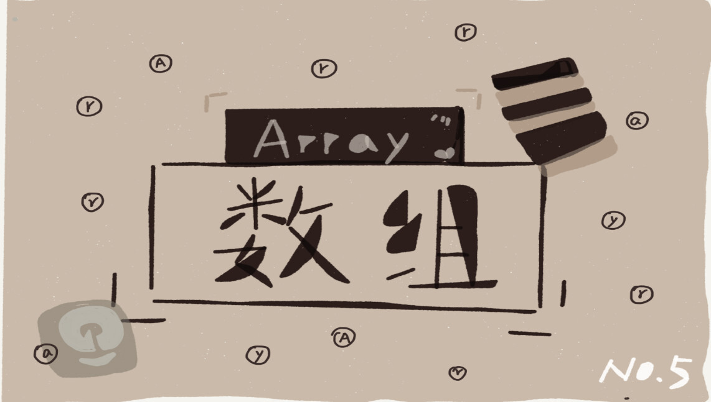

你好，我是悦创。

提到数组，我想你肯定不陌生，甚至还会自信地说，它很简单啊。

是的，在每一种编程语言中，基本都会有数组这种数据类型。不过，它不仅仅是一种编程语言中的数据类型，还是一种最基础的数据结构。尽管数组看起来非常基础、简单，但是我估计很多人都并没有理解这个基础数据结构的精髓。

在大部分编程语言中，数组都是从 0 开始编号的，但你是否下意识地想过，**为什么数组要从 0 开始编号，而不是从 1 开始呢？** 从 1 开始不是更符合人类的思维习惯吗？

你可以带着这个问题来学习接下来的内容。

## 1. 如何实现随机访问？

什么是数组？我估计你心中已经有了答案。不过，我还是想用专业的话来给你做下解释。**数组（Array）是一种线性表数据结构。它用一组连续的内存空间，来存储一组具有相同类型的数据。**

这个定义里有几个关键词，理解了这几个关键词，我想你就能彻底掌握数组的概念了。下面就从我的角度分别给你“点拨”一下。

第一是**线性表**（Linear List）。顾名思义，线性表就是数据排成像一条线一样的结构。每个线性表上的数据最多只有前和后两个方向。其实除了数组，链表、队列、栈等也是线性表结构。

欢迎关注我公众号：AI悦创，有更多更好玩的等你发现！

::: details 公众号：AI悦创【二维码】

:::

::: info AI悦创·编程一对一

AI悦创·推出辅导班啦，包括「Python 语言辅导班、C++ 辅导班、java 辅导班、算法/数据结构辅导班、少儿编程、pygame 游戏开发」，全部都是一对一教学：一对一辅导 + 一对一答疑 + 布置作业 + 项目实践等。当然，还有线下线上摄影课程、Photoshop、Premiere 一对一教学、QQ、微信在线，随时响应！微信：Jiabcdefh

C++ 信息奥赛题解，长期更新！长期招收一对一中小学信息奥赛集训，莆田、厦门地区有机会线下上门，其他地区线上。微信：Jiabcdefh

方法一：[QQ](http://wpa.qq.com/msgrd?v=3&uin=1432803776&site=qq&menu=yes)

方法二：微信：Jiabcdefh

:::

