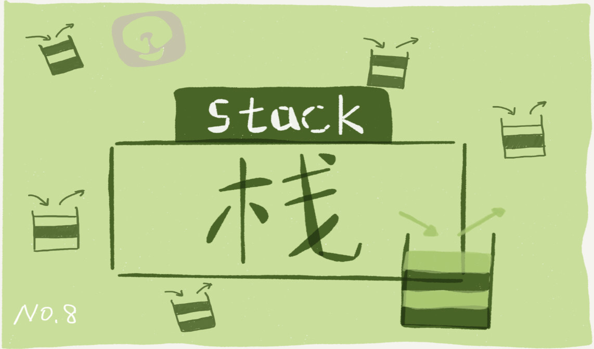
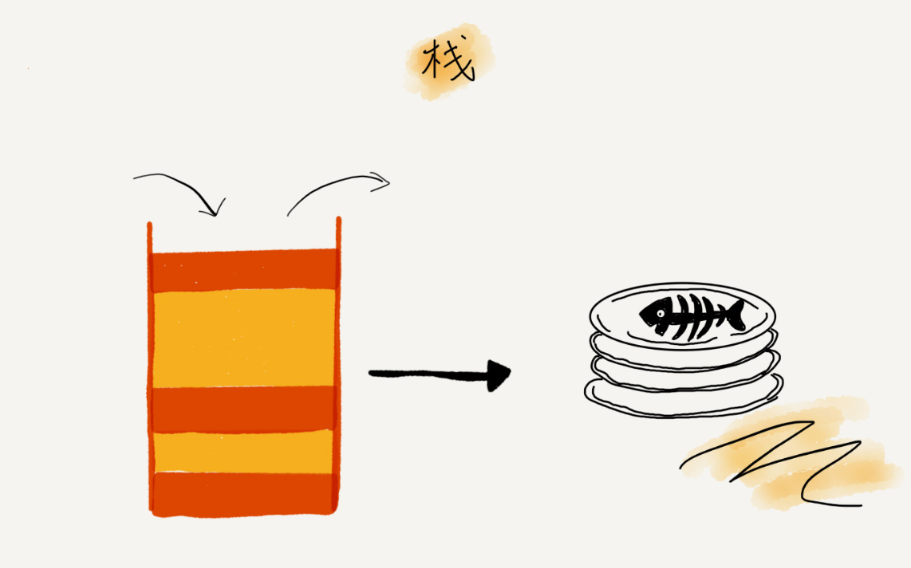
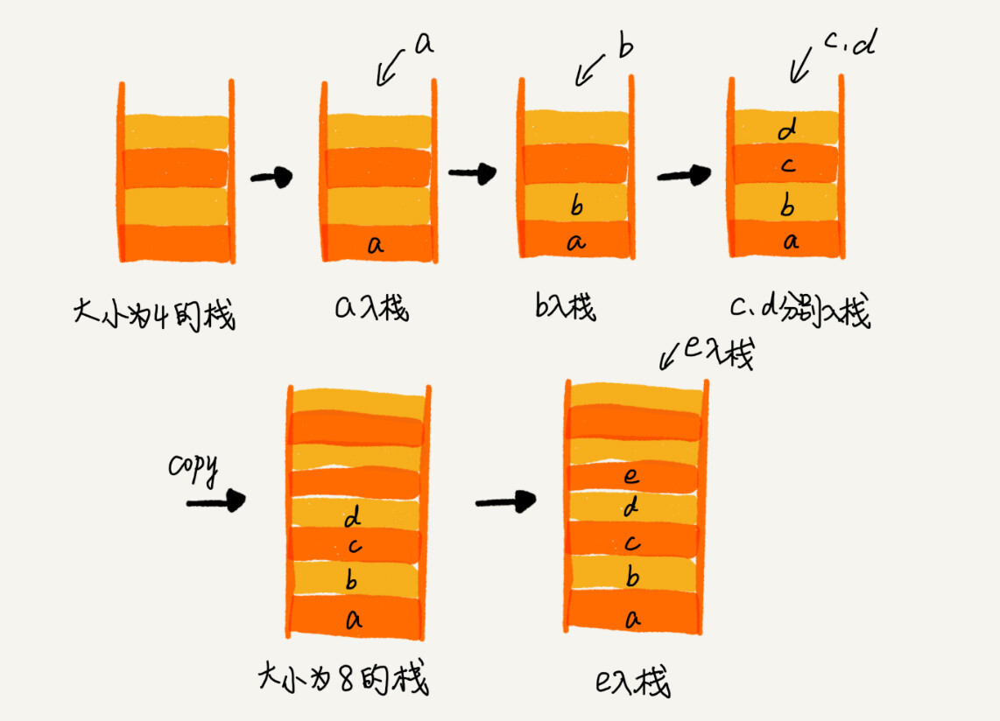
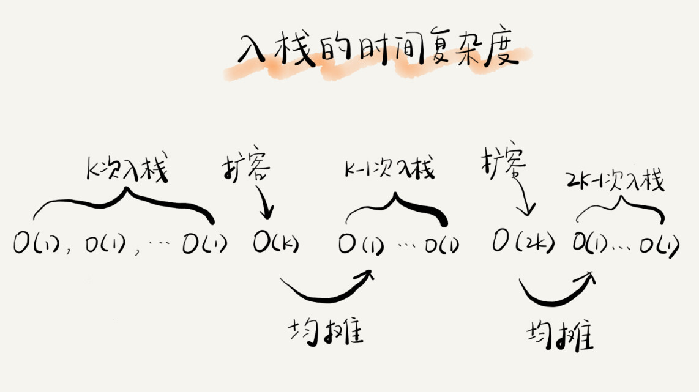
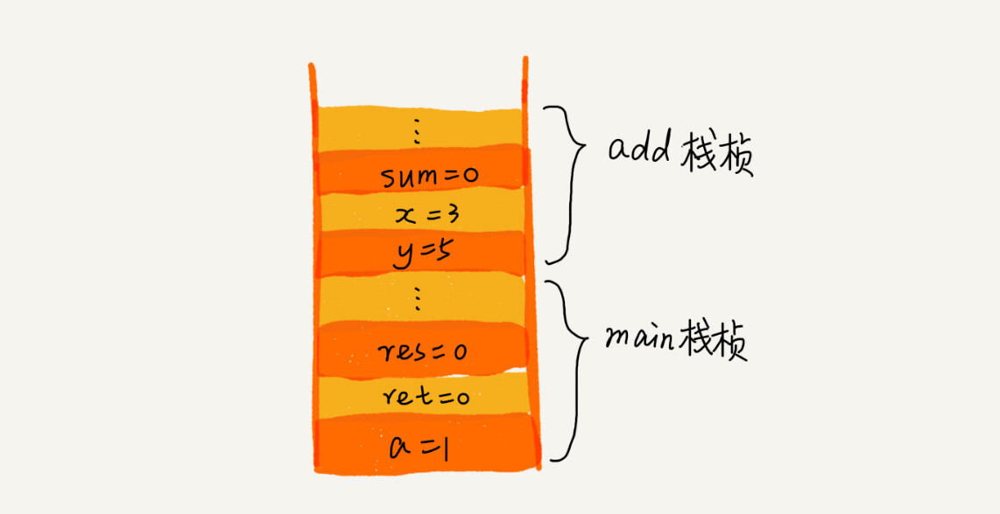
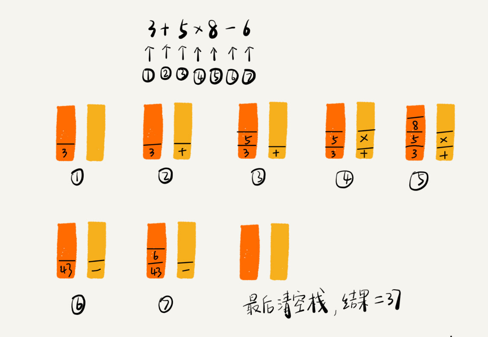
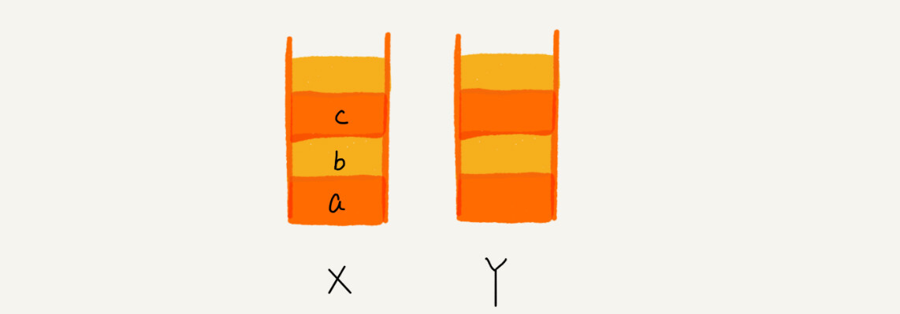

你好，我是悦创。

浏览器的前进、后退功能，我想你肯定很熟悉吧？

当你依次访问完一串页面 a-b-c 之后，点击浏览器的后退按钮，就可以查看之前浏览过的页面 b 和 a。当你后退到页面 a，点击前进按钮，就可以重新查看页面 b 和 c。但是，如果你后退到页面 b 后，点击了新的页面 d，那就无法再通过前进、后退功能查看页面 c 了。

**<span style="color:orange">假设你是 Chrome 浏览器的开发工程师，你会如何实现这个功能呢？</span>**

这就要用到我们今天要讲的“栈”这种数据结构。带着这个问题，我们来学习今天的内容。

## 1. 如何理解“栈”？

关于“栈”，我有一个非常贴切的例子，就是一摞叠在一起的盘子。我们平时放盘子的时候，都是从下往上一个一个放；取的时候，我们也是从上往下一个一个地依次取，不能从中间任意抽出。**后进者先出，先进者后出，这就是典型的“栈”结构。**



从栈的操作特性上来看，**栈是一种“操作受限”的线性表**，只允许在一端插入和删除数据。

我第一次接触这种数据结构的时候，就对它存在的意义产生了很大的疑惑。因为我觉得，相比数组和链表，栈带给我的只有限制，并没有任何优势。那我直接使用数组或者链表不就好了吗？为什么还要用这个“操作受限”的“栈”呢？

事实上，从功能上来说，数组或链表确实可以替代栈，但你要知道，特定的数据结构是对特定场景的抽象，而且，数组或链表暴露了太多的操作接口，操作上的确灵活自由，但使用时就比较不可控，自然也就更容易出错。

**当某个数据集合只涉及在一端插入和删除数据，并且满足后进先出、先进后出的特性，这时我们就应该首选“栈”这种数据结构。**

## 2. 如何实现一个“栈”？

从刚才栈的定义里，我们可以看出，栈主要包含两个操作，入栈和出栈，也就是在栈顶插入一个数据和从栈顶删除一个数据。理解了栈的定义之后，我们来看一看如何用代码实现一个栈。

实际上，栈既可以用数组来实现，也可以用链表来实现。用数组实现的栈，我们叫作**顺序栈**，用链表实现的栈，我们叫作**链式栈**。

我这里实现一个基于数组的顺序栈。基于链表实现的链式栈的代码，你可以自己试着写一下。我会将我写好的代码放到 GitHub 上，你可以去看一下自己写的是否正确。

我这段代码是用 Java 来实现的，但是不涉及任何高级语法，并且我还用中文做了详细的注释，所以你应该是可以看懂的。

::: tabs

@tab java1

原文代码：

```java
// 基于数组实现的顺序栈
public class ArrayStack {
    private String[] items;  // 数组
    private int count;       // 栈中元素个数
    private int n;           //栈的大小

  // 初始化数组，申请一个大小为n的数组空间
  public ArrayStack(int n) {
      this.items = new String[n];
      this.n = n;
      this.count = 0;
  }

  // 入栈操作
  public boolean push(String item) {
      // 数组空间不够了，直接返回false，入栈失败。
      if (count == n) return false;
      // 将 item 放到下标为 count 的位置，并且 count 加一
      items[count] = item;
      ++count;
      return true;
  }
  
  // 出栈操作
  public String pop() {
      // 栈为空，则直接返回 null
      if (count == 0) return null;
      // 返回下标为 count-1 的数组元素，并且栈中元素个数 count 减一
      String tmp = items[count-1];
      --count;
      return tmp;
  }
}
```

@tab java2

补充代码：

```java
public class StackExample {
    private final int[] data;  // 存储元素的数组
    private int top;     // 栈顶指针

    // 构造函数，初始化数组和栈顶指针
    public StackExample(int capacity) {
        data = new int[capacity];
        top = -1;  // top 初始值为 -1，表示 Stack 为空
    }

    // 判断 Stack 是否为空
    public boolean isEmpty() {
        return top == -1;
    }

    // 判断 Stack 是否已满
    public boolean isFull() {
        return top == data.length - 1;
    }

    // 将元素压入 Stack 中
    public void push(int item) {
        if (isFull()) {  // 如果 Stack 已满，抛出异常
            throw new RuntimeException("Stack is full");
        }
        data[++top] = item;  // 将元素压入 Stack 中，并更新栈顶指针
    }

    // 弹出栈顶元素
    public int pop() {
        if (isEmpty()) {  // 如果 Stack 为空，抛出异常
            throw new RuntimeException("Stack is empty");
        }
        return data[top--];  // 弹出栈顶元素，并更新栈顶指针
    }

    // 获取栈顶元素但不弹出
    public int peek() {
        if (isEmpty()) {  // 如果 Stack 为空，抛出异常
            throw new RuntimeException("Stack is empty");
        }
        return data[top];  // 获取栈顶元素
    }

    // 获取 Stack 的大小
    public int size() {
        return top + 1;  // 栈顶指针加一就是 Stack 的大小
    }
}
```

这个示例代码实现了一个 Stack，其中使用一个数组来存储元素，栈顶指针 `top` 初始值为 `-1`，表示 Stack 为空。以下是每个方法的详细注释：

- `public StackExample(int capacity)` 构造函数，初始化数组和栈顶指针。
- `public boolean isEmpty()` 判断 Stack 是否为空，如果栈顶指针 `top` 等于 `-1`，就表示 Stack 为空。
- `public boolean isFull()` 判断 Stack 是否已满，如果栈顶指针 `top` 等于数组长度减一，就表示 Stack 已满。
- `public void push(int item)` 将元素压入 Stack 中，首先判断 Stack 是否已满，如果已满就抛出异常，否则将元素存储到数组中，并将栈顶指针 `top` 加一。
- `public int pop()` 弹出栈顶元素，首先判断 Stack 是否为空，如果为空就抛出异常，否则将栈顶元素取出，并将栈顶指针 `top` 减一。
- `public int peek()` 获取栈顶元素但不弹出，首先判断 Stack 是否为空，如果为空就抛出异常，否则返回栈顶元素。
- `public int size()` 获取 Stack 的大小，栈顶指针加一就是 Stack 的大小

@tab Java 基础语法实现 Stack

```java
import java.util.EmptyStackException;

public class StackExample {
    private int[] stack; // 存储 Stack 元素的数组
    private int top; // Stack 栈顶元素的下标
    private int maxSize; // Stack 的最大大小

    // 构造函数，传入 Stack 的最大大小
    public StackExample(int maxSize) {
        this.maxSize = maxSize;
        this.stack = new int[maxSize];
        this.top = -1; // 初始化 Stack 为空
    }

    // 将元素压入 Stack 中
    public void push(int value) {
        // 判断 Stack 是否已满
        if (top == maxSize - 1) {
            throw new StackOverflowError();
        }
        stack[++top] = value; // 将元素压入 Stack
    }

    // 弹出 Stack 的栈顶元素，并返回该元素的值
    public int pop() {
        // 判断 Stack 是否为空
        if (isEmpty()) {
            throw new EmptyStackException();
        }
        return stack[top--]; // 弹出 Stack 的栈顶元素
    }

    // 返回 Stack 的栈顶元素的值
    public int peek() {
        // 判断 Stack 是否为空
        if (isEmpty()) {
            throw new EmptyStackException();
        }
        return stack[top]; // 返回 Stack 的栈顶元素
    }

    // 判断 Stack 是否为空
    public boolean isEmpty() {
        return top == -1;
    }

    // 返回 Stack 中元素的个数
    public int size() {
        return top + 1;
    }

    public static void main(String[] args) {
        StackExample stack = new StackExample(5); // 创建一个大小为 5 的 Stack

        stack.push(1); // 将元素 1 压入 Stack
        stack.push(2); // 将元素 2 压入 Stack
        stack.push(3); // 将元素 3 压入 Stack

        System.out.println(stack.peek()); // 输出 Stack 的栈顶元素，即元素 3

        System.out.println(stack.pop()); // 弹出栈顶元素并输出，即元素 3

        System.out.println(stack.isEmpty()); // 输出 Stack 是否为空，即 false

        System.out.println(stack.size()); // 输出 Stack 中元素的个数，即 2
    }
}
```

@tab Java 使用现成的 Stack

## 1. java.util.Stack

在 Java 中，可以使用 `java.util.Stack` 类来实现堆栈（stack）数据结构。以下是一个简单的示例代码：

```java
import java.util.Stack;

public class StackExample {
    public static void main(String[] args) {
        Stack<Integer> stack = new Stack<>();

        // 压入元素
        stack.push(1);
        stack.push(2);
        stack.push(3);

        // 弹出元素
        int top = stack.pop(); // top = 3

        // 获取栈顶元素
        int peek = stack.peek(); // peek = 2

        // 判断栈是否为空
        boolean isEmpty = stack.isEmpty(); // isEmpty = false

        // 获取栈的大小
        int size = stack.size(); // size = 2
    }
}
```

在这个示例代码中，我们首先创建了一个 `Stack` 类型的对象，然后使用 `push` 方法将元素依次压入栈中。接着使用 `pop` 方法弹出栈顶元素，并使用 `peek` 方法获取栈顶元素但不弹出，使用 `isEmpty` 方法判断栈是否为空，使用 `size` 方法获取栈的大小。

需要注意的是，在 Java 中，使用 `java.util.Deque` 接口的实现类 `ArrayDeque` 也可以用来实现堆栈。例如，可以使用 `ArrayDeque` 实现上面的示例代码：

```java
import java.util.ArrayDeque;
import java.util.Deque;

public class StackExample {
    public static void main(String[] args) {
        Deque<Integer> stack = new ArrayDeque<>();

        // 压入元素
        stack.push(1);
        stack.push(2);
        stack.push(3);

        // 弹出元素
        int top = stack.pop(); // top = 3

        // 获取栈顶元素
        int peek = stack.peek(); // peek = 2

        // 判断栈是否为空
        boolean isEmpty = stack.isEmpty(); // isEmpty = false

        // 获取栈的大小
        int size = stack.size(); // size = 2
    }
}
```

使用 `ArrayDeque` 的方式与使用 `Stack` 的方式类似，但 `ArrayDeque` 的性能更好，因为它是用数组实现的，而 `Stack` 是用向量实现的。

## 2. java.util.Stack 的用法

`java.util.Stack` 是 Java 提供的一个基于后进先出 (Last-In-First-Out, LIFO) 原则的数据结构，它继承自 Vector 类，并实现了 List 接口。除了 Vector 类中的方法外，Stack 类还提供了一些专门用于栈操作的方法，下面是 Stack 类的全部用法：

### 2.1 构造函数

- `Stack()`：创建一个空的 Stack。
- `Stack(Collection<? extends E> c)`：创建一个包含指定集合中所有元素的 Stack。

### 2.2 Stack 栈操作方法

- `boolean empty()`：判断 Stack 是否为空。
- `E peek()`：返回 Stack 的栈顶元素，但不弹出该元素。
- `E pop()`：弹出并返回 Stack 的栈顶元素。
- `E push(E item)`：将元素压入 Stack 中。
- `int search(Object o)`：返回 Stack 中指定元素从栈顶开始算的索引位置。如果元素不在 Stack 中，则返回 -1。

### 2.3 Vector 类中继承的方法

- `void addElement(E obj)`：将指定元素添加到 Stack 的末尾。
- `E elementAt(int index)`：返回 Stack 中指定索引位置的元素。
- `Enumeration<E> elements()`：返回 Stack 中的枚举类型。
- `void insertElementAt(E obj, int index)`：将指定元素插入到 Stack 的指定位置。
- `boolean removeElement(Object obj)`：从 Stack 中移除指定元素。
- `void setElementAt(E obj, int index)`：替换 Stack 中指定索引位置的元素。
- `void setSize(int newSize)`：更改 Stack 的大小。

需要注意的是，由于 Stack 类是 Vector 类的一个子类，因此它也继承了 Vector 类中的所有方法，但是推荐使用 Stack 类提供的专门用于栈操作的方法来实现栈的功能，以便使代码更加清晰易读。

### 2.4 如何清空 stack

要清空一个 Stack 对象，可以使用 Stack 类中的 `clear()` 方法，该方法会清空 Stack 中的所有元素。

示例代码：

```java
Stack<Integer> stack = new Stack<>();
stack.push(1);
stack.push(2);
stack.push(3);
System.out.println("清空前 Stack 的大小：" + stack.size()); // 输出：清空前 Stack 的大小：3
stack.clear();
System.out.println("清空后 Stack 的大小：" + stack.size()); // 输出：清空后 Stack 的大小：0
```

在上述示例代码中，首先创建了一个包含三个元素的 Stack 对象，然后调用了 `clear()` 方法清空 Stack 中的所有元素，最后输出 Stack 的大小，可以看到 Stack 中已经没有元素了。

### 2.5 empty() 与 isEmpty() 区别

在 Stack 类中，`empty()` 方法和 `isEmpty()` 方法是等价的，都是用来判断 Stack 是否为空的方法。

`empty()` 方法是 Stack 类中定义的方法，它继承自 Vector 类，其源码如下：

```java
public synchronized boolean empty() {
    return size() == 0;
}
```

而 `isEmpty()` 方法是 List 接口中定义的方法，Stack 类实现了 List 接口，因此也可以使用该方法判断 Stack 是否为空，其源码如下：

```java
public boolean isEmpty() {
    return size() == 0;
}
```

可以看到，`empty()` 方法和 `isEmpty() `方法的实现原理是一样的，都是通过判断 Stack 的大小是否为 0 来判断 Stack 是否为空，因此它们的功能是完全相同的，只是方法名称不同而已。

@tab Python

## 1. 基于列表实现 Stack

在 Python 中实现一个栈可以使用内置的列表（list）数据类型。列表可以被用作栈，它可以在末尾添加或删除元素，并可以方便地实现“后进先出”（LIFO）的数据结构。

最粗糙的实现：

```python
stack = []  # 创建一个空栈

# push操作（添加元素到栈顶）
stack.append(1)
stack.append(2)
stack.append(3)

# peek操作（查看栈顶元素）
print(stack[-1])  # 输出 3

# pop操作（删除并返回栈顶元素）
print(stack.pop())  # 输出 3
print(stack.pop())  # 输出 2

# 判断栈是否为空
if not stack:
    print("栈为空")
```

以下是一个使用 Python 类实现栈：

```python
class Stack:
    def __init__(self):
        self.items = []

    def push(self, item):
        self.items.append(item)

    def pop(self):
        return self.items.pop()

    def is_empty(self):
        return len(self.items) == 0

    def peek(self):
        return self.items[-1]

    def size(self):
        return len(self.items)
```

在这个实现中，`Stack` 类包含以下方法：

- `__init__()`：初始化一个空的栈。
- `push(item)`：将一个元素添加到栈的顶部。
- `pop()`：从栈的顶部删除并返回一个元素。
- `is_empty()`：检查栈是否为空。
- `peek()`：返回栈顶元素，但不删除它。
- `size()`：返回栈的大小。

例如，以下是如何使用这个栈实现：

```python
stack = Stack()
stack.push(1)
stack.push(2)
stack.push(3)
print(stack.peek()) # 输出 3
print(stack.pop()) # 输出 3
print(stack.pop()) # 输出 2
print(stack.size()) # 输出 1
print(stack.is_empty()) # 输出 False
```

在这个例子中，我们首先创建一个名为 `stack` 的新栈。然后我们用 `push()` 方法将3个元素添加到栈中。接着我们使用 `peek()` 方法查看栈顶元素，使用 `pop()` 方法弹出栈顶元素，并使用 `size()` 方法和 `is_empty()`方法检查栈的状态。

## 2. 使用链表实现 Stack

在Python中，我们可以使用链表（Linked List）来实现一个栈，链表是一种数据结构，由节点组成，每个节点包含了数据和指向下一个节点的指针，可以实现动态内存分配。

以下是一个使用链表实现栈的示例：

```python
class Node:
    def __init__(self, value=None):
        self.value = value
        self.next = None

class Stack:
    def __init__(self):
        self.head = None

    def push(self, value):
        new_node = Node(value)
        new_node.next = self.head
        self.head = new_node

    def pop(self):
        if not self.head:
            return None
        value = self.head.value
        self.head = self.head.next
        return value

    def peek(self):
        if not self.head:
            return None
        return self.head.value

    def is_empty(self):
        return self.head is None
```

在这个示例中，我们定义了一个`Node`类来表示链表中的节点，包含了一个`value`属性和一个`next`属性，表示指向下一个节点的指针。然后我们定义了一个`Stack`类来表示栈，包含了`head`属性，表示栈顶节点。

`push()`方法用于将一个元素压入栈中，创建一个新的节点，将它插入到链表的头部，并将它设置为新的栈顶节点。`pop()`方法用于从栈顶弹出一个元素，返回栈顶节点的`value`属性，并将栈顶指针指向下一个节点。`peek()`方法用于返回栈顶元素的值，但不删除它。`is_empty()`方法用于判断栈是否为空。

以下是如何使用这个栈实现：

```python
stack = Stack()
stack.push(1)
stack.push(2)
stack.push(3)
print(stack.peek()) # 输出 3
print(stack.pop()) # 输出 3
print(stack.pop()) # 输出 2
print(stack.is_empty()) # 输出 False
```

在这个例子中，我们首先创建一个名为`stack`的新栈。然后我们用`push()`方法将3个元素添加到栈中。接着我们使用`peek()`方法查看栈顶元素，使用`pop()`方法弹出栈顶元素，并使用`is_empty()`方法检查栈的状态。

:::

了解了定义和基本操作，那它的操作的时间、空间复杂度是多少呢？

不管是顺序栈还是链式栈，我们存储数据只需要一个大小为 n 的数组就够了。在入栈和出栈过程中，只需要一两个临时变量存储空间，所以空间复杂度是 O(1)。

注意，这里存储数据需要一个大小为 n 的数组，并不是说空间复杂度就是 O(n)。因为，这 n 个空间是必须的，无法省掉。所以我们说空间复杂度的时候，是指除了原本的数据存储空间外，算法运行还需要额外的存储空间。

空间复杂度分析是不是很简单？时间复杂度也不难。不管是顺序栈还是链式栈，入栈、出栈只涉及栈顶个别数据的操作，所以时间复杂度都是 O(1)。

## 3. 支持动态扩容的顺序栈

刚才那个基于数组实现的栈，是一个固定大小的栈，也就是说，在初始化栈时需要事先指定栈的大小。当栈满之后，就无法再往栈里添加数据了。尽管链式栈的大小不受限，但要存储 next 指针，内存消耗相对较多。那我们如何基于数组实现一个可以支持动态扩容的栈呢？

你还记得，我们在数组那一节，是如何来实现一个支持动态扩容的数组的吗？当数组空间不够时，我们就重新申请一块更大的内存，将原来数组中数据统统拷贝过去。这样就实现了一个支持动态扩容的数组。

所以，如果要实现一个支持动态扩容的栈，我们只需要底层依赖一个支持动态扩容的数组就可以了。当栈满了之后，我们就申请一个更大的数组，将原来的数据搬移到新数组中。我画了一张图，你可以对照着理解一下。



实际上，支持动态扩容的顺序栈，我们平时开发中并不常用到。我讲这一块的目的，主要还是希望带你练习一下前面讲的复杂度分析方法。所以这一小节的重点还是复杂度分析。

你不用死记硬背入栈、出栈的时间复杂度，你需要掌握的是分析方法。能够自己分析才算是真正掌握了。现在我就带你分析一下支持动态扩容的顺序栈的入栈、出栈操作的时间复杂度。

对于出栈操作来说，我们不会涉及内存的重新申请和数据的搬移，所以出栈的时间复杂度仍然是 O(1)。但是，对于入栈操作来说，情况就不一样了。当栈中有空闲空间时，入栈操作的时间复杂度为 O(1)。但当空间不够时，就需要重新申请内存和数据搬移，所以时间复杂度就变成了 O(n)。

也就是说，对于入栈操作来说，最好情况时间复杂度是 O(1)，最坏情况时间复杂度是 O(n)。那平均情况下的时间复杂度又是多少呢？还记得我们在复杂度分析那一节中讲的摊还分析法吗？这个入栈操作的平均情况下的时间复杂度可以用摊还分析法来分析。我们也正好借此来实战一下摊还分析法。

为了分析的方便，我们需要事先做一些假设和定义：

- 栈空间不够时，我们重新申请一个是原来大小两倍的数组；
- 为了简化分析，假设只有入栈操作没有出栈操作；
- 定义不涉及内存搬移的入栈操作为 `simple-push` 操作，时间复杂度为 O(1)。

如果当前栈大小为 K，并且已满，当再有新的数据要入栈时，就需要重新申请 2 倍大小的内存，并且做 K 个数据的搬移操作，然后再入栈。但是，接下来的 `K-1` 次入栈操作，我们都不需要再重新申请内存和搬移数据，所以这 `K-1` 次入栈操作都只需要一个 `simple-push` 操作就可以完成。为了让你更加直观地理解这个过程，我画了一张图。



你应该可以看出来，这 K 次入栈操作，总共涉及了 K 个数据的搬移，以及 K 次 `simple-push` 操作。将 K 个数据搬移均摊到 K 次入栈操作，那每个入栈操作只需要一个数据搬移和一个 `simple-push` 操作。以此类推，入栈操作的均摊时间复杂度就为 O(1)。

通过这个例子的实战分析，也印证了前面讲到的，均摊时间复杂度一般都等于最好情况时间复杂度。因为在大部分情况下，入栈操作的时间复杂度 O 都是 O(1)，只有在个别时刻才会退化为 O(n)，所以把耗时多的入栈操作的时间均摊到其他入栈操作上，平均情况下的耗时就接近 O(1)。

## 4. 栈在函数调用中的应用

前面我讲的都比较偏理论，我们现在来看下，栈在软件工程中的实际应用。栈作为一个比较基础的数据结构，应用场景还是蛮多的。其中，比较经典的一个应用场景就是**函数调用栈**。

我们知道，操作系统给每个线程分配了一块独立的内存空间，这块内存被组织成“栈”这种结构, 用来存储函数调用时的临时变量。每进入一个函数，就会将临时变量作为一个栈帧入栈，当被调用函数执行完成，返回之后，将这个函数对应的栈帧出栈。为了让你更好地理解，我们一块来看下这段代码的执行过程。

```C++
int main() {
    int a = 1; 
    int ret = 0;
    int res = 0;
    ret = add(3, 5);
    res = a + ret;
    printf("%d", res);
    reuturn 0;
}

int add(int x, int y) {
    int sum = 0;
    sum = x + y;
    return sum;
}
```

从代码中我们可以看出，`main()` 函数调用了 `add()` 函数，获取计算结果，并且与临时变量 a 相加，最后打印 res 的值。为了让你清晰地看到这个过程对应的函数栈里出栈、入栈的操作，我画了一张图。图中显示的是，在执行到 `add()` 函数时，函数调用栈的情况。



## 5. 栈在表达式求值中的应用

我们再来看栈的另一个常见的应用场景，编译器如何利用栈来实现**表达式求值**。

为了方便解释，我将算术表达式简化为只包含加减乘除四则运算，比如：`34 + 13 * 9 + 44 - 12 / 3`。对于这个四则运算，我们人脑可以很快求解出答案，但是对于计算机来说，理解这个表达式本身就是个挺难的事儿。如果换作你，让你来实现这样一个表达式求值的功能，你会怎么做呢？

实际上，编译器就是通过两个栈来实现的。其中一个保存操作数的栈，另一个是保存运算符的栈。我们从左向右遍历表达式，当遇到数字，我们就直接压入操作数栈；当遇到运算符，就与运算符栈的栈顶元素进行比较。

如果比运算符栈顶元素的优先级高，就将当前运算符压入栈；如果比运算符栈顶元素的优先级低或者相同，从运算符栈中取栈顶运算符，从操作数栈的栈顶取 2 个操作数，然后进行计算，再把计算完的结果压入操作数栈，继续比较。

我将 `3 + 5 * 8 - 6` 这个表达式的计算过程画成了一张图，你可以结合图来理解我刚讲的计算过程。



这样用两个栈来解决的思路是不是非常巧妙？你有没有想到呢？

## 6. 栈在括号匹配中的应用

除了用栈来实现表达式求值，我们还可以借助栈来检查表达式中的括号是否匹配。

我们同样简化一下背景。我们假设表达式中只包含三种括号，圆括号 `()`、方括号[]和花括号{}，并且它们可以任意嵌套。比如，`{[] ()[{}]}` 或 `[{()}([])] ` 等都为合法格式，而 `{[}()]` 或 `[({)]` 为不合法的格式。那我现在给你一个包含三种括号的表达式字符串，如何检查它是否合法呢？

这里也可以用栈来解决。我们用栈来保存未匹配的左括号，从左到右依次扫描字符串。当扫描到左括号时，则将其压入栈中；当扫描到右括号时，从栈顶取出一个左括号。如果能够匹配，比如“`(`”跟“`)`”匹配，“`[`”跟“`]`”匹配，“`{`”跟“`}`”匹配，则继续扫描剩下的字符串。如果扫描的过程中，遇到不能配对的右括号，或者栈中没有数据，则说明为非法格式。

当所有的括号都扫描完成之后，如果栈为空，则说明字符串为合法格式；否则，说明有未匹配的左括号，为非法格式。

## 7. 解答开篇

好了，我想现在你已经完全理解了栈的概念。我们再回来看看开篇的思考题，如何实现浏览器的前进、后退功能？其实，用两个栈就可以非常完美地解决这个问题。

我们使用两个栈，X 和 Y，我们把首次浏览的页面依次压入栈 X，当点击后退按钮时，再依次从栈 X 中出栈，并将出栈的数据依次放入栈 Y。当我们点击前进按钮时，我们依次从栈 Y 中取出数据，放入栈 X 中。当栈 X 中没有数据时，那就说明没有页面可以继续后退浏览了。当栈 Y 中没有数据，那就说明没有页面可以点击前进按钮浏览了。

比如你顺序查看了 a，b，c 三个页面，我们就依次把 a，b，c 压入栈，这个时候，两个栈的数据就是这个样子：



当你通过浏览器的后退按钮，从页面 c 后退到页面 a 之后，我们就依次把 c 和 b 从栈 X 中弹出，并且依次放入到栈 Y。这个时候，两个栈的数据就是这个样子：


这个时候你又想看页面 b，于是你又点击前进按钮回到 b 页面，我们就把 b 再从栈 Y 中出栈，放入栈 X 中。此时两个栈的数据是这个样子：


这个时候，你通过页面 b 又跳转到新的页面 d 了，页面 c 就无法再通过前进、后退按钮重复查看了，所以需要清空栈 Y。此时两个栈的数据这个样子：


## 8. 内容小结

我们来回顾一下今天讲的内容。栈是一种操作受限的数据结构，只支持入栈和出栈操作。后进先出是它最大的特点。栈既可以通过数组实现，也可以通过链表来实现。不管基于数组还是链表，入栈、出栈的时间复杂度都为 O(1)。除此之外，我们还讲了一种支持动态扩容的顺序栈，你需要重点掌握它的均摊时间复杂度分析方法。

## 9. 课后思考

1. 我们在讲栈的应用时，讲到用函数调用栈来保存临时变量，为什么函数调用要用“栈”来保存临时变量呢？用其他数据结构不行吗？
2. 我们都知道，JVM 内存管理中有个“堆栈”的概念。栈内存用来存储局部变量和方法调用，堆内存用来存储 Java 中的对象。那 JVM 里面的“栈”跟我们这里说的“栈”是不是一回事呢？如果不是，那它为什么又叫作“栈”呢？

欢迎留言和我分享，我会第一时间给你反馈。

## 10. 补充

内存中的堆栈和数据结构堆栈不是一个概念，可以说内存中的堆栈是真实存在的物理区，数据结构中的堆栈是抽象的数据存储结构。     

**内存空间在逻辑上分为三部分：**

- 代码区、静态数据区和动态数据区，动态数据区又分为栈区和堆区。 
- 代码区：存储方法体的二进制代码。高级调度（作业调度）、中级调度（内存调度）、低级调度（进程调度）控制代码区执行代码的切换。 
- 静态数据区：存储全局变量、静态变量、常量，常量包括 final 修饰的常量和 String 常量。系统自动分配和回收。
- 栈区：存储运行方法的形参、局部变量、返回值。由系统自动分配和回收。 
- 堆区：new 一个对象的引用或地址存储在栈区，指向该对象存储在堆区中的真实数据。

---

**为什么函数调用要用“栈”来保存临时变量呢？**

用其他数据结构不行吗？ 其实，我们不一定非要用栈来保存临时变量，只不过如果这个函数调用符合后进先出的特性，用栈这种数据结构来实现，是最顺理成章的选择。 从调用函数进入被调用函数，对于数据来说，变化的是什么呢？是作用域。所以根本上，只要能保证每进入一个新的函数，都是一个新的作用域就可以。而要实现这个，用栈就非常方便。在进入被调用函数的时候，分配一段栈空间给这个函数的变量，在函数结束的时候，将栈顶复位，正好回到调用函数的作用域内。

---

**为什么函数调用要用“栈”来保存临时变量呢？**

用其他数据结构不行吗？ 其实，我们不一定非要用栈来保存临时变量，只不过如果这个函数调用符合后进先出的特性，用栈这种数据结构来实现，是最顺理成章的选择。 从调用函数进入被调用函数，对于数据来说，变化的是什么呢？是作用域。所以根本上，只要能保证每进入一个新的函数，都是一个新的作用域就可以。而要实现这个，用栈就非常方便。在进入被调用函数的时候，分配一段栈空间给这个函数的变量，在函数结束的时候，将栈顶复位，正好回到调用函数的作用域内。

---

关于这个浏览器的前进和后退，老师您说的是用两个栈实现，其实开篇我已经想到，但是，我还有一个很不错的解决思路，对于内存消耗可能会高点，但是时间复杂度也很低，就是使用双向链表，用 pre 和 next 来实现前进和后退

---

**为什么内存中的“栈”也叫“栈”，而且英文都是 stack？** 

我认为，虽然内存中的栈和数据结构的栈不是一回事，即内存中的栈是一段虚拟的内存空间，数据结构中的栈是一种抽象的数据类型，但是它们都有“栈”的特性——后进先出，所以都叫“栈”也无可厚非。 

----- 还有，置顶留言中说，内存中的堆栈是真实存在的物理区，这个说法有点不精确，因为大部分人所说的，以及应用编程中所用到的内存，一般情况下指的都是虚拟内存空间，英文为：Virtual Memory，是物理内存的映射。

欢迎关注我公众号：AI悦创，有更多更好玩的等你发现！

::: details 公众号：AI悦创【二维码】


:::

::: info AI悦创·编程一对一

AI悦创·推出辅导班啦，包括「Python 语言辅导班、C++ 辅导班、java 辅导班、算法/数据结构辅导班、少儿编程、pygame 游戏开发」，全部都是一对一教学：一对一辅导 + 一对一答疑 + 布置作业 + 项目实践等。当然，还有线下线上摄影课程、Photoshop、Premiere 一对一教学、QQ、微信在线，随时响应！微信：Jiabcdefh

C++ 信息奥赛题解，长期更新！长期招收一对一中小学信息奥赛集训，莆田、厦门地区有机会线下上门，其他地区线上。微信：Jiabcdefh

方法一：[QQ](http://wpa.qq.com/msgrd?v=3&uin=1432803776&site=qq&menu=yes)

方法二：微信：Jiabcdefh

:::

