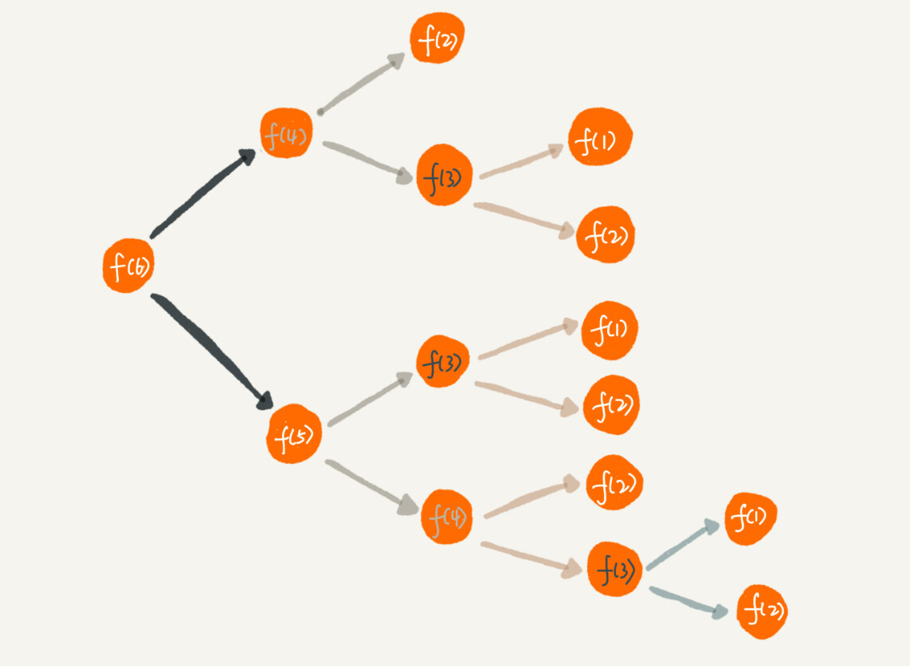

你好，我是悦创。

推荐注册返佣金的这个功能我想你应该不陌生吧？现在很多 App 都有这个功能。这个功能中，用户 A 推荐用户 B 来注册，用户 B 又推荐了用户 C 来注册。我们可以说，用户 C 的“最终推荐人”为用户 A，用户 B 的“最终推荐人”也为用户 A，而用户 A 没有“最终推荐人”。

一般来说，我们会通过数据库来记录这种推荐关系。在数据库表中，我们可以记录两行数据，其中 `actor_id` 表示用户 id，`referrer_id` 表示推荐人 id。


基于这个背景，我的问题是，**<span style="color:orange">给定一个用户 ID，如何查找这个用户的“最终推荐人”？ </span>** 带着这个问题，我们来学习今天的内容，递归（Recursion）！

## 1. 如何理解“递归”？

从我自己学习数据结构和算法的经历来看，我个人觉得，有两个最难理解的知识点，一个是**动态规划**，另一个就是**递归**。

递归是一种应用非常广泛的算法（或者编程技巧）。之后我们要讲的很多数据结构和算法的编码实现都要用到递归，比如 DFS 深度优先搜索、前中后序二叉树遍历等等。所以，搞懂递归非常重要，否则，后面复杂一些的数据结构和算法学起来就会比较吃力。

不过，别看我说了这么多，递归本身可是一点儿都不“高冷”，咱们生活中就有很多用到递归的例子。

**周末你带着女朋友去电影院看电影，女朋友问你，咱们现在坐在第几排啊？电影院里面太黑了，看不清，没法数，现在你怎么办？**

别忘了你是程序员，这个可难不倒你，递归就开始排上用场了。于是你就问前面一排的人他是第几排，你想只要在他的数字上加一，就知道自己在哪一排了。但是，前面的人也看不清啊，所以他也问他前面的人。就这样一排一排往前问，直到问到第一排的人，说我在第一排，然后再这样一排一排再把数字传回来。直到你前面的人告诉你他在哪一排，于是你就知道答案了。

这就是一个非常标准的递归求解问题的分解过程，去的过程叫“**递**”，回来的过程叫“**归**”。基本上，所有的递归问题都可以用递推公式来表示。刚刚这个生活中的例子，我们用递推公式将它表示出来就是这样的：

```tex
f(n) = f(n - 1) + 1 其中，f(1) = 1
```

`f(n)` 表示你想知道自己在哪一排，`f(n - 1)` 表示前面一排所在的排数，`f(1) = 1` 表示第一排的人知道自己在第一排。有了这个递推公式，我们就可以很轻松地将它改为递归代码，如下：

```java
int f(int n) {
    if (n == 1) return 1;
    return f(n-1) + 1;
}
```

## 2. 递归需要满足的三个条件

刚刚这个例子是非常典型的递归，那究竟什么样的问题可以用递归来解决呢？我总结了三个条件，只要同时满足以下三个条件，就可以用递归来解决。

### 2.1 一个问题的解可以分解为几个子问题的解

**何为子问题？**

子问题就是数据规模更小的问题。

比如，前面讲的电影院的例子，你要知道，“**自己在哪一排**”的问题，可以分解为“**前一排的人在哪一排**”这样一个子问题。

### 2.2 这个问题与分解之后的子问题，除了数据规模不同，求解思路完全一样

比如电影院那个例子，**<span style="color: orange">你求解“自己在哪一排”的思路，和前面一排人求解“自己在哪一排”的思路，是一模一样的。</span>**

### 2.3 存在递归终止条件

把问题分解为子问题，把子问题再分解为子子问题，一层一层分解下去，不能存在无限循环，这就需要有终止条件。

还是电影院的例子，第一排的人不需要再继续询问任何人，就知道自己在哪一排，也就是 `f(1) = 1`，这就是递归的终止条件。

## 3. 如何编写递归代码？

刚刚铺垫了这么多，现在我们来看，如何来写递归代码？我个人觉得，写递归代码最关键的是写出递推公式，找到终止条件，剩下将递推公式转化为代码就很简单了。

你先记住这个理论。我举一个例子，带你一步一步实现一个递归代码，帮你理解。

::: info 问题

**假如这里有 n 个台阶，每次你可以跨 1 个台阶或者 2 个台阶，请问走这 n 个台阶有多少种走法？**

:::

::: tip 思路

如果有 7 个台阶，你可以 2，2，2，1 这样子上去，也可以 1，2，1，1，2 这样子上去，总之走法有很多，那如何用编程求得总共有多少种走法呢？

:::

我们仔细想下，实际上，可以根据第一步的走法把所有走法分为两类，第一类是第一步走了 1 个台阶，另一类是第一步走了 2 个台阶。所以 n 个台阶的走法就等于先走 1 阶后，`n-1` 个台阶的走法 加上先走 2 阶后，`n-2` 个台阶的走法。用公式表示就是：

```tex
f(n) = f(n - 1) + f(n - 2)
```

有了递推公式，递归代码基本上就完成了一半。我们再来看下终止条件。当有一个台阶时，我们不需要再继续递归，就只有一种走法。所以 `f(1) = 1`。这个递归终止条件足够吗？我们可以用 `n = 2`，`n = 3` 这样比较小的数试验一下。

`n = 2` 时，`f(2) = f(1) + f(0)`。如果递归终止条件只有一个 `f(1) = 1`，那 `f(2)` 就无法求解了。所以除了 `f(1) = 1` 这一个递归终止条件外，还要有 `f(0) = 1`，表示走 0 个台阶有一种走法，不过这样子看起来就不符合正常的逻辑思维了。所以，我们可以把 `f(2) = 2` 作为一种终止条件，表示走 2 个台阶，有两种走法，一步走完或者分两步来走。

所以，递归终止条件就是 `f(1) = 1`，`f(2) = 2`。这个时候，你可以再拿 `n = 3`，`n = 4` 来验证一下，这个终止条件是否足够并且正确。

我们把递归终止条件和刚刚得到的递推公式放到一起就是这样的：

```tex
f(1) = 1;
f(2) = 2;
f(n) = f(n - 1) + f(n - 2)
```

有了这个公式，我们转化成递归代码就简单多了。最终的递归代码是这样的：

```java
int f(int n) {
    if (n == 1) return 1; 
    if (n == 2) return 2; 
    return f(n-1) + f(n-2);
}
```

我总结一下，**<span style="color: orange">写递归代码的关键就是找到如何将大问题分解为小问题的规律，并且基于此写出递推公式，然后再推敲终止条件，最后将递推公式和终止条件翻译成代码。</span>**

虽然我讲了这么多方法，但是作为初学者的你，现在是不是还是有种想不太清楚的感觉呢？实际上，我刚学递归的时候，也有这种感觉，这也是文章开头我说递归代码比较难理解的地方。

刚讲的电影院的例子，我们的递归调用只有一个分支，也就是说“一个问题只需要分解为一个子问题”，我们很容易能够想清楚“递”和“归”的每一个步骤，所以写起来、理解起来都不难。

但是，当我们面对的是一个问题要分解为多个子问题的情况，递归代码就没那么好理解了。

像我刚刚讲的第二个例子，人脑几乎没办法把整个“递”和“归”的过程一步一步都想清楚。

计算机擅长做重复的事情，所以递归正合它的胃口。而我们人脑更喜欢平铺直叙的思维方式。当我们看到递归时，我们总想把递归平铺展开，脑子里就会循环，一层一层往下调，然后再一层一层返回，试图想搞清楚计算机每一步都是怎么执行的，这样就很容易被绕进去。

对于递归代码，这种试图想清楚整个递和归过程的做法，实际上是进入了一个思维误区。很多时候，我们理解起来比较吃力，主要原因就是自己给自己制造了这种理解障碍。那正确的思维方式应该是怎样的呢？

如果一个问题 A 可以分解为若干子问题 B、C、D，你可以假设子问题 B、C、D 已经解决，在此基础上思考如何解决问题 A。而且，你只需要思考问题 A 与子问题 B、C、D 两层之间的关系即可，不需要一层一层往下思考子问题与子子问题，子子问题与子子子问题之间的关系。屏蔽掉递归细节，这样子理解起来就简单多了。

因此，**编写递归代码的关键是，只要遇到递归，我们就把它抽象成一个递推公式，不用想一层层的调用关系，不要试图用人脑去分解递归的每个步骤。**

## 4. 递归代码要警惕堆栈溢出

在实际的软件开发中，编写递归代码时，我们会遇到很多问题，比如堆栈溢出。而堆栈溢出会造成系统性崩溃，后果会非常严重。为什么递归代码容易造成堆栈溢出呢？我们又该如何预防堆栈溢出呢？

我在“栈”那一节讲过，函数调用会使用栈来保存临时变量。每调用一个函数，都会将临时变量封装为栈帧压入内存栈，等函数执行完成返回时，才出栈。系统栈或者虚拟机栈空间一般都不大。如果递归求解的数据规模很大，调用层次很深，一直压入栈，就会有堆栈溢出的风险。

比如前面的讲到的电影院的例子，如果我们将系统栈或者 JVM 堆栈大小设置为 1KB，在求解 f(19999) 时便会出现如下堆栈报错：

```java
Exception in thread "main" java.lang.StackOverflowError
```

那么，如何避免出现堆栈溢出呢？

我们可以通过在代码中限制递归调用的最大深度的方式来解决这个问题。递归调用超过一定深度（比如 1000）之后，我们就不继续往下再递归了，直接返回报错。还是电影院那个例子，我们可以改造成下面这样子，就可以避免堆栈溢出了。不过，我写的代码是伪代码，为了代码简洁，有些边界条件没有考虑，比如 `x<=0`。

```java
// 全局变量，表示递归的深度。
int depth = 0;

int f(int n) {
    ++depth;
    if (depth > 1000) throw exception;
    
    if (n == 1) return 1;
    return f(n-1) + 1;
}
```

但这种做法并不能完全解决问题，因为最大允许的递归深度跟当前线程剩余的栈空间大小有关，事先无法计算。如果实时计算，代码过于复杂，就会影响代码的可读性。所以，如果最大深度比较小，比如 10、50，就可以用这种方法，否则这种方法并不是很实用。

## 5. 递归代码要警惕重复计算

除此之外，使用递归时还会出现重复计算的问题。刚才我讲的第二个递归代码的例子，如果我们把整个递归过程分解一下的话，那就是这样的：



从图中，我们可以直观地看到，想要计算 `f(5)`，需要先计算 `f(4)` 和 `f(3)`，而计算 `f(4)` 还需要计算 `f(3)`，因此，`f(3)` 就被计算了很多次，这就是重复计算问题。

为了避免重复计算，我们可以通过一个数据结构（比如散列表）来保存已经求解过的 `f(k)`。当递归调用到 `f(k)` 时，先看下是否已经求解过了。如果是，则直接从散列表中取值返回，不需要重复计算，这样就能避免刚讲的问题了。

按照上面的思路，我们来改造一下刚才的代码：

```java
public int f(int n) {
    if (n == 1) return 1;
    if (n == 2) return 2;
    
    // hasSolvedList 可以理解成一个 Map，key 是 n，value 是 f(n)
    if (hasSolvedList.containsKey(n)) {
        return hasSolvedList.get(n);
    }
    
    int ret = f(n - 1) + f(n - 2);
    hasSolvedList.put(n, ret);
    return ret;
}
```

除了堆栈溢出、重复计算这两个常见的问题。递归代码还有很多别的问题。

在时间效率上，递归代码里多了很多函数调用，当这些函数调用的数量较大时，就会积聚成一个可观的时间成本。在空间复杂度上，因为递归调用一次就会在内存栈中保存一次现场数据，所以在分析递归代码空间复杂度时，需要额外考虑这部分的开销，比如我们前面讲到的电影院递归代码，空间复杂度并不是 `O(1)`，而是 `O(n)`。

## 6. 怎么将递归代码改写为非递归代码？

我们刚说了，递归有利有弊，利是递归代码的表达力很强，写起来非常简洁；而弊就是空间复杂度高、有堆栈溢出的风险、存在重复计算、过多的函数调用会耗时较多等问题。所以，在开发过程中，我们要根据实际情况来选择是否需要用递归的方式来实现。

那我们是否可以把递归代码改写为非递归代码呢？比如刚才那个电影院的例子，我们抛开场景，只看 `f(x) = f(x - 1) + 1` 这个递推公式。我们这样改写看看：

```java
int f(int n) {
    int ret = 1;
    for (int i = 2; i <= n; ++i) {
        ret = ret + 1;
    }
    return ret;
}
```

同样，第二个例子也可以改为非递归的实现方式。

```java
int f(int n) {
    if (n == 1) return 1;
    if (n == 2) return 2;
    
    int ret = 0;
    int pre = 2;
    int prepre = 1;
    for (int i = 3; i <= n; ++i) {
        ret = pre + prepre;
        prepre = pre;
        pre = ret;
    }
    return ret;
}
```

那是不是所有的递归代码都可以改为这种**迭代循环**的非递归写法呢？

笼统地讲，是的。因为递归本身就是借助栈来实现的，只不过我们使用的栈是系统或者虚拟机本身提供的，我们没有感知罢了。如果我们自己在内存堆上实现栈，手动模拟入栈、出栈过程，这样任何递归代码都可以改写成看上去不是递归代码的样子。

但是这种思路实际上是将递归改为了“手动”递归，本质并没有变，而且也并没有解决前面讲到的某些问题，徒增了实现的复杂度。

## 7. 解答开篇

到此为止，递归相关的基础知识已经讲完了，咱们来看一下开篇的问题：如何找到“最终推荐人”？我的解决方案是这样的：

```java
long findRootReferrerId(long actorId) {
    Long referrerId = select referrer_id from [table] where actor_id = actorId;
    if (referrerId == null) return actorId;
    return findRootReferrerId(referrerId);
}
```

是不是非常简洁？用三行代码就能搞定了，不过在实际项目中，上面的代码并不能工作，为什么呢？这里面有两个问题。

第一，如果递归很深，可能会有堆栈溢出的问题。

第二，如果数据库里存在脏数据，我们还需要处理由此产生的无限递归问题。比如 demo 环境下数据库中，测试工程师为了方便测试，会人为地插入一些数据，就会出现脏数据。如果 A 的推荐人是 B，B 的推荐人是 C，C 的推荐人是 A，这样就会发生死循环。

第一个问题，我前面已经解答过了，可以用限制递归深度来解决。第二个问题，也可以用限制递归深度来解决。不过，还有一个更高级的处理方法，就是自动检测 A-B-C-A 这种“环”的存在。如何来检测环的存在呢？这个我暂时不细说，你可以自己思考下，后面的章节我们还会讲。

## 8. 内容小结

关于递归的知识，到这里就算全部讲完了。我来总结一下。

递归是一种非常高效、简洁的编码技巧。只要是满足“三个条件”的问题就可以通过递归代码来解决。

不过递归代码也比较难写、难理解。编写递归代码的关键就是不要把自己绕进去，正确姿势是写出递推公式，找出终止条件，然后再翻译成递归代码。

递归代码虽然简洁高效，但是，递归代码也有很多弊端。比如，堆栈溢出、重复计算、函数调用耗时多、空间复杂度高等，所以，在编写递归代码的时候，一定要控制好这些副作用。

## 9. 课后思考

我们平时调试代码喜欢使用 IDE 的单步跟踪功能，像规模比较大、递归层次很深的递归代码，几乎无法使用这种调试方式。对于递归代码，你有什么好的调试方法呢？

欢迎留言和我分享，我会第一时间给你反馈。

## 10. 补充

以免有人对爬楼梯的公式有疑惑，我还是把这个公式的解释写出来。

假设走到第 n 个台阶的方法数为 `f(n)`，则有递推公式：

`f(n) = f(n - 1) + f(n - 2)`

这个递推公式的意义是，走到第 n 个台阶的方法数等于走到第 `n-1 `个台阶的方法数加上走到第 `n-2` 个台阶的方法数。因为每次只能跨 1 个或 2 个台阶，所以要走到第 n 个台阶，必须先走到第 `n-1` 或第 `n-2` 个台阶，然后再跨 1 个或 2 个台阶。

另外，当 `n = 1` 或 `n = 2` 时，走法分别为 1 和 2 种，因此可以将递推公式作为边界条件：

- `f(1) = 1`

- `f(2) = 2`

这个边界条件的意义是，当只有一个台阶时，只有 1 种走法；当有两个台阶时，有 2 种走法。

综上所述，求解走 n 个台阶的方法数，可以使用递推公式 `f(n) = f(n - 1) + f(n - 2)`，并将 `f(1)` 和 `f(2)` 作为边界条件。

::: tabs

@tab Python

## 1. 动态规划实现

要计算有多少种走法，我们可以使用动态规划 (Dynamic Programming) 的方法。这里是一个使用 Python 编写的简单程序来计算有 n 个台阶时有多少种走法：

```python
"""
假设有 n 个台阶，走到第 n 个台阶有两种方法：

从第 n-1 个台阶跨 1 个台阶到达第 n 个台阶；
从第 n-2 个台阶跨 2 个台阶到达第 n 个台阶。
因此，走到第 n 个台阶的方法数等于走到第 n-1 个台阶的方法数加上走到第 n-2 个台阶的方法数。

设走到第 n 个台阶的方法数为 f(n)，则有递推公式：

f(n) = f(n-1) + f(n-2)

同时需要注意的是，当 n=1 或 n=2 时，走法分别为 1 和 2 种，因此可以将递推公式作为边界条件：

f(1) = 1
f(2) = 2

因此，可以使用动态规划的方法求解，代码如下：
"""
def count_ways(n):
    if n <= 0:
        return 0
    if n == 1:
        return 1
    if n == 2:
        return 2

    dp = [0] * (n + 1)
    dp[1] = 1
    dp[2] = 2

    for i in range(3, n + 1):
        dp[i] = dp[i - 1] + dp[i - 2]

    return dp[n]

n = 10  # 可以改成任意正整数来计算有多少种走法
print("走", n, "个台阶有", count_ways(n), "种走法")
```

在这个程序中，我们定义了一个函数 `count_ways` 来计算有多少种走法。函数使用动态规划的方法，先初始化一个长度为 `n+1` 的数组 `dp`，其中 `dp[i]` 表示走 i 个台阶有多少种走法。然后通过迭代计算 `dp[i] = dp[i - 1] + dp[i - 2]` 来求解走 n 个台阶的走法数。最后返回 `dp[n]` 即可。

---

您也可以使用递归实现这个问题。这是一个使用递归的 Python 程序来计算有 n 个台阶时有多少种走法：

```python
def count_ways_recursive(n):
    if n <= 0:
        return 0
    if n == 1:
        return 1
    if n == 2:
        return 2

    return count_ways_recursive(n - 1) + count_ways_recursive(n - 2)

n = 10  # 可以改成任意正整数来计算有多少种走法
print("走", n, "个台阶有", count_ways_recursive(n), "种走法")
```

请注意，递归方法在较大的 n 值时可能会变得非常慢，因为它会重复计算许多相同的子问题。为了优化性能，您可以使用备忘录 (Memoization) 技术来存储已经计算过的子问题的结果。下面是一个使用备忘录的递归实现：

```python
def count_ways_memo(n, memo=None):
    if memo is None:
        memo = {}

    if n <= 0:
        return 0
    if n == 1:
        return 1
    if n == 2:
        return 2

    if n not in memo:
        memo[n] = count_ways_memo(n - 1, memo) + count_ways_memo(n - 2, memo)

    return memo[n]

n = 10  # 可以改成任意正整数来计算有多少种走法
print("走", n, "个台阶有", count_ways_memo(n), "种走法")
```

```python
# 定义一个带备忘录的递归函数，计算 n 个台阶有多少种走法
def count_ways_memo(n, memo=None):
    # 如果 memo 为空，初始化为一个空字典
    if memo is None:
        memo = {}

    # 处理边界情况：台阶数小于等于 0
    if n <= 0:
        return 0
    # 处理基本情况：台阶数为 1，只有 1 种走法
    if n == 1:
        return 1
    # 处理基本情况：台阶数为 2，有 2 种走法
    if n == 2:
        return 2

    # 如果 n 不在备忘录中，说明这个子问题还没有被计算过
    if n not in memo:
        # 递归计算走 n-1 个台阶和 n-2 个台阶的走法数，并将结果相加
        memo[n] = count_ways_memo(n - 1, memo) + count_ways_memo(n - 2, memo)

    # 从备忘录中返回已经计算好的走 n 个台阶的走法数
    return memo[n]

# 示例：计算有 n 个台阶的走法数
n = 10  # 可以改成任意正整数来计算有多少种走法
print("走", n, "个台阶有", count_ways_memo(n), "种走法")
```

代码的主要部分是一个名为 `count_ways_memo` 的函数，它接受两个参数：`n` 表示台阶数，`memo` 是一个字典，用于存储已经计算过的子问题的结果。在函数开始时，如果 `memo` 为空，将其初始化为一个空字典。

接下来，函数处理一些基本情况。如果 `n` 小于等于 0，返回 0 表示没有走法；如果 `n` 等于 1，返回 1 表示有 1 种走法；如果 `n` 等于 2，返回 2 表示有 2 种走法。

然后，如果 `n` 不在 `memo` 中，说明这个子问题还没有被计算过。此时，函数通过递归调用自身来计算走 `n-1` 个台阶和 `n-2` 个台阶的走法数，并将结果相加。计算结果会被存储在 `memo` 字典中，以便后续使用。

最后，函数从备忘录中返回已经计算好的走 `n` 个台阶的走法数。在主程序部分，我们调用 `count_ways_memo` 函数来计算有 `n` 个台阶的几种走法。

@tab Java 动态规划

```java
public class Solution {
    public int climbStairs(int n) {
        if (n == 1) {
            return 1;
        }
        if (n == 2) {
            return 2;
        }
        // 初始化递推数组
        int[] dp = new int[n + 1];
        dp[1] = 1;
        dp[2] = 2;
        // 递推求解
        for (int i = 3; i <= n; i++) {
            dp[i] = dp[i - 1] + dp[i - 2];
        }
        // 返回结果
        return dp[n];
    }
}

/*
代码注释：

第 2-6 行，定义了一个名为 Solution 的类，包含了一个名为 climbStairs 的方法，接受一个整数 n 作为参数，返回一个整数类型的结果。
第 7 行，判断当 n=1 时，只有 1 种走法，直接返回 1。
第 8 行，判断当 n=2 时，有 2 种走法，直接返回 2。
第 11 行，初始化一个长度为 n+1 的递推数组 dp，dp[i] 表示走到第 i 个台阶的方法数。
第 12-13 行，初始化 dp[1] 和 dp[2]。
第 16-18 行，使用循环递推 dp 数组，从 i=3 开始循环到 n，根据递推公式 dp[i] = dp[i-1] + dp[i-2] 计算 dp[i] 的值。
第 21 行，返回 dp[n] 作为结果。
时间复杂度：循环求解 dp 数组的时间复杂度为 O(n)，因此总的时间复杂度为 O(n)。

空间复杂度：需要使用一个长度为 n+1 的递推数组 dp，因此空间复杂度为 O(n)。
*/
```

:::

## 11. 习题

### 1. 递归实现 n 的阶乘

:::: tabs

@tab Java

## 1. 递归

```java
public class Main {
    public static void main(String[] args) {
        int n = 5; // 要计算阶乘的整数 n
        int result = factorial(n); // 调用递归函数计算阶乘
        System.out.println(n + "! = " + result); // 输出结果
    }

    public static int factorial(int n) {
        if (n == 0) { // 0的阶乘为1
            return 1;
        } else {
            return n * factorial(n - 1); // 递归调用自身
        }
    }
}
```

在这个程序中，我们定义了一个名为 factorial 的递归函数，它接受一个整数 n 作为参数，并返回 n 的阶乘。如果 n 为 0，则阶乘为 1，因此递归函数返回1。否则，递归函数返回 n 乘以 `factorial(n-1)` 的结果，即 n 乘以 `(n-1)` 的阶乘。在程序的主函数中，我们调用 factorial 函数来计算阶乘并输出结果。

这个程序将输出：

```java
5! = 120
```

你可以将代码中的 5 替换为你想要计算阶乘的整数 n 的值。需要注意的是，递归函数可能会导致堆栈溢出，因此对于较大的 n，使用循环语句可能更好。

## 2. for-loop

```java
public class Main {
    public static void main(String[] args) {
        int n = 5; // 要计算阶乘的整数 n
        int result = 1; // 用于存储阶乘的结果
        for (int i = 1; i <= n; i++) {
            result *= i;
        }
        System.out.println(n + "! = " + result); // 输出结果
    }
}
```

## 3. while-loop

```java
public class Factorial {
    public static int factorial(int n) {
        int result = 1;
        while (n > 0) {
            result *= n;
            n--;
        }
        return result;
    }

    public static void main(String[] args) {
        int n = 5; // 要计算阶乘的整数 n
        int result = factorial(n);
        System.out.println(n + "! = " + result);
    }
}
```

在这个程序中，我们定义了一个名为 factorial 的静态方法，它接受一个整数 n 作为参数，并返回 n 的阶乘。我们使用 while 循环，每次将n乘以当前值，并将 n 减 1，直到 n 减小到 1 为止。最后，我们在主方法中调用 factorial 方法来计算阶乘，并使用 `System.out.println` 方法输出结果。

你可以将代码中的 5 替换为你想要计算阶乘的整数 n 的值。需要注意的是，Java 中的整数有一个最大值限制，因此如果计算的阶乘超过了这个最大值，程序可能会出现错误。为了避免这种情况，你可以使用 BigInteger 类来计算更大的整数阶乘。

## 4. BigInteger

在 Java 中，如果要计算非常大的整数阶乘，可以使用 BigInteger 类。BigInteger 类可以存储任意大的整数，并且提供了许多用于执行算术操作的方法。以下是一个使用 BigInteger 类计算 n 的阶乘的 Java 程序：

```java
import java.math.BigInteger;

public class Factorial {
    public static BigInteger factorial(int n) {
        BigInteger result = BigInteger.ONE;
        for (int i = 2; i <= n; i++) {
            result = result.multiply(BigInteger.valueOf(i));
        }
        return result;
    }

    public static void main(String[] args) {
        int n = 100; // 要计算阶乘的整数 n
        BigInteger result = factorial(n);
        System.out.println(n + "! = " + result);
    }
}
```

在这个程序中，我们使用 `BigInteger.ONE` 初始化一个 BigInteger 对象 result，然后使用 for 循环遍历从 2 到 n 的整数，每次将当前整数乘以 result，并将结果赋值给 result。最后，我们在主方法中调用 factorial 方法来计算阶乘，并使用 `System.out.println` 方法输出结果。

> 你可以将代码中的 n 替换为你想要计算阶乘的整数 n 的值。由于 BigInteger 对象的计算速度较慢，因此计算大型整数阶乘可能需要更长时间。

@tab Python

## 1. 递归

```python
def factorial(n):
    if n == 0:
        return 1
    else:
        return n * factorial(n - 1)

n = 5 # 要计算阶乘的整数 n
result = factorial(n)
print(n, "! =", result)
```

在这个程序中，我们定义了一个名为 `factorial` 的递归函数，它接受一个整数 n 作为参数，并返回 n 的阶乘。如果 n 为 0，则阶乘为 1，因此递归函数返回 1。否则，递归函数返回 n 乘以 `factorial(n-1)` 的结果，即 n 乘以 `(n-1)` 的阶乘。

在程序的主函数中，我们调用 factorial 函数来计算阶乘，并使用 print 函数输出结果。

这个程序将输出：

```python
5 ! = 120
```

你可以将代码中的 5 替换为你想要计算阶乘的整数 n 的值。需要注意的是，递归函数可能会导致堆栈溢出，因此对于较大的 n，使用循环语句可能更好。

以下是一个 Python 程序，使用循环实现计算 n 的阶乘：

## 2. for-loop

```python
def factorial(n):
    result = 1
    for i in range(1, n+1):
        result *= i
    return result

n = 5 # 要计算阶乘的整数n
result = factorial(n)
print(n, "! =", result)
```

在这个程序中，我们使用 for 循环从 1 到 n 遍历，每次乘以当前的循环计数器i，将结果存储在变量 result 中。最后，我们使用 print 函数输出结果。

你可以将代码中的 5 替换为你想要计算阶乘的整数 n 的值。这种方法不使用递归，因此在计算较大的 n 时可以避免堆栈溢出的问题。

## 3. while-loop

```python
def factorial(n):
    result = 1
    while n > 0:
        result *= n
        n -= 1
    return result

n = 5 # 要计算阶乘的整数 n
result = factorial(n)
print(n, "! =", result)
```

在这个程序中，我们使用 while 循环，每次将 n 乘以当前值，并将 n 减 1，直到 n 减小到 1 为止。最后，我们使用 print 函数输出结果。

你可以将代码中的 5 替换为你想要计算阶乘的整数 n 的值。这种方法也不使用递归，因此在计算较大的 n 时可以避免堆栈溢出的问题。

::::

### 2. 斐波那契数列

斐波那契数列在自然界中很常见，例如植物的分枝、蜗牛壳的螺旋形状等都可以用斐波那契数列来描述。在计算机科学中，斐波那契数列也有广泛的应用，例如在排序算法、搜索算法、密码学和图像处理等领域中都有应用。

斐波拉契数列，是这样的一个数列：0、1、1、2、3、5、8、13、21、……。

斐波拉契数列的核心思想是：从第三项起，每一项都等于前两项的和，即 `F(N) = F(N - 1) + F(N - 2) (N >= 2)`

并且规定 F(0) = 0，F(1) = 1

:::: tabs

@tab Java

## 1. 递归

```java
public class Fibonacci {
    public static int fibonacci(int n) {
        if (n <= 1) {
            return n;
        }
        return fibonacci(n - 1) + fibonacci(n - 2);
    }

    public static void main(String[] args) {
        int n = 10; // 要计算斐波那契数列的第n项
        int result = fibonacci(n);
        System.out.println("第" + n + "项斐波那契数列为：" + result);
    }
}
```

在这个程序中，我们定义了一个名为 fibonacci 的静态方法，它接受一个整数 n 作为参数，并返回斐波那契数列的第 n 项。

在方法中，我们使用递归调用来计算斐波那契数列。如果 n 小于等于 1，我们直接返回 n；否则，我们递归地计算前两个数的和，直到计算出第 n 项。最后，我们在主方法中调用 fibonacci 方法来计算斐波那契数列的第 n 项，并使用 `System.out.println` 方法输出结果。

这个程序将输出：

```java
第10项斐波那契数列为：55
```

你可以将代码中的 n 替换为你想要计算斐波那契数列的第 n 项的值。需要注意的是，当 n 较大时，使用递归计算斐波那契数列可能会导致栈溢出，因此在实际应用中应该考虑使用循环实现。

## 2. while-loop

```java
public class Fibonacci {
    public static int fibonacci(int n) {
        if (n <= 1) {
            return n;
        }
        int a = 0;
        int b = 1;
        int fib = 0;
        int i = 2;
        while (i <= n) {
            fib = a + b;
            a = b;
            b = fib;
            i++;
        }
        return fib;
    }

    public static void main(String[] args) {
        int n = 10; // 要计算斐波那契数列的第n项
        int result = fibonacci(n);
        System.out.println("第" + n + "项斐波那契数列为：" + result);
    }
}
```

在这个程序中，我们定义了一个名为 fibonacci 的静态方法，它接受一个整数 n 作为参数，并返回斐波那契数列的第 n 项。我们使用三个整型变量 a、b 和 fib 来存储斐波那契数列中的前两个元素和当前元素的值。我们使用 while 循环计算斐波那契数列中的每个数。在循环中，我们计算当前元素的值并将其存储在 fib 变量中，然后更新 a 和 b 的值，使得它们成为斐波那契数列中的下一对相邻元素。循环继续，直到计算出第 n 项。最后，我们在主方法中调用 fibonacci 方法来计算斐波那契数列的第 n 项，并使用 `System.out.println` 方法输出结果。

这个程序将输出：

```java
第10项斐波那契数列为：55
```

你可以将代码中的 n 替换为你想要计算斐波那契数列的第 n 项的值。使用 while 循环计算斐波那契数列的效率也很高，因为循环不会导致重复计算，效率较高。

## 3. for-loop

```java
public class Fibonacci {
    public static int fibonacci(int n) {
        if (n <= 1) {
            return n;
        }
        int a = 0;
        int b = 1;
        int c = 1;
        for (int i = 2; i <= n; i++) {
            c = a + b;
            a = b;
            b = c;
        }
        return c;
    }

    public static void main(String[] args) {
        int n = 10; // 要计算斐波那契数列的第n项
        int result = fibonacci(n);
        System.out.println("第" + n + "项斐波那契数列为：" + result);
    }
}
```

```java
public class Fibonacci {
    public static int fibonacci(int n) {
        if (n <= 1) {
            return n;
        }
        int[] fib = new int[n + 1];
        fib[0] = 0;
        fib[1] = 1;
        for (int i = 2; i <= n; i++) {
            fib[i] = fib[i - 1] + fib[i - 2];
        }
        return fib[n];
    }

    public static void main(String[] args) {
        int n = 10; // 要计算斐波那契数列的第n项
        int result = fibonacci(n);
        System.out.println("第" + n + "项斐波那契数列为：" + result);
    }
}
```

在这个程序中，我们定义了一个名为 fibonacci 的静态方法，它接受一个整数 n 作为参数，并返回斐波那契数列的第 n 项。我们使用循环来计算斐波那契数列。在循环中，我们使用三个变量 a、b 和 c 来保存斐波那契数列中的前两个数，并通过它们计算下一个数。最后，我们在主方法中调用 fibonacci 方法来计算斐波那契数列的第 n 项，并使用 `System.out.println` 方法输出结果。

这个程序将输出：

```java
第10项斐波那契数列为：55
```

@tab Python

## 1. 递归

```python
def fibonacci(n):
    # 如果 n 小于或等于 1，则返回 n
    if n <= 1:
        return n
    # 如果 n 大于 1，则递归调用 fibonacci 函数计算前两个数的和，并返回结果
    else:
        return fibonacci(n-1) + fibonacci(n-2)

# 测试代码
n = 10  # 要计算斐波那契数列的第n项
result = fibonacci(n)
print("第", n, "项斐波那契数列为：", result)
```

在这个程序中，我们定义了一个名为 fibonacci 的函数，它使用递归实现斐波那契数列。该函数接受一个整数 n 作为参数，并返回斐波那契数列的第 n 项。在函数中，我们首先检查 n 是否小于或等于 1。如果是，我们直接返回n，因为斐波那契数列的前两个元素分别是 0 和 1，它们的值分别为 0 和 1。如果 n 大于 1，我们递归调用 fibonacci 函数计算前两个元素的和，并返回结果。

在主函数中，我们将 n 设置为要计算斐波那契数列的第 n 项的值，并调用 fibonacci 函数来计算它。然后，我们使用 print 函数将结果输出到控制台。

这个程序将输出：

```python
第 10 项斐波那契数列为： 55
```

请注意，递归实现斐波那契数列的效率不高。如果你计算的 n 值较大，程序可能需要很长时间才能执行完毕。这是因为递归调用会导致大量的重复计算，浪费了大量的时间和资源。建议使用循环实现斐波那契数列，以获得更高的效率。

## 2. while-loop

```python
def fibonacci(n):
    # 定义斐波那契数列的前两个元素
    a, b = 0, 1
    # 如果 n 小于或等于 1，则返回 n
    if n <= 1:
        return n
    # 如果 n 大于 1，则循环计算斐波那契数列的前 n 项，并返回第 n 项的值
    else:
        # 使用 while 循环计算斐波那契数列的前n项
        while n >= 2:
            # 计算当前的斐波那契数列元素的值
            c = a + b
            # 更新前两个元素的值
            a, b = b, c
            # 将 n 减 1，继续计算下一个元素的值
            n -= 1
        # 返回第 n 项的值
        return b

# 测试代码
n = 10  # 要计算斐波那契数列的第 n 项
result = fibonacci(n)
print("第", n, "项斐波那契数列为：", result)
```

在这个程序中，我们定义了一个名为 fibonacci 的函数，它使用 while 循环实现斐波那契数列。该函数接受一个整数 n 作为参数，并返回斐波那契数列的第 n 项。在函数中，我们首先定义斐波那契数列的前两个元素 a 和 b，它们的值分别为 0 和 1。然后，我们检查 n 是否小于或等于 1。如果是，我们直接返回 n，因为斐波那契数列的前两个元素分别是 0 和 1，它们的值分别为 0 和 1。如果 n 大于 1，我们使用 while 循环计算斐波那契数列的前 n 项。在循环中，我们使用变量 c 计算当前的斐波那契数列元素的值，然后更新前两个元素的值，以便计算下一个元素的值。最后，我们将 n 减 1，并继续计算下一个元素的值。在循环结束时，我们返回第 n 项的值。

在主函数中，我们将 n 设置为要计算斐波那契数列的第 n 项的值，并调用 fibonacci 函数来计算它。然后，我们使用 print 函数将结果输出到控制台。

这个程序将输出：

```python
第 10 项斐波那契数列为： 55
```

请注意，使用 while 循环实现斐波那契数列的效率比递归实现高得多，因为它避免了重复计算。建议使用 while 循环实现斐波那契数列，以获得更高。

## 3. for-loop

```python
def fibonacci(n):
    # 初始化前两个数
    a, b = 0, 1
    
    # 循环计算斐波那契数列
    for i in range(n):
        # 输出当前斐波那契数列的数值
        print(a)
        
        # 计算下一个斐波那契数列的数值
        a, b = b, a + b

# 测试代码
fibonacci(10)
```

输出：

```python
0
1
1
2
3
5
8
13
21
34
```

首先，我们初始化前两个斐波那契数列的数值为 0 和 1。然后使用 for 循环计算斐波那契数列。在循环中，我们首先输出当前的斐波那契数列的数值 a，然后计算下一个数值，即 `a+b` ，并将其赋值给 a 和 b。这样循环 10 次，就可以得到前 10 个斐波那契数列的数值。

@tab 总结

## Java

::: tip 问

java 中斐波那契数列的实现，递归、while、for 优缺点和选择依据。

:::

Java 中斐波那契数列的实现有递归、while 循环和 for 循环三种方式，它们各有优缺点，选择依据主要取决于实际情况和需求。

1. 递归实现斐波那契数列

递归是实现斐波那契数列的最简单和最自然的方式，代码简洁易懂，但其缺点是递归深度较大，容易造成栈溢出，尤其是在计算较大的斐波那契数列时，效率很低。

1. while循环实现斐波那契数列

使用while循环实现斐波那契数列可以有效避免递归的缺点，可以处理更大的数据量。该方法的优点是代码简单，易于理解和实现，缺点是没有循环次数限制，容易出现死循环的情况，需要格外注意。

1. for循环实现斐波那契数列

使用for循环实现斐波那契数列可以明确循环次数，更加安全可靠。该方法的优点是代码简洁明了，易于理解和维护，缺点是需要提前知道需要计算的斐波那契数列的个数，因此在需要计算较大的斐波那契数列时，可能需要预先估算循环次数。

根据实际情况和需求，我们可以选择适合的方式来实现斐波那契数列。一般来说，如果计算的数据量比较小，可以使用递归的方式来实现；如果需要计算的数据量较大，而且循环次数有限，可以使用for循环实现；如果需要计算的数据量较大，且循环次数不确定，可以使用 while 循环来实现。同时，我们还可以结合 BigInteger 等大数运算库来实现更大范围内的斐波那契数列的计算。

::::

## 12. 面试

::: tip 问

递归优缺点，如何避免递归深度过深以及如何防止堆栈溢出？

:::

递归是一种常见的程序设计技巧，它的优缺点和应用场景需要根据具体问题来决定。递归的优点在于实现简单，易于理解，同时适用于一些需要重复执行的场景。但是递归也存在缺点，比如递归深度过深可能会导致堆栈溢出，而且递归调用需要消耗额外的时间和内存，递归的执行效率较低等。

为了避免递归深度过深和堆栈溢出的问题，我们可以考虑以下几个方法：

1. 改用非递归方式实现。对于一些简单的递归问题，可以使用循环等方式替代递归，这样可以避免递归深度过深的问题。
2. 优化递归算法。一些递归算法可以通过尾递归、动态规划等方式进行优化，从而减少递归深度和减少额外的空间复杂度。
3. 增加递归深度限制。在编写递归程序时，可以设置最大递归深度，从而避免递归深度过深导致的堆栈溢出问题。
4. 增加内存空间限制。对于一些需要频繁调用的递归函数，可以使用缓存等方式来减少内存空间的消耗，从而避免堆栈溢出等问题。

需要注意的是，针对不同的问题和场景，需要选择适合的递归方法和避免递归深度过深的方式。对于堆栈溢出等问题，我们可以通过增加递归深度限制、增加内存空间限制等方式来避免。同时，在编写递归程序时，需要仔细考虑递归的边界条件和递归调用的次数，以免导致堆栈溢出等问题。


递归是一种常见的程序设计技巧，其优点是代码简单易懂，适用于一些需要重复执行的场景，例如计算斐波那契数列等。然而，递归也存在一些缺点，如递归深度过深可能导致栈溢出等问题。下面是递归的优缺点和如何避免递归深度过深的方法：

优点：

1. 代码简单易懂，易于实现和维护。
2. 可以有效处理一些需要重复执行的场景，例如计算斐波那契数列等。

缺点：

1. 递归深度过深可能导致栈溢出等问题。
2. 递归调用需要消耗额外的内存和时间。

如何避免递归深度过深？

1. 改用非递归的方式实现，例如使用循环等。
2. 优化递归算法，例如尾递归、动态规划等。
3. 增加递归深度限制，例如设置最大递归深度等。
4. 增加内存空间限制，例如使用缓存等。

需要注意的是，针对不同的问题和场景，需要选择适合的递归方法和避免递归深度过深的方式。对于递归深度过深导致的问题，一般可以通过增加递归深度限制或者使用缓存等方法来避免。


递归的优点在于代码实现简单易懂，思路清晰，能够解决一些复杂的问题。但是递归也存在一些缺点，比如递归深度过深会导致栈溢出，递归的执行效率较低等。

为了避免递归深度过深，可以通过一些方法进行优化，比如尾递归优化、循环代替递归等。

尾递归是指递归函数在调用自身的时候，是直接返回函数的调用结果，而不再进行额外的计算。尾递归可以减少递归深度，提高程序的效率。需要注意的是，并非所有的递归函数都可以进行尾递归优化。

循环代替递归是指通过循环来代替递归实现某些功能。在实现某些递归算法的时候，如果递归深度不是很大，那么可以使用循环来代替递归。这样可以避免递归过深导致的栈溢出问题。

为了防止堆栈溢出，可以增大堆栈的大小，或者使用尾递归、循环代替递归等方法来避免递归深度过深。此外，一些编程语言也提供了特殊的语法或者函数来处理递归调用的栈溢出问题，比如Java中的尾递归优化，Python中的sys.setrecursionlimit()函数等。但是过度依赖这些方法并不是好的编程习惯，因为它们可能会导致其他问题。

欢迎关注我公众号：AI悦创，有更多更好玩的等你发现！

::: details 公众号：AI悦创【二维码】


::: 

::: info AI悦创·编程一对一

AI悦创·推出辅导班啦，包括「Python 语言辅导班、C++ 辅导班、java 辅导班、算法/数据结构辅导班、少儿编程、pygame 游戏开发」，全部都是一对一教学：一对一辅导 + 一对一答疑 + 布置作业 + 项目实践等。当然，还有线下线上摄影课程、Photoshop、Premiere 一对一教学、QQ、微信在线，随时响应！微信：Jiabcdefh

C++ 信息奥赛题解，长期更新！长期招收一对一中小学信息奥赛集训，莆田、厦门地区有机会线下上门，其他地区线上。微信：Jiabcdefh

方法一：[QQ](http://wpa.qq.com/msgrd?v=3&uin=1432803776&site=qq&menu=yes)

方法二：微信：Jiabcdefh

:::

