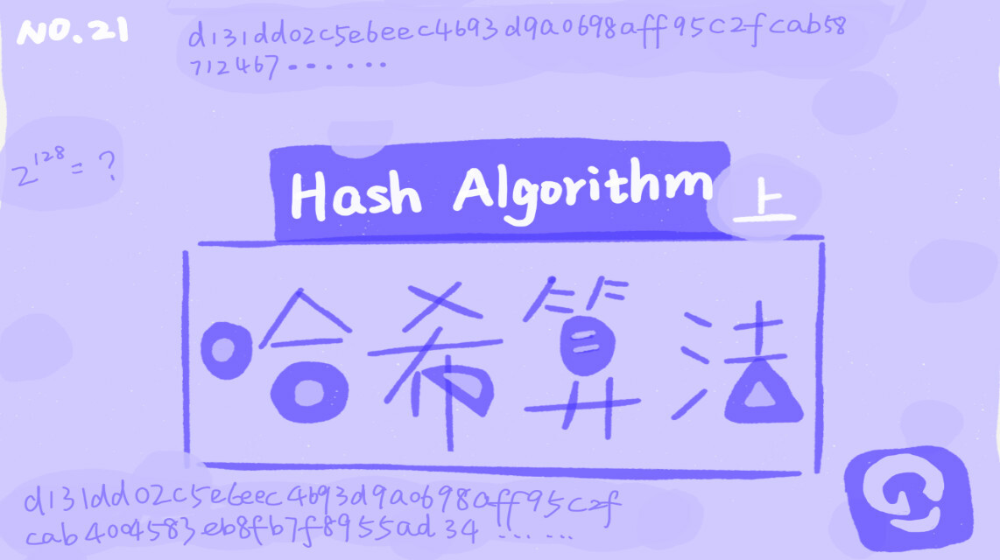

你好，我是悦创。

还记得 2011 年 CSDN 的“脱库”事件吗？当时，CSDN 网站被黑客攻击，超过 600 万用户的注册邮箱和密码明文被泄露，很多网友对 CSDN 明文保存用户密码行为产生了不满。如果你是 CSDN 的一名工程师，<span style="color: orange">**你会如何存储用户密码这么重要的数据吗？**</span>仅仅 MD5 加密一下存储就够了吗？ 要想搞清楚这个问题，就要先弄明白哈希算法。

哈希算法历史悠久，业界著名的哈希算法也有很多，比如 MD5、SHA 等。在我们平时的开发中，基本上都是拿现成的直接用。所以，我今天不会重点剖析哈希算法的原理，也不会教你如何设计一个哈希算法，而是从实战的角度告诉你，**在实际的开发中，我们该如何用哈希算法解决问题。**

## 1. 什么是哈希算法？

我们前面几节讲到“散列表”“散列函数”，这里又讲到“哈希算法”，你是不是有点一头雾水？实际上，不管是“散列”还是“哈希”，这都是中文翻译的差别，英文其实就是“**Hash**”。所以，我们常听到有人把“散列表”叫作“哈希表”“Hash 表”，把“哈希算法”叫作“Hash 算法”或者“散列算法”。那到底什么是哈希算法呢？

哈希算法的定义和原理非常简单，基本上一句话就可以概括了。将任意长度的二进制值串映射为固定长度的二进制值串，这个映射的规则就是**哈希算法**，而通过原始数据映射之后得到的二进制值串就是**哈希值**。但是，要想设计一个优秀的哈希算法并不容易，根据我的经验，我总结了需要满足的几点要求：

- 从哈希值不能反向推导出原始数据（所以哈希算法也叫单向哈希算法）；
- 对输入数据非常敏感，哪怕原始数据只修改了一个 Bit，最后得到的哈希值也大不相同；
- 散列冲突的概率要很小，对于不同的原始数据，哈希值相同的概率非常小；
- 哈希算法的执行效率要尽量高效，针对较长的文本，也能快速地计算出哈希值。

这些定义和要求都比较理论，可能还是不好理解，我拿 MD5 这种哈希算法来具体说明一下。

我们分别对“今天我来讲哈希算法”和“jiajia”这两个文本，计算 MD5 哈希值，得到两串看起来毫无规律的字符串（MD5 的哈希值是 128 位的 Bit 长度，为了方便表示，我把它们转化成了 16 进制编码）。可以看出来，无论要哈希的文本有多长、多短，通过 MD5 哈希之后，得到的哈希值的长度都是相同的，而且得到的哈希值看起来像一堆随机数，完全没有规律。

```python
MD5("今天我来讲哈希算法") = bb4767201ad42c74e650c1b6c03d78fa
MD5("jiajia") = cd611a31ea969b908932d44d126d195b
```


欢迎关注我公众号：AI悦创，有更多更好玩的等你发现！

::: details 公众号：AI悦创【二维码】


::: 

::: info AI悦创·编程一对一

AI悦创·推出辅导班啦，包括「Python 语言辅导班、C++ 辅导班、java 辅导班、算法/数据结构辅导班、少儿编程、pygame 游戏开发」，全部都是一对一教学：一对一辅导 + 一对一答疑 + 布置作业 + 项目实践等。当然，还有线下线上摄影课程、Photoshop、Premiere 一对一教学、QQ、微信在线，随时响应！微信：Jiabcdefh

C++ 信息奥赛题解，长期更新！长期招收一对一中小学信息奥赛集训，莆田、厦门地区有机会线下上门，其他地区线上。微信：Jiabcdefh

方法一：[QQ](http://wpa.qq.com/msgrd?v=3&uin=1432803776&site=qq&menu=yes)

方法二：微信：Jiabcdefh

:::

