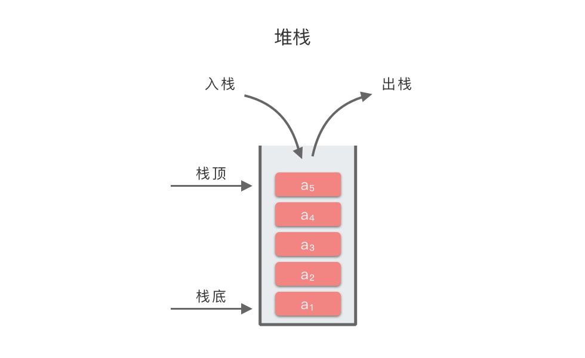

## 1. java.util.Stack

在 Java 中，可以使用 `java.util.Stack` 类来实现堆栈（stack）数据结构。以下是一个简单的示例代码：

```java
/**
 * @ClassName: StackExample
 * @Description: TODO
 * @Author: AndersonHJB
 * @date: 2023/3/13 09:36
 * @Version: V1.0
 * @Blog: https://bornforthis.cn
 */

import java.util.Stack;

public class StackExample {
    public static void main(String[] args) {
        Stack<Integer> stack = new Stack<>();

        // 压入元素
        stack.push(1);
        stack.push(2);
        stack.push(3);

        // 弹出元素
        int top = stack.pop();

        // 获取栈顶元素
        int peek = stack.peek();

        // 判断栈是否为空

        // todo: empty() 方法和 isEmpty() 方法是等价
        boolean isEmpty = stack.isEmpty();
        // isEmpty = stack.empty();

        // 获取栈的大小
        int size = stack.size();

        // 返回 Stack 中指定元素从栈顶开始算的索引位置。如果元素不在 Stack 中，则返回 -1
        int search = stack.search(3);  // 如果第 22 行，没注释。则输出 -1，注释了，则输出 1
        System.out.println(search);

        search = stack.search(2);
        System.out.println(search);

        search = stack.search(1);
        System.out.println(search);


    }
}
```

在这个示例代码中，我们首先创建了一个 `Stack` 类型的对象，然后使用 `push` 方法将元素依次压入栈中。接着使用 `pop` 方法弹出栈顶元素，并使用 `peek` 方法获取栈顶元素但不弹出，使用 `isEmpty` 方法判断栈是否为空，使用 `size` 方法获取栈的大小。

需要注意的是，在 Java 中，使用 `java.util.Deque` 接口的实现类 `ArrayDeque` 也可以用来实现堆栈。例如，可以使用 `ArrayDeque` 实现上面的示例代码：

```java
import java.util.ArrayDeque;
import java.util.Deque;

public class StackExample {
    public static void main(String[] args) {
        Deque<Integer> stack = new ArrayDeque<>();

        // 压入元素
        stack.push(1);
        stack.push(2);
        stack.push(3);

        // 弹出元素
        int top = stack.pop(); // top = 3

        // 获取栈顶元素
        int peek = stack.peek(); // peek = 2

        // 判断栈是否为空
        boolean isEmpty = stack.isEmpty(); // isEmpty = false

        // 获取栈的大小
        int size = stack.size(); // size = 2
    }
}
```

使用 `ArrayDeque` 的方式与使用 `Stack` 的方式类似，但 `ArrayDeque` 的性能更好，因为它是用数组实现的，而 `Stack` 是用向量实现的。

## 2. Java 使用基础语法实现 Stack

```java
public class StackExample {
    private int[] data;  // 存储元素的数组
    private int top;     // 栈顶指针

    public StackExample(int capacity) {
        data = new int[capacity];
        top = -1;
    }

    public boolean isEmpty() {
        return top == -1;
    }

    public boolean isFull() {
        return top == data.length - 1;
    }

    public void push(int item) {
        if (isFull()) {
            throw new RuntimeException("Stack is full");
        }
        data[++top] = item;
    }

    public int pop() {
        if (isEmpty()) {
            throw new RuntimeException("Stack is empty");
        }
        return data[top--];
    }

    public int peek() {
        if (isEmpty()) {
            throw new RuntimeException("Stack is empty");
        }
        return data[top];
    }

    public int size() {
        return top + 1;
    }
}
```





欢迎关注我公众号：AI悦创，有更多更好玩的等你发现！

::: details 公众号：AI悦创【二维码】


:::

::: info AI悦创·编程一对一

AI悦创·推出辅导班啦，包括「Python 语言辅导班、C++ 辅导班、java 辅导班、算法/数据结构辅导班、少儿编程、pygame 游戏开发」，全部都是一对一教学：一对一辅导 + 一对一答疑 + 布置作业 + 项目实践等。当然，还有线下线上摄影课程、Photoshop、Premiere 一对一教学、QQ、微信在线，随时响应！微信：Jiabcdefh

C++ 信息奥赛题解，长期更新！长期招收一对一中小学信息奥赛集训，莆田、厦门地区有机会线下上门，其他地区线上。微信：Jiabcdefh

方法一：[QQ](http://wpa.qq.com/msgrd?v=3&uin=1432803776&site=qq&menu=yes)

方法二：微信：Jiabcdefh

:::


