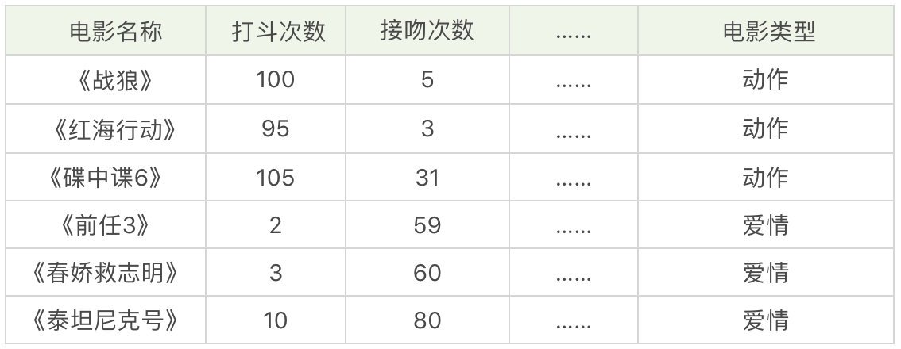
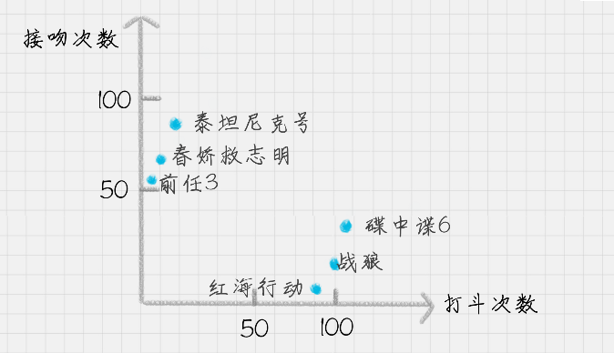
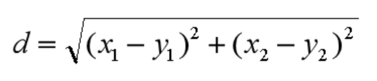
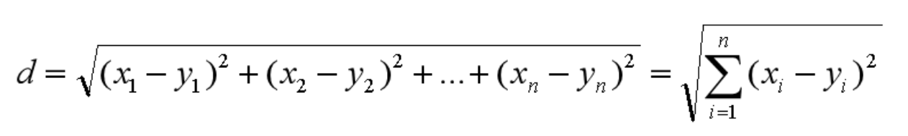
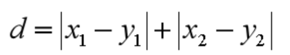
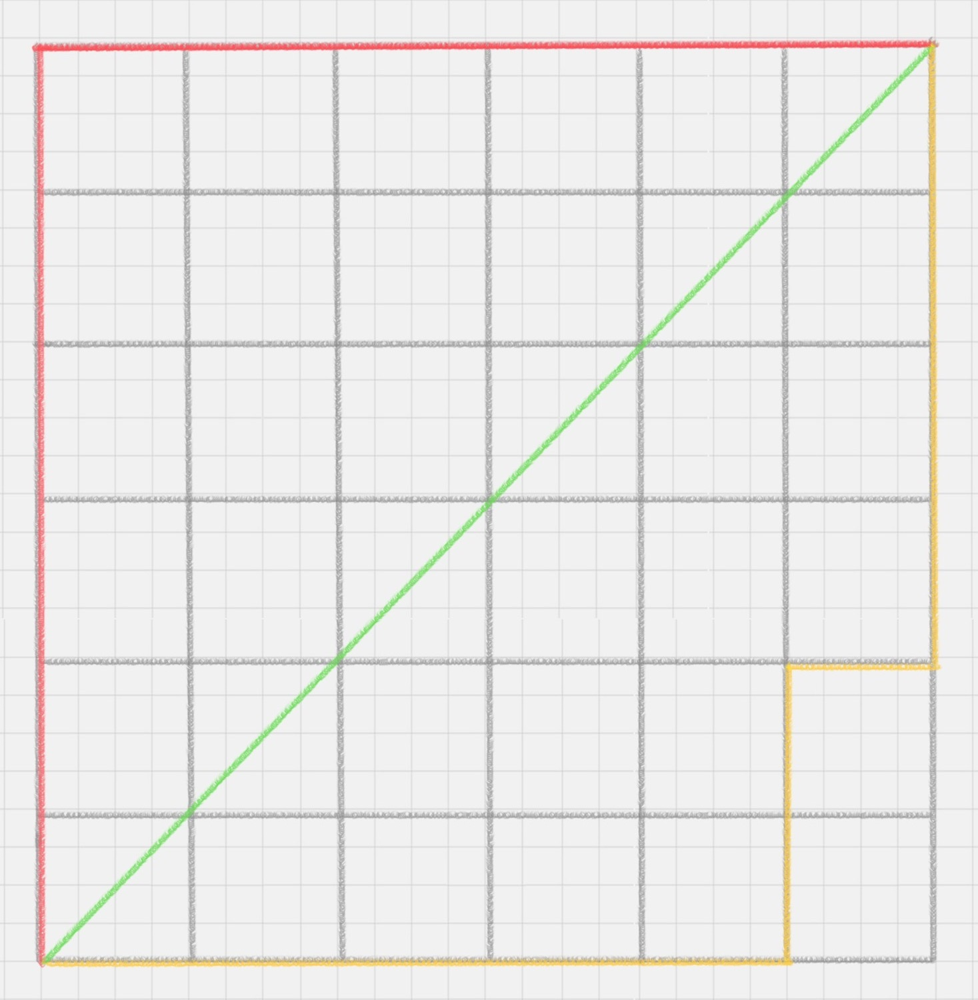
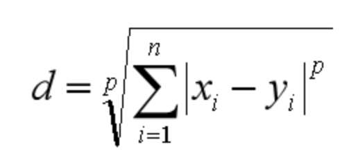
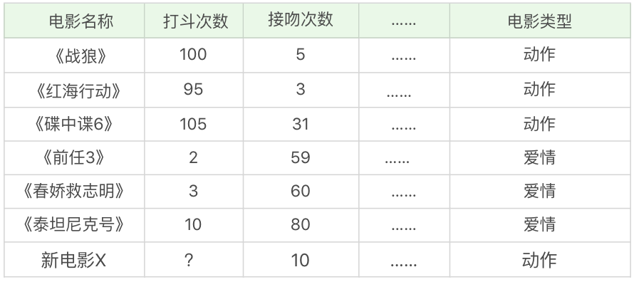
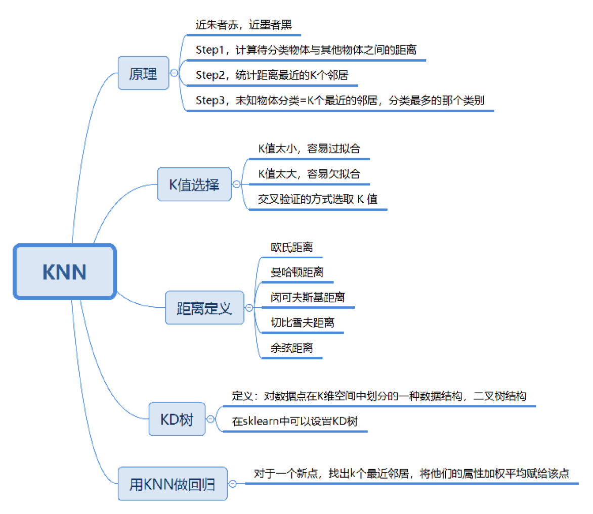
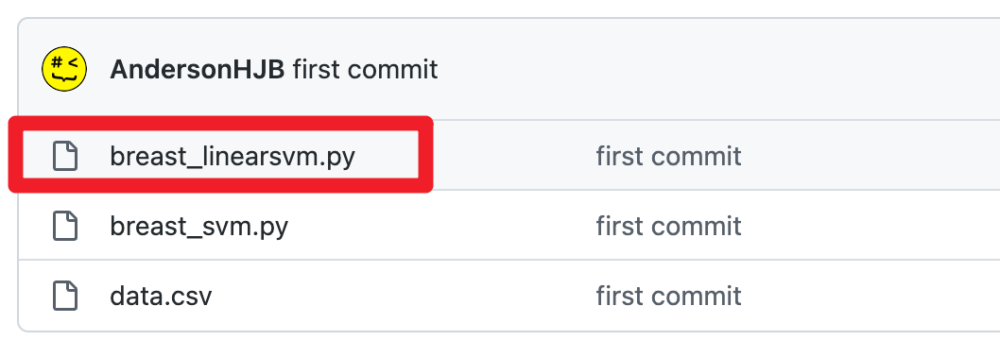

你好，我是悦创。

今天我来带你进行 KNN 的学习，KNN 的英文叫 K-Nearest Neighbor，应该算是数据挖掘算法中最简单的一种。

我们先用一个例子体会下。

假设，我们想对电影的类型进行分类，统计了电影中打斗次数、接吻次数，当然还有其他的指标也可以被统计到，如下表所示。

我们很容易理解《战狼》《红海行动》《碟中谍 6》是动作片，《前任 3》《春娇救志明》《泰坦尼克号》是爱情片，但是有没有一种方法让机器也可以掌握这个分类的规则，当有一部新电影的时候，也可以对它的类型自动分类呢？

我们可以把打斗次数看成 X 轴，接吻次数看成 Y 轴，然后在二维的坐标轴上，对这几部电影进行标记，如下图所示。

对于未知的电影 A，坐标为 (x,y)，我们需要看下离电影 A 最近的都有哪些电影，这些电影中的大多数属于哪个分类，那么电影 A 就属于哪个分类。实际操作中，我们还需要确定一个 K 值，也就是我们要观察离电影 A 最近的电影有多少个。

## KNN 的工作原理

“近朱者赤，近墨者黑”可以说是 KNN 的工作原理。整个计算过程分为三步：

1. 计算待分类物体与其他物体之间的距离；
2. 统计距离最近的 K 个邻居；
3. 对于 K 个最近的邻居，它们属于哪个分类最多，待分类物体就属于哪一类。

## K 值如何选择

你能看出整个 KNN 的分类过程，K 值的选择还是很重要的。那么问题来了，K 值选择多少是适合的呢？

如果 K 值比较小，就相当于未分类物体与它的邻居非常接近才行。这样产生的一个问题就是，如果邻居点是个噪声点，那么未分类物体的分类也会产生误差，这样 KNN 分类就会产生过拟合。

> **数据噪声(Noise)**：数据集中的 **干扰数据**（对场景描述不准确的数据），即测量变量中的**随机误差或方差**。

::: tip

思考极端情况，K=1 和 K=N（样本数）的情况： 前者太受样本中噪音点的影响，或者说就是太受样本偶然性的影响了；后者度所有的样本点都是一个预测值，都一样，还有什么拟合效果——就相当于是用样本均值来拟合一个回归模型。

对的，要考虑整体的情况。 统计方面，要看绝大多数就好了，不要过分。 其他算法有没有考虑过拟合的情况呢？

:::

如果 K 值比较大，相当于距离过远的点也会对未知物体的分类产生影响，虽然这种情况的好处是鲁棒性强，但是不足也很明显，会产生欠拟合情况，也就是没有把未分类物体真正分类出来。

所以 K 值应该是个实践出来的结果，并不是我们事先而定的。在工程上，我们一般采用交叉验证的方式选取 K 值。

交叉验证的思路就是，把样本集中的大部分样本作为训练集，剩余的小部分样本用于预测，来验证分类模型的准确性。所以在 KNN 算法中，我们一般会把 K 值选取在较小的范围内，同时在验证集上准确率最高的那一个最终确定作为 K 值。

## 距离如何计算

在 KNN 算法中，还有一个重要的计算就是关于距离的度量。两个样本点之间的距离代表了这两个样本之间的相似度。距离越大，差异性越大；距离越小，相似度越大。

关于距离的计算方式有下面五种方式：

1. 欧氏距离；
2. 曼哈顿距离；
3. 闵可夫斯基距离；
4. 切比雪夫距离；
5. 余弦距离。

其中前三种距离是 KNN 中最常用的距离，我给你分别讲解下。

**欧氏距离**是我们最常用的距离公式，也叫做欧几里得距离。在二维空间中，两点的欧式距离就是：

同理，我们也可以求得两点在 n 维空间中的距离：

**曼哈顿距离**在几何空间中用的比较多。以下图为例，绿色的直线代表两点之间的欧式距离，而红色和黄色的线为两点的曼哈顿距离。所以曼哈顿距离等于两个点在坐标系上绝对轴距总和。用公式表示就是：

**闵可夫斯基距离**不是一个距离，而是一组距离的定义。对于 n 维空间中的两个点 `x(x1,x2,…,xn)` 和 `y(y1,y2,…,yn)` ， x 和 y 两点之间的闵可夫斯基距离为：

其中 p 代表空间的维数，当 `p=1` 时，就是曼哈顿距离；当 `p=2` 时，就是欧氏距离；当 `p→∞` 时，就是切比雪夫距离。

**那么切比雪夫距离**怎么计算呢？二个点之间的切比雪夫距离就是这两个点坐标数值差的绝对值的最大值，用数学表示就是：`max(|x1-y1|,|x2-y2|)`。

余弦距离实际上计算的是两个向量的夹角，是在方向上计算两者之间的差异，对绝对数值不敏感。在兴趣相关性比较上，角度关系比距离的绝对值更重要，因此余弦距离可以用于衡量用户对内容兴趣的区分度。比如我们用搜索引擎搜索某个关键词，它还会给你推荐其他的相关搜索，这些推荐的关键词就是采用余弦距离计算得出的。

## KD 树

其实从上文你也能看出来，KNN 的计算过程是大量计算样本点之间的距离。为了减少计算距离次数，提升 KNN 的搜索效率，人们提出了 KD 树（K-Dimensional 的缩写）。KD 树是对数据点在 K 维空间中划分的一种数据结构。在 KD 树的构造中，每个节点都是 k 维数值点的二叉树。既然是二叉树，就可以采用二叉树的增删改查操作，这样就大大提升了搜索效率。

在这里，我们不需要对 KD 树的数学原理了解太多，你只需要知道它是一个二叉树的数据结构，方便存储 K 维空间的数据就可以了。而且在 sklearn 中，我们直接可以调用 KD 树，很方便。

## 用 KNN 做回归

KNN 不仅可以做分类，还可以做回归。首先讲下什么是回归。在开头电影这个案例中，如果想要对未知电影进行类型划分，这是一个分类问题。首先看一下要分类的未知电影，离它最近的 K 部电影大多数属于哪个分类，这部电影就属于哪个分类。

如果是一部新电影，已知它是爱情片，想要知道它的打斗次数、接吻次数可能是多少，这就是一个回归问题。

那么 KNN 如何做回归呢？

对于一个新电影 X，我们要预测它的某个属性值，比如打斗次数，具体特征属性和数值如下所示。此时，我们会先计算待测点（新电影 X）到已知点的距离，选择距离最近的 K 个点。假设 K=3，此时最近的 3 个点（电影）分别是《战狼》，《红海行动》和《碟中谍 6》，那么它的打斗次数就是这 3 个点的该属性值的平均值，即 `(100+95+105)/3=100` 次。

## 总结

今天我给你讲了 KNN 的原理，以及 KNN 中的几个关键因素。比如针对 K 值的选择，我们一般采用交叉验证的方式得出。针对样本点之间的距离的定义，常用的有 5 种表达方式，你也可以自己来定义两个样本之间的距离公式。不同的定义，适用的场景不同。比如在搜索关键词推荐中，余弦距离是更为常用的。

另外你也可以用 KNN 进行回归，通过 K 个邻居对新的点的属性进行值的预测。

KNN 的理论简单直接，针对 KNN 中的搜索也有相应的 KD 树这个数据结构。KNN 的理论成熟，可以应用到线性和非线性的分类问题中，也可以用于回归分析。

不过 KNN 需要计算测试点与样本点之间的距离，当数据量大的时候，计算量是非常庞大的，需要大量的存储空间和计算时间。另外如果样本分类不均衡，比如有些分类的样本非常少，那么该类别的分类准确率就会低很多。

当然在实际工作中，我们需要考虑到各种可能存在的情况，比如针对某类样本少的情况，可以增加该类别的权重。

同样 KNN 也可以用于推荐算法，虽然现在很多推荐系统的算法会使用 TD-IDF、协同过滤、Apriori 算法，不过针对数据量不大的情况下，采用 KNN 作为推荐算法也是可行的。

最后我给你留几道思考题吧，KNN 的算法原理和工作流程是怎么样的？KNN 中的 K 值又是如何选择的？

## 上一篇文章思考题的代码

我在上篇文章里留了一道思考题，你可以在 [GitHub](https://github.com/AndersonHJB/breast_cancer_data) 上看到我写的关于这道题的代码（完整代码和文章案例代码差别不大），供你借鉴。

欢迎关注我公众号：AI悦创，有更多更好玩的等你发现！

::: details 公众号：AI悦创【二维码】

:::

::: info AI悦创·编程一对一

AI悦创·推出辅导班啦，包括「Python 语言辅导班、C++ 辅导班、java 辅导班、算法/数据结构辅导班、少儿编程、pygame 游戏开发」，全部都是一对一教学：一对一辅导 + 一对一答疑 + 布置作业 + 项目实践等。当然，还有线下线上摄影课程、Photoshop、Premiere 一对一教学、QQ、微信在线，随时响应！微信：Jiabcdefh

C++ 信息奥赛题解，长期更新！长期招收一对一中小学信息奥赛集训，莆田、厦门地区有机会线下上门，其他地区线上。微信：Jiabcdefh

方法一：[QQ](http://wpa.qq.com/msgrd?v=3&uin=1432803776&site=qq&menu=yes)

方法二：微信：Jiabcdefh

:::

