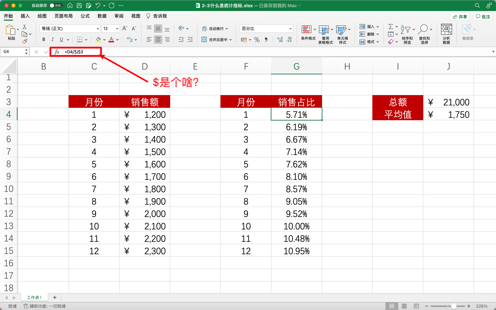

## 问题

## Excel 里 $是什么意思

**两种意思：**

1、在单元格引用里，表示绝对引用。就是 $ 后边的那个字母或数字不随公式的拖动而变化。

2、在数据表示里，表示美元。

用在公式里是锁行和锁列的，$ 在公式里的数字前锁行，字母前锁列，前后都加是锁行和列，这个按 F4 就可以出来了

**绝对引用 符号**

- `A1` 行列相对引用

- `$A` 列绝对引用，行相对引用

- `A$1` 列相对引用，行绝对引用

- `$A$1` 行列绝对引用

<button name="button" style="color: black"><a href="/sjfx/Homework/2-3什么是统计指标.xlsx" target="_blank">Operation File</a></button>

欢迎关注我公众号：AI悦创，有更多更好玩的等你发现！

::: details 公众号：AI悦创【二维码】

:::

::: info AI悦创·编程一对一

AI悦创·推出辅导班啦，包括「Python 语言辅导班、C++ 辅导班、java 辅导班、算法/数据结构辅导班、少儿编程、pygame 游戏开发」，全部都是一对一教学：一对一辅导 + 一对一答疑 + 布置作业 + 项目实践等。当然，还有线下线上摄影课程、Photoshop、Premiere 一对一教学、QQ、微信在线，随时响应！微信：Jiabcdefh

C++ 信息奥赛题解，长期更新！长期招收一对一中小学信息奥赛集训，莆田、厦门地区有机会线下上门，其他地区线上。微信：Jiabcdefh

方法一：[QQ](http://wpa.qq.com/msgrd?v=3&uin=1432803776&site=qq&menu=yes)

方法二：微信：Jiabcdefh

:::

