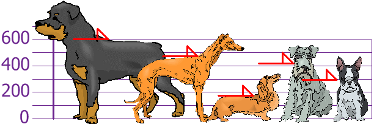

::: center

*差的意思是离正常有多远*

## *Deviation just means how far from the normal*

:::

## 标准差

标准差是数值分散的测量。

标准差的符号是 **σ** （希腊语字母 西格马，英语 sigma）

公式很简单：**方差**的**平方根**。那么…… "方差是什么？”

## 方差

方差的定义是：离平均的**平方**距离的平均。

按照以下的步骤来计算方差：

- 求数值的 [平均](https://www.shuxuele.com/mean.html)
- 从每一个数值减去平均，然后求*差的平方*。
- 求结果的平均。（[为什么要求平方？](https://www.shuxuele.com/data/standard-deviation.html#WhySquare))

## 例子

你和朋友们量度了狗狗的身高（毫米）：

身高（到肩膀）是：600mm、470mm、170mm、430mm 和 300mm。

求平均、方差和标准差。

第一步是求平均：

## 期待你和我一起，用数据解析世界

欢迎关注我公众号：AI悦创，有更多更好玩的等你发现！

::: details 公众号：AI悦创【二维码】

:::

::: info AI悦创·编程一对一

AI悦创·推出辅导班啦，包括「Python 语言辅导班、C++ 辅导班、java 辅导班、算法/数据结构辅导班、少儿编程、pygame 游戏开发、小学数学一对一教学」，全部都是一对一教学：一对一辅导 + 一对一答疑 + 布置作业 + 项目实践等。当然，还有线下线上摄影课程、Photoshop、Premiere 一对一教学、QQ、微信在线，随时响应！微信：Jiabcdefh

C++ 信息奥赛题解，长期更新！长期招收一对一中小学信息奥赛集训，莆田、厦门地区有机会线下上门，其他地区线上。微信：Jiabcdefh

方法一：[QQ](http://wpa.qq.com/msgrd?v=3&uin=1432803776&site=qq&menu=yes)

方法二：微信：Jiabcdefh

:::

