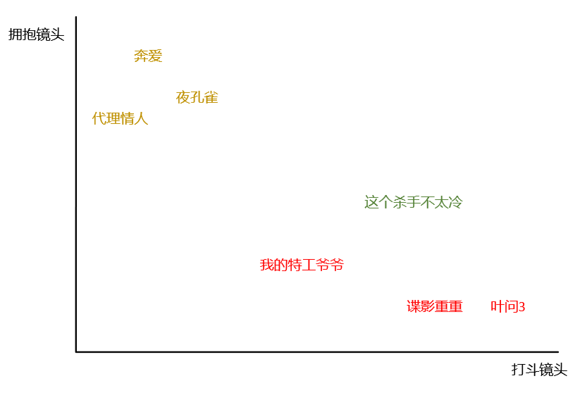
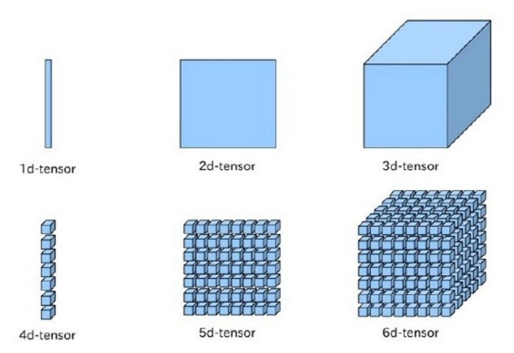

在学习机器学习的时候，接触的第一个算法大都是 KNN。不过在介绍之前，请先允许我讲一下个别名词：
- 交叉验证：将原始数据 **随机** 分成两组，一组作为训练集，一组作为验证集。训练集训练分类器，验证集验证分类器的效果，并将最后的准确率作为分类器的性能指标。
- 特征缩放：将特征的取值控制在某一范围内，保证每个特征占据的权重一致。常用的是归一化和标准化。

## 原理介绍

**简言之，KNN 算法计算不同特征值之间的距离对样本进行分类。**

OK，说完结论，懂的可以直接看代码部分了，如果不能理解的请听我娓娓道来~现在有这么一组数据

| 电影名称            | 打斗镜头 | 拥抱镜头 | 电影类型 |
| ------------------- | -------- | -------- | -------- |
| 谍影重重「A」       | 57       | 2        | 动作片   |
| 叶问3「B」          | 65       | 2        | 动作片   |
| 我的特工爷爷「C」   | 21       | 4        | 动作片   |
| 奔爱「D」           | 4        | 46       | 爱情片   |
| 夜孔雀「E」         | 8        | 39       | 爱情片   |
| 代理情人「F」       | 2        | 38       | 爱情片   |
| 这个杀手不太冷「G」 | 49       | 6        | ？       |

上面6个样本（电影）分别给出其特征（打斗镜头、拥抱镜头）和标签（电影类型）信息，现在给定一个新的样本，我们想知道这部电影的类型。由于是2维数据，我们可以用平面直角坐标系表示。



绿色的点是未知的，红色的黄色的点是已知的。kNN要做的就是计算未知的点到所有已知点的距离，根据距离进行排序。

$$ D_{A} = \sqrt{(49-57)^{2} + (6-2)^{2}} \approx 8.94 $$

$$ D_{B} = \sqrt{(49-65)^{2} + (6-2)^{2}} \approx 16.49 $$
$$ D_{C} = \sqrt{(49-21)^{2} + (6-4)^{2}} \approx 28.07 $$

$$ D_{D} = \sqrt{(49-4)^{2} + (6-46)^{2}} \approx 60.21 $$

$$ D_{E} = \sqrt{(49-8)^{2} + (6-39)^{2}} \approx 52.63 $$

$$ D_{F} = \sqrt{(49-2)^{2} + (6-38)^{2}} \approx 56.86 $$

排序后的数据如下，

| 电影名称     | 与未知电影距离 |
| ------------ | -------------- |
| 谍影重重     | 8.94           |
| 叶问3        | 16.49          |
| 我的特工爷爷 | 28.07          |
| 夜孔雀       | 52.63          |
| 代理情人     | 56.86          |
| 奔爱         | 60.21          |

我们在 KNN 算法中经常会听到说当 `k=3` 时、当 `k=5` 时......

这里的 k 指的就是样本数。在这个例子中，当 k=3 时，前三个样本出现最多的电影类型是动作片，因此《这个杀手不太冷》样本也应该归为动作片。同样的，当 k=5 时，前 5 个样本出现最多的电影类型也是动作片（$\frac{3}{5} > \frac{2}{5}$），因此样本也属于动作片。

上面提到的是 2 维数据，但是我们现实中处理的样本可能有 3 个甚至更多特征，我们无法用视觉来抽象这些特征，但是计算方法还是一样的，只不过根号里做差的数变多了而已。



## 代码实现——Numpy

机器学习算法的一般流程可以归为三步。
- 数据预处理
	1. 加载数据
   2. 交叉验证
   3. 归一化
- 模型训练
- 模型验证

| Column 1 | Column 2 | Column 3 |
| -------- | -------- | -------- |
| Text     | Text     | Text     |

**机器学习的任务就是从海量数据中找到有价值的信息，** 所以在使用算法之前，我们要对数据进行预处理。

```python
# 1. 加载莺尾花数据集
from sklearn import datasets

iris = datasets.load_iris()
X = iris.data
y = iris.target
```

如果我们查看 y 标签信息会发现，它的前 50 个值为 `0` ，`51—100` 的值为 1，后 50 个值为 2。

如果直接交叉验证，取到的测试集数据可能都是 label 值为 2 的样本，这并不是我们想要的。「PS：有时候我们会选择十折交叉验证，也就是分为十组，然后每次会有一组当作验证集，其余做训练集」

所以在这之前，我们需要先对样本打乱顺序。`zip()` 能将可迭代的对象打包成元组，利用 `*` 操作符可以将元组解压为列表。

```python
# 2. 实现交叉验证
import numpy as np


def train_test_split(X, y, ratio=0.3):
    # 乱序
    data = list(zip(X, y))
    np.random.shuffle(data)
    X, y = zip(*data)
    # 切割
    boundary_X = int((1 - ratio) * len(X))
    boundary_y = int((1 - ratio) * len(y))
    # 将 boundary_X 和 boundary_y 之前的作为训练集
    x_train = np.array(X[:boundary_X])
    x_test = np.array(X[boundary_X:])
    y_train = np.array(y[:boundary_y])
    y_test = np.array(y[boundary_y:])
    return x_train, x_test, y_train, y_test


x_train, x_test, y_train, y_test = train_test_split(X, y)
```

- ratio: 比率，比例
- boundary: 分界线，边界；界限，范围；
- train: 培训，训练；
- 一般来说，我们做训练集，的比例要大一些，占整体的 70%～60%，剩下的 30%～40%可以用来做验证。
- 标签对应数据「label: 数据」

1. 归一化主要有两种形式：0-1 均匀分布和标准正态分布。

```python
# 3. 归一化
def normalization(data):
    """0-1 均匀分布"""
    return (data - data.min()) / (data.max() - data.min()) 


def standardization(data):
    """标准正态分布"""
    return (data - data.mean()) / data.std()


x_train = standardization(x_train)
x_test = standardization(x_test)
```

KNN 的“模型训练”有点不同于一般的模型训练过程，它们可能需要求一些参数，而 kNN 是计算未知点到已知点的距离。从严格意义上来说，这并不算是训练。

```python
# 4. 距离计算
from collections import Counter


class KNNClassifier:
    """KNN 分类器"""
    def __init__(self, k):
        self._k = k
        self._X_train = None
        self._y_train = None

    def fit(self, X_train, y_train):
        self._X_train = X_train
        self._y_train = y_train

    # 预测X_predict样本的分类结果，这里的X_predict用的是交叉验证中的测试集
    def predict(self, X_predict):
        return np.array([self._predict(x) for x in X_predict])

    def _predict(self, x):
        # 计算输入样本_X_train到所有已知数据的距离
        distances = np.sqrt(np.sum((self._X_train - x)**2, axis=1))
        # 记录distances中前k个小的数对应的类别的出现次数
        votes = Counter(self._y_train[np.argpartition(distances, self._k)[: self._k]])
        # most_common(n)可以打印n个出现最多次元素的值和次数
        predict_y = votes.most_common(1)[0][0]
        return predict_y

    # 计算准确率
    def score(self, X_test, label):
        y_predict = self.predict(X_test)
        n_sample = len(label)
        right_sample = 0
        for i, e in enumerate(label):
            if y_predict[i] == e:
                right_sample += 1
        return right_sample / n_sample


knn = KNNClassifier(k=3)
knn.fit(x_train, y_train)
knn.score(x_test, y_test)
```

输出：

```python
0.9555555555555556
```


## 超参数搜索函数

KNN 的参数不止是 k，距离模式 distype 也是它的参数。对于 k 和 distype 这两种参数的组合，可能会有很多不同的结果，不妨设计一个超参数搜索函数来优化 k 和 distype。

```python
class KNNClassifierSuper(KNNClassifier):
    def __init__(self, k, distype):
        super().__init__(k)
        self.distype = distype

    def _predict(self, x):
        assert self.distype in ["1", "2", "3"], "Error distance type!"
        if self.distype == "1":
            distances = np.sum(abs(self._X_train - x), axis=1)
        elif self.distype == "2":
            distances = np.sqrt(np.sum((self._X_train - x)**2, axis=1))
        else:
            distances = np.max(abs(self._X_train - x), axis=1)
        votes = Counter(self._y_train[np.argpartition(distances, self._k)[: self._k]])
        predict_y = votes.most_common(1)[0][0]
        return predict_y


# ManhattanDistance —— "1"
# EuclideanDistance —— "2"
# ChebyshevDistance —— "3"
for k in range(3, 15, 2):
    for distype in range(1, 4):
        knn = KNNClassifierSuper(k, str(distype))
        knn.fit(x_train, y_train)
        print("k = {}\tdistype = {}\tscore = {}".format(
            k, distype, knn.score(x_test, y_test)))
```

输出：

```python
k = 3	distype = 1	score = 0.9555555555555556
k = 3	distype = 2	score = 0.9555555555555556
k = 3	distype = 3	score = 0.9555555555555556
k = 5	distype = 1	score = 0.9777777777777777
k = 5	distype = 2	score = 0.9555555555555556
k = 5	distype = 3	score = 0.9555555555555556
k = 7	distype = 1	score = 0.9555555555555556
k = 7	distype = 2	score = 0.9555555555555556
k = 7	distype = 3	score = 0.9777777777777777
k = 9	distype = 1	score = 0.9777777777777777
k = 9	distype = 2	score = 0.9777777777777777
k = 9	distype = 3	score = 0.9777777777777777
k = 11	distype = 1	score = 0.9777777777777777
k = 11	distype = 2	score = 0.9777777777777777
k = 11	distype = 3	score = 0.9777777777777777
k = 13	distype = 1	score = 0.9777777777777777
k = 13	distype = 2	score = 0.9777777777777777
k = 13	distype = 3	score = 0.9555555555555556
```

## 代码实现——sklearn

上面我们用 Numpy 实现了交叉验证、归一化、距离计算等方法，这些在 sklearn 中都已经为我们封装好了。

```python
from sklearn.model_selection import train_test_split, GridSearchCV
from sklearn import preprocessing
from sklearn.neighbors import KNeighborsClassifier

# 加载莺尾花数据
iris = datasets.load_iris()
X, y = iris.data, iris.target

# 交叉验证
x_train, x_test, y_train, y_test = train_test_split(X, y, test_size=0.4)

# 归一化
x_train = preprocessing.scale(x_train)
x_test = preprocessing.scale(x_test)

# 距离计算 + 超参数搜索函数
# p = 1 manhattan_distance 
# p = 2 euclidean_distance
# arbitrary p minkowski_distance 
for k in range(3, 14, 2):
    for p in range(1, 5):
        knn = KNeighborsClassifier(n_neighbors=k, p=p)
        knn.fit(x_train, y_train)
        print("k = {}\tp = {}\tscore = {}".format(
            k, p, knn.score(x_test, y_test)))
```

## 笔记

1. ValueError: The truth value of an array with more than one element is ambiguous. Use a.any() or a.all()
> ndarray 计算的时候尽量用 np 的属性（`np.sum()` 而不是 sum）
***
2. ValueError: kth(=3) out of bounds (1)
> 计算距离的时候 `np.sum()` 需要指定 `axis=1`，不然会直接对多维数组进行 sum 得到一个数值，在 `np.argpartition` 会出错。
***
3. `np.sum()` 如果不指定 axis 是无法广播的，会直接返回数值
***
4. axis 一种较好的理解方式是把他看成消除器。对于 shape 为 `(2L, 3L, 4L)` 的数组 arr，`np.sum(arr, axis=0)`会返回 shape 为 `(3L, 4L)` 的数组，`np.sum(arr, axis=1)` 会返回 shape 为 `(2L, 4L)` 的数组，`np.sum(arr, axis=0)`会返回 shape 为 `(2L, 3L)` 的数组。


欢迎关注我公众号：AI悦创，有更多更好玩的等你发现！

::: details 公众号：AI悦创【二维码】


:::

::: info AI悦创·编程一对一

AI悦创·推出辅导班啦，包括「Python 语言辅导班、C++ 辅导班、java 辅导班、算法/数据结构辅导班、少儿编程、pygame 游戏开发」，全部都是一对一教学：一对一辅导 + 一对一答疑 + 布置作业 + 项目实践等。当然，还有线下线上摄影课程、Photoshop、Premiere 一对一教学、QQ、微信在线，随时响应！微信：Jiabcdefh

C++ 信息奥赛题解，长期更新！长期招收一对一中小学信息奥赛集训，莆田、厦门地区有机会线下上门，其他地区线上。微信：Jiabcdefh

方法一：[QQ](http://wpa.qq.com/msgrd?v=3&uin=1432803776&site=qq&menu=yes)

方法二：微信：Jiabcdefh

:::

