## 集中趋势指标的特点

在数据分析的过程中，我们会经常遇到下面的问题：

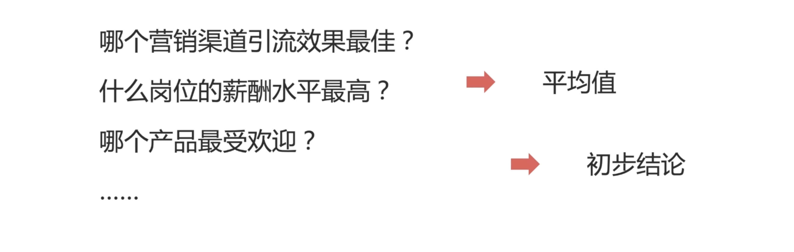

- 哪个营销渠道引流效果最佳？
    - 便于我们决定将资源、钱、精力，投入到哪个营销渠道。
- 什么岗位的薪酬水平最高？
    - 又或者哪个岗位的薪酬水平最高，以数据分析为例：有运营的、有产品的、有市场营销的等，我们通过比较这些岗位的薪酬水平，来决定我更想去哪个岗位，或者哪个岗位的发展前景更好。
- 哪个产品最受欢迎？
    - 又或者我们相知道哪个产品更受欢迎，帮组我们去了解现在的市场，以及消费者的偏好。
- .....

那这个时候，一个简单的方法就是：**就是通过计算平均值，来了解不同选择的平均水平是怎么样的，以便我们得到初步结论。**

**那这个平均值，就是集中趋势指标的一种。**

## 什么是集中趋势指标？

集中趋势指标体现的就是同来体现数据一般水平的指标，帮助我们快速了解数据概况。最常用的，就是上面提到的集中趋势指标，也就是就是 **平均值**。

## 平均值

平均值的计算方式很简单：`平均值=所有数据相加/数据个数`

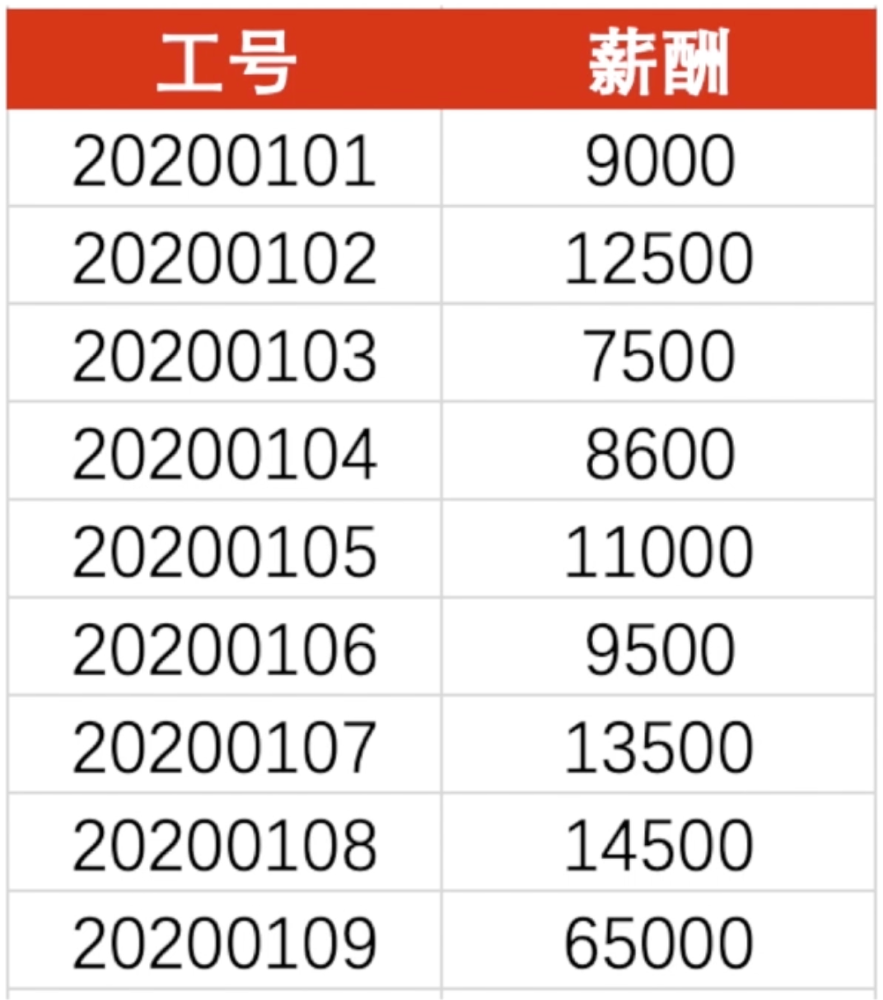

- 加和：151100
- 平均值：16789

那通过观察，你会发现：16789 的平均值，其实符合我们整体薪酬水平的概念吗？我上标中大概有八个都没有达到平均值，这个时候你可以思考一下：是什么原因？

你会发现表中有一个很凸匹的值：65000，也就是一个比其他薪酬高出两到三倍的数值，这也就是我们所说的异常值。大大的拉高了我们平均值的水平。

那关于异常值的识别和处理，在这个章节我会用两课时带你了解一下，这也是我们做数据分析前期或者数据分析过程中必做的一步。

如果你不用一些科学的方法，去处理异常值的话，它「异常值」会导致你平均值等，集中趋势指标出现异常「谬误」。

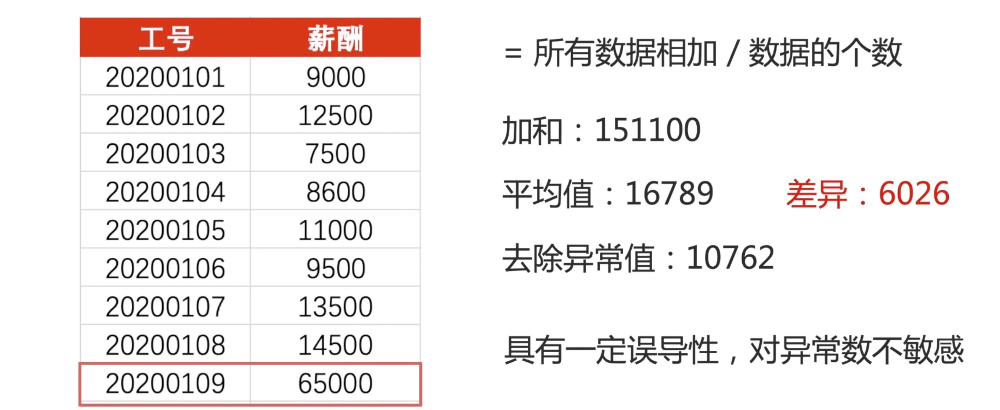

这个时候，我们把异常值去除，去除之后。我们再一次计算八个数据的加和、除以个数就可以得到平均值：`去除异常值后的平均值：10762`。

我们可以发现，有异常值和无异常值的平均值，中间差异值会达到：6026。这是一个非常大的差异值。

**也就是说：单纯的去计算平均值，是具有一定误导性的，因为平均值对于异常值「异常数据」不敏感。**

那这个时候，我们可以引入 **中位数** 的概念。

## 中位数

中位数指的是，一组数据按顺序排列后，居于中间位置的数。

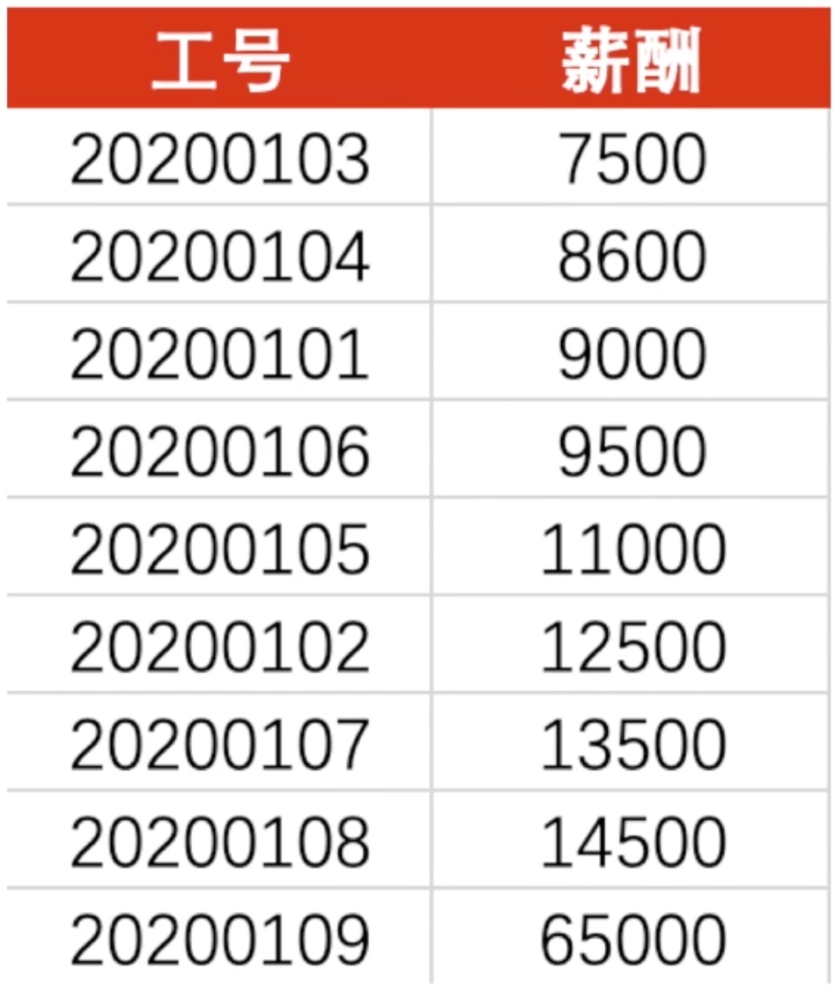

我们讲刚刚上面九个人的薪酬，从小到大排列一下。

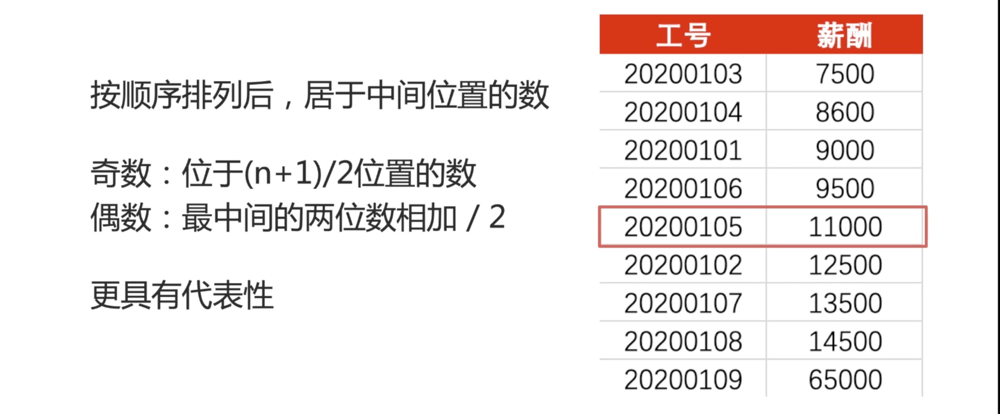

最小的 7500，最大的 65000。位于中间的数值 11000。「也就是 (9 + 1)/2 的位置」

如果整体数据数量是偶数，那就是最中间的两位数相加/2。

这里的中位数是 11000，这个值相对于平均值 10762。显然中位数更能代表这组数据的中间水平。「**中位数更具有代表性**」

## 众数

众数指的是出现次数最多的数值。

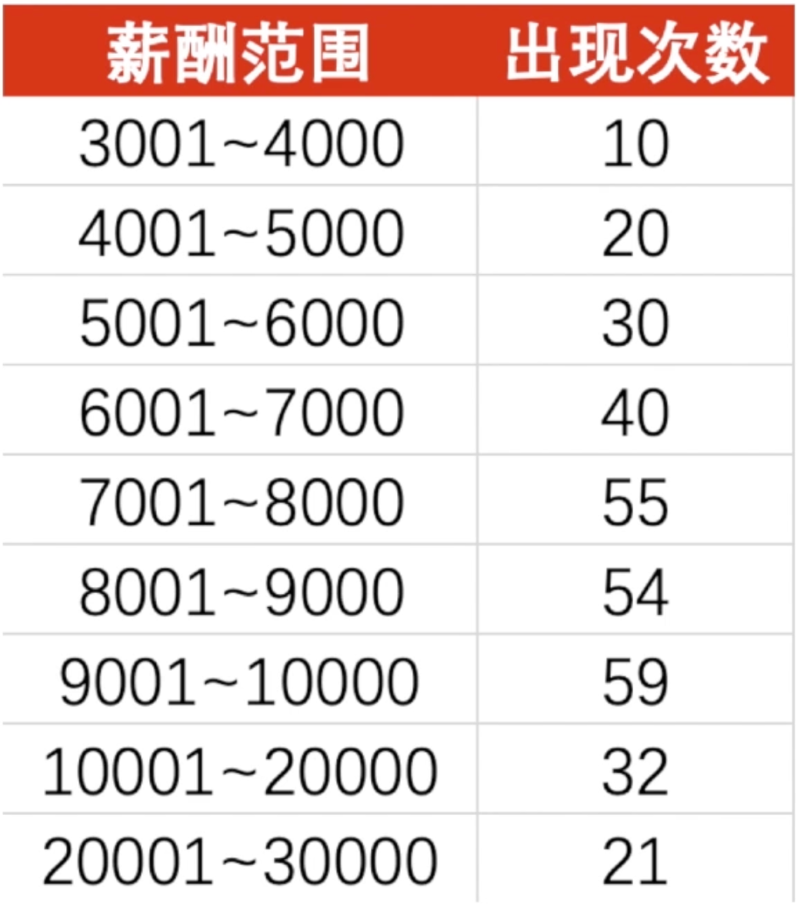

我现在统计三百多人的薪酬，并且将这九个薪酬分为九个不同范围，对应薪酬范围人员出现次数，我也统计在上标中了。

我们可以发现出现次数最大的值是 59，也就是它对应的 9001 到 10000 是我们这里所提到的众数。

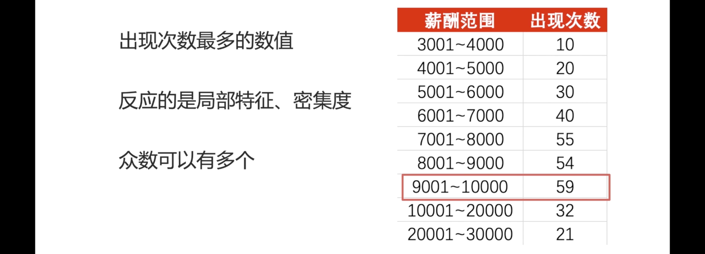

众数反应的是局部的特征，也就是最密集、最频繁出现的数据项，就是我们所说的众数。对于众数来说，是可以有多个的。

假设我们 7001～8000、8001～9000 它们对应出现的次数都是 59，那么它们都是众数。

那对于，集中趋势指标。不同的，统计方式、统计标准。——都是从不同的维度，反应了我们的样本特性。那将刚刚的薪酬区间与对应的次数「人数」，画成折线图，我们得到下面的图表格。

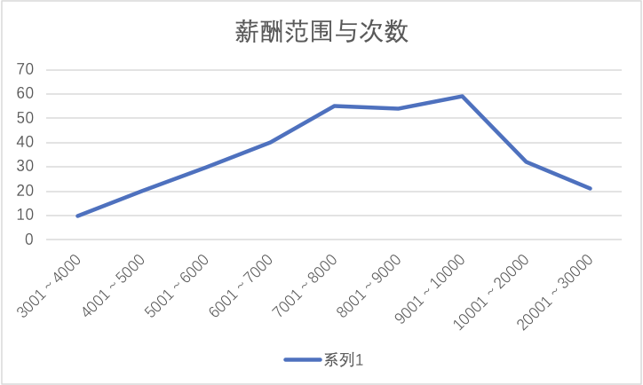

x 轴是我们的薪酬范围。纵轴「y」是我们的人数。通过连点成线的方式，我们得到了中间高两边低的折线图。

那以这张图为例，我们来回顾一下今天学习的内容：

- 平均值：平均值是所有数据加和得到的值，除以它的个数。在上图也就是我们所有 300 多人的薪酬相加在一起，除以三百多人的个数。得到的平均值是 9500。

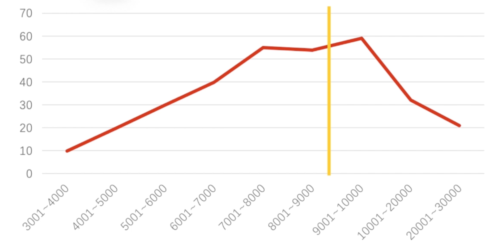

也就是我们每个人能拿到的钱是 9500「平均值」。

- 中位数：指的是数据项从小到达排列之后，处于中间的值。也就是 7001～8000。如果，你在这三百多人中，拿到了八千以上的薪酬，那说明你的薪酬是处在中上位置的。

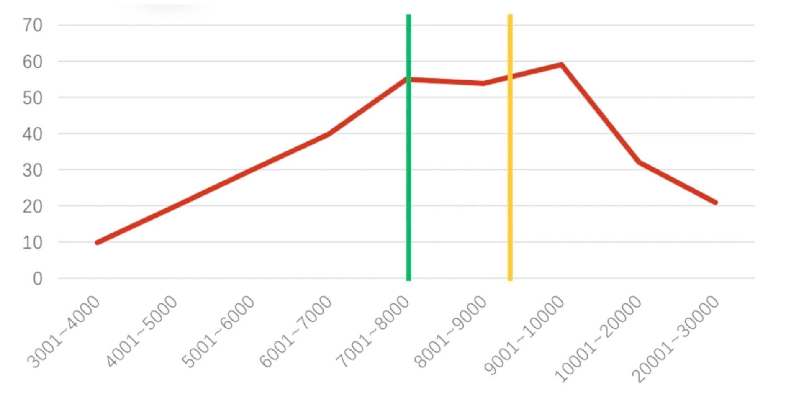

- 众数：指的是出现次数最多的数值，也就是这里最高的点所对应的 9001～10000。也就是说：在这三百多人中，拿 9001～10000 是最普遍的现象。

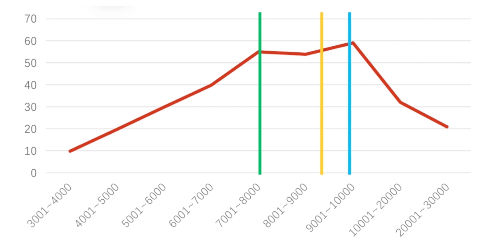

## 课后作业

基于本节课所学习的内容，给大家两组薪酬数据，计算这两组薪酬数据的 **平均值、中位数、众数** ，并根据平均值、中位数和众数来判断哪一组的薪酬水平更高，原因是什么？

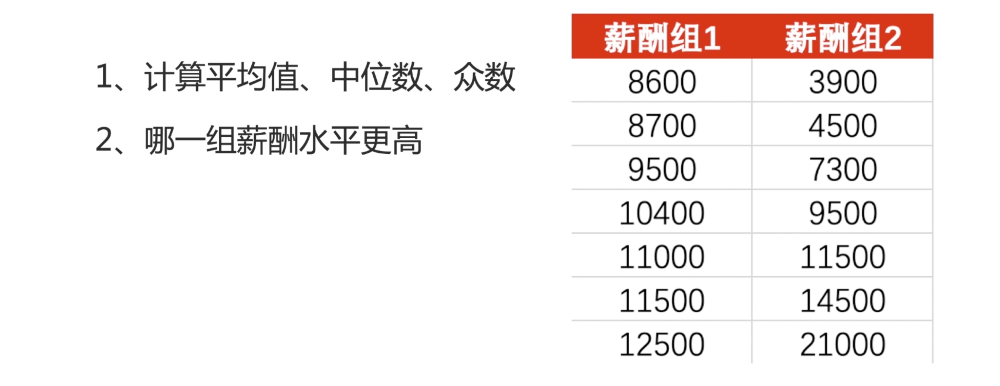

你也可以把自己判断的理由和根据发表出，大家一起讨论～～

> **Tips**：这两组薪酬数据的平均值是相等的哦，本节课作业的答案也会放到代码仓库去。

## 期待你和我一起，用数据解析世界

欢迎关注我公众号：AI悦创，有更多更好玩的等你发现！

::: details 公众号：AI悦创【二维码】

:::

::: info AI悦创·编程一对一

AI悦创·推出辅导班啦，包括「Python 语言辅导班、C++ 辅导班、java 辅导班、算法/数据结构辅导班、少儿编程、pygame 游戏开发」，全部都是一对一教学：一对一辅导 + 一对一答疑 + 布置作业 + 项目实践等。当然，还有线下线上摄影课程、Photoshop、Premiere 一对一教学、QQ、微信在线，随时响应！微信：Jiabcdefh

C++ 信息奥赛题解，长期更新！长期招收一对一中小学信息奥赛集训，莆田、厦门地区有机会线下上门，其他地区线上。微信：Jiabcdefh

方法一：[QQ](http://wpa.qq.com/msgrd?v=3&uin=1432803776&site=qq&menu=yes)

方法二：微信：Jiabcdefh

:::

