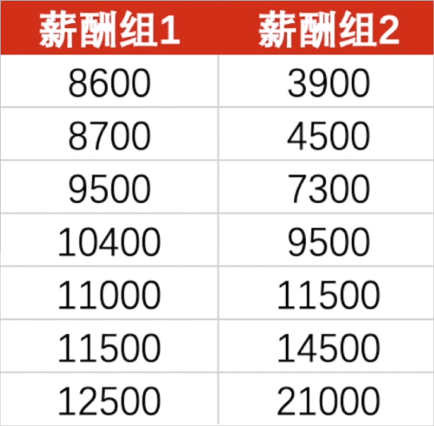
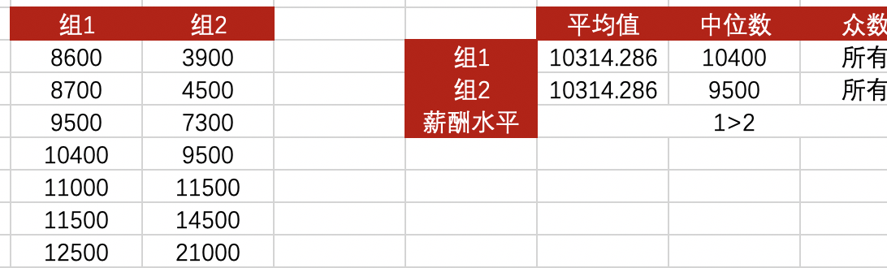

## 任务描述

基于本节课所学习的内容，给大家两组薪酬数据，计算这两组薪酬数据的**平均值、中位数、众数**，并根据平均值、中位数和众数来判断哪一组的薪酬水平更高，原因是什么？

你也可以把自己判断的理由和根据发表出，大家一起讨论～～

> **Tips**：这两组薪酬数据的平均值是相等的哦，本节课作业的答案也会放到代码仓库去。

<button name="button" style="color: black"><a href="/sjfx/Homework/2-4统计指标：集中趋势.xlsx" target="_blank">答案</a></button>

## 期待你和我一起，用数据解析世界

欢迎关注我公众号：AI悦创，有更多更好玩的等你发现！

::: details 公众号：AI悦创【二维码】

:::

::: info AI悦创·编程一对一

AI悦创·推出辅导班啦，包括「Python 语言辅导班、C++ 辅导班、java 辅导班、算法/数据结构辅导班、少儿编程、pygame 游戏开发」，全部都是一对一教学：一对一辅导 + 一对一答疑 + 布置作业 + 项目实践等。当然，还有线下线上摄影课程、Photoshop、Premiere 一对一教学、QQ、微信在线，随时响应！微信：Jiabcdefh

C++ 信息奥赛题解，长期更新！长期招收一对一中小学信息奥赛集训，莆田、厦门地区有机会线下上门，其他地区线上。微信：Jiabcdefh

方法一：[QQ](http://wpa.qq.com/msgrd?v=3&uin=1432803776&site=qq&menu=yes)

方法二：微信：Jiabcdefh

:::

