你好，我是悦创。

上节课我们学习了，集中趋势指标，并通过计算平均值、中位数、众数，了解了数据样本的一般水平。这节课，我们学习离散趋势指标，来了解一个数据的内部差异有多大。

## 什么是离散趋势指标

我以两支股票价格波动数据为例：

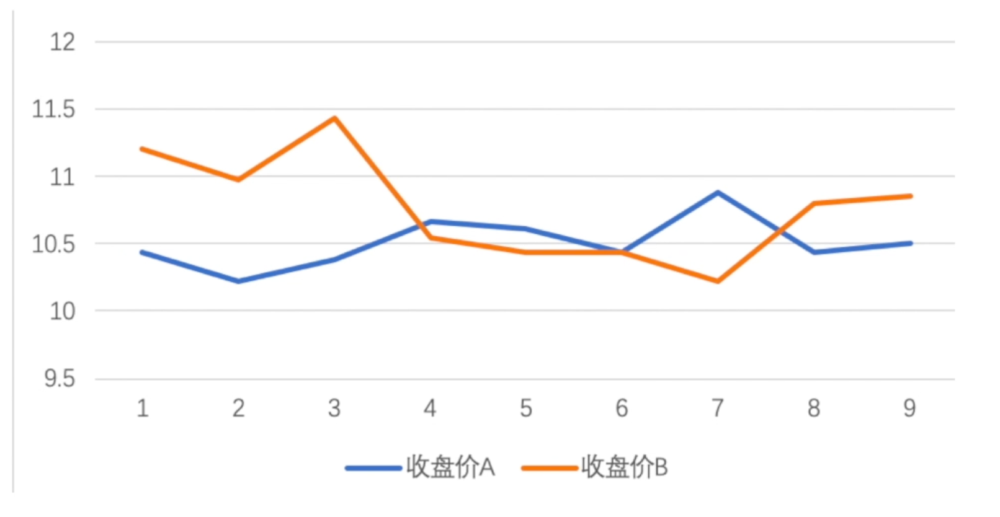

可以看到，股票 A，也就是蓝色这条线，它的波动比较平缓。股票 B 也就是橘色的那条，波动比较大。

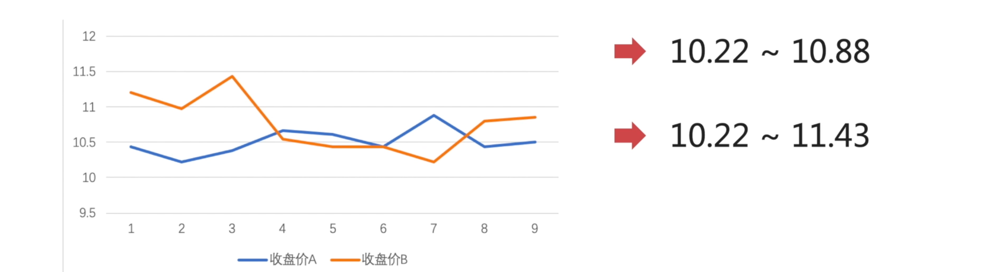

那用数值化来表示，股票 A 的波动幅度是在：10.22～10.88 之间；

股票 B 的波动幅度是在 10.22～11.43 之间。

通过图示，我们可以得出一个很简单的结论：股票 A 相对于股票 B——波动的幅度是更小的。「股票 B 比股票 A 更离散」

**离散趋势指标，作为体现样本数据内部差异度的指标。** 主要有三类指标可以表示：

- 极差
- 平均差
- 标准差

接下来，我们来看看这几个指标的具体概念和区别。

## 极差

我们将收盘价的数据，以折线图的形式进行表示：

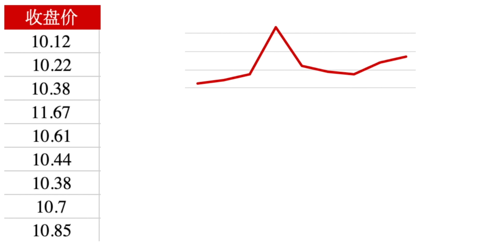

**极差就是求：两个相差最远点的之间的距离。**

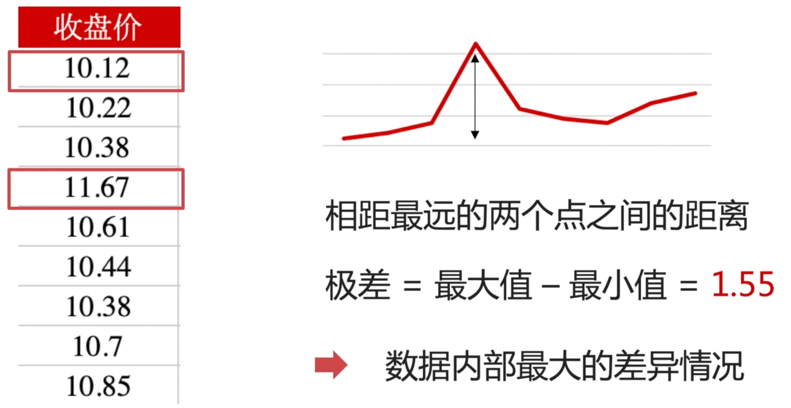

那在上面的收盘价中，最小的值是 10.12，最大的值是 11.67。那通过计算：**极差=最大值-最小值=1.55** ，它体现的就是数据内部最大的差异情况。

**那么极差大样本的数据，内部一定离散程度高吗？**

我们来观察两组数据：

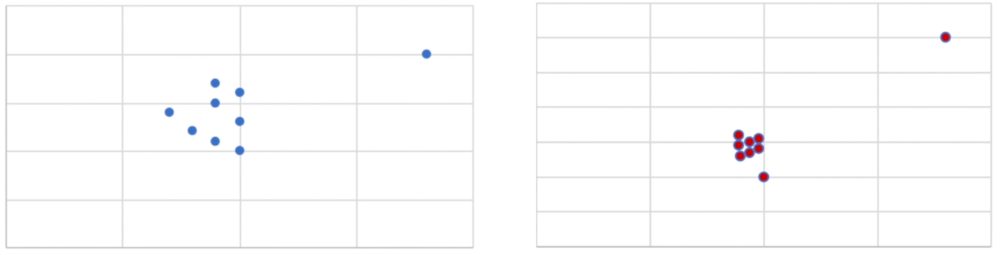

可以试想一下，上图左边是公司项目组 A 的业绩情况，右边是公司项目组 B 的业绩情况。

在项目组 A 中，表现最好与表现最差的，它们相差额度是 100万。

在项目组 B 中，表现最好与表现最差的，它们相差额度是 200万。

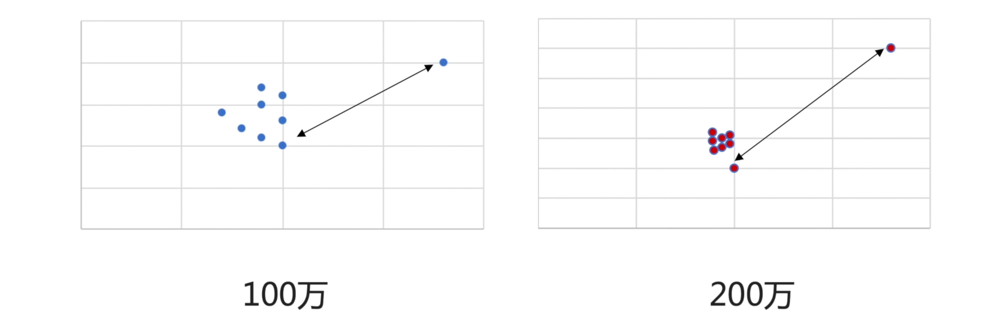

那么，通过观察我们的图表，项目组 A 相差 100 万，它们内部的离散程度，一定比项目组 B 相差 200 万极差的数据，离散程度要更小吗？——其实不一定的，也就是说： **极差不能体现，数据内部真正的离散程度** 。那么想要知道一组数据内部真正的差异情况，我们可以使用平均差。

## 平均差

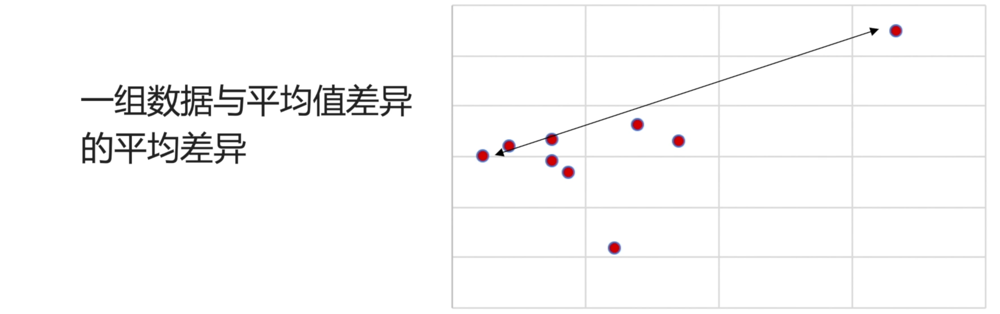

平均差，就是指：每一个点，每一个数据，它相对于我们的平均值，与平均值之间的平均距离——也就是点与点之间的平均差异程度，就是我们的平均差。

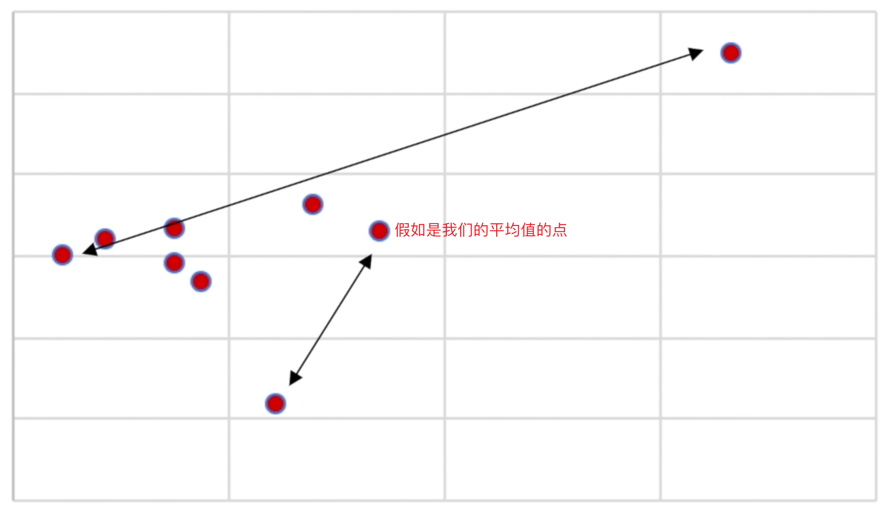

公式：

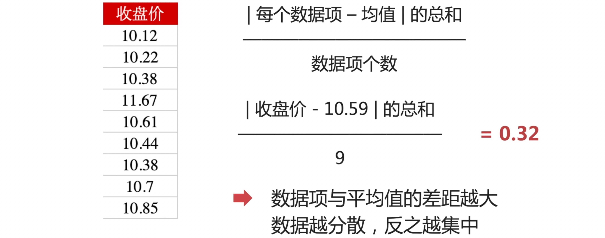

上面的 0.32 指的就是我内部的价格差异。

观察公式我们可以发现，我们 **数据项个数** 其实是不会变的，而分母的 **|收盘价-均值|** 差异越大，不就证明我这个公式的分母就越大。我这个平均差的指标就会越大，那数据内部的离散程度就越大。

这个时候，我们稍微的计算收盘价，头两天的交易差价，大概在 0.1 左右。头三天是在 0.26 = 10.38 - 10.12。

这几个值，你算起来都比 0.32 小的。那这个时候，你就要思考一下，是不是存在 **异常值** 导致这个平均差，比我们实际的真实情况要更大。

那为了，更好的观察到，我们每天收盘价的变化，我把涨跌幅也放进去。

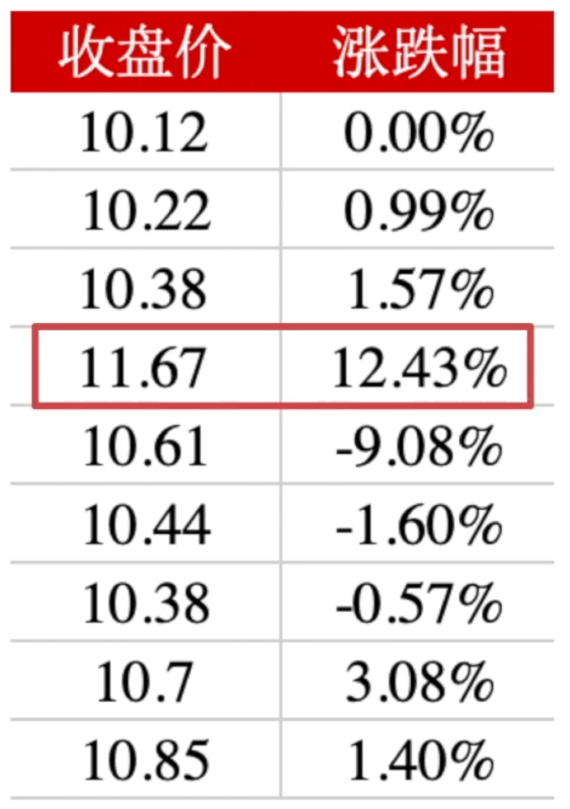

大家可以观察一下，它明显是一个异常值的数据。

那这个异常值，产生的原因有很多。

- 在股票市场中：可能是股东回购，导致这个市值上涨；或者是行业或者政策的利好；又或者是因为，供需失衡，导致市场对于这一家公司业务需求度上涨，然后导致股票的估值也上涨。当然还有其他原因。。。都会导致数据的异常。
- 但问题是：这种问题虽然是由事件驱动型，导致的异常数据，在样本量较小的时候，容易导致误差。但是！这个异常数据又是真实存在的数据，我们不能通过简单的刨除、或者使用其他数值来代替这个数据。
- 那这个时候，为了更好的去突出，对于离散程度，对于这种异常数据的敏感度，我们基于平均差，发展出了 **标准差**。

## 标准差

标准差的公式和平均差很相似：

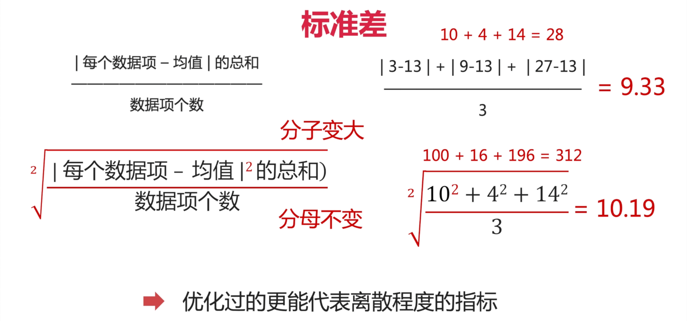

相对于平均差，标准差更能够体现离散程度指标。说白了，更加放大了，它们之间的差异程度。

我们还是用刚刚的收盘股票数据，来验证一下。收盘价 A 是原有的收盘价数据，收盘价 B 是把异常值换成了和上一个交易日相同的数据。（也就是抹去了异常值的存在）

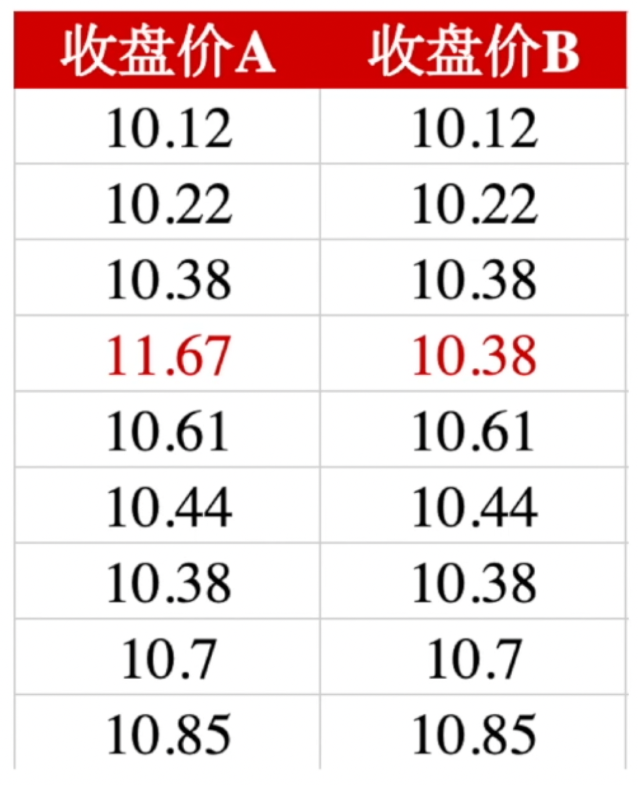

那这个时候，我们计算这两组数据的平均差和标准差。

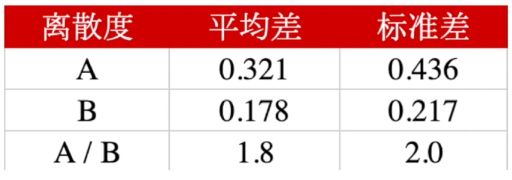

A/B 的平均差，差了 1.8 倍。标准差差了 2.0 倍。也就是说用标准差更能「更直观」体现数据内部的差异程度。「离散程度」

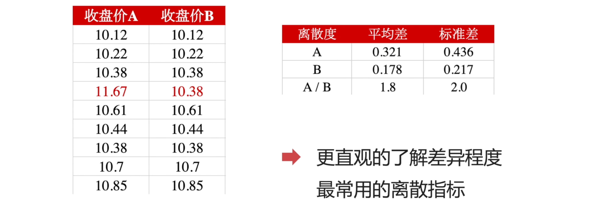

实际上，标准差也是我们最常用的离散指标。在风控相关的：比如股票投资品类的风险的时候，我们都是使用标准差来对价格数据进行计算。

**标准差越大的，风险也就会越大。因为，它的波动幅度越大。**

## 章节回顾

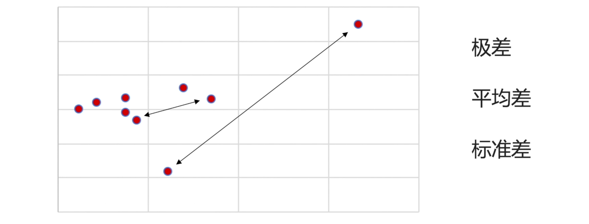

## 课后作业

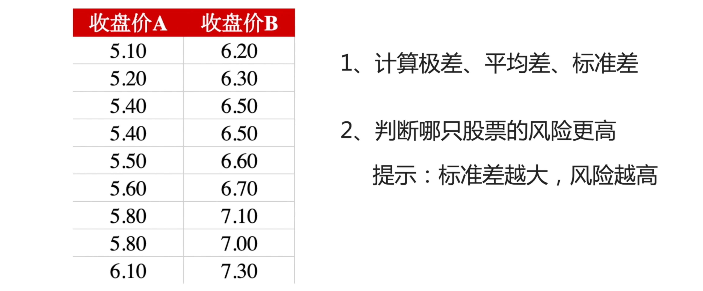

## 期待你和我一起，用数据解析世界

欢迎关注我公众号：AI悦创，有更多更好玩的等你发现！

::: details 公众号：AI悦创【二维码】

:::

::: info AI悦创·编程一对一

AI悦创·推出辅导班啦，包括「Python 语言辅导班、C++ 辅导班、java 辅导班、算法/数据结构辅导班、少儿编程、pygame 游戏开发」，全部都是一对一教学：一对一辅导 + 一对一答疑 + 布置作业 + 项目实践等。当然，还有线下线上摄影课程、Photoshop、Premiere 一对一教学、QQ、微信在线，随时响应！微信：Jiabcdefh

C++ 信息奥赛题解，长期更新！长期招收一对一中小学信息奥赛集训，莆田、厦门地区有机会线下上门，其他地区线上。微信：Jiabcdefh

方法一：[QQ](http://wpa.qq.com/msgrd?v=3&uin=1432803776&site=qq&menu=yes)

方法二：微信：Jiabcdefh

:::

