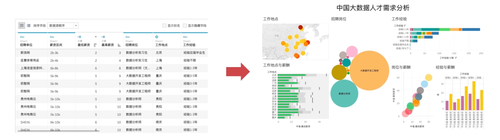
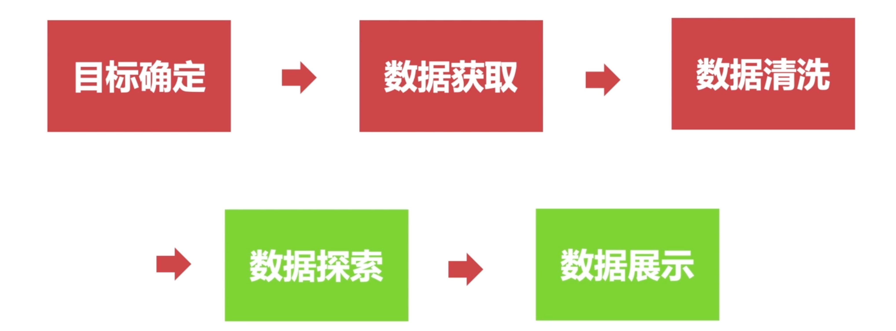
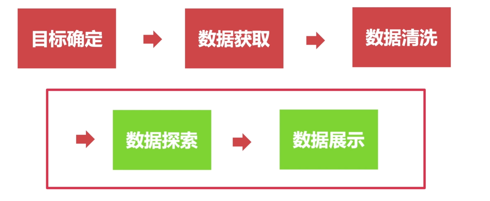
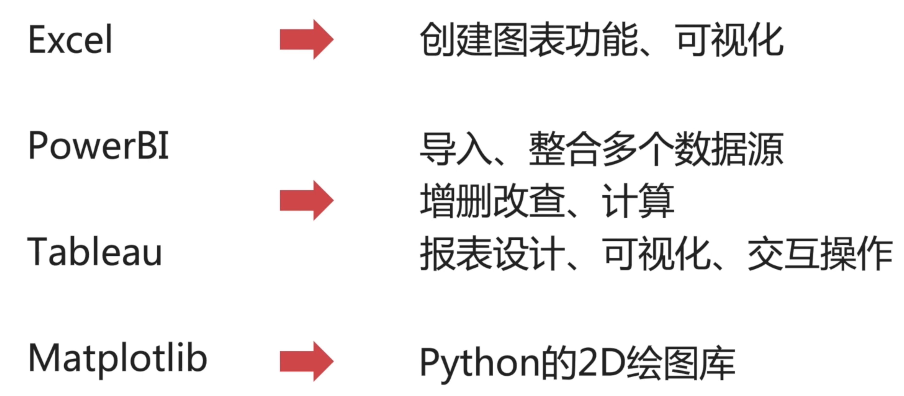
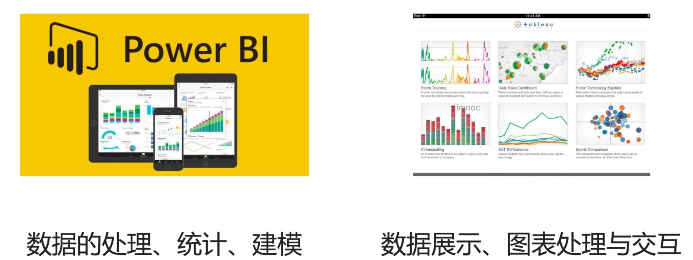
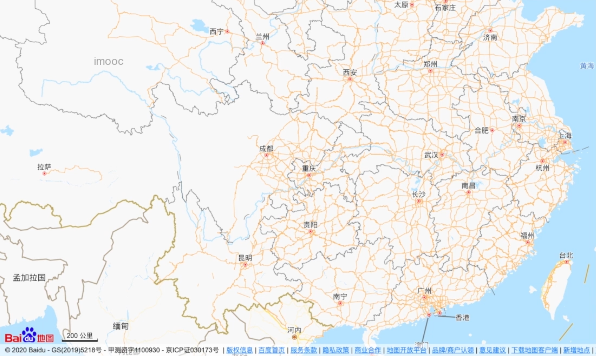
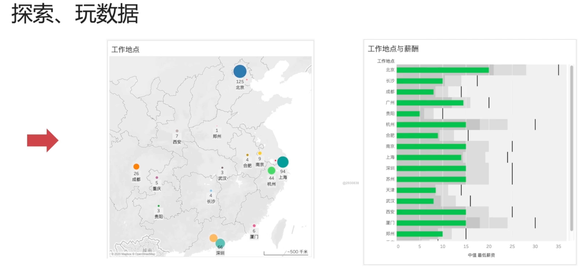

## 1. 什么是 Tableau

### 1.1 什么是数据可视化工具

那么，可以进行可视化的应用软件、程序、编程语言。

那么，在数据分析中它属于哪个环节呢？

而可视化，在数据探索和数据展示都有应用。

我们通过创建图表，更好的理解数据，以此发现规律。也会将合适的图表作为展示和讲解的依据。

### 1.2 数据可视化工具有哪些

<table>
    <tr>
        <th>名称</th>
        <th>功能</th>
    </tr>
    <tr>
        <td>Excel</td>
        <td>创建图表功能、可视化</td>
    </tr>
    <tr>
        <td>PowerBI</td>
        <td rowspan="2">导入、整合多个数据源，进行增删改查、基础的计算、报表设计、可视化、交互操作</td>
    </tr>
    <tr>
        <td>Tableau</td>
        <!-- 注意这里没有功能描述的单元格，因为我们在上一行已经设置了 rowspan="2" -->
    </tr>
    <tr>
        <td>Matplotlib</td>
        <td>Python 的 2D 绘图库</td>
    </tr>
</table>

::: details Other

| 名称       | 功能                                                         |
| ---------- | ------------------------------------------------------------ |
| Excel      | 创建图表功能、可视化                                         |
| PowerBI    | 导入、整合多个数据源，进行增删改查、计算、报表设计、可视化、交互操作 |
| Tableau    | 导入、整合多个数据源，进行增删改查、计算、报表设计、可视化、交互操作 |
| Matplotlib | Python 的 2D 绘图库                                          |

:::

那么，PowerBI 和 Tableau 有什么区别呢？

- PowerBI 会更侧重数据的处理、统计、建模，它入门更容易。因为是微软旗下的，很多功能和 Excel 都很类似。
- Tableau 更侧重于对数据的展示、图表的精细处理，以及交互的操作等等

**那，什么是交互呢？**

——以百度地图为例，我们可以使用鼠标进行放大缩小整张地图。我们也可以使用拖拉拽来查看地图的不同区域。可以去百度地图网站去感受一下。「这个就是和数据完成交互的过程」

对于 Excel 和 PowerBI 来说，它们更侧重于展示。

也就是，这个数据我们可以直接看见。在数据实时更新情况下，Tableau 在交互方面下了很大功夫。

### 1.3 为什么选择 Tableau

Tableau 交互性更强，很多时候，也就是我们刚刚获取到数据的时候，我们对数据其实是挺陌生的。

我们也不知道数据具体的分布是怎么样的，数据表现是怎么样的。

不同数据维度，之间的关系是怎么样的。——那，怎么办呢？

我自己摸索出来的一个方法，就是先玩数据，先探索数据。

那怎么玩呢？

——我们可以使用 Tableau 进行各种拖拉拽，各种可视化。

- 比如，使用地图工具，去看工作地点的分布。
- 统计职位的数量或者是看看薪酬和工作地点的相关性。

- 探索、玩数据

欢迎关注我公众号：AI悦创，有更多更好玩的等你发现！

::: details 公众号：AI悦创【二维码】

:::

::: info AI悦创·编程一对一

AI悦创·推出辅导班啦，包括「Python 语言辅导班、C++ 辅导班、java 辅导班、算法/数据结构辅导班、少儿编程、pygame 游戏开发」，全部都是一对一教学：一对一辅导 + 一对一答疑 + 布置作业 + 项目实践等。当然，还有线下线上摄影课程、Photoshop、Premiere 一对一教学、QQ、微信在线，随时响应！微信：Jiabcdefh

C++ 信息奥赛题解，长期更新！长期招收一对一中小学信息奥赛集训，莆田、厦门地区有机会线下上门，其他地区线上。微信：Jiabcdefh

方法一：[QQ](http://wpa.qq.com/msgrd?v=3&uin=1432803776&site=qq&menu=yes)

方法二：微信：Jiabcdefh

:::

