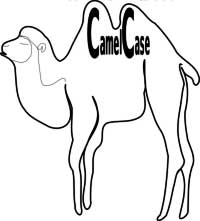

::: info 注解

在英语中，依靠单词的大小写拼写复合词的做法，叫做"骆驼拼写法"（CamelCase）。比如，backColor 这个复合词，color 的第一个字母采用大写。

这种拼写法在正规的英语中是不允许的，但是在编程语言和商业活动中却大量使用。比如，sony 公司的畅销游戏机 PlayStation，play 和 station 两个词的词首字母都是大写的。

:::

它之所以被叫做"骆驼拼写法"，是因为大小写的区分使得复合词呈现"块状"（bump），看上去就像骆驼的驼峰（hump）。

"骆驼拼写法"又分为两种。第一个词的首字母小写，后面每个词的首字母大写，叫做"小骆驼拼写法"（lowerCamelCase）；第一个词的首字母，以及后面每个词的首字母都大写，叫做"大骆驼拼写法"（UpperCamelCase），又称"帕斯卡拼写法"（PascalCase）。

在历史上，"骆驼拼写法"早就存在。苏格兰人的姓名中的 Mac 前缀就是一例，比如著名歌手 Paul MacCartney 的名字中，M 和 C 都是大写的，如果将 C 小写就是错误的。另一个例子是，著名化学品公司杜邦公司的名字 DuPont。

但是，这种拼写法真正流行，还是在 80 年代以后，那时正是计算机语言开始兴起的时候。许多著名的计算机语言依靠单词不同的大小写来区分变量。在计算机语言中，还有一种"匈牙利拼写法"（Hungarian Type Notation），变量中每个单词的首字母都大写，然后变量名的最前面再加一个小写字母，表示这个单词的数据类型。比如，iMyTestValue 这个变量名，就表示它是一个整数变量（integer）。据说，微软公司最喜欢使用"匈牙利拼写法"。

（完）

::: details 公众号：AI悦创【二维码】

:::

::: info AI悦创·编程一对一

AI悦创·推出辅导班啦，包括「Python 语言辅导班、C++ 辅导班、java 辅导班、算法/数据结构辅导班、少儿编程、pygame 游戏开发、Linux、Web」，全部都是一对一教学：一对一辅导 + 一对一答疑 + 布置作业 + 项目实践等。当然，还有线下线上摄影课程、Photoshop、Premiere 一对一教学、QQ、微信在线，随时响应！微信：Jiabcdefh

C++ 信息奥赛题解，长期更新！长期招收一对一中小学信息奥赛集训，莆田、厦门地区有机会线下上门，其他地区线上。微信：Jiabcdefh

方法一：[QQ](http://wpa.qq.com/msgrd?v=3&uin=1432803776&site=qq&menu=yes)

方法二：微信：Jiabcdefh

:::

