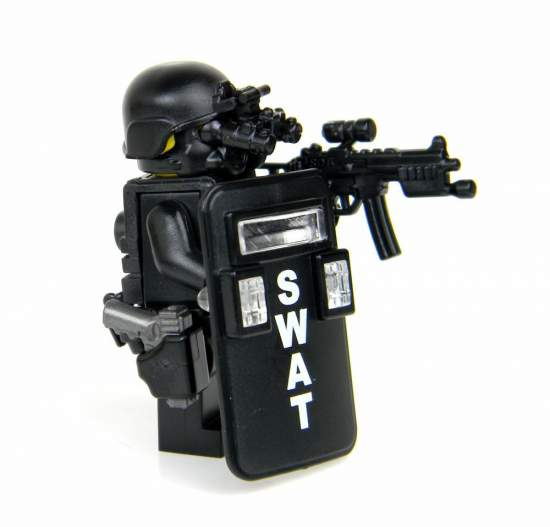
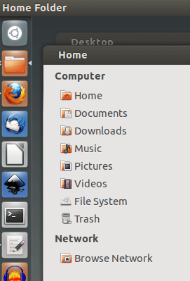
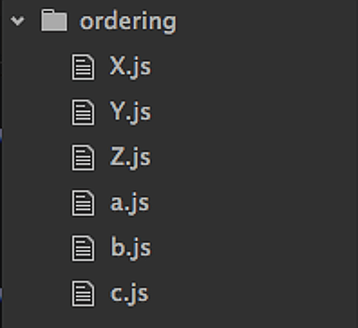
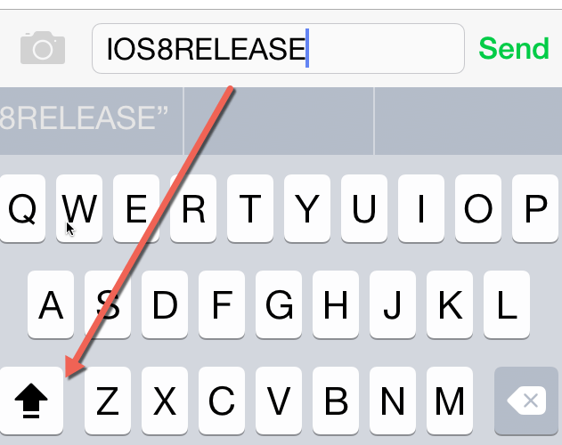

::: tip 摘要

"文件名建议只使用小写字母，不使用大写字母。"

"为了醒目，某些说明文件的文件名，可以使用大写字母，比如`README`、`LICENSE`。"

:::

网友看见了，就提问为什么文件名要小写？


::: info 我的回答

这是 Linux 传统，主要有两个原因，一是有些系统会自动生成大写的目录名，比如`Downloads`、`Desktop`、`Documents`，小写的文件名可以与系统文件区分；二是，大写需要按下 Shift 键，比较麻烦。

:::

说实话，虽然这是 Linux 传统，我却从没认真想过原因。赶紧查资料，结果发现四个很有说服力的理由，支持这样做。

下面就是这四个理由。另外，文后我还会发布一条编程一对一培训的消息。

## 1. 可移植性

Linux 系统是大小写敏感的，而 Windows 系统和 Mac 系统正好相反，大小写不敏感。一般来说，这不是大问题。

但是，如果两个文件名只有大小写不同，其他都相同，跨平台就会出问题。

> - `foobar`
> - `Foobar`
> - `FOOBAR`
> - `fOObAr`

上面四个文件名，Windows 系统会把它们都当作 `foobar`。如果它们同时存在，你可能没办法打开后面三个文件。

另一方面，在 Mac 系统上开发时，有时会疏忽，写错大小写。

```javascript
// 正确文件名是 MyModule.js
const module = require('./myModule');
```

上面的代码在 Mac 上面可以运行，因为 Mac 认为 `MyModule.js` 和 `myModule.js` 是同一个文件。但是，一旦代码到服务器运行就会报错，因为 Linux 系统找不到 `myModule.js`。

如果所有的文件名都采用小写，就不会出现上面的问题，可以保证项目有良好的可移植性。

## 2. 易读性

小写文件名通常比大写文件名更易读，比如 `accessibility.txt` 就比 `ACCESSIBILITY.TXT` 易读。

有人习惯使用[驼峰命名法](./camelcase.md)，单词的第一个字母大写，其他字母小写。这种方法的问题是，如果遇到全部是大写的缩略词，就会不适用。



比如，一个姓李的纽约特警，无论写成 `NYPoliceSWATLee` 还是 `NyPoliceSwatlee` ，都怪怪的，还是写成 `ny-police-swat-lee`比较容易接受。

## 3. 易用性

某些系统会生成一些预置的用户目录，采用首字母大写的目录名。比如，Ubuntu 在用户主目录会默认生成 `Downloads`、 `Pictures`、`Documents` 等目录。



Mac 系统更过分，一部分系统目录也是大写的，比如`/Library/Audio/Apple Loops/`。

另外，某些常见的配置文件或说明文件，也采用大写的文件名，比如 `Makefile`、`INSTALL`、`CHANGELOG`、`.Xclients`和 `.Xauthority` 等等。

所以，用户的文件都采用小写文件名，就很方便与上面这些目录或文件相区分。

如果你打破砂锅问到底，为什么操作系统会采用这样的大写文件名？原因也很简单，因为早期 Unix 系统上，`ls`命令先列出大写字母，再列出小写字母，大写的路径会排在前面。因此，如果目录名或文件名是大写的，就比较容易被用户首先看到。



## 4. 便捷性

文件名全部小写，还有利于命令行操作。比如，某些命令可以不使用`-i`参数了。

```bash
# 大小写敏感的搜索
$ find . -name abc
$ locate "*.htmL"

# 大小写不敏感的搜索
$ find . -iname abc
$ locate -i "*.HtmL"
```



另外，大写字母需要按下 Shift 键，多多少少有些麻烦。如果文件名小写，就不用碰这个键了，不仅省事，还可以提高打字速度。

程序员长时间使用键盘，每分钟少按几次 Shift，一天下来就可以省掉很多手指动作。长年累月，也是对自己身体的一种保护。

综上所述，文件名全部使用小写字母和连词线（all-lowercase-with-dashes），是一种值得推广的正确做法。

## 5. 读者提问

搭车问一个问题，现在很多应用都有标签功能（tags），例如 Evernote 的标签系统，我经常用。但是随着标签的不断增多，变得越来越难以管理，因此想借悦创老师博客的光，咨询下悦创老师和众多网友，有关标签的使用经验。

1. 请问标签，应统一用一种语言（全英文或全中文等），还是根据文章的语言决定？我现在是全英文标签，方便管理，但是有时根据中文语境又无法推断当初设定的英文标签。
2. 请问标签，应该大写、小写、还是首字母大写？例如 LINUX / linux / Linux 等。
3. 请问一篇文章的标签，应该越多越细节化，还是应该越独特越命中率高呢？
4. 大家最常用的标签是什么呢？我是 IT / linux / skill / life / education ，感觉越来越和笔记本分类趋同了，一个笔记本分类内大量相同标签。

「我相信倘有请益的时候，先生是一定不吝赐教的。」:-)

::: info 回答

我现在处理照片是这样做的：建立一个目录，按照 [日期]-[一级地点]-[二级地点] 命名，比如“2023-01-25-杭州-西湖”，这样不仅浏览方便，将来用脚本处理也方便。我觉得 tag，也可以借鉴这样处理。

:::

::: details 公众号：AI悦创【二维码】


:::

::: info AI悦创·编程一对一

AI悦创·推出辅导班啦，包括「Python 语言辅导班、C++ 辅导班、java 辅导班、算法/数据结构辅导班、少儿编程、pygame 游戏开发、Linux、Web」，全部都是一对一教学：一对一辅导 + 一对一答疑 + 布置作业 + 项目实践等。当然，还有线下线上摄影课程、Photoshop、Premiere 一对一教学、QQ、微信在线，随时响应！微信：Jiabcdefh

C++ 信息奥赛题解，长期更新！长期招收一对一中小学信息奥赛集训，莆田、厦门地区有机会线下上门，其他地区线上。微信：Jiabcdefh

方法一：[QQ](http://wpa.qq.com/msgrd?v=3&uin=1432803776&site=qq&menu=yes)

方法二：微信：Jiabcdefh

:::


