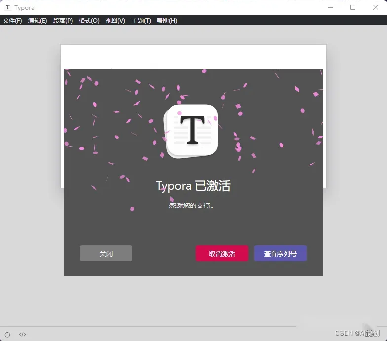
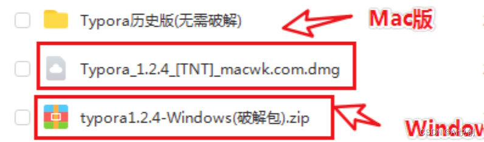
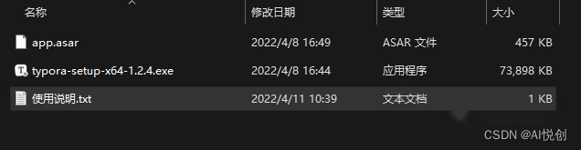
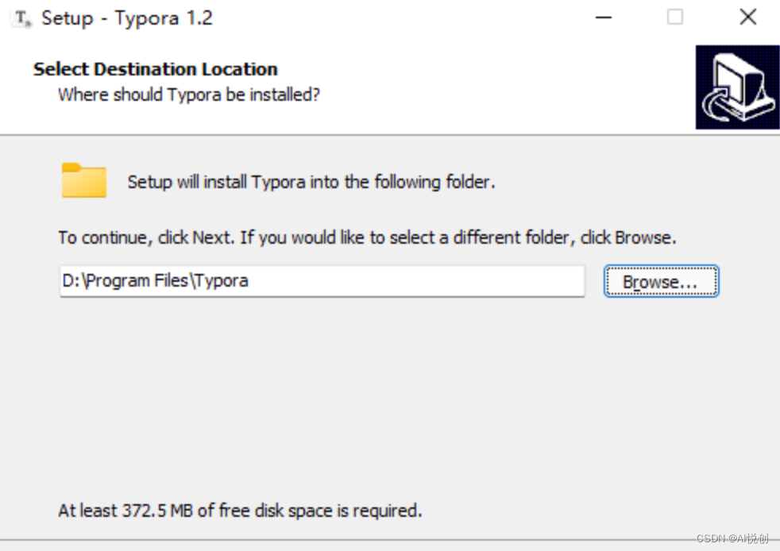
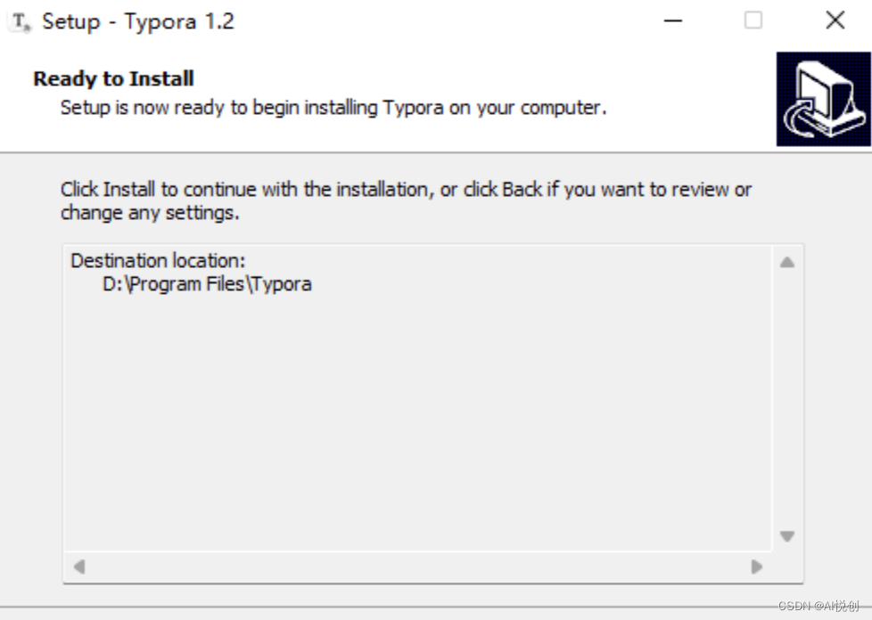
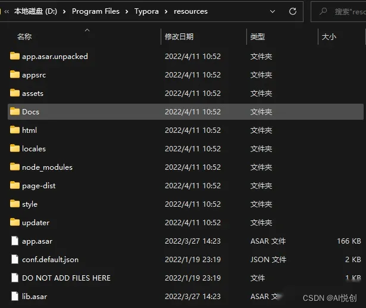
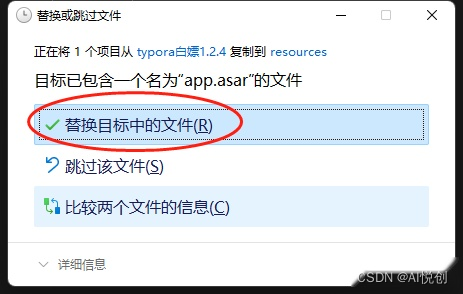
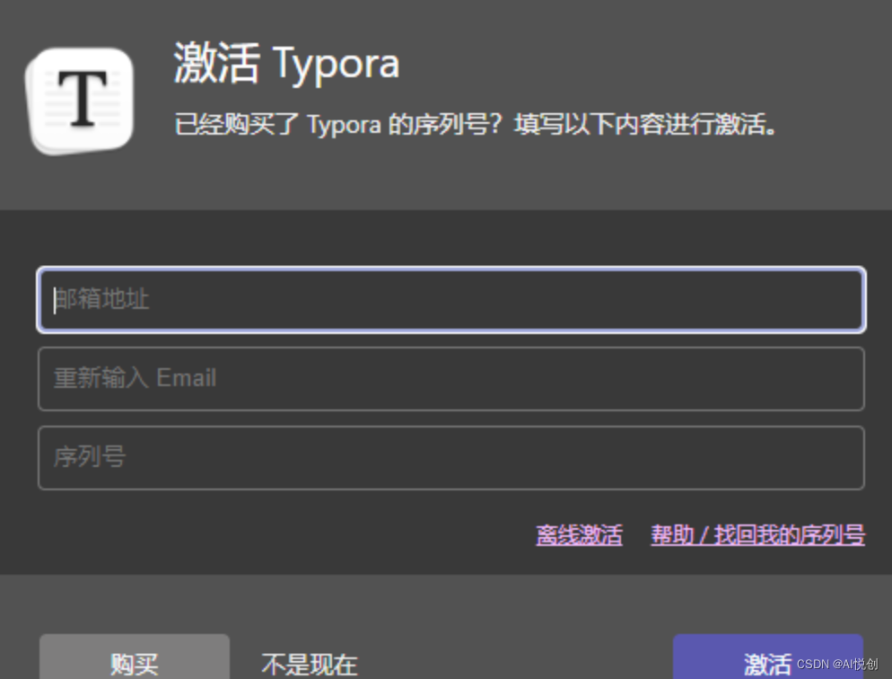
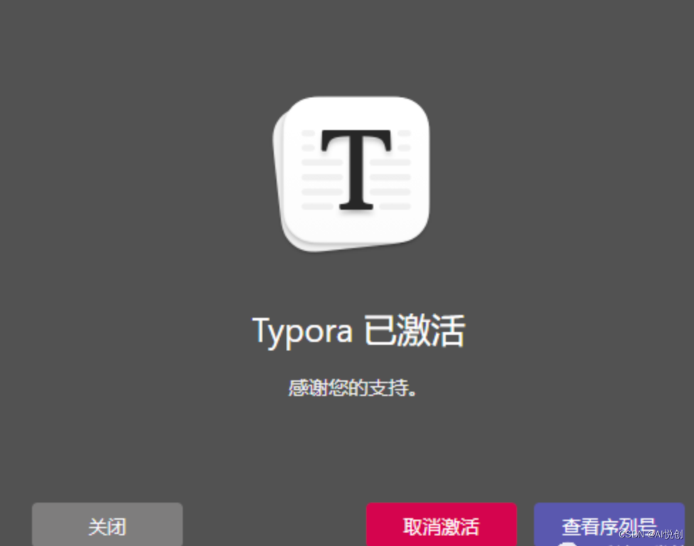

::: tip

关注公众号 “AI悦创”，选择“设为星标” ，优质资源及时送达

:::

你好，我是悦创。

## Typora v1.2.4 （Windows）破解
Typora 是一款简单易用的 Markdown 编辑器。

Markdown 是一种可以使用普通文本编辑器编写的标记语言，通过简单的标记语法，它可以使普通文本内容具有一定的格式，其目标是实现易读易写。

而 Typora 则是一个非常不错的 Markdown 编辑器，它的界面非常的简洁直观，并且功能各方面也是非常的不错，例如实时预览功能在完成输入后就可以看到这些内联样式，并在键入时或按下“Enter”键或焦点到另一个段落后查看块样式。

并且 Typora 将为您提供读者和作家的无缝体验。它删除了预览窗口，模式切换器，降低源代码的语法符号以及所有其他不必要的干扰。将它们替换为真实的实时预览功能，以帮助您专注于内容本身。

## 一、 下载破解文件
下载文件：[https://www.aliyundrive.com/s/LQhGAaNNUmL](https://www.aliyundrive.com/s/LQhGAaNNUmL)

如果失效，关注公众号：AI悦创，加我好友获取。记得备注来意。

mac 版本可以直接安装，windows 版本需要破解。

## 二、 解压文件

下载成功后，解压，目录如下：

## 三、 安装 Typora

点击安装。

将解压出的 `app.asar` 文件移动到 Typora 安装目录 resource 文件夹下，替换掉原本的`app.asar` 。

## 四、 重启Typora

替换掉 `app.asar` 后，重启 Typora。

## 五、输入任意邮箱号与使用说明中提供的序列号完成激活

欢迎关注我公众号：AI悦创，有更多更好玩的等你发现！

::: details 公众号：AI悦创【二维码】

:::

::: info AI悦创·编程一对一

AI悦创·推出辅导班啦，包括「Python 语言辅导班、C++ 辅导班、java 辅导班、算法/数据结构辅导班、少儿编程、pygame 游戏开发」，全部都是一对一教学：一对一辅导 + 一对一答疑 + 布置作业 + 项目实践等。当然，还有线下线上摄影课程、Photoshop、Premiere 一对一教学、QQ、微信在线，随时响应！微信：Jiabcdefh

C++ 信息奥赛题解，长期更新！长期招收一对一中小学信息奥赛集训，莆田、厦门地区有机会线下上门，其他地区线上。微信：Jiabcdefh

方法一：[QQ](http://wpa.qq.com/msgrd?v=3&uin=1432803776&site=qq&menu=yes)

方法二：微信：Jiabcdefh

:::

