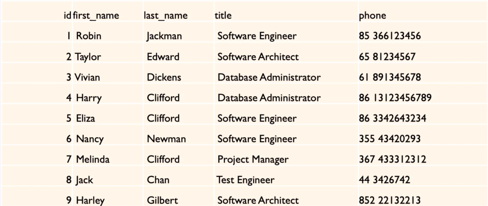
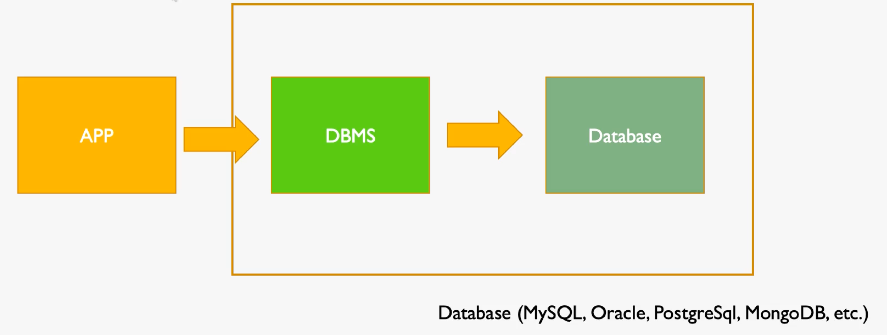

::: tip 关于视频观看

课程视频为合作视频，存储方式特殊，如果要顺利观看视频，请科学上网。[https://bornforthis.cn/vpn.html](https://bornforthis.cn/vpn.html)

:::

## 1. 视频讲解

<VidStack src="https://aiyc.top/SQL-MySQL-Easy-Learn/01/01-什么是Database？.mp4" />

## 2. 什么是 Database？

你好，我是悦创。

欢迎大家来到 Sql/Mysql 入门到精通课程。

## 3. 定义

### 3.1 数据的集合「Collection of Data」

下图是公司员工的通讯录：

上面的表，某种程度就是数据库的 collection 集合。

并且这些数据是按照特定的格式，放到一起的。但是，会有一个问题：如果我们的数据非常多，那我们必然有一个需求——查询。

我要去查找某一个员工的联系方式的时候，这个时候就会不是很方便。

比如我现在要找 Nancy 的电话号码，那我们如果有成千上万条数据的话，很显然：通过这种纯粹的数据集合，我们是没办法做一个便捷的数据查询。

所以这个时候我们就要引入数据库第二个定义。

### 3.2 操作、访问数据的集合「Methods for accessing and manipulating that data」

所以，数据库为我们提供了便捷的操作方法。

### 3.3 DATABASE VS DBMS 「DATABASE MANAGEMENT SYSTEM」「数据库管理系统」

我们可以从软件的角度来看我们的数据库。

- Database：其实是纯粹的数据存储方式
- DBMS：数据库管理系统，对数据的访问接口
- 我们一般在说数据库的时候，说的是：DBMS + Database
- 我们使用者「APP」更多与数据库交互，其实是与 DBMS 进行交互的
- 通过交互不同的 DBMS 来操作真正的 Database

::: details 公众号：AI悦创【二维码】

:::

::: info AI悦创·编程一对一

AI悦创·推出辅导班啦，包括「Python 语言辅导班、C++ 辅导班、java 辅导班、算法/数据结构辅导班、少儿编程、pygame 游戏开发、Linux、Web、Sql」，全部都是一对一教学：一对一辅导 + 一对一答疑 + 布置作业 + 项目实践等。当然，还有线下线上摄影课程、Photoshop、Premiere 一对一教学、QQ、微信在线，随时响应！微信：Jiabcdefh

C++ 信息奥赛题解，长期更新！长期招收一对一中小学信息奥赛集训，莆田、厦门地区有机会线下上门，其他地区线上。微信：Jiabcdefh

方法一：[QQ](http://wpa.qq.com/msgrd?v=3&uin=1432803776&site=qq&menu=yes)

方法二：微信：Jiabcdefh

:::

