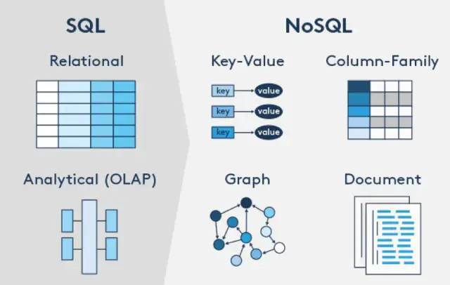
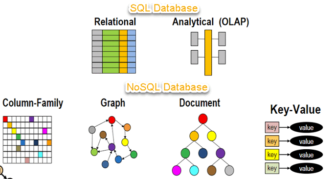

::: tip 关于视频观看

课程视频为合作视频，存储方式特殊，如果要顺利观看视频，请科学上网。[https://bornforthis.cn/vpn.html](https://bornforthis.cn/vpn.html)

:::

## 1. 视频讲解

<VidStack src="https://aiyc.top/SQL-MySQL-Easy-Learn/01/02-SQL和NOSQL.mp4" />

## 2. SQL

上节课我们了解到，我们「APP」操作 DBMS「数据库管理系统」。那肯定使用的是接口吧，接口肯定需要通信语言。这个通信语言肯定是各种各样的，在我们的数据库中叫做：SQL。

- 结构化的查询语言「**Structured Query Language** (SQL) 」
- 是与 DBMS、关系型数据库「Relational Database」通信的标准语言

那有关系型数据库，就会有非关系型数据库。

## 3.SQL VS NO-SQL

一般，我们对于非关系型数据库，我们一般称为 NO-SQL「但这不是绝对的，并不是说 NO-SQL 就代表非关系型数据库」。

我用 SQL 和 NO-SQL 主要用来说明，我们是使用什么语言跟它们通信。

::: details 公众号：AI悦创【二维码】

:::

::: info AI悦创·编程一对一

AI悦创·推出辅导班啦，包括「Python 语言辅导班、C++ 辅导班、java 辅导班、算法/数据结构辅导班、少儿编程、pygame 游戏开发、Linux、Web、Sql」，全部都是一对一教学：一对一辅导 + 一对一答疑 + 布置作业 + 项目实践等。当然，还有线下线上摄影课程、Photoshop、Premiere 一对一教学、QQ、微信在线，随时响应！微信：Jiabcdefh

C++ 信息奥赛题解，长期更新！长期招收一对一中小学信息奥赛集训，莆田、厦门地区有机会线下上门，其他地区线上。微信：Jiabcdefh

方法一：[QQ](http://wpa.qq.com/msgrd?v=3&uin=1432803776&site=qq&menu=yes)

方法二：微信：Jiabcdefh

:::

