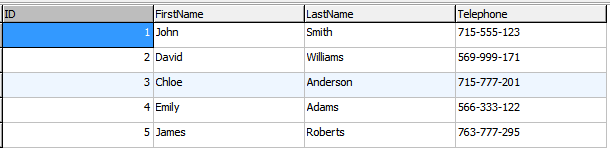

## 1. 数据库简介

### 1.1 什么是数据库?

**数据库**，简而言之可视为电子化的文件柜——存储电子文件的处所，用户可以对文件中的数据进行新增、查询、更新、删除等操作。

所谓“数据库”是以一定方式储存在一起、能与多个用户共享、具有尽可能小的冗余度、与应用程序彼此独立的数据集合。

数据库由存储相关信息的表组成。

例如，如果你想要创建一个像爱奇艺这样的网站，数据库中将包含许多信息, 如视频，用户名，评论 等。

【单选题】以下关于数据库的叙述不正确的是？

- [ ] 数据库由 "表" 组成
- [x] 数据库是一种编程语言
- [ ] 数据库是数据的集合

### 1.2 数据库表

数据库表以结构化的格式存储和显示数据，由行和列组成，与 Excel 电子表格中显示的类似。

一个数据库通常包含一个或多个表，每个表都为特定目的而设计。 例如，创建一个名称和电话号码的数据库表。

首先，我们将使用 FirstName，LastName 和 Telephone 的名称来设置列。


注： 表具有指定数量的列，但可以包含任意数量的行。

【单选题】数据库中的数据表由什么组成？

- [ ] 列
- [ ] 队列
- [ ] 行
- [x] 行和列

### 1.3 主键（PRIMARY KEY）

主键（PRIMARY KEY）是表中唯一标识表记录的字段。

主键的主要特征是:

- 主键必须包含唯一的值。
- 主键列不能包含 NULL 值。

例如，在下面的表中，唯一的 ID 号将是表中主键的最佳选择，在名字重复的时候可以通过 ID 来唯一识别, 就像身份证号码一样。



注: 每张表格只能有一个主键, 每行主键的值必须不同。

【单选题】在数据库表中，唯一标识表记录的字段称为什么？

- [ ] 记录编号
- [x] 主键
- [ ] 外键
- [ ] 索引

### 1.4 什么是 SQL？

SQL，指**结构化查询语言**，全称是 Structured Query Language。

SQL 是用于访问和处理数据库的标准的计算机语言。

MySQL 是一个关系型数据库管理系统，MySQL 可以使用 SQL 语言来访问数据库。

SQL 可以：

- 创建新的数据库、表、存储过程和视图。
- 在数据库中插入、更新、删除记录。
- 从数据库中检索数据等。

虽然 SQL 是一门 ANSI（美国国家标准化组织）标准的计算机语言，但是仍然存在着多种不同版本的 SQL 语言。

除了SQL标准之外，大多数SQL数据库程序都有自己的专有扩展，但它们都支持主要命令。

【单选题】SQL 指的是？

- [x] 结构化查询语言
- [ ] 结构化脚本语言
- [ ] 结构化标记语言

### 1.5 SQL 能做什么？

- SQL 面向数据库执行查询
- SQL 可从数据库取回数据
- SQL 可在数据库中插入新的记录
- SQL 可更新数据库中的数据
- SQL 可从数据库删除记录
- SQL 可创建新数据库
- SQL 可在数据库中创建新表
- SQL 可在数据库中创建存储过程
- SQL 可在数据库中创建视图
- SQL 可以设置表、存储过程和视图的权限

### 1.6 SQL 是一种标准 - 但是...

虽然 SQL 是一门 ANSI（American National Standards Institute 美国国家标准化组织）标准的计算机语言，但是仍然存在着多种不同版本的 SQL 语言。

然而，为了与 ANSI 标准相兼容，它们必须以相似的方式共同地来支持一些主要的命令（比如 SELECT、UPDATE、DELETE、INSERT、WHERE 等等）。

**注释：** 除了 SQL 标准之外，大部分 SQL 数据库程序都拥有它们自己的专有扩展！

### 1.7 在您的网站中使用 SQL

要创建一个显示数据库中数据的网站，您需要：

- RDBMS 数据库程序（比如 MS Access、SQL Server、MySQL）
- 使用服务器端脚本语言，比如 PHP 或 ASP
- 使用 SQL 来获取您想要的数据
- 使用 HTML / CSS

### 1.8 RDBMS

RDBMS 指关系型数据库管理系统，全称 Relational Database Management System。

RDBMS 是 SQL 的基础，同样也是所有现代数据库系统的基础，比如 MS SQL Server、IBM DB2、Oracle、MySQL 以及 Microsoft Access。

RDBMS 中的数据存储在被称为表的数据库对象中。

表是相关的数据项的集合，它由列和行组成。

## 2. SQL SELECT

### 2.1 SHOW

**SHOW** 语句显示数据库及其表中包含的信息。这个有用的工具可以让你跟踪数据库的内容，或查询表的结构。

例如，`SHOW DATABASES` 命令列出了服务器管理的数据库。

```sql
SHOW DATABASES
```

在整个课程中，我们将使用 MySQL 和 Navicat 数据库管理工具来运行 SQL 查询。

Mysql 下载地址： https://www.mysql.com/downloads/

Navicat 下载地址： https://www.navicat.com/en/products


### 2.2 创建数据库以便后续使用

::: code-tabs

@tab sql1

```sql
CREATE DATABASE MyDatabase
CHARACTER SET utf8mb4
COLLATE utf8mb4_unicode_ci;
```

@tab sql2

```sql
mysql> CREATE DATABASE SQLDB;
Query OK, 1 row affected (0.02 sec)

mysql> CREATE DATABASE MyDatabase
    -> CHARACTER SET utf8mb4
    -> COLLATE utf8mb4_unicode_ci;
Query OK, 1 row affected (0.01 sec)
```

:::

### 2.3 使用数据库

```sql
mysql> use SQLDB;
Database changed
mysql> set names utf8;
Query OK, 0 rows affected, 1 warning (0.00 sec)
```

**解析:**

- **use SQLDB;** 命令用于选择数据库。
- **set names utf8;** 命令用于设置使用的字符集。

### 2.4 创建表

```sql
SET NAMES utf8;
SET FOREIGN_KEY_CHECKS = 0;
```


#### 2.4.1 SET FOREIGN_KEY_CHECKS = 0;

命令 `SET FOREIGN_KEY_CHECKS = 0;` 用于临时禁用数据库中的外键约束检查。这在进行一些需要批量修改或导入数据的操作时特别有用，因为这些操作可能会暂时违反外键约束。

在数据库中，外键用于维护表之间的引用完整性，确保一个表中的字段值必须在另一个表的特定字段中有对应的值。当 `FOREIGN_KEY_CHECKS` 设置为 1（默认值）时，数据库会强制这些外键约束，任何试图违反外键约束的操作都会被拒绝并返回错误。

将 `FOREIGN_KEY_CHECKS` 设置为 0 会告诉数据库系统暂时忽略外键约束，这样你就可以执行可能违反这些约束的操作，比如：

- 删除或修改参与外键约束的表中的行，即使这些更改会导致引用的表中出现孤立的行。
- 批量导入数据到一个表中，即使这些数据中的外键值在相关联的表中尚不存在。

使用 `SET FOREIGN_KEY_CHECKS = 0;` 需要谨慎，因为它暂时禁用了数据库的一项重要完整性检查功能。在执行完需要这种设置的操作后，应该通过执行 `SET FOREIGN_KEY_CHECKS = 1;` 命令来重新启用外键约束检查，以确保数据库的引用完整性得到维护。

请注意，这个命令在不同的数据库管理系统中的支持和行为可能会有所不同，但它在像 MySQL 这样的系统中是常见和广泛使用的。在实际应用中，建议在进行大规模数据操作前后，使用适当的事务控制和数据验证确保数据的一致性和完整性。

#### 2.4.2 DROP TABLE IF EXISTS \`websites\`;

指令 DROP TABLE IF EXISTS \`websites`; 是一条 SQL 语句，用于删除数据库中的表，但只在该表存在时执行删除操作。这条指令避免了在尝试删除一个不存在的表时产生错误。

详细解析如下：

- `DROP TABLE`: 这是 SQL 中用于删除一个或多个表的命令。执行这个命令时，表中的所有数据以及表结构都会被永久删除。

- `IF EXISTS`: 这个条件用于检查指定的表是否存在于数据库中。如果表存在，那么执行 `DROP TABLE` 操作；如果表不存在，SQL语句不会执行任何操作，也不会返回错误。这对于脚本编写和自动化任务非常有用，因为它允许脚本在不知道表是否存在的情况下安全运行，避免了因尝试删除不存在的表而导致的中断或错误。

- ``websites``: 这是要删除的表的名称。使用反引号 (`) 包围表名是一种常见的做法，尤其是在表名可能与SQL保留字冲突或包含特殊字符时。反引号确保表名被正确识别为标识符。

综上所述，DROP TABLE IF EXISTS \`websites\`; 这条指令会检查名为 "websites" 的表是否存在，如果存在，则删除它。这种做法在执行数据库迁移、测试或重建数据库结构时特别有用，因为它减少了手动检查表存在性的需要，也避免了因表不存在而导致的错误。

### 2.2 SHOW TABLES

SHOW TABLES 命令用于显示当前选定的 MySQL 数据库中的所有表。

```sql

```


::: details 公众号：AI悦创【二维码】


:::

::: info AI悦创·编程一对一

AI悦创·推出辅导班啦，包括「Python 语言辅导班、C++ 辅导班、java 辅导班、算法/数据结构辅导班、少儿编程、pygame 游戏开发、Linux、Web、Sql」，全部都是一对一教学：一对一辅导 + 一对一答疑 + 布置作业 + 项目实践等。当然，还有线下线上摄影课程、Photoshop、Premiere 一对一教学、QQ、微信在线，随时响应！微信：Jiabcdefh

C++ 信息奥赛题解，长期更新！长期招收一对一中小学信息奥赛集训，莆田、厦门地区有机会线下上门，其他地区线上。微信：Jiabcdefh

方法一：[QQ](http://wpa.qq.com/msgrd?v=3&uin=1432803776&site=qq&menu=yes)

方法二：微信：Jiabcdefh

:::


