你好，我是悦创。

数据库是软件系统中不可或缺的一个组成部分，若能在数据库工程中好好利用 ER 图，便能让您生成高质量的数据库设计，用于数据库创建，管理和维护，也为人员间的交流提供了具意义的基础。

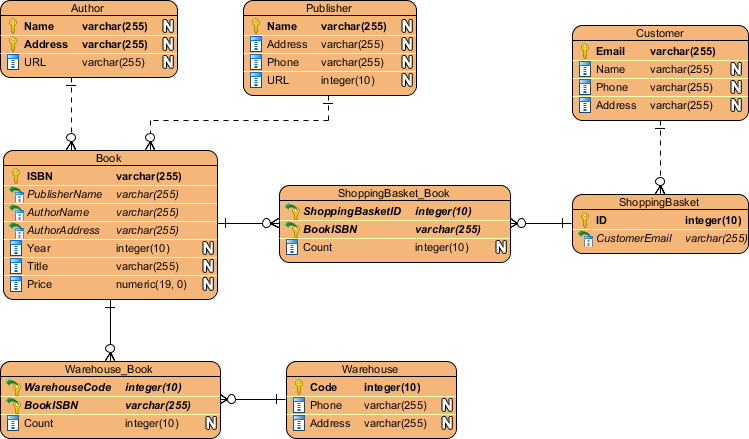

今天，我们将为你深入介绍 ER 图表。通过阅读本ERD指南，您将获得有关 ER 图和数据库设计的基本知识和技能。你会学到什么是 ERD，为什么要绘制 ERD，ERD 符号，如何绘制 ERD 等，以及一堆 ERD 示例。

## 什么是实体关系图（ERD）？

首先，什么是实体关系图？

实体关系图也被称为 ERD、ER 图、实体联系模型、实体联系模式图或 ER 模型，是一种用于数据库设计的结构图。一幅 ERD 包含不同的符号和连接符，用于显示两个重要的資訊： 系统范围内的**主要实体**，以及这些**实体之间的相互关系**。

这也就是为什么它被称为“实体”“关系”图 （ERD）啊！

当我们谈论 ERD 中的实体时，我们经常提到诸如人员/角色（例如学生），有形商业对象（例如产品），无形商业对象（例如日志）等业务对象。“关系”則是这些实体在系统内的相互关联。

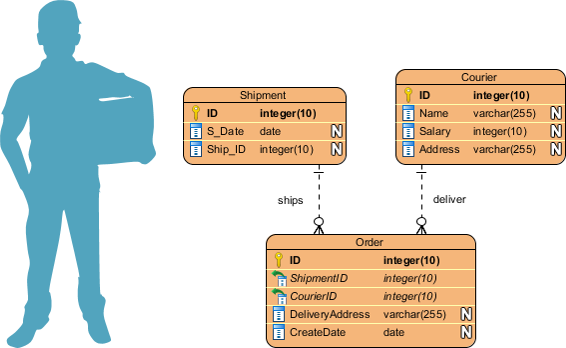

在典型的 ER 设计中，可以找到诸如圆角矩形和 (Rounded rectangle) 连接符（具有不同样式的末端）的符号来描述实体，它们的属性和相互关系。

## 何时绘制 ER 图？

那么，我们该在什么时候绘制ER图呢？虽然ER模型大多是为展示概念和设计物理数据库而绘制的，但也有别的用途的，以下是一些典型的用例。

- **数据库设计** - 直接在数据库更改数据库结构会有风险， 为避免破坏数据库中的数据，我们得仔细规划一切变更。通过绘制 ER 图来展示数据库设计意念，您能轻松找出错误和识别设计缺陷，并在执行数据库更改之前作出修正。
- **数据库调试** - 调试数据库问题往往具挑战性，特别是当数据库包含许多表时，你我编写复杂的 SQL 来获取所需的信息。通过 ERD 来展示数据库结构，您可以全面地了解整个数据库的结构。您可以轻松找到实体，查看其属性并确定与别的实体的关系，有助您更轻松地找出数据库的问题。
- **数据库创建和修补** - 像 Visual Paradigm 这样的 ERD 软件支持数据库生成工具，可以通过ER图来自动生成和修补数据库。使用这个 ER 图工具，您的ER设计不再仅仅是一个静态图，而是一个真实反映物理数据库结构的镜像。
- **帮助收集需求** - 您可以通过绘制 ERD 来表达系统中的高级业务对象以用于确定系统的需求。这种初始模型也可以演化为物理数据库模型，用于创建关系数据库，或为创建流程图和数据流模型提供有力的参考。

## ERD 符号指南

ER 图包含实体，属性和关系。在本节中，我们将详细介绍各 ERD 符号。

### 实体

ERD 实体是一个系统内**可定义的事物或概念**，如人/角色（例如学生），对象（例如发票），概念（例如简介）或事件（例如交易）（注：在 ERD 中，术语“实体”通常用来代替“表”，但它们是一样的）。在考慮实体时，嘗試把它们想成名词。在 ER 模型中，实体显示为圆角矩形，其名称位于上方，其属性列在实体形状的主体中。下面的 ERD 示例显示了 ER 实体的一个用例。

### 实体属性

也称为列 (Row)，意思是**持有它的实体的属性或特性**。

一个属性有一个描述属性的名称和一个描述属性种类的类型，例如代表字符串的 varchar，整数的 int。当为物理数据库开发绘制 ERD 时，得使用目标 RDBMS 支持的类型，以確保設計和物理数据库的一致性。

下面的 ER 图示例显示了一個包含属性的实体。

#### 主键 (Primary Key)

主键又称 PK，是一种特殊的实体属性，用于**界定数据库表中的记录的独特性**。一个表不能有两笔（或更多）拥有相同的主键属性值的记录，像是身份证明内的 ID 便是典型的例子，两个人即使性名相同，ID 是不会一样，若身份证明是个表，那 ID 便是主键了。下面的 ERD 示例显示了拥有主键属性 “ID” 的实体 “Product”，以及数据库中表记录的预览。第三个记录是无效的，因为 ID 'PDT-0002' 的值已被另一个记录使用。

#### 外键 (Foreign Key)

外键又称外来键和外部键，是**对主键的引用**，用于识别实体之间的关系。请注意，有别于主键，外键不必是唯一的，多个记录可以共享相同的值。下面的 ER Diagram 示例显示了一个包含一些列的实体，其中一个外键用于引用另一个实体。

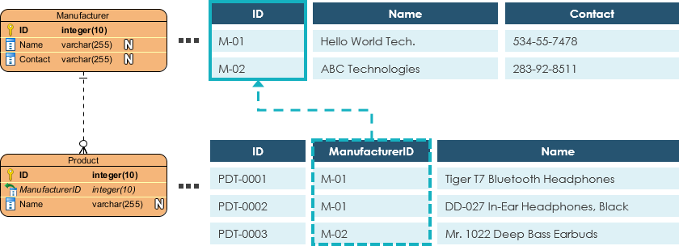

### 关系

两个实体之间的关系表示**这两个实体以某种方式相互关联**。例如，学生可能参加课程。实体“学生”因此与“课程”相关，而这关系则在 ER 图中以连接线表达着。

#### 基数 (Cardinality)

基数定义了**一个实与另一个实体的关系里面，某方可能出现次数**。例如，一个团队有许多球员，若把这关系呈现于 ERD 时，团队和球员之间是一对多的关系。

在 ER 图中，基数表示为连接线端的乌鸦脚。三种常见的主要关系是一对一，一对多和多对多。

##### 一对一的基数的例子

一对一关系主要用于将实体分成两部分，简洁地将资讯呈现，使读者更容易理解。下图显示了一对一关系的示例。

##### 一对多的基数的例子

一对多关系是指两个实体 X 和 Y 之间的关系，其中 X 的一个实例可以链接到Y的许多实例，而 Y 的一个实例仅链接到 X 的一个实例。下图显示了一对多关系的一个例子。

##### 多对多的基数的例子

多对多关系是指两个实体 X 和 Y 之间的关系，其中 X 可以被链接到 Y 的许多实例，反之亦然。下图显示了一个多对多关系的例子。请注意，多对多关系在物理 ERD 中被分成一对一对多的关系，你会在下一节中學到什麼是物理 ERD。

## 概念，逻辑和物理数据模型

ER 模型通常被绘制成最多三个抽象层次上：

- 概念 ERD / 概念数据模型
- 逻辑 ERD / 逻辑数据模型
- 物理 ERD / 物理数据模型

虽然 ER 模型的三个层次都包含有属性和关系的实体，但它们的创建目的和目标受众都不同。

一般而言，业务分析人员使用概念和逻辑模型来展示系统中存在的业务对象 (Business Object)，而数据库设计人员或数据库工程师會為概念和逻辑 ER 模型加入更详细的資訊，進而生成反映物理模型结构的物理数据模型，好為创建数据库作準備。下表列出了三种数据模型之间的差异。

概念模型 vs 逻辑模型 vs 数据模型：

| ERD 功能   | 概念 | 逻辑 | 物理 |
| :--------- | :--- | :--- | :--- |
| 实体(名称) | 是   | 是   | 是   |
| 关系       | 是   | 是   | 是   |
| 列         |      | 是   | 是   |
| 列的类型   |      | 随意 | 是   |
| 主键       |      |      | 是   |
| 外键       |      |      | 是   |

### 概念数据模型

概念性 ERD 表达了**系统中该存在的业务对象以及它们之间的关系**。建立概念模型，是为了通过识别所涉及的业务对象来呈现系统的宏观图像。概念数据模型定义了哪些实体存在，而非哪些表。例如，逻辑或物理数据模型中可能存在“多对多”表，但在概念数据模型下，它们只会表示为无基数的关系。

#### 概念数据模型示例

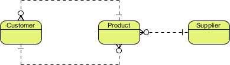

注意：概念性 ERD 支持使用泛化 (Generalization) 来表达两个实体之间的“一种”关系，例如三角形是一种形状，这个用法就像 UML 中的泛化一样。请注意只有概念 ERD 支持泛化。

### 逻辑数据模型

逻辑 ERD 是**概念 ERD 的详细版本**，通过明确定义每个实体中的列并引入操作和事务实体 (Transactional Entities)来让概念模型丰富起来。虽然逻辑数据模型仍流于高层次的设计(非为特定数据库系统而绘画)，但如果会影响数据库的设计，在绘制逻辑数据模型时仍然可酌情调整。

#### 逻辑数据模型示例

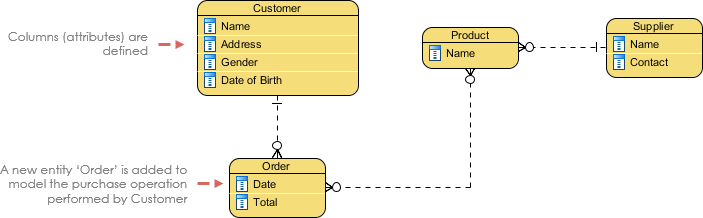

### 物理数据模型

物理 ERD 是**数据库的实际设计蓝图**。物理数据模型通过为每列指定类型 (Type)，长度 (Length)，可为空 (Nullable) 等来详细阐述逻辑数据模型。由于物理 ERD 表達了如何在特定的 DBMS中构造和关联数据，因此在設計時要考虑到实际的数据库系统的需要和局限，倒如确保 DBMS 支持某列类型，并在命名实体和列中避用某些保留字 (Reserved Words)。

#### 物理数据模型示例

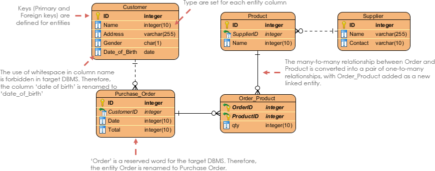

## 如何绘制 ER 图？

如果您发现绘制 ER 图很难，请不要担心，在本节中我们将给你一些 ERD 提示。尝试按照以下步骤以了解如何有效地绘制 ER 图吧。

1. 确保你清楚知道绘制 ERD 的目的。您是否试图呈现涉及业务对象定义的整体系统架构？或者你正在开发一个准备用于数据库创建的 ER 模型？您必须明了开发 ER 图的目的，方可使用合适的模型层次（概念/逻辑和物理）来迎合您所需 （请阅读概念，逻辑和物理数据模型部分了解更详细信息）
2. 确保你清楚模型的范围。了解建模范围可以防止在设计中包含冗余实体和关系。
3. 画出范围内的主要实体。
4. 通过添加列来定义实体的属性。
5. 仔细检查 ERD 并检查实体和列是否足以存储系统的数据。如果不是，请考虑添加其他实体和列。通常，您可以在此步骤中确定一些事务 (Transactional)，操作 (Operational) 和事件 (Event) 实体。
6. 考虑所有实体之间的关系，将它们联系起来，並寫上正確的基数（例如客户和订单之间的一对多关系）。如果有任何实体沒有被連接上，请不要担心，虽然這不常见，但它是合法的。
7. 使用数据库规范化技术 (Database Normalization)重构实体，以减少冗余数据和提高数据完整性。例如，“制造商”的資訊可能最初存储在“产品”实体下，透過规范化过程，您可能会发“制造商”的记录不断重复，您便可将其拆分为单独的“制造商”实体，并使用外键將“产品”和“制造商”連接起來。

## 数据模型的例子

### ERD 示例 - 电影租赁系统

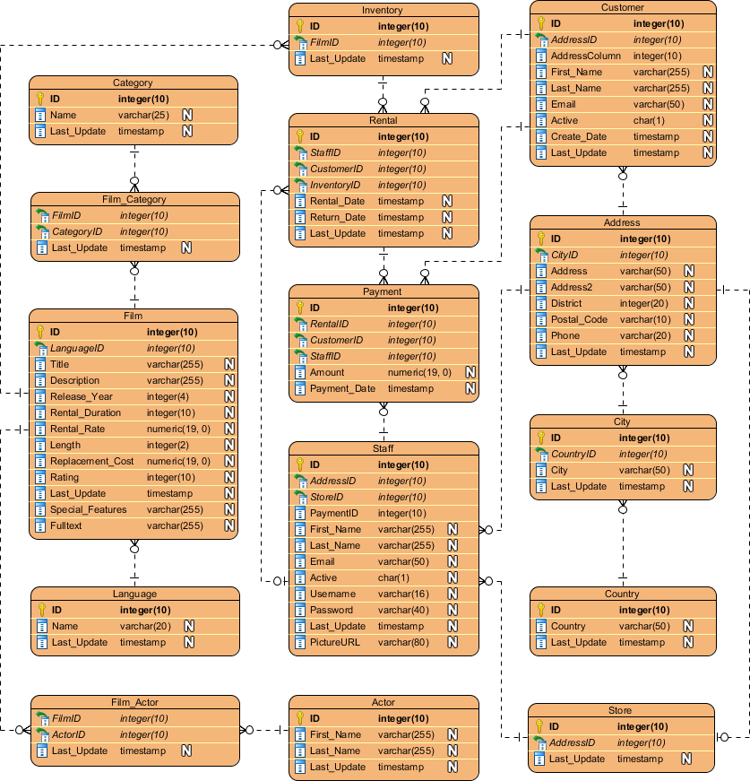

### ERD 示例 - 贷款系统

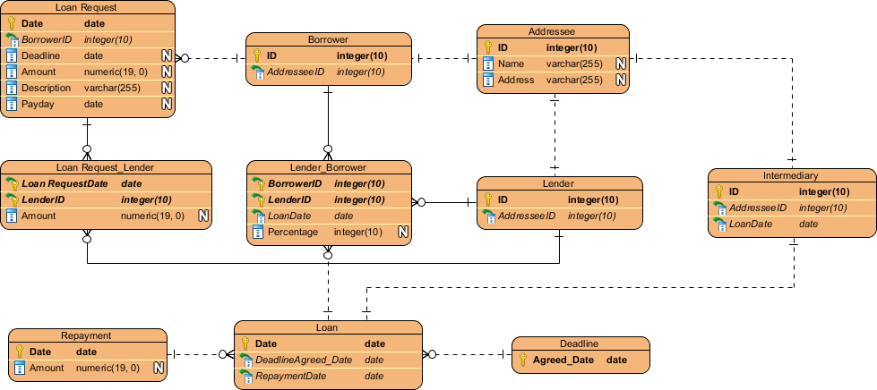

### ERD 示例 - 在线商店

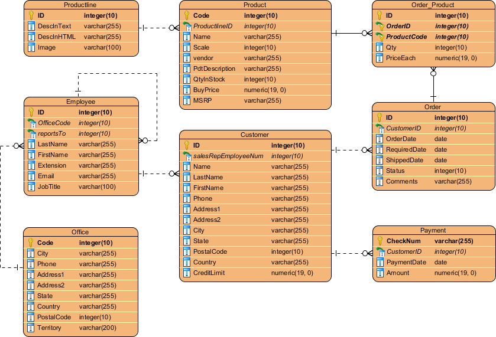

## 使用 ERD 和数据流图（DFD） 

在系统分析和设计中，可以绘制[数据流图（DFD）](https://www.visual-paradigm.com/features/data-flow-diagram-tool) 来展现系统流程中的信息流。在数据流图中，有一个名为数据储存 (Data Store)的符号，它代表一个提供系统所需信息的数据库表。

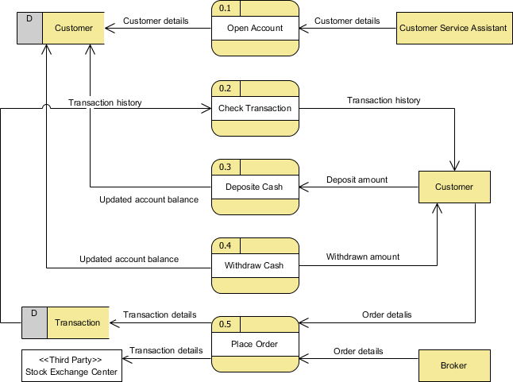

由于物理 ER 图提供了实际数据库的蓝图，因此这种 ERD 中的实体与 DFD 中的数据存储一致。您可以 ERD 作为 DFD 的补充，以表达信息的结构；或以 DFD 补充 ERD，以显示系统在运行时如何运用数据。

## 使用 ERD 和 BPMN 业务流程图（BPD） 

在业务流程映射中 (Business Process Mapping)，可以绘制 [BPMN 业务流程图 （BPD）](https://www.visual-paradigm.com/features/bpmn-diagram-and-tools) 以展示业务工作流程。在业务流程图中，有一个称为数据对象（Data Object）的符号，表示在流程输入/输出的数据。

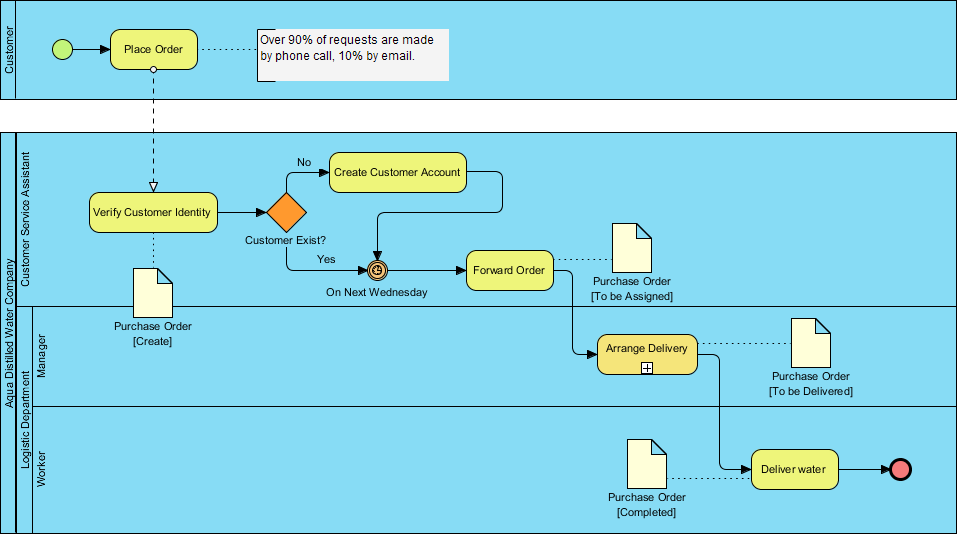

由于概念和逻辑数据模型提供了系统内业务对象的高级视图，因此此类 ERD 中的实体与 BPD 中的数据对象一致。您可绘制 ERD 作为 BPD 的补充，以表示业务工作流程所需的数据对象的结构；或以 BPD 補充 ERD，以显示在整个业务流程中如何運用数据。

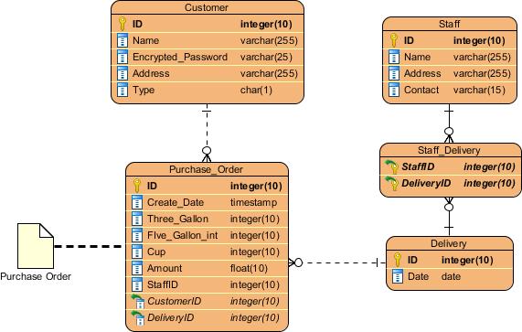

## 选择一个ERD工具

制作 ERD 数据模型需要时间和精力，而一个有用的数据库设计工具则能大大减省你花费的时间和精力。 Visual Paradigm 不仅为您提供 ERD 工具，还提供了一组可视化建模功能，助您更快、更轻松地绘制实体关系图。它支持当今市场上最流行的数据库管理系统，是数据库设计、数据库生成和实体关系图逆转的好帮手。

::: details 公众号：AI悦创【二维码】

:::

::: info AI悦创·编程一对一

AI悦创·推出辅导班啦，包括「Python 语言辅导班、C++ 辅导班、java 辅导班、算法/数据结构辅导班、少儿编程、pygame 游戏开发、Linux、Web、Sql」，全部都是一对一教学：一对一辅导 + 一对一答疑 + 布置作业 + 项目实践等。当然，还有线下线上摄影课程、Photoshop、Premiere 一对一教学、QQ、微信在线，随时响应！微信：Jiabcdefh

C++ 信息奥赛题解，长期更新！长期招收一对一中小学信息奥赛集训，莆田、厦门地区有机会线下上门，其他地区线上。微信：Jiabcdefh

方法一：[QQ](http://wpa.qq.com/msgrd?v=3&uin=1432803776&site=qq&menu=yes)

方法二：微信：Jiabcdefh

:::

