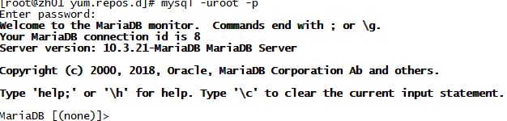
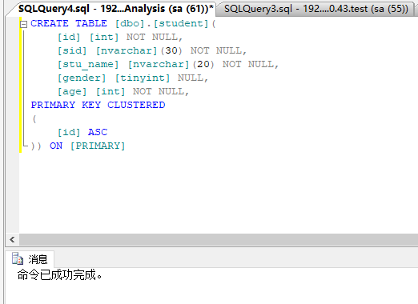
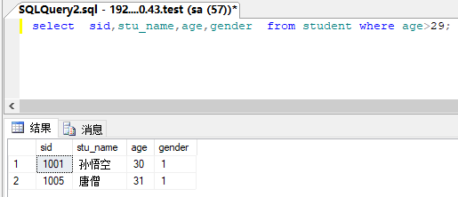

::: center


:::

::: tip 

知识犹如人体的血液一样宝贵。——高士其

:::

你好，我是悦创。

## 2.1 什么是数据库？

数据库（Database）是**以特定组织方式存储以及管理数据的仓库**，我们日常生活中经常会接触到数据库，通过浏览器打开网站查阅的新闻，打开微信查看的朋友圈，你从银行账户中查询到的金额等等，这些数据都存储在数据库中。

这么说可能你还是有些疑惑。换个说法：你知道 Excel 电子表格吗？

电子表格和数据库之间有很多的相似点：**都可以存储和访问数据，都可以按照需求筛选出自己需要的记录，也可以通过某些特定函数完成数据的统计**。电子表格是一个后缀名为 `.xls` 或者 `.xlsx` 的文件。数据库同样是一个后缀名为 `.sql` 的文件。

## 2.2 有了 Excel 还需要数据库吗？

**那你可能会问：既然有了Excel 了，为什么还要有数据库呢？它们两个有什么差别？**

不知道你有没有经历过这样一个场景：当你在电子表格中**操作数据还未完成时，电脑突然宕机，导致前功尽弃**。但是数据库确具有完善的安全管理机制，在这种场景下能将数据进行完美恢复，并将数据损失降到最小。

另外，数据库是可以在线共享的，它允许多人同时操作同一张表格，却不会导致数据混乱。电子表格却无法实现多人同时编辑同一张表格，即使可以也需要设置复杂的共享操作。

并且，**数据库在存储硬件允许的情况下，可以存放海量的数据，并且支持比较复杂的计算和查询，而且效率也是远超电子表格**，当然数据库的功能远不止这些，我们在后面的章节会一一把数据库的优点向大家展示。

## 2.3 数据库管理系统

有了数据库，当然要对数据库进行管理，自然而然的数据库管理系统就应运而生了。数据库管理系统就类似于 WPS 和 Office。这两个软件都可以管理后缀名为 `.xls` 或者 `.xlsx` 的电子表格。而数据库管理系统就是用来管理后缀名为 `.sql` 的数据库文件的一个软件。

不同于 WPS 和 Office 的划江而治，数据库管理系统可以说是百花争艳，比如说付费的有甲骨文公司的 Oracle、IBM 的 DB2、微软的 SQL Server，开源的有 MySQL 和 PostgreSQL。都是比较成熟的数据管理系统产品。

在选择数据库时需要结合具体项目业务及投入成本等因素综合考虑，比如银行、金融、物流等数据量大、对安全性要求高且投入较大的项目使用 Oracle 和 SQLL Server 会更好，Mysql 和 PostgreSQL 则更适合互联网方向的中小型项目，对于初学者可以选择 SQLL Server 或者 Mysql 来入门。

为了让大家更全面了解各个主流数据库的差异，后续各小节会对同一功能 SQL 查询在不同数据库上进行对比验证，如没有特殊说明，本课程执行 SQL 语句的具体数据库版本默认为 MariaDB 10.3.12（MySQL的一个分支）或者 SQL Server 2012、Oracle 11.2.0.1、PostgreSQL 11.6。

## 2.4 安装 MariaDB 10.3.21

在使用数据库之前，和大家一起了解下数据库 MariaDB 10.3.21 的安装过程：

首先 Vmware 上新建虚拟机安装 CentOS7.5，root 用户登录：


```sh
[root@iZ8vbexjmeno0adswvyk5nZ ~]# cat /etc/redhat-release 
CentOS Linux release 7.8.2003 (Core)
```

进入 `/etc/yum.repos.d` 生成 `MariaDB.repo` 文件 ：

::: code-tabs#sh

@tab 命令

```sh
[root@iZ8vbexjmeno0adswvyk5nZ ~]# cd /etc/yum.repos.d/
[root@iZ8vbexjmeno0adswvyk5nZ yum.repos.d]# cat Mariadb.repo 
cat: Mariadb.repo: No such file or directory
[root@iZ8vbexjmeno0adswvyk5nZ yum.repos.d]# touch Mariadb.repo 
[root@iZ8vbexjmeno0adswvyk5nZ yum.repos.d]# vim Mariadb.repo 
[root@iZ8vbexjmeno0adswvyk5nZ yum.repos.d]# cat Mariadb.repo 
[Mariadb]
name = MariaDB
baseurl = http://yum.mariadb.org/10.3/centos7-amd64
gpgkey=https://yum.mariadb.org/RPM-GPG-KEY-MariaDB
gpgcheck=1
```

@tab 写入的内容

```txt
[Mariadb]
name = MariaDB
baseurl = http://yum.mariadb.org/10.3/centos7-amd64
gpgkey=https://yum.mariadb.org/RPM-GPG-KEY-MariaDB
gpgcheck=1
```

:::

运行安装命令安装 MariaDB :

```sh
yum -y install MariaDB-server MariaDB-client
```

安装成功之后启动 MariaDB 服务，并设为开机自启：

```sh
systemctl start mariadb #启动服务  

systemctl enable mariadb #设置开机启动
```

登录到 MariaDB 数据库：

```sh
mysql -uroot -p
```

输入上面命令后，系统会提示我们输入密码，此时 root 默认密码为空，直接回车即可。



如果要退出 MariaDB，输入 `exit;` 后回车即可。

进行 MariaDB。的相关简单配置，在 Linux 命令行输入命令：

```sql
mysql_secure_installation 
```

回车后，系统会提示我们进行以下内容的设置：

```sql
Enter current password for root (enter for none):<–初次运行直接回车
Set root password? [Y/n] <– 是否设置root用户密码，输入y并回车或直接回车
New password: <– 设置root用户的密码
Re-enter new password: <– 再输入一次你设置的密码
Remove anonymous users? [Y/n] <– 是否删除匿名用户，回车
Disallow root login remotely? [Y/n] <–是否禁止root远程登录,回车（后面授权配置）
Remove test database and access to it? [Y/n] <– 是否删除test数据库，回车
Reload privilege tables now? [Y/n] <– 是否重新加载权限表，回车
```

初始化 MariaDB 完成，再次登陆需要输入设置的密码。

配置 MariaDB 的字符集，使得 MariaDB 服务端支持中文 ：

```sql
vi /etc/my.cnf  
[mysqld]
init_connect='SET collation_connection = utf8_unicode_ci'
init_connect='SET NAMES utf8'
character-set-server=utf8
collation-server=utf8_unicode_ci
skip-character-set-client-handshake

systemctl restart mariadb #重新启动  
```

## 2.5 什么是表？

表-Table，是数据库存贮数据的基本单元。你可以把表设想为电子表格中的 Sheet 页。而表就是数据库中的 Sheet 页。

上面的例子可能不太形象，换个说法。如果把数据库比作一列货运火车，那么 Schema (模式，也叫架构)就是这列火车的一节节的车厢，每间车厢中放置有很多包装箱，这些包装箱就是表。

在同一个车厢中，包装箱编号不能重名，但不同车厢中的包装箱编号可以重名，Schema 和表也同样具有这个特点。同一间车厢存放着相同规格的包装箱，就像同一个模式下的表具有相同的特性(表如何存储，什么样的数据，数据如何分解等)。也可以将 Schema 看做操作系统上的目录，里面的文件就是表，只是 Schema 里面不能创建 Schema，而目录里面是可以继续创建目录。

| 火车   | ———>> | 数据库       |
| ------ | ----- | ------------ |
| 车厢   | ———>> | Schema       |
| 包装箱 | ———>> | 表           |
| 货物   | ———>> | 表中存放数据 |

**一张表只能存一种相关的实体，比如可以存放学生信息，课程信息，学生选课记录等。 学生信息和课程信息不能存放在一张表中，这样会导致查询很困难，而且数据混乱。**

值得注意的是，Schema 除包含表之外，还可以包含与表相关的视图，索引，数据类型，函数以及操作符等数据库对象。另外 Schema 在不同数据库中它的含义稍有差别，在 SQL Server 和 PostgreSQL 中默认 Schema 分别为 dbo 和 public ，它们和用户权限有很大关系，在你创建数据库对象时，如果没有指定 Schema，数据库对象归属于这些默认的 Schema。而在 MySQL 中，Schema 就是指的数据库，在 Oracle 中一个 Schema 对应着一个用户。

## 2.6 什么是列、行和数据类型

如果说一张表就是一个实体，那么表中的列就是这个实体的属性，比如学生（实体）表中有年龄，性别和学号等列来表示学生的属性，一行就是指一条记录，一名学生的相关属性数据就可以存放成一行数据。从上面可以看出数据库中的行和列与 Excel 中的行和列很类似。

数据库的数据类型是和列并存的，它指定了列在计算机机中以什么数据形式存储，虽然常用的数据类型就几种，但在各种数据库中却存在名称上或用法上的细微差异，下表列出了四种数据库主要数据类型对比：

| SQLServer | MySQL    | ORACLE    | PostgreSQL |
| :-------- | :------- | :-------- | :--------- |
| int       | int      | NUMBER    | int4       |
| varchar   | varchar  | VARCHAR2  | varchar    |
| nvarchar  | varchar  | NVARCHAR2 | varchar    |
| datetime  | datetime | DATE      | timestamp  |
| decimal   | decimal  | NUMBER    | numeric    |
| text      | longtext | CLOB      | text       |
| tinyint   | tinyint  | NUMBER    | int2       |
| bit       | tinyint  | NUMBER    | bool       |
| float     | float    | FLOAT     | foloat8    |

## 2.7 SQL 语句

现在大家已经知道了数据库，表，行列数据的概念了。那么问题就来了：我该怎么操作数据库，表，行列数据呢？

这时，就不得不说一下本门课程的重点 SQL 语句了。Sql 是操作和管理数据库的工具，是人们与数据库交互的一种计算机语言，它由关键字（如 `select` ,`from`,`where`,`order by` ,`create` 等）、表名、字段等组合成的一条语句，Sql 语句分为以下几种类型：

- DDL（Data Definition Language，数据定义语言）  **日常使用的创建数据库或表的 Create 语句，删除数据库或表的 Drop 语句，以及修改数据库或表的 alter 语句都属于该类型**，比如我们在 SQL Server 上的数据库中创建一张学生表：



```sql
CREATE TABLE [dbo].[student] (
[id] [int] NOT NULL,
[sid] [nvarchar] (30) NOT NULL,
[stu_name] [nvarchar] (20) NOT NULL,
[gender] [tinyint] NULL,
[age] [int] NOT NULL,
PRIMARY KEY CLUSTERED
(
     [id] ASC
)) ON [PRIMARY];
```

- DML（Data Manipulation Language，数据操作语言）**对表的增删改查都属于 DML语句** ，比如我们查询年龄大于29岁的学生：



- 除此之外，还有 DCL（Data Control Language，数据控制语言）， **它主要完成对数据库变更操作的确认和取消，以及用户对数据库对象权限的设定** 。比如 update 语句后面出现 commit 表示确认更新完成，出现 rollback 代表取消更新，数据保持不变。

## 2.8 测试数据获取

本专栏相关表结构和数据可以通过以下链接获取：[https://github.com/AndersonHJB/Easy-Sql-Tutorial](https://github.com/AndersonHJB/Easy-Sql-Tutorial) 


## 命令

### 1. 查看已有数据库

```sql
show databases;
```

```sql
mysql> show databases;
+--------------------+
| Database           |
+--------------------+
| information_schema |
| mysql              |
| performance_schema |
| sys                |
+--------------------+
4 rows in set (0.01 sec)
```

```sql
mysql> create database aiyc;
Query OK, 1 row affected (0.01 sec)

mysql> show databases;
+--------------------+
| Database           |
+--------------------+
| aiyc               |
| information_schema |
| mysql              |
| performance_schema |
| sys                |
+--------------------+
5 rows in set (0.01 sec)
```

> 视野中若有了焦点，自然也出现了盲点。

::: details 公众号：AI悦创【二维码】


:::

::: info AI悦创·编程一对一

AI悦创·推出辅导班啦，包括「Python 语言辅导班、C++ 辅导班、java 辅导班、算法/数据结构辅导班、少儿编程、pygame 游戏开发、Linux、Web、Sql」，全部都是一对一教学：一对一辅导 + 一对一答疑 + 布置作业 + 项目实践等。当然，还有线下线上摄影课程、Photoshop、Premiere 一对一教学、QQ、微信在线，随时响应！微信：Jiabcdefh

C++ 信息奥赛题解，长期更新！长期招收一对一中小学信息奥赛集训，莆田、厦门地区有机会线下上门，其他地区线上。微信：Jiabcdefh

方法一：[QQ](http://wpa.qq.com/msgrd?v=3&uin=1432803776&site=qq&menu=yes)

方法二：微信：Jiabcdefh

:::


