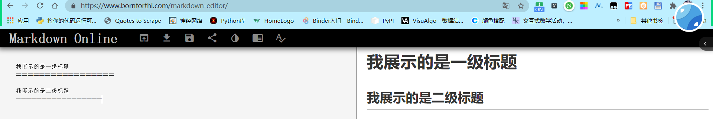
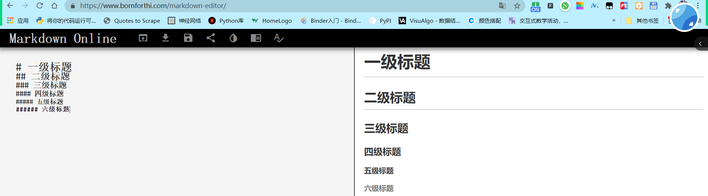

你好，我是悦创。

Markdown 标题有两种格式。

# 1、使用 = 和 - 标记一级和二级标题

= 和 - 标记语法格式如下：

```markdown
我展示的是一级标题
=================

我展示的是二级标题
-----------------
```

显示效果如下图：



# 2. 使用 # 号标记

使用 **#** 号可表示 1-6 级标题，一级标题对应一个 **#** 号，二级标题对应两个 **#** 号，以此类推。

```markdown
# 一级标题
## 二级标题
### 三级标题
#### 四级标题
##### 五级标题
###### 六级标题
```

显示效果如下图：




::: details 公众号：AI悦创【二维码】


:::

::: info AI悦创·编程一对一

AI悦创·推出辅导班啦，包括「Python 语言辅导班、C++ 辅导班、java 辅导班、算法/数据结构辅导班、少儿编程、pygame 游戏开发」，全部都是一对一教学：一对一辅导 + 一对一答疑 + 布置作业 + 项目实践等。当然，还有线下线上摄影课程、Photoshop、Premiere 一对一教学、QQ、微信在线，随时响应！微信：Jiabcdefh

C++ 信息奥赛题解，长期更新！长期招收一对一中小学信息奥赛集训，莆田、厦门地区有机会线下上门，其他地区线上。微信：Jiabcdefh

方法一：[QQ](http://wpa.qq.com/msgrd?v=3&uin=1432803776&site=qq&menu=yes)

方法二：微信：Jiabcdefh

:::

