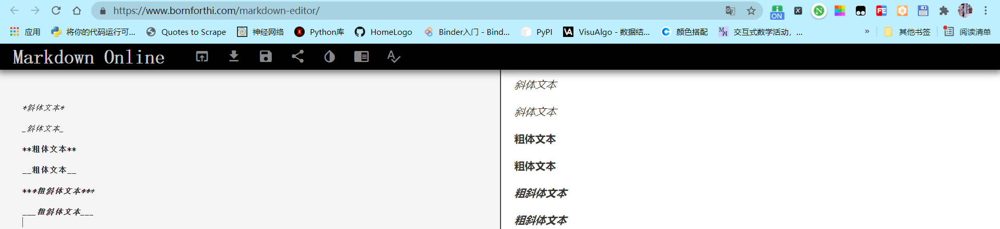
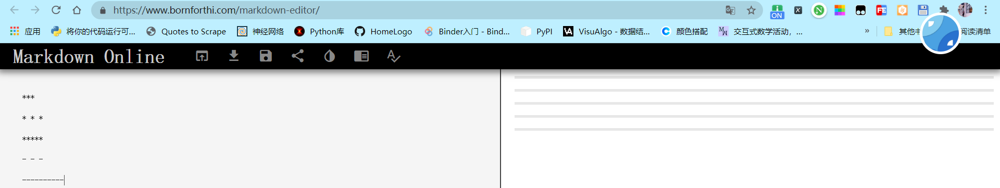
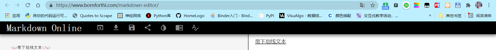
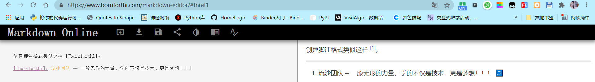

你好，我是悦创。

Markdown 段落没有特殊的格式，直接编写文字就好，**段落的换行直接回车就好。**


## 字体

Markdown 可以使用以下几种字体：

```markdown
*斜体文本*
_斜体文本_
**粗体文本**
__粗体文本__
***粗斜体文本***
___粗斜体文本___
```

显示效果如下所示：




## 分隔线

你可以在一行中用三个以上的星号、减号、底线来建立一个分隔线，行内不能有其他东西。你也可以在星号或是减号中间插入空格。下面每种写法都可以建立分隔线：

```markdown
***

* * *

*****

- - -

----------
```

显示效果如下所示：




## 删除线

如果段落上的文字要添加删除线，只需要在文字的两端加上两个波浪线 **\~\~**  即可，实例如下：

```markdown
aiyc.top

book.bornforthi.com

~~baidu.com~~
```

显示效果如下所示：


## 下划线

下划线可以通过 HTML 的 **\<u>** 标签来实现：

```markdown
<u>带下划线文本</u>
```

显示效果如下所示：




## 脚注

脚注是对文本的补充说明。

Markdown 脚注的格式如下:

```markdown
[^要注明的文本]
```

以下实例演示了脚注的用法：

```markdown
创建脚注格式类似这样 [^bornforthi]。

[^bornforthi]: 流沙团队 -- 一股无形的力量，学的不仅是技术，更是梦想！！！
```

演示效果如下：



::: details 公众号：AI悦创【二维码】


:::

::: info AI悦创·编程一对一

AI悦创·推出辅导班啦，包括「Python 语言辅导班、C++ 辅导班、java 辅导班、算法/数据结构辅导班、少儿编程、pygame 游戏开发」，全部都是一对一教学：一对一辅导 + 一对一答疑 + 布置作业 + 项目实践等。当然，还有线下线上摄影课程、Photoshop、Premiere 一对一教学、QQ、微信在线，随时响应！微信：Jiabcdefh

C++ 信息奥赛题解，长期更新！长期招收一对一中小学信息奥赛集训，莆田、厦门地区有机会线下上门，其他地区线上。微信：Jiabcdefh

方法一：[QQ](http://wpa.qq.com/msgrd?v=3&uin=1432803776&site=qq&menu=yes)

方法二：微信：Jiabcdefh

:::


