## 1. 如何选择相机品牌

你好，我是悦创。

我们现在所面对的品牌很多，我最喜欢徕卡。

## 2. 根据相机种类来筛选

### 2.1 单反相机

在单反相机中，你不是选佳能，就是选尼康。

这两个是单反相机中的，最常见的品牌。

佳能广告多，尼康广告少。

两个机型，在同一档次机型下，差别非常小，比如说：你都准备花一万块钱买相机，这个差异几乎肉眼无法辨别的。

你如果，以前用过哪个品牌的相机，就买哪种相机，**换门** 我不是非常建议的。

> 换门：就是说你从尼康这个门，进到佳能这个门，这叫换门。所以，如果你换门的话，意味的你不仅仅是换机身，还要换镜头和配件，所以有网友称：灭门。

### 2.2 微单相机

#### 2.2.1 奥林巴斯

画幅比较小，比全画幅感光元件小1/2——半幅。但是这种半幅，把优势发挥到了极致，它的防抖极为强悍，可以说是目前所有相机中，防抖最为强悍的相机。

除此之外，它还有每秒 11 张的连拍，和诸多非常智能的功能。

它的拨轮、按钮特别多。我们在选择相机的时候，更喜欢拨轮和按钮长在外面的，因为数码相机的功能都是非常多的，如果每一个功能都要你进去找，那是非常不方便的，操作会更慢。

#### 2.2.2 富士

特点，色彩非常漂亮。

它的色彩，是模拟富士以前做过的胶片色彩。所以，当别的相机的选项是：标准、人像、风光等，这样的色彩模式。在富士的相机里则是“交卷的名称”，因为它的色彩调节是基于胶片的特性来的。所以拍出来的照片，也显得非常真实。照片非常真实，色彩也非常漂亮，是几十年来久经考验的色彩风格。

X-100 适合做人文摄影的。因为它不属于微单的范畴了，咱们就先不说。

富士的感光元件，会比奥林巴斯的感光元件大一些，所以，理论上在暗光摄影的环境下，会更好一些。

#### 2.2.3 索尼

索尼也是适用的是 APS 画幅，是非全幅单反相机的画幅是一样的。它们在画质上，也不输非全幅的单反相机。但是，索尼自己也出了一些，全画幅微单相机。「使用全画幅微单相机，会失去微单相机便携的优势」

如果你想要画质好，它就会变得更笨重一些，更糟糕的一点是：越大的画幅，它的镜头就越重。索尼全画幅相机的重量跟真正的全画幅单反相机的重量几乎是一样的。你可以想一下，你到底背不背的动。

如果你只是在影棚里面拍一拍，自驾游还好。如果你做旅游摄影师，风光摄影师的时候，可能背一大套全画幅相机还是有些困难的。别忘了，你还要背很多的镜头。——所以，索尼的特点在于它的画质还不错。

#### 2.2.4 松下

### 2.3 旁轴相机

#### 2.3.1 徕卡

如果你要买旁轴的话，可能这是一个最好的选择。但是旁轴相机，几乎没有自动化的功能，最新版的徕卡有微单相机。

这个富士 X100 相机可以符合一些旁轴相机的某一些优点。

### 2.3 中画幅相机

相机之王，如果你准备买中画幅就买最好的，哈苏就好了。

## 3. 和你朋友选一样的品牌

如果你的朋友用的佳能就买佳能，你的朋友用的尼康，你就买尼康吧。因为，你们俩的镜头和附件，基本上是可以通用的。这样的话，可以为你省下一大笔钱，这样就能先试一试对方镜头的效果。

## 4. 哪些是相机的必备功能？

### 4.1 光圈优先曝光模式

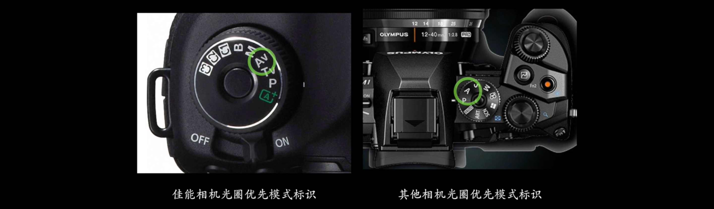

这是一种半自动的模式，相机控制快门，人控制光圈。

通过控制光圈优先模式，可以控制光圈的大小，调节背景虚化功能。

### 4.2 手动曝光模式

如果你需要在室内拍摄，不管是拍摄人物还是拍摄产品，只要你需要使用闪光灯的时候，你就必须要有一个手动曝光模式。

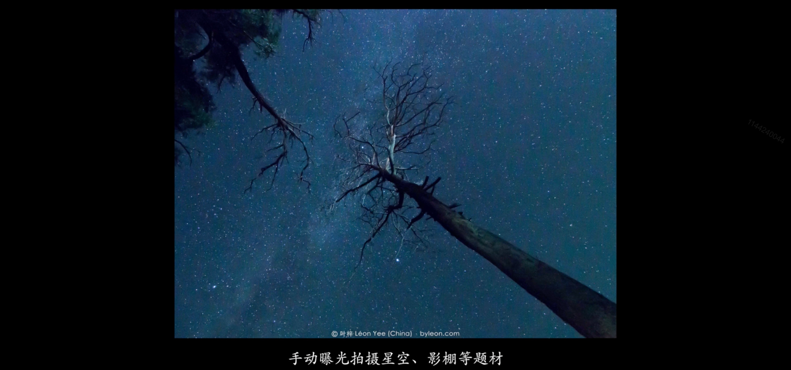

相机无法正常测光了，因为光线太过昏暗了，我们不得不使用手动曝光。

### 4.3 手动设置感光度

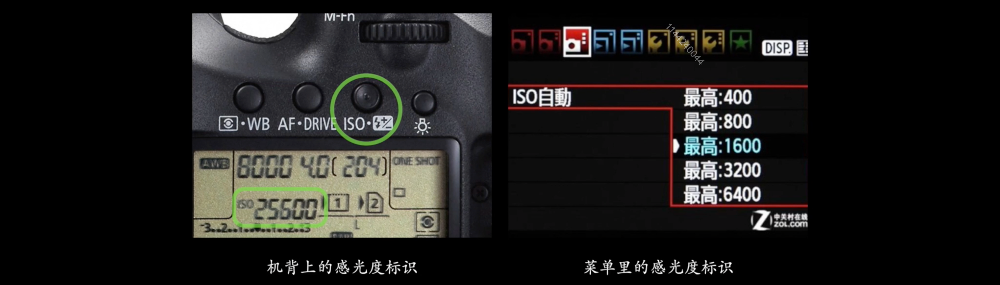

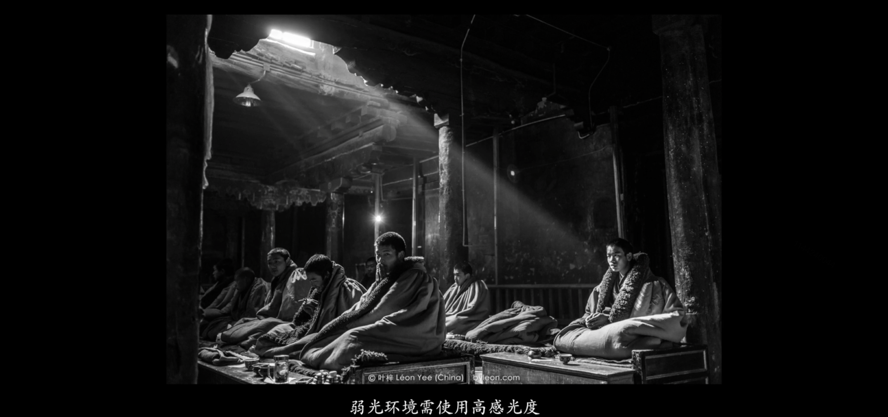

### 4.4 有曝光补偿功能

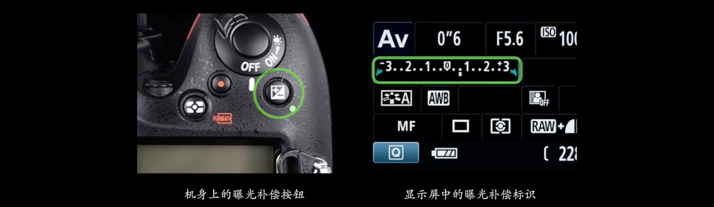

往右画面就会越来越亮，往左画面就会越来越暗。

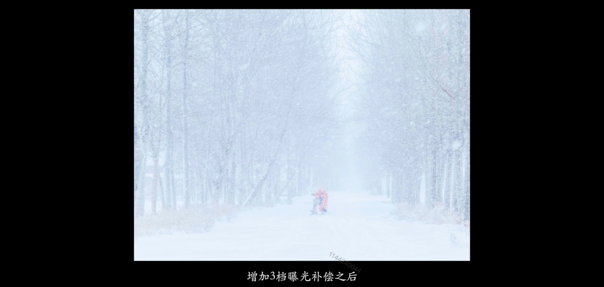

有些时候拍摄雪景会偏暗，所以我们可以使用曝光补偿来添加。使曝光正常，让雪更白。

### 4.5 有白平衡调整功能

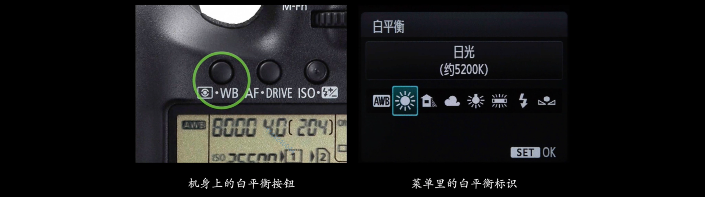

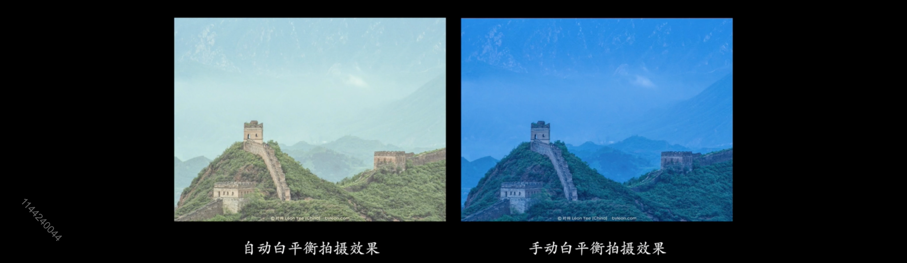

如果是自动白平衡的话，它会自动矫正当时环境色的偏差。把你拍摄的物体，争取拍摄出 **原有的本色** ，但是手动白平衡就不一样了，它可能，让相机不要造成故意的色彩偏差。——甚至可以自己去营造画面的一些偏色效果。

## 5. 能用胶片相机学摄影吗？

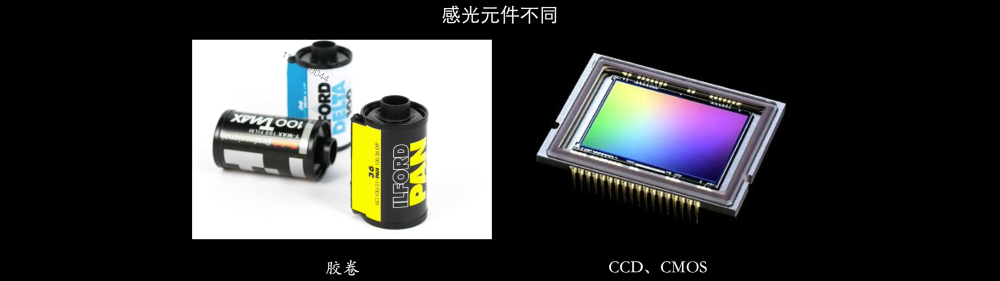

愿不愿等，愿不愿意花钱洗照片。

## 6. 选择合适自己的镜头

### 6.1 定焦镜头

焦距不可变换。

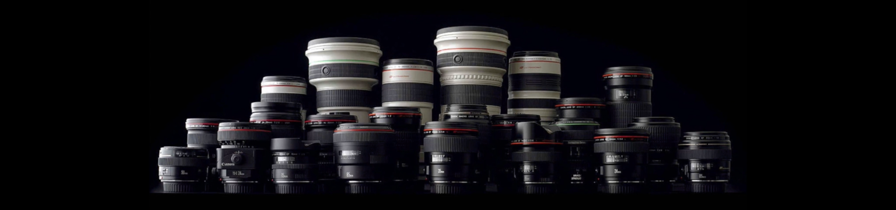

长焦的就是长焦的，可以把远处的物体拉的很近，没有什么立体感。

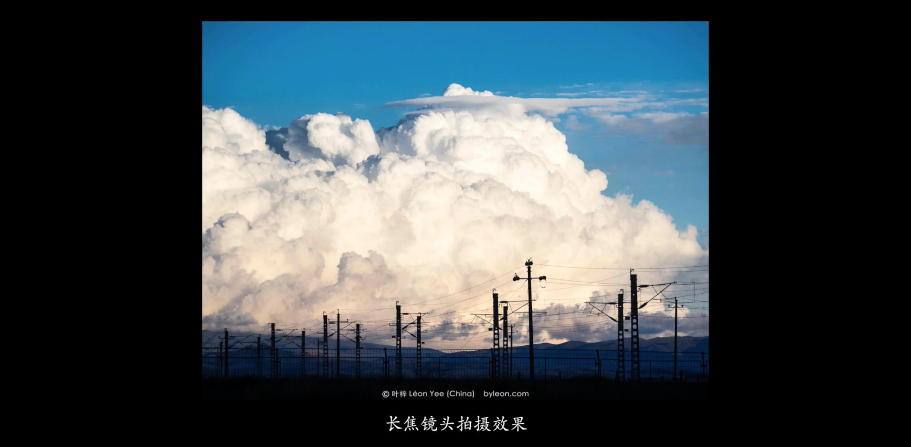

广角的就是广角的，立体透视明显，近大远小，而且非常具有震撼的效果，常用于拍摄室内，或者狭小的巷子等等。

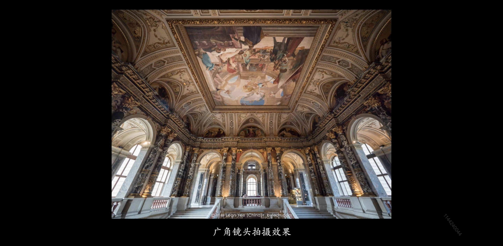

中焦的镜头看到的世界和人眼看到的世界，比较类似。它既没有广角的那么夸张，也没有长焦的那么抽象，或者那么猎奇。

这也是为什么过去的摄影师要背很多的镜头，什么样的场景选择什么样的镜头。

### 6.2 变焦镜头

它的焦距可以从广角到长焦不断变化。买的时候，可以买上面范围的焦段。这样你可以快速的体验到每种照片的区别。

> 如果不是全画幅相机的同学们，你们买的镜头焦距稍微不一样一些。

### 6.3 镜头的关键参数

——光圈

上图就是：广角的时候可以使用光圈 3.5，长焦的时候可以使用镜头 5.6。

### 6.4 镜头灰尘

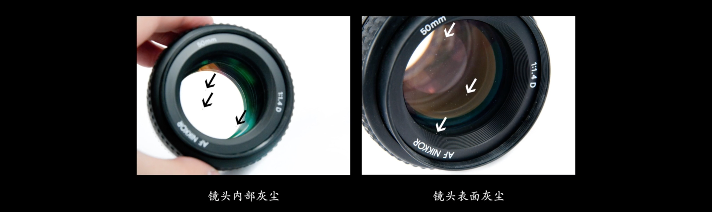

欢迎关注我公众号：AI悦创，有更多更好玩的等你发现！

::: details 公众号：AI悦创【二维码】

:::

::: info AI悦创·编程一对一

AI悦创·推出辅导班啦，包括「Python 语言辅导班、C++ 辅导班、java 辅导班、算法/数据结构辅导班、少儿编程、pygame 游戏开发」，全部都是一对一教学：一对一辅导 + 一对一答疑 + 布置作业 + 项目实践等。当然，还有线下线上摄影课程、Photoshop、Premiere 一对一教学、QQ、微信在线，随时响应！微信：Jiabcdefh

C++ 信息奥赛题解，长期更新！长期招收一对一中小学信息奥赛集训，莆田、厦门地区有机会线下上门，其他地区线上。微信：Jiabcdefh

方法一：[QQ](http://wpa.qq.com/msgrd?v=3&uin=1432803776&site=qq&menu=yes)

方法二：微信：Jiabcdefh

:::

