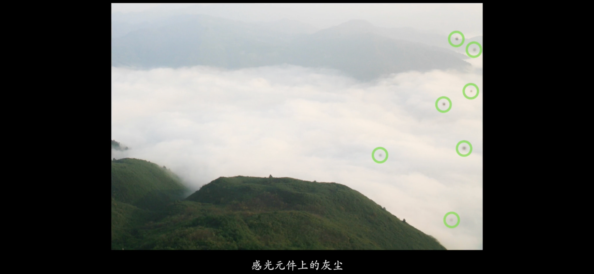
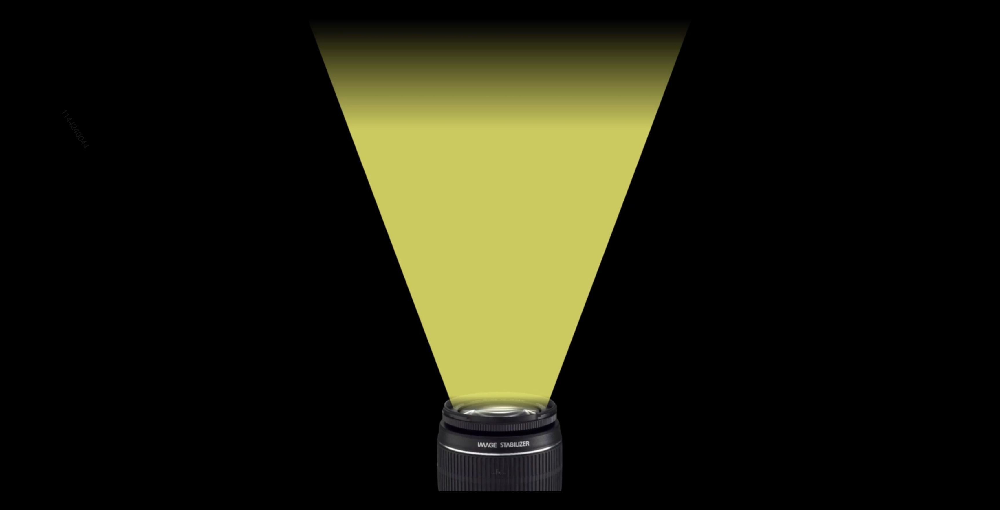
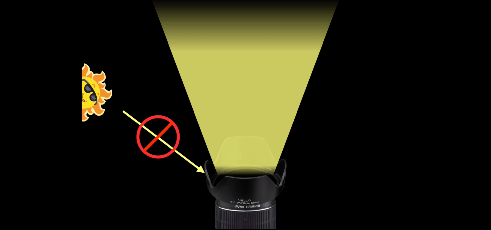
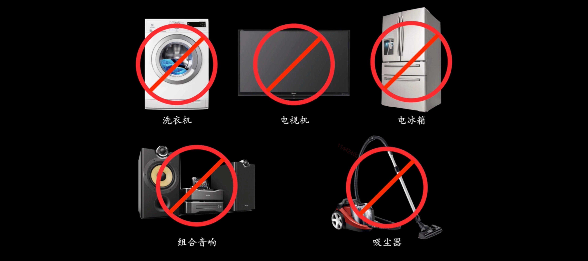
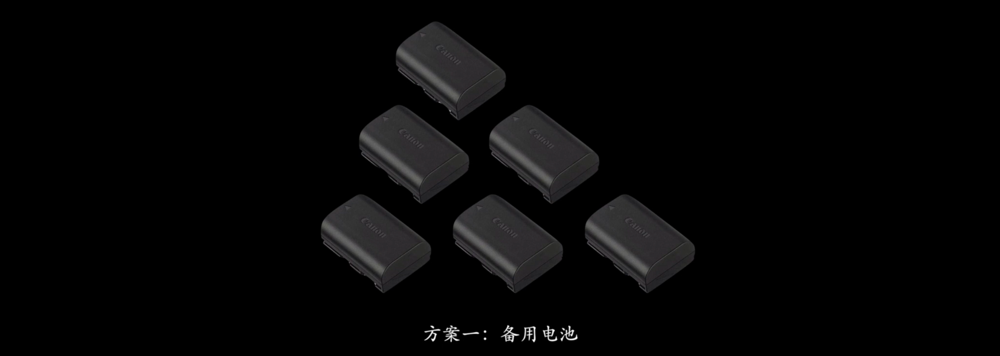
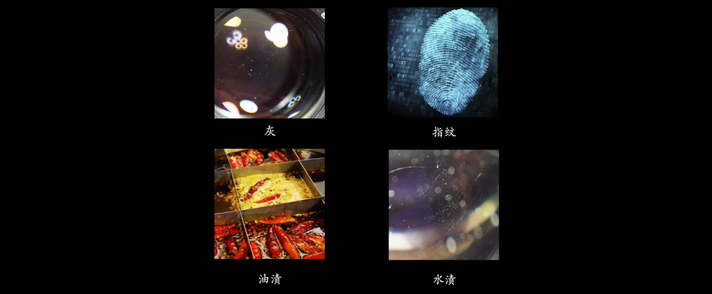

## 沙尘

## UV 镜？

## 遮光罩

在相机掉落的时候，可以替相机吸能。

太阳光不停的在你的镜头中进行反射，最后形成光雾「灰灰、白白、黄黄」的画面。这样就会导致对比度不清晰，颜色也不够鲜艳。这是因为，多余的太阳光摄入了我们的镜头，这个时候就需要遮光罩。

## 相机包

## 相机安全箱

## 磁场

## 低温与低气压

## 给镜头擦个脸

## 标准清洁镜头的步骤

### 吹

欢迎关注我公众号：AI悦创，有更多更好玩的等你发现！

::: details 公众号：AI悦创【二维码】

:::

::: info AI悦创·编程一对一

AI悦创·推出辅导班啦，包括「Python 语言辅导班、C++ 辅导班、java 辅导班、算法/数据结构辅导班、少儿编程、pygame 游戏开发」，全部都是一对一教学：一对一辅导 + 一对一答疑 + 布置作业 + 项目实践等。当然，还有线下线上摄影课程、Photoshop、Premiere 一对一教学、QQ、微信在线，随时响应！微信：Jiabcdefh

C++ 信息奥赛题解，长期更新！长期招收一对一中小学信息奥赛集训，莆田、厦门地区有机会线下上门，其他地区线上。微信：Jiabcdefh

方法一：[QQ](http://wpa.qq.com/msgrd?v=3&uin=1432803776&site=qq&menu=yes)

方法二：微信：Jiabcdefh

:::

