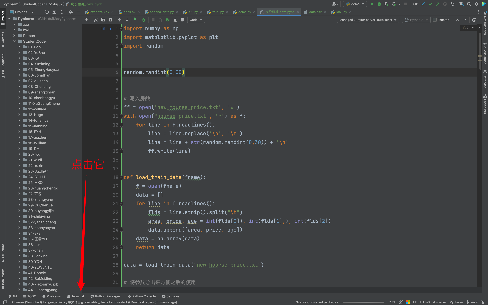
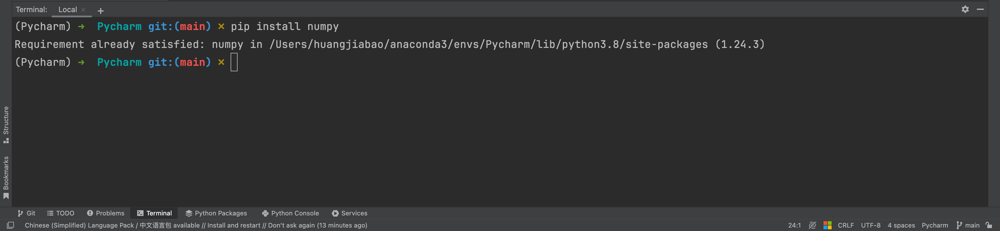
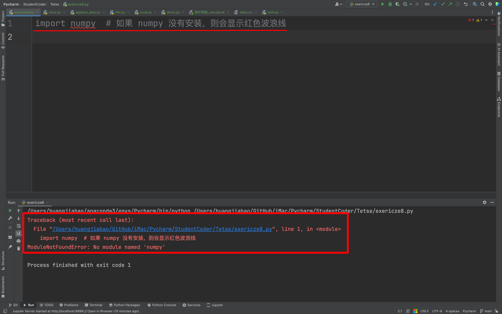
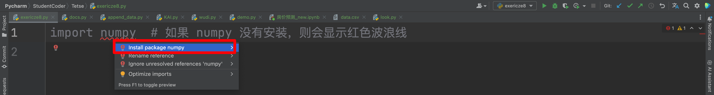

## 1. 通过命令行安装

无论是 Mac 还是 Windows，都有两种命令行。一种是系统自带的命令行，另一种是 Pycharm 命令行。

这里，主要带你使用 Pycharm 命令行来安装，比较通用。

### 1.1 打开 Pycharm



### 1.2 使用 pip 安装

比如我们这里需要安装 numpy 库，我们则使用如下命令：

```bash
pip install numpy
# pip install 你需要安装的库名称
```

### 1.3 在 Terminal 执行命令



> 如果安装失败，请自行检查网络等其他未知问题。可以加微信，咨询我。

## 2. 通过 Pycharm 直接安装

### 2.1 随便一个 Python 代码文件

随便一个 Python 的代码文件中，导入你所需要的库，不论是否安装。



### 2.2 开始安装

鼠标点击 numpy 库，然后按住键盘 Alt 键 + Enter。




欢迎关注我公众号：AI悦创，有更多更好玩的等你发现！

::: details 公众号：AI悦创【二维码】


:::

::: info AI悦创·编程一对一

AI悦创·推出辅导班啦，包括「Python 语言辅导班、C++ 辅导班、java 辅导班、算法/数据结构辅导班、少儿编程、pygame 游戏开发」，全部都是一对一教学：一对一辅导 + 一对一答疑 + 布置作业 + 项目实践等。当然，还有线下线上摄影课程、Photoshop、Premiere 一对一教学、QQ、微信在线，随时响应！微信：Jiabcdefh

C++ 信息奥赛题解，长期更新！长期招收一对一中小学信息奥赛集训，莆田、厦门地区有机会线下上门，其他地区线上。微信：Jiabcdefh

方法一：[QQ](http://wpa.qq.com/msgrd?v=3&uin=1432803776&site=qq&menu=yes)

方法二：微信：Jiabcdefh

:::


