## 1. 打开 PyCharm

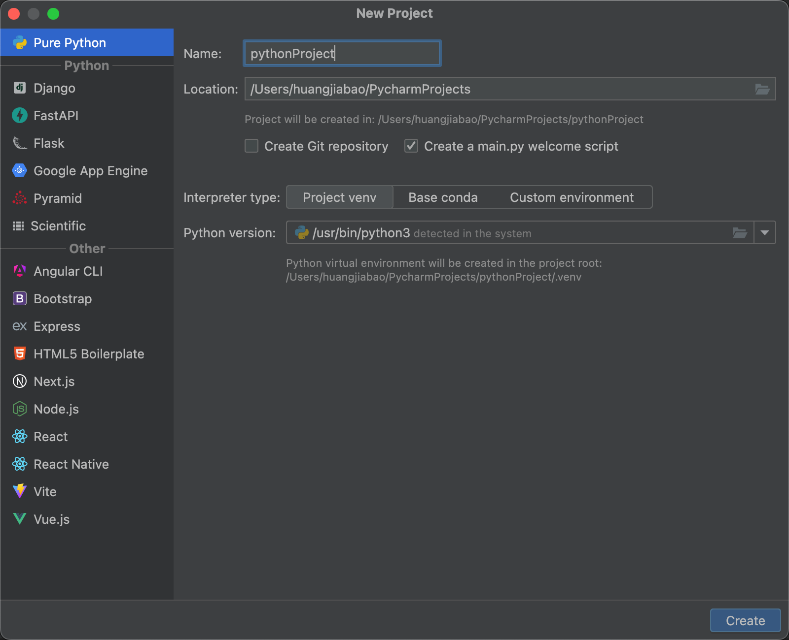

## 2. 设置项目相关信息

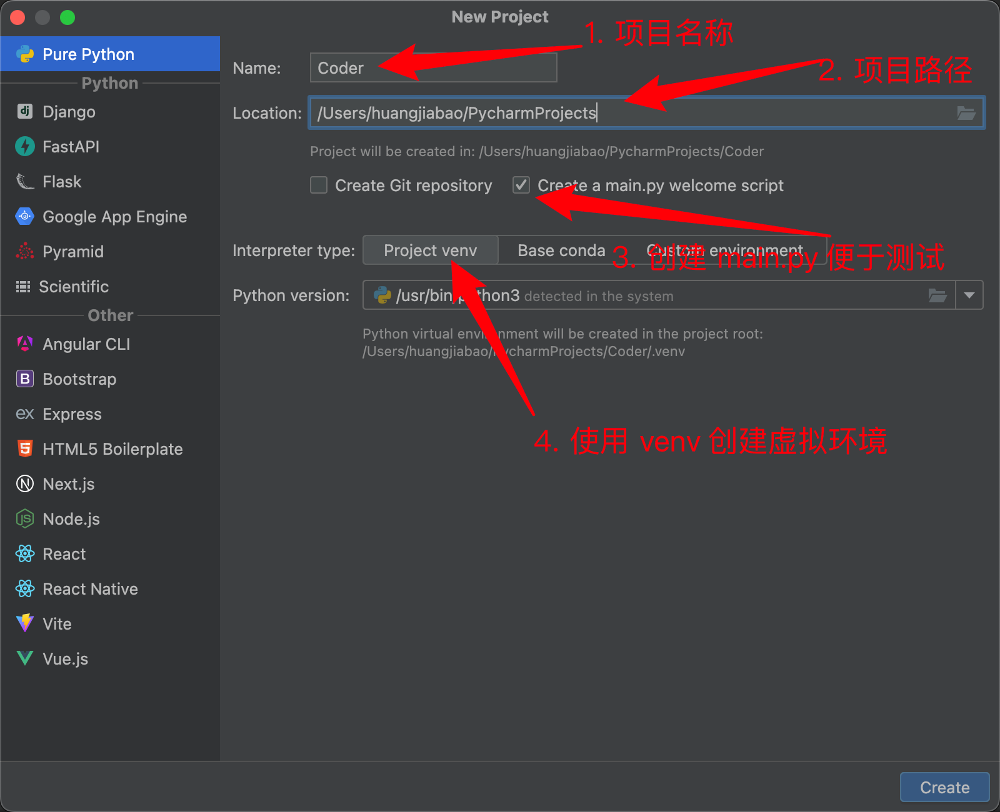

最后点击 Create 即可。

## 3. 创建项目之后的界面

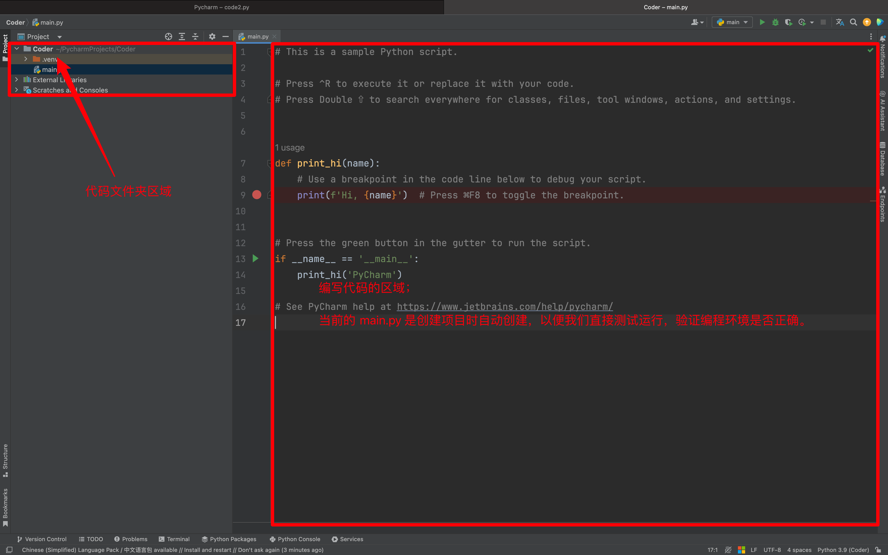

## 4. 运行代码测试

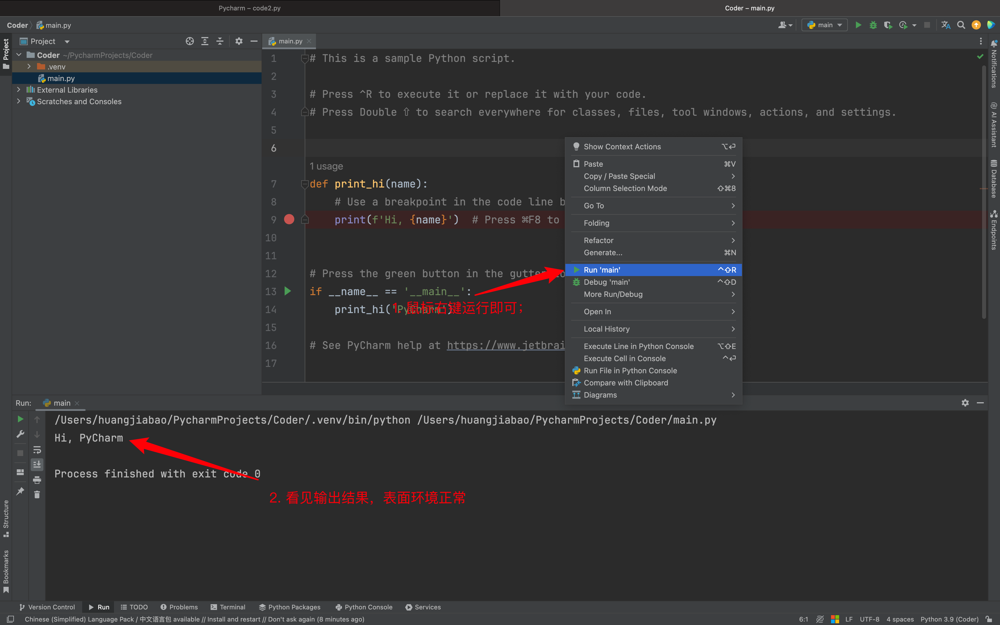

## 5. 删除 main.py

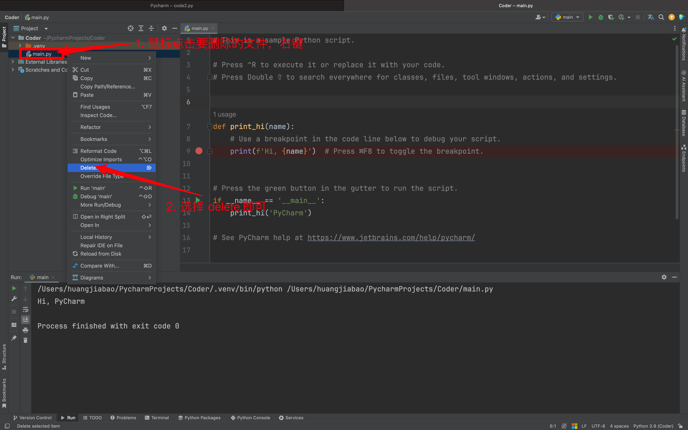

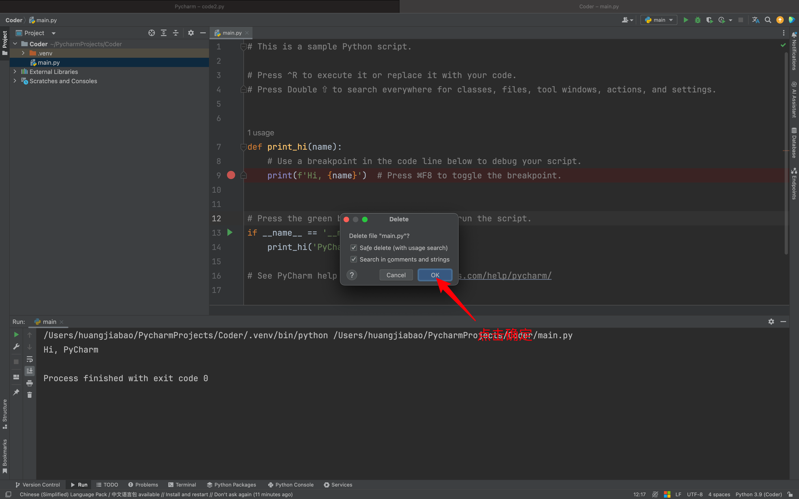

## 6. 注意⚠️

文件夹中的 `.venv` 文件夹不能操作，是当前 PyCharm 环境的配置文件夹。

操作有可能导致无法正常运行，就放着不动即可。

## 7. 新建文件夹

放在要新建的文件夹 `Coder` 上，鼠标右键操作：

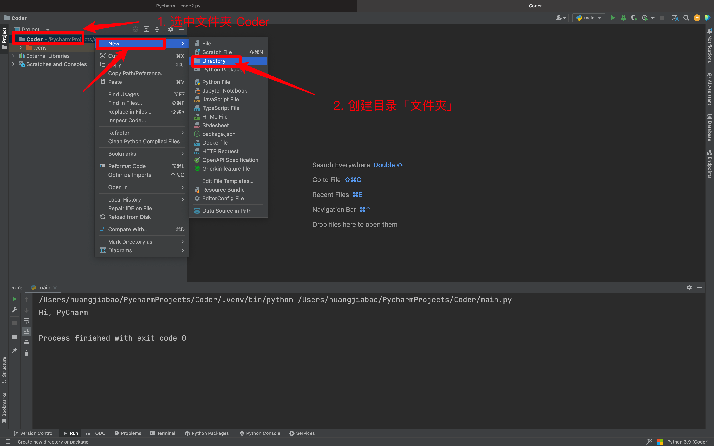

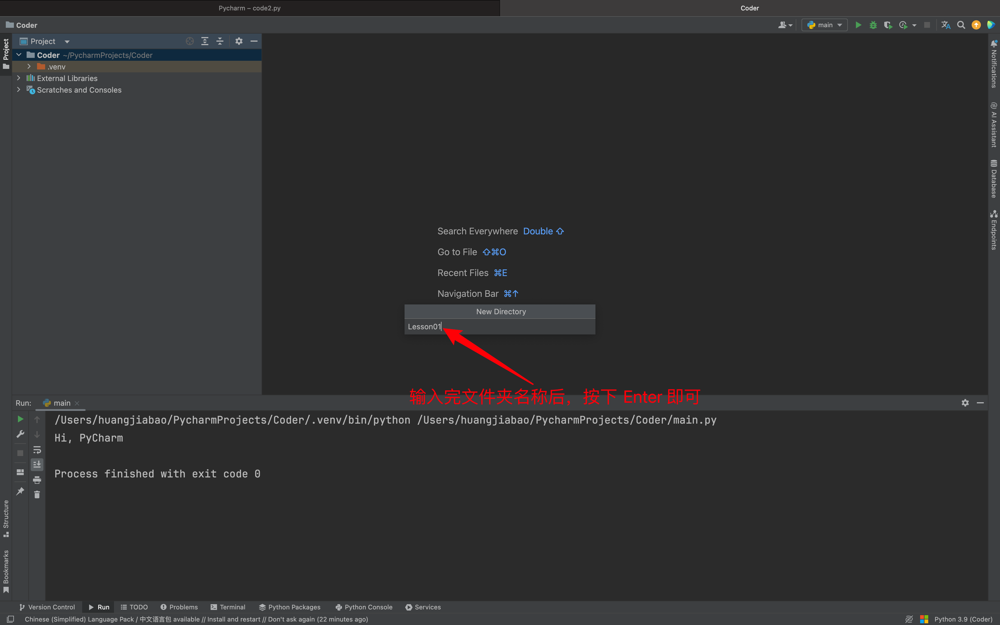

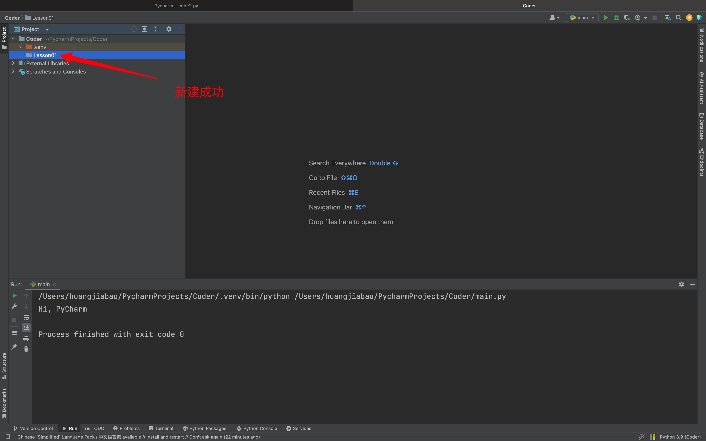


## 8. 新建代码文件

在你想把代码放在哪个文件夹，在那个文件夹上面鼠标右键。

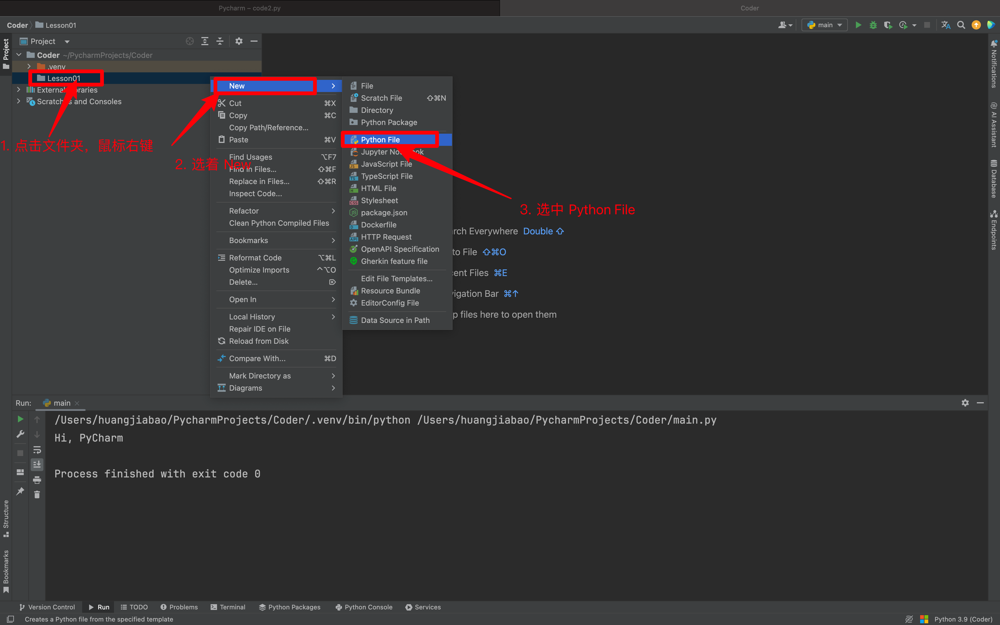

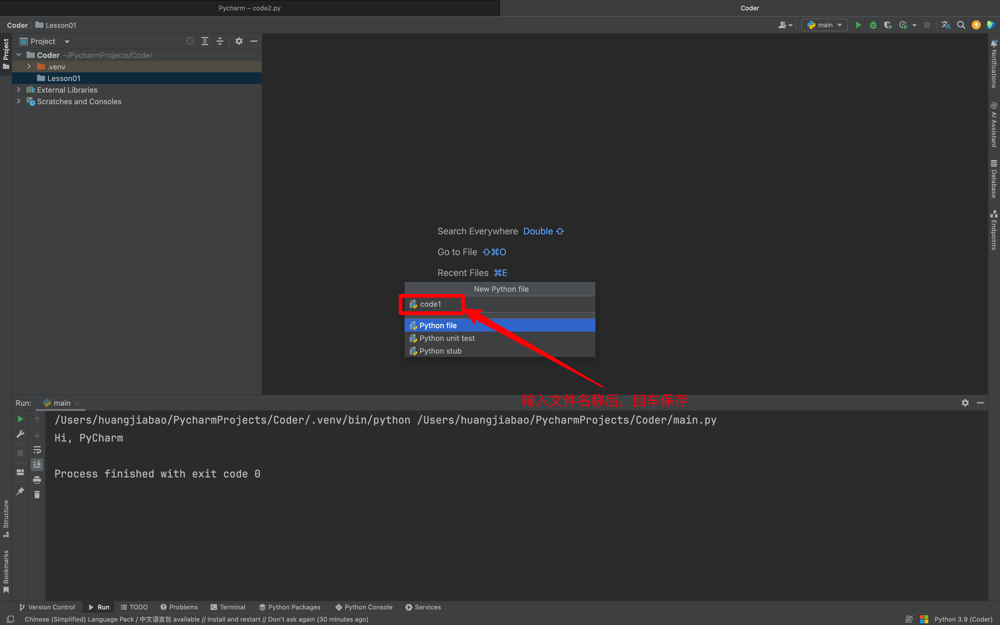

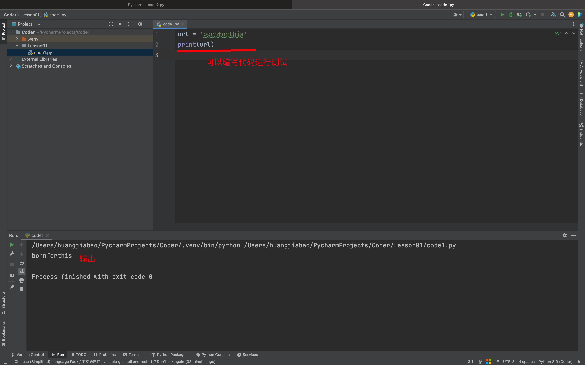


## 9. 重命名

有时候，我们会需要重新命名文件夹或者代码文件，所以接下来带你操作文件、文件夹重命名。

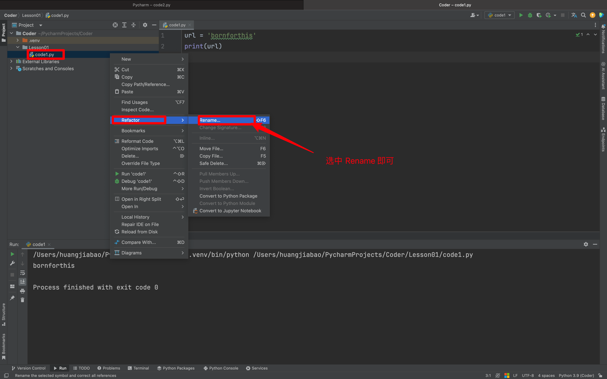

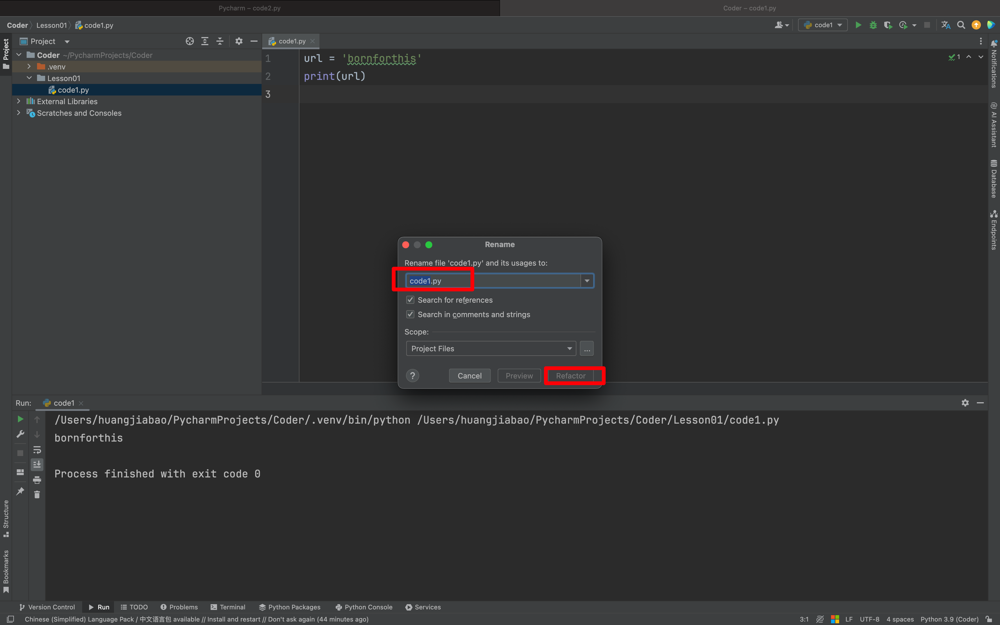

## 10. 几种常见的虚拟环境介绍

### 10.1 介绍

在 Python 开发中，虚拟环境是一个非常重要的概念，它允许你为每个项目创建一个独立的环境，这样就可以在不同项目之间隔离依赖，避免版本冲突。想象一下，你有两个项目，一个需要 Django 2.0，而另一个需要 Django 3.0。

如果没有虚拟环境，这两个版本的 Django就会发生冲突「因为，是在同一台电脑同一个 Python 肯定会冲突」。

虚拟环境就像是给每个项目提供了一个小盒子，这个盒子里面装着所有这个项目需要的东西，而且盒子之间是相互独立的。

### 10.2 为什么需要虚拟环境？

- **依赖管理**：不同项目可能需要不同版本的库，虚拟环境可以避免版本冲突。
- **项目隔离**：保持全局环境的干净整洁，每个项目都有自己的环境，不会互相影响。
- **易于复制**：如果你想在另一台机器或者环境中复制你的项目，虚拟环境可以让这一过程变得简单，因为你可以很容易地重新创建一个一模一样的环境。

### 10.3 几种常见的 Python 虚拟环境管理工具

1. **venv**
    - `venv` 是 Python 自带的虚拟环境工具，从 Python 3.3 开始内置。
    - 使用方法简单，可以通过简单的命令创建虚拟环境，然后激活环境并在其中安装依赖。
    - 适合大多数基本的用途。
2. **pipenv**
    - `pipenv` 是一个 Python 开发工作流的工具，它结合了 pip 和 venv 的功能。
    - 它自动管理项目的虚拟环境，并且使用 `Pipfile` 和 `Pipfile.lock` 来替代传统的 `requirements.txt`，这样可以更清楚地定义项目依赖。
    - 它还提供了依赖图的概览，让开发者可以很方便地看到依赖之间的关系。
3. **conda**
    - `conda` 是一个开源的包、依赖和环境管理器，它支持 Python 项目，但也可以用于其他语言的项目。
    - Conda 更像是一个跨平台的工具，不仅能管理 Python 库，还能管理非 Python 的库。
    - 它非常适合于处理复杂的科学计算项目，因为很多科学计算库在安装时有复杂的依赖。

虚拟环境在 Python 开发中扮演着非常重要的角色，无论是保持开发环境的清洁，还是管理不同项目之间的依赖冲突，都有着不可替代的作用。选择哪种虚拟环境工具，主要取决于项目需求和个人偏好。

### 10.4 如何使用这些虚拟环境工具

#### 10.4.1 venv

1. 新建虚拟环境

```bash
python3 -m venv myenv
```

这条命令会在当前目录下创建一个名为 `myenv` 的虚拟环境目录。这个目录包含了 Python 的可执行文件，以及一个 `pip` 库的拷贝，可以用来安装其他包。

2. 激活虚拟环境

- Windows:

```bash
myenv\Scripts\activate
```

- macOS/Linux:

```bash
source myenv/bin/activate
```

激活虚拟环境后，你会在命令行前面看到虚拟环境的名字，这表示虚拟环境已经被激活。

3. 退出虚拟环境

```bash
deactivate
```

运行 `deactivate` 命令可以退出当前的虚拟环境，回到系统的全局 Python 环境。

#### 10.4.2 pipenv

1. 新建虚拟环境

```bash
pipenv install
```

在项目目录中运行这个命令，如果 `Pipfile` 存在，`pipenv` 会根据 `Pipfile` 来创建一个新的虚拟环境。如果不存在，它会创建一个新的 `Pipfile`。

2. 使用虚拟环境

```bash
pipenv shell
```

这个命令会激活虚拟环境。`pipenv` 也支持通过 `pipenv run` 命令在虚拟环境中运行命令，而无需手动激活虚拟环境。

3. 退出虚拟环境

如果你是通过 `pipenv shell` 进入的虚拟环境，可以通过 `exit` 命令或者 Ctrl+D（在大多数 Unix 系统中）来退出。

#### 10.4.3 conda

1. 新建虚拟环境

```bash
conda create --name myenv python=3.8
```

这个命令会创建一个名为 `myenv` 的新虚拟环境，其中安装了 Python 3.8 。`conda` 允许你在创建环境时指定安装包。

2. 激活虚拟环境

```bash
conda activate myenv
```

使用 `conda activate ` 命令激活虚拟环境。激活后，你会在命令行提示符前看到环境的名字。

3. 退出虚拟环境

```bash
conda deactivate
```

运行 `conda deactivate` 可以退出当前的虚拟环境。

每种工具的命令都有自己的特点，但基本的流程是相似的：创建环境、激活环境、使用环境，最后退出环境。使用虚拟环境是一个好习惯，它能帮助你更有效地管理项目依赖和避免潜在的冲突。


