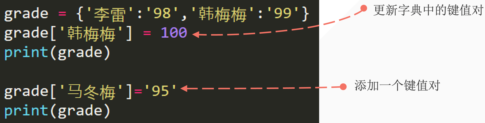
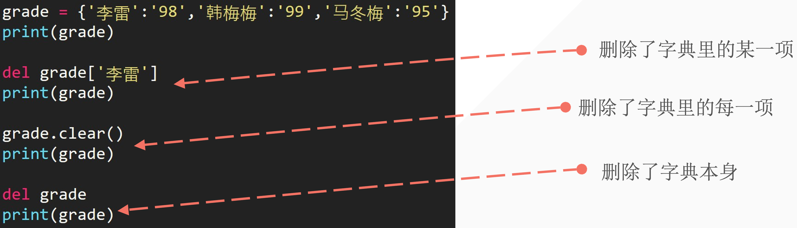

## 1. 如何创建一个电话簿

我们现在有下面的联系人：

| 姓名        | 手机号 |
| ----------- | ------ |
| 李雷        | 123456 |
| 韩梅梅      | 132456 |
| 大卫        | 154389 |
| Mr.Liu      | 131452 |
| Bornforthis | 180595 |
| Alexa       | 131559 |

如何用以往学过的知识构建一个具有用户输入查询功能的电话簿。

> 变量、数字型、列表、元组、字符串。

程序运行效果：

- 测试一：

```python
Enter your search name: 李雷
The 李雷 phone number is: 123456
```

- 测试二：

```python
Enter your search name: Bornforthis
The Bornforthis phone number is: 180595
```

::: code-tabs

@tab Code1

```python
names = ['李雷', '韩梅梅', '大卫', 'Mr.Liu', 'Bornforthis', 'Alexa']
phones = ['123456', '132456', '154389', '131452', '180595', '131559']

# 获取用户输入
search_name = input("Enter your search name: ")
position = names.index(search_name)
print(f"The {search_name} phone number is: {phones[position]}")
```

@tab Code2

```python
phonebooks = ['李雷', '123456', '韩梅梅', '132456', '大卫', '154389', 'Mr.Liu', '131452', 'Bornforthis', '180595', 'Alexa', '131559']

# 获取用户输入
search_name = input("Enter your search name: ")
position = phonebooks.index(search_name)
print(f"The {search_name} phone number is: {phonebooks[position + 1]}")
```

@tab Code3

```python
names = ['李雷', '韩梅梅', '大卫', 'Mr.Liu', 'Bornforthis', 'Alexa']
phones = ['123456', '132456', '154389', '131452', '180595', '131559']
phonebooks = list(zip(names, phones))

# 获取用户输入
search_name = input("Enter your search name: ")
position = names.index(search_name)
print(f"The {search_name} phone number is: {phonebooks[position][1]}")
```

:::

由上面的问题应该要了解两个点：

1. 如何用已有的知识去完成未知的新任务，毕竟 Python 不可能包含全部各种需求所需要的数据类型类型；「这个情况，只是把未来会遇到的情况提前揪出来」
2. 字典存在意义，从上面题目完成后应该要 get 到。

## 2. 字典结构

- 用 **<span style="color:orange">花括号</span>** 表示字典
- 字典内每一项都有两个元素组成：**<span style="color:orange">key 和 value</span>**
    - `{key: value, key: value}`
- 各个项用 **<span style="color:orange">逗号</span>** 隔开

```python
phone_numbers = {'李雷': '1234', '韩梅梅': '3456', '马冬梅': '0123'}
print(phone_numbers['李雷'])

# ---output---
1234
```

## 3. 字典结构 key & value

- key 和 value 是一一对应，同一个键只能有一个对应的值
- 键的类型是不可变的；
- value 的类型是任意的；

```python
names = {'name': '李雷', 'numbers': '1234', 'name': '韩梅梅', True: 'bool', 2: 'int'}
print(names)

# ---output---
{'name': '韩梅梅', 'numbers': '1234', True: 'bool', 2: 'int'}
```

- 如果 key 用列表则报错：

```python
names = {['name']: '李雷', 'numbers': '1234'}
print(names)

# ---output---
Traceback (most recent call last):
  File "/Users/huangjiabao/GitHub/iMac/Pycharm/StudentCoder/44-liuchengyang/look.py", line 8, in <module>
    names = {['name']: '李雷', 'numbers': '1234'}
TypeError: unhashable type: 'list'
```

## 4. 用字典 dict 函数创建字典

- 方法一：根据其他序列新建字典

```python
message = [('lilei', 98), ('hanmeimei', 99)]
list_to_dict = dict(message)
print(list_to_dict)

# ---output---
{'lilei': 98, 'hanmeimei': 99}
```

- 方法二：根据关键字参数新建字典

```python
d = dict(lilei=98, hanmeimei=99)
print(d)

# ---output---
{'lilei': 98, 'hanmeimei': 99}
```

::: info 上面两种创建字典的方法，有什么优缺点？

上面方法一的方法，可以更好的适配字典的各种数据类型情况。why？——因为结构是列表里面放元组，而元组的 0 号位放 key，1 号位放 value。所以，只要是不可变的数据类型都可以放在 0 号位。

反之对比上面方法二：第一个位置必须是“变量”，不能是其它数据类型。举个例子：

```python
d = dict(lilei=98, hanmeimei=99)  # 看起来正常
d = dict('lilei'=98, 'hanmeimei'=99)  # 看起来怎么样？
```

上面第二行代码，看起来就很奇怪了，一共有两个值一个值是 `'lilei'` 另一个值 `98` 两个都是值，可以用 98 赋值给另一个值吗？——显然是不行的。我们的赋值是需要把一个值赋值给一个变量「有空间」。

所以，第二种方法虽然可以实现创建字典，但是对于字典 key 的各种情况并不能完全支持。

> Output 时第二种的 key 只能得到字符串

:::

## 5. 访问字典数据

### 5.1 中括号访问

- 利用中括号加要查询的 key

```python
grade = {'李雷': '98', '韩梅梅': '99'}
print(grade['李雷'])  # 98
```

### 5.2 上面的提取方法存在问题

在提取不存在的 key 的时候，会报错：

```python
grade = {'李雷': '98', '韩梅梅': '99'}
print(grade['马冬梅']) 

# ---output---
Traceback (most recent call last):
  File "/Users/huangjiabao/GitHub/iMac/Pycharm/StudentCoder/44-liuchengyang/look.py", line 9, in <module>
    print(grade['马冬梅'])
KeyError: '马冬梅'
```

就像我们查询电话簿的时候，没找到会返回：未找到。


### 5.3 使用 .get() 解决

当使用 `get` 方法时，需要提供一个键（key），方法会返回与该键关联的值。如果该键在字典中不存在，`get` 方法将返回 `None`，或者你可以指定一个默认值，如果键不存在，则返回这个默认值。

这是 `get` 方法的基本语法：

```python
value = dictionary.get(key, default_value)
```

- `key`：你想要检索的键。
- `default_value`：（可选）如果键不存在时返回的值。如果未提供此参数，默认值为 `None`。

下面是一个使用 `get` 方法的例子：

```python
# 创建一个简单的字典
my_dict = {'name': 'Alice', 'age': 25}

# 使用 get 访问一个存在的键
print(my_dict.get('name'))  # 输出: Alice

# 使用 get 访问一个不存在的键，并提供默认值。
# 如果没有提供第二个参数，则返回 None
print(my_dict.get('gender', 'Not Specified'))  # 输出: Not Specified
```

在第一个 `get` 调用中，我们访问了键 `'name'`，它在字典中存在，因此返回了对应的值 `'Alice'`。在第二个调用中，我们试图访问键 `'gender'`，它在字典中不存在，因此返回了我们指定的默认值 `'Not Specified'`。

## 6. 更新字典的数据

字典修改或添加数据原则：有则改之，无则加勉「无则添加」



```python
grade = {'李雷': '98', '韩梅梅': '99'}
grade['韩梅梅'] = 100
print(grade)

grade['马冬梅'] = '95'
print(grade)

# ---output---
{'李雷': '98', '韩梅梅': 100}
{'李雷': '98', '韩梅梅': 100, '马冬梅': '95'}
```

## 7. 字典删除



```python
grade = {'李雷': '98', '韩梅梅': '99', '马冬梅': '95'}
print(grade)

# ---output---
{'李雷': '98', '韩梅梅': '99', '马冬梅': '95'}
```

```python
grade = {'李雷': '98', '韩梅梅': '99', '马冬梅': '95'}

del grade['李雷'] # 删除李雷
print(grade)

# ---output---
{'韩梅梅': '99', '马冬梅': '95'}
```

```python
grade = {'李雷': '98', '韩梅梅': '99', '马冬梅': '95'}
del grade['李雷']
grade.clear()  # 清空字典
print(grade)


# ---output---
{}
```

```python
grade = {'李雷': '98', '韩梅梅': '99', '马冬梅': '95'}
del grade['李雷']
grade.clear()  # 清空字典
del grade
print(grade)

# ---output---
Traceback (most recent call last):
  File "/Users/huangjiabao/GitHub/iMac/Pycharm/StudentCoder/44-liuchengyang/look.py", line 12, in <module>
    print(grade)
NameError: name 'grade' is not defined
```

## 8. 字典结构嵌套字典

嵌套：将一系列字典存储在列表中，或将列表作为值存储在字典中。

- 字典列表
- 在字典中存储列表
- 在字典中存储字典

### 8.1 字典列表

> 由字典构成的列表

```python
student1 = {'name': '李雷', 'age': 18, 'grade': 98}
student2 = {'name': '韩梅梅', 'age': 19, 'grade': 99}
student3 = {'name': '马冬梅', 'age': 18, 'grade': 95}
students = [student1, student2, student3]
print(students)

# ---output---
[{'name': '李雷', 'age': 18, 'grade': 98}, {'name': '韩梅梅', 'age': 19, 'grade': 99}, {'name': '马冬梅', 'age': 18, 'grade': 95}]
```

:::: tip 小试牛刀：通过提取 students 来得到 韩梅梅的分数

::: code-tabs

@tab Code1

```python
print(students[1]['grade'])
```

@tab Code2

```python
print(students[1].get('grade'))
```

:::

中括号和 get 的选择依据：看数据是否是确定的，如果是确定的优先使用中括号提取。否则，使用 get。

::::

### 8.2 在字典中存储列表

```python
favorite_class = {
    '李雷': ['数学', '英语'],
    '韩梅梅': ['语文'],
    '马冬梅': ['计算机', '物理', '数学'],
}
print(favorite_class['李雷'])
print(favorite_class['李雷'][0])

# ---output---
['数学', '英语']
数学
```

### 8.3 在字典中存储字典

```python
# 用一个字典表示一个学生信息
student1 = {'name': 'lilei', '成绩': '98', '实验班': True}

# 用一个字典表示全班学生信息
class1 = {
    '李雷': {'成绩': '98', '实验班': True},
    '韩梅梅': {'成绩': '95', '实验班': False},
}
print(class1['李雷'])
print(class1['李雷']['成绩'])
```

## 9. 字典常见方法

### 9.1 .pop(key)

删除特定的键对值。

```python
# 用一个字典表示一个学生信息
student = {'name': 'lilei', '成绩': '98', '实验班': True}
print(student)
student.pop('实验班')  # 必须填写要删除的 key
print(student)

# ---output---
{'name': 'lilei', '成绩': '98', '实验班': True}
{'name': 'lilei', '成绩': '98'}
```

### 9.2 popitem()

`popitem` 是用于移除并返回字典中的最后一个键值对。该方法会修改原字典，且删除的是最后插入的键值对。

**关键点：**

1. **删除最后一个项**：`popitem` 从字典中移除并返回最后插入的键值对。
2. **返回值**：返回一个包含键和值的元组 `(key, value)`。
3. **修改原字典**：使用 `popitem` 会修改原字典。
4. **空字典报错**：如果字典为空，调用 `popitem` 会引发 `KeyError` 异常。

`popitem` 方法是处理字典中最后插入的项的有效工具，特别适用于需要按插入顺序删除和访问键值对的情况。需要注意的是，如果字典为空，调用此方法会引发异常，因此在使用前最好检查字典是否为空或使用 try-except 进行错误处理。

::: code-tabs

@tab Code1

```python
student = {'name': 'lilei', '成绩': '98', '实验班': True}
del_val = student.popitem()
print(del_val)
print(student)

# ---output---
('实验班', True)
{'name': 'lilei', '成绩': '98'}
```

@tab Code2

```python
# 创建一个字典
my_dict = {'a': 1, 'b': 2, 'c': 3}

# 使用 popitem 移除并返回最后一个键值对
item = my_dict.popitem()
print(item)  # 输出: ('c', 3)
print(my_dict)  # 输出: {'a': 1, 'b': 2}

# 再次调用 popitem
item = my_dict.popitem()
print(item)  # 输出: ('b', 2)
print(my_dict)  # 输出: {'a': 1}

# 继续调用 popitem
item = my_dict.popitem()
print(item)  # 输出: ('a', 1)
print(my_dict)  # 输出: {}

# 对空字典调用 popitem 会引发 KeyError
try:
    my_dict.popitem()
except KeyError as e:
    print("Error:", e)  # 输出: Error: 'popitem(): dictionary is empty'
```

:::


### 9.3 .keys()

获取字典中所有的键。

```python
student = {'name': 'lilei', '成绩': '98', '实验班': True}
keys = student.keys()
print(keys)
print(list(keys))

# ---output---
dict_keys(['name', '成绩', '实验班'])
['name', '成绩', '实验班']
```

### 9.4 .values()

获取字典中所有的值。

```python
student = {'name': 'lilei', '成绩': '98', '实验班': True}
values = student.values()
print(values)
print(list(values))


# ---output---
dict_values(['lilei', '98', True])
['lilei', '98', True]
```

### 9.5 .items()

获取字典的键对值。

```python
student = {'name': 'lilei', '成绩': '98', '实验班': True}
values = student.items()
print(values)
print(list(values))


# ---output---
dict_items([('name', 'lilei'), ('成绩', '98'), ('实验班', True)])
[('name', 'lilei'), ('成绩', '98'), ('实验班', True)]
```

> items() 方法，类似上面创建字典的逆方法。

### 9.6 in

1. 默认情况是判断 key 在字典中

```python
dict1 = {'name': '李雷', 'age': 19}
print('name' in dict1)

# ---output---
True
```

2. 使用 keys 实现纯粹判断

```python
dict1 = {'name': '李雷', 'age': 19}
print('name' in dict1.keys())

# ---output---
True
```

3. 使用 values 实现纯粹判断

```python
dict1 = {'name': '李雷', 'age': 19}
print('name' in dict1.values())

# ---output---
False
```

### 9.7 update()

`update()` 方法是字典对象的一个重要方法，它允许你更新字典的内容，通过添加新的键值对或修改现有的键值对。

1. **更新字典：** 你可以使用另一个字典来更新一个字典。这将添加新的键值对到原始字典中，并覆盖任何现有的键的值。

::: code-tabs

@tab Code1

```python
dict1 = {'name': '李雷', 'age': 19}
dict2 = {'age': 20, 'class': '1班', 'gender': 'male'}
dict1.update(dict2)
print(dict1)

# ---output---
{'name': '李雷', 'age': 20, 'class': '1班', 'gender': 'male'}
```

@tab Code2

```python
dict1 = {'a': 1, 'b': 2}
dict2 = {'b': 3, 'c': 4}
dict1.update(dict2)
print(dict1)  # 输出：{'a': 1, 'b': 3, 'c': 4}
# 在这个例子中，dict1 使用 dict2 的内容进行了更新。键 'b' 的值从 2 更新为 3，键 'c' 被添加到了字典中。
```

:::

2. **使用关键字参数**：你也可以使用关键字参数来更新字典。

::: code-tabs

@tab Code1

```python
dict1 = {'name': '李雷', 'age': 19}
dict1.update(name="范闲", age=20)
print(dict1)

# ---output---
{'name': '范闲', 'age': 20}
```

@tab Code2

```python
dict1 = {'a': 1, 'b': 2}
dict1.update(c=3, d=4)
print(dict1)  # 输出：{'a': 1, 'b': 2, 'c': 3, 'd': 4}
# 这里，使用关键字参数 c 和 d 直接更新了 dict1。
```

:::

3. **使用可迭代对象**：可以传递一个可迭代对象（比如元组列表），其中每个元素都是一个键值对。

::: code-tabs

@tab Code1

```python
dict1 = {'name': '李雷', 'age': 19}
data_lst = [('age', 20), ('class', '1班'), ('gender', 'male')]
dict1.update(data_lst)
print(dict1)

# ---output---
{'name': '李雷', 'age': 20, 'class': '1班', 'gender': 'male'}
```

@tab Code2

```python
dict1 = {'a': 1, 'b': 2}
dict1.update([('c', 3), ('d', 4)])
print(dict1)  # 输出：{'a': 1, 'b': 2, 'c': 3, 'd': 4}
```

:::

**注意事项：**

- 当使用 `update()` 方法时，如果键已存在，则其值将被新的值覆盖。
- 如果键不存在，则将添加新的键值对。
- `update()` 方法不返回任何值（即返回 `None`）。
- 当使用 `update()` 方法时，如果键的值是一个可变数据类型（如列表或字典），需要注意，如果通过 `update()` 方法修改了这个键的值，原来对应的值也会被更改，除非进行深拷贝。

这种方法特别有用，在你需要合并两个字典或者在已有字典中添加新的信息时。例如，当你处理来自不同来源的数据并希望将它们合并为一个统一的数据结构时，`update()` 方法非常方便。

**应用场景：**

- **合并配置**：在软件开发中，可能需要从多个配置文件中加载设置，并用特定的用户配置来覆盖默认配置。`update()` 方法可以用来实现这种合并更新。
- **数据聚合**：在数据分析工作中，可能需要将多个字典中的数据聚合到一个字典中，以便进行统一处理。

**扩展用法：**

`update()` 还支持通过迭代器提供的键值对进行更新。如果迭代器产生的是两项的元组，则第一项将被视为键，第二项视为值。

```python
dict1 = {'a': 1, 'b': 2}
pairs = zip(['b', 'c'], [3, 4])
dict1.update(pairs)
print(dict1)  # 输出：{'a': 1, 'b': 3, 'c': 4}
```

在这个例子中，`zip()` 函数生成了一个元组列表，这些元组被用来更新 `dict1`。


### 9.8 排序

1. 以 key 排序

```python
dict1 = {'a': 1, 'd': 4, 'b': 2, 'c': 3}
sorted_dict = sorted(dict1.items())  # 默认升序排序
print(sorted_dict)

# ---output---
[('a', 1), ('b', 2), ('c', 3), ('d', 4)]


to_dict = dict(sorted_dict)
print(to_dict)
# ---output---
{'a': 1, 'b': 2, 'c': 3, 'd': 4}


# 验证是以什么为排序
dict1 = {'a': 5, 'd': 2, 'b': 4, 'c': 3, 'e': 1}
sorted_dict = dict(sorted(dict1.items()))
print(sorted_dict)
# ---output---
{'a': 5, 'b': 4, 'c': 3, 'd': 2, 'e': 1}


# 指定为 key 排序
dict1 = {'a': 1, 'd': 4, 'b': 2, 'c': 3}
sorted_dict = sorted(dict1.items(), key=lambda x: x[0])
print(sorted_dict)

to_dict = dict(sorted_dict)
print(to_dict)
```

2. 以 value 排序

```python
dict1 = {'a': 1, 'd': 4, 'b': 2, 'c': 3}
sorted_dict = sorted(dict1.items(), key=lambda x: x[1])
print(sorted_dict)

to_dict = dict(sorted_dict)
print(to_dict)

# ---output---
[('a', 1), ('b', 2), ('c', 3), ('d', 4)]
{'a': 1, 'b': 2, 'c': 3, 'd': 4}
```

降序排序实现方式：

1. `reverse=True`
2. `[::-1]`


## 10. 练习

### 10.1 题目 1

**描述**：给定一个字典，其中键是学生的名字，值是一个元组，包含学生的年龄和他们的成绩。编写一个程序，该程序返回按成绩（grade）从小到大排序的学生名单。

**示例输入**：
```python
students = {
    'Alice': (20, 85), # name: (age, grade)
    'Bob': (22, 90),
    'Charlie': (21, 88)
}
```

**示例输出**：

```python
['Alice', 'Charlie', 'Bob']
```

**答案：**

```python
# 示例输入
students = {
    'Alice': (20, 85),
    'Bob': (22, 90),
    'Charlie': (21, 88)
}

# 使用 sorted 函数对字典按年龄进行排序
sorted_students = sorted(students.items(), key=lambda x: x[1][1])

# 提取排序后的学生名字
sorted_names = list(dict(sorted_students).keys())

# 打印结果
print(sorted_names)
```

**解释：**

1. `students` 是一个字典，包含学生的名字作为键，年龄和成绩的元组作为值。
2. `sorted(students.items(), key=lambda x: x[1][1])` 使用 `sorted` 函数按年龄排序字典的项。
   - `students.items()` 返回一个包含字典项的列表，每个项都是一个 `(key, value)` 形式的元组。
   - `key=lambda x: x[1][1]` 是一个 lambda 函数，指定排序的依据是每个学生的成绩，即字典值的第一个元素（元组的第一个元素）。
3. `sorted_students` 变量保存排序后的列表。
4. 转换成字典并使用 `keys()` 提取学生名称，最后使用 `list()` 函数转换。
5. 最后，使用 `print` 函数输出排序后的学生名单。

> 现在可以试一试按学生年龄来排序并输出学生姓名看看，看看有没有什么奇妙的发现。

::: details 有趣点

`sorted_students = sorted(students.items(), key=lambda x: x[1])` 和 `sorted_students = sorted(students.items(), key=lambda x: x[1][0])` 都是正确的，因为不指定一个序列具体的排序数字，默认会以第一个元素进行比较。

:::

### 10.2 题目 2「超纲」

**描述**：给定一个字典，其中键是商品的名字，值是商品的价格。编写一个程序，计算字典中所有商品的平均价格，并返回低于平均价格的商品的名称列表。

**示例输入**：
```python
products = {
    'Apple': 3.5,
    'Banana': 2.0,
    'Cherry': 5.0,
    'Date': 4.0
}
```

**示例输出**：
```python
['Banana', 'Date']
```

**答案：**

::: code-tabs

@tab Code1

```python
def get_below_average_products(products):
    # 计算所有商品的平均价格
    average_price = sum(products.values()) / len(products)
    # 返回价格低于平均价格的商品名称列表
    return [name for name, price in products.items() if price < average_price]

# 示例
products = {
    'Apple': 3.5,
    'Banana': 2.0,
    'Cherry': 5.0,
    'Date': 4.0
}
print(get_below_average_products(products))  # 输出：['Banana', 'Date']
```

@tab Code2

```python
def get_below_average_products(products):
    # 计算所有商品的平均价格
    average_price = sum(products.values()) / len(products)
    
    # 初始化一个空列表来存储低于平均价格的商品
    below_average = []
    
    # 遍历商品字典，找出价格低于平均价格的商品
    for name, price in products.items():
        if price < average_price:
            below_average.append(name)
            
    return below_average

# 示例
products = {
    'Apple': 3.5,
    'Banana': 2.0,
    'Cherry': 5.0,
    'Date': 4.0
}
print(get_below_average_products(products))  # 输出：['Banana', 'Date']
```


:::

### 10.3 题目 3

**描述**：给定两个字典，编写一个程序，将这两个字典合并成一个。如果同一个键在两个字典中都有，则它的值应为两个字典中的值相加。假设字典中的值都是整数。

**示例输入**：
```python
dict1 = {'a': 1, 'b': 2, 'c': 3}
dict2 = {'b': 3, 'c': 4, 'd': 5}
```

**示例输出**：
```python
{'a': 1, 'b': 5, 'c': 7, 'd': 5}
```

**答案：**

```python
def merge_dictionaries(dict1, dict2):
    # 创建合并后的字典副本
    merged_dict = dict1.copy()
    # 遍历第二个字典，将其键值对合并到第一个字典
    for key, value in dict2.items():
        if key in merged_dict:
            merged_dict[key] += value  # 如果键存在，合并值
        else:
            merged_dict[key] = value  # 如果键不存在，直接添加

    return merged_dict

# 示例
dict1 = {'a': 1, 'b': 2, 'c': 3}
dict2 = {'b': 3, 'c': 4, 'd': 5}
print(merge_dictionaries(dict1, dict2))  # 输出：{'a': 1, 'b': 5, 'c': 7, 'd': 5}
```


