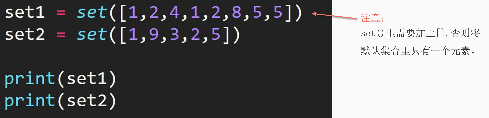

## 1. 创建集合

1. 直接使用花括号创建集合

```python
set1 = {1, 2, 4, 5, 8}
```

2. 使用 `set()` 方法



## 2. 集合的交集

交集（Intersection）：求两个集合中都出现了的元素。用 `&` 运算符实现。

```python
set1 = {1, 2, 4, 5, 8}
set2 = {1, 2, 3, 5, 9}
print(set1 & set2)

# ---output---
{1, 2, 5}
```

## 3. 集合的并集

并集（Union）：求两个集合中共有的元素。用 `|` 运算符实现。

```python
set1 = {1, 2, 4, 5, 8}
set2 = {1, 2, 3, 5, 9}
print(set1 | set2)

# ---output---
{1, 2, 3, 4, 5, 8, 9}
```

## 4. 集合的差集

差集（Difference）：求 set1 和 set2 的差集时，会返回在 set1 中但不在 set2 中的元素。用 `-` 运算符实现。

```python
set1 = {1, 2, 4, 5, 8}
set2 = {1, 2, 3, 5, 9}
print(set1 - set2)

# ---output---
{8, 4}
```

## 5. 对称差集

对称差集（Sysmetric Difference）：求 set1 和 set2 的对称差集时，会返回在 set1 中或在 set2 中，但不同时存在于两个集合中的元素。用 `^` 运算符实现。

```python
set1 = {1, 2, 4, 5, 8}
set2 = {1, 2, 3, 5, 9}
print(set1 ^ set2)

# ---output---
{3, 4, 8, 9}
```

## 6. 思考

对称差集可以用其他三种集合操作来实现吗？如何实现？

```python
set1 = {1, 2, 4, 5, 8}
set2 = {1, 2, 3, 5, 9}
U = set1 | set2
N = set1 & set2
print(U - N)

# ---output---
{8, 9, 3, 4}
```


## 7. .add() 添加集合元素

```python
set1 = {1, 2, 4, 5, 8}
set1.add(10)
print(set1)

# ---output---
{1, 2, 4, 5, 8, 10}
```


## 8. 如何创建空集合

```python
set1 = set()
```


## 9. 练习

### 9.1 题目 1

**描述**：给定两个集合 `A` 和 `B`，编写一个函数，返回只存在于集合 `A` 而不在 `B` 中的元素集合。

**示例输入**：

```python
A = {1, 2, 3, 4, 5}
B = {4, 5, 6, 7}
```

**示例输出**：
```python
{1, 2, 3}
```

**答案：**

```python
def difference_between_sets(A, B):
    # 使用集合的差集运算符 - 得到只存在于 A 而不在 B 中的元素集合
    return A - B

# 示例
A = {1, 2, 3, 4, 5}
B = {4, 5, 6, 7}
print(difference_between_sets(A, B))  # 输出：{1, 2, 3}
```


### 9.2 题目 2

**描述**：给定一个字符串，编写一个函数，返回字符串中出现的唯一字符的集合（即每个字符只出现一次）。

**示例输入**：
```python
string = "programming"
```

**示例输出**：
```python
{'p', 'o', 'a', 'i', 'n', 'g'}
```

**答案：**

```python
def unique_characters(string):
    # 创建一个空字典，用于记录字符出现的次数
    char_count = {}
    
    # 遍历字符串，统计每个字符的出现次数
    for char in string:
        char_count[char] = char_count.get(char, 0) + 1

    # 将出现次数为 1 的字符存入集合并返回
    return {char for char, count in char_count.items() if count == 1}

# 示例
string = "programming"
print(unique_characters(string))  # 输出：{'p', 'o', 'a', 'i', 'n', 'g'}
```


### 9.3 题目 3

**描述**：给定一个集合 `numbers`，编写一个函数，返回一个元组，包含集合中最大和最小的元素。

**示例输入**：
```python
numbers = {2, 5, 9, 1, 7}
```

**示例输出**：

```python
(1, 9)
```

**答案：**

```python
def min_max_from_set(numbers):
    # 使用内置的 min 和 max 函数找到集合中的最小值和最大值
    return (min(numbers), max(numbers))

# 示例
numbers = {2, 5, 9, 1, 7}
print(min_max_from_set(numbers))  # 输出：(1, 9)
```


