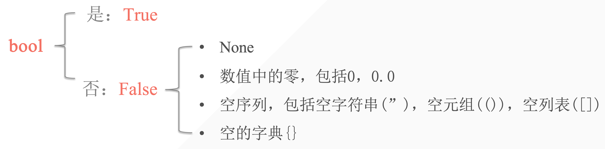

## 1. 布尔值

意义：表示判断中的是与否。一般用于条件测试中。

```python
In [1]: a = True

In [2]: a
Out[2]: True

In [3]: 10 < 5
Out[3]: False

In [4]: 10 > 8
Out[4]: True
```



- 所有的非空就是 True
- 所有的空序列、空数字皆为 False


## 2. 逻辑运算符

逻辑运算符：用于检测两个或两个以上的条件是否满足。

逻辑运算符只存在于布尔类型中。

| 逻辑运算符      | 描述                                                         |
| --------------- | ------------------------------------------------------------ |
| and「逻辑“与”」 | 当运算符两边的两个运算对象都为 True 时，结果为 True          |
| or「逻辑“或”」  | 当运算符两边的两个运算对象其中有一个运算对象为 True 时，结果即为 True |
| not「逻辑“非”」 | 用于反转运算符对象的状态                                     |


| exp         | bool           | value | Return value |
| ----------- | -------------- | ----- | ------------ |
| 3 and 5     | True and True  | True  | 5            |
| 3 or 5      | True and True  | True  | 3            |
| 0 or 5      | False or True  | True  | 5            |
| 3 and not 5 | True and False | Fasle |              |

```python
In [5]: True and False or True
Out[5]: True

In [6]: False or False or not False
Out[6]: True
```


## 3. 表达式应用——条件测试

- 检查当前变量是否与一个特定值相等/不相等。
- 比较数字的大小。
- 检查特定值是否在某序列里。

- 使用 and 检查多个条件

```python
>>> age_lilei = 17
>>> age_hanmeimei = 18
>>> age_lilei >= 18 and age_hanmeimei >= 18
False
>>> age_lilei >= 15 and age_hanmeimei >= 15
True
```

- 使用 or 检查多个条件

```python
>>> age_lilei >= 18 or age_hanmeimei >= 15
True
>>> age_lilei >= 20 or age_hanmeimei >= 20
```

## 4. 练习

1. （多选）以下哪些值可以被当作布尔值中的 False？

A. 0

B. None

C. 空序列

D. 空字典

2. **判断输出**：给定 `x = True` 和 `y = False`，表达式 `x and y` 的结果是什么？

> **判断输出**：给定 `x = True` 和 `y = False`，表达式 `x and y` 的结果是 `False`，因为 `and` 运算符要求两边的值都为 `True` 才返回 `True`。

1. **布尔运算**：如果 `a = 5`，`b = 3`，那么 `a > b` 和 `a == (b + 2)` 的结果是什么？
2. **逻辑表达式**：对于 `x = 10`，`y = 20`，表达式 `not (x > y or y > x)` 的结果是什么？
3. **组合逻辑**：给定 `a = True`，`b = False` 和 `c = True`，计算表达式 `(a and b) or (a and c)` 的结果。
4. **比较操作**：假设有 `list1 = [1, 2, 3]` 和 `list2 = [1, 2, 3]`，`list1 == list2` 和 `list1 is list2` 的结果是什么？
5. **布尔值转换**：使用 `bool()` 函数，`bool(0)`, `bool(0.0)`, `bool("")`, `bool("False")` 分别的结果是什么？
6. **优先级问题**：给定 `x = False`，`y = True` 和 `z = False`，计算表达式 `x or y and z` 的结果，并解释为什么。
7. **逻辑非操作**：对于 `flag = True`，`not flag` 的结果是什么？
8. **混合类型逻辑**：如果 `x = "hello"` 和 `y = ""`，那么 `bool(x) and bool(y)` 的结果是什么？
9. **条件表达式实践**：写一个表达式，使用三元运算符，如果 `age = 18`，返回 `"成年"`，否则返回 `"未成年"`。


1. **布尔运算**：如果 `a = 5`，`b = 3`，那么 `a > b` 的结果是 `True`，因为5大于3；`a == (b + 2)` 的结果也是 `True`，因为 `b + 2` 等于5，所以 `a` 等于 `b + 2`。

2. **逻辑表达式**：对于 `x = 10`，`y = 20`，表达式 `not (x > y or y > x)` 的结果是 `False`。因为 `y > x` 是 `True`，而 `not True` 是 `False`。

3. **组合逻辑**：给定 `a = True`，`b = False` 和 `c = True`，计算表达式 `(a and b) or (a and c)` 的结果是 `True`。因为 `a and c` 为 `True`，而 `or` 运算符只要其中一边为 `True`，结果就是 `True`。

4. **比较操作**：假设有 `list1 = [1, 2, 3]` 和 `list2 = [1, 2, 3]`，`list1 == list2` 的结果是 `True`，因为它们的内容相同；`list1 is list2` 的结果是 `False`，因为它们是存储在内存中的两个不同对象。

5. **布尔值转换**：`bool(0)`, `bool(0.0)`, `bool("")` 的结果都是 `False`，因为它们被视为布尔上下文中的“假”值；`bool("False")` 的结果是 `True`，因为非空字符串被视为“真”值。

6. **优先级问题**：给定 `x = False`，`y = True` 和 `z = False`，表达式 `x or y and z` 的结果是 `False`。根据布尔运算的优先级，`and` 优先于 `or`，因此先计算 `y and z` 得到 `False`，然后计算 `x or False` 也是 `False`。

7. **逻辑非操作**：对于 `flag = True`，`not flag` 的结果是 `False`，因为 `not` 运算符会将 `True` 变为 `False`。

8. **混合类型逻辑**：如果 `x = "hello"` 和 `y = ""`，那么 `bool(x) and bool(y)` 的结果是 `False`。因为 `bool(x)` 为 `True`（非空字符串视为 `True`），而 `bool(y)` 为 `False`（空字符串视为 `False`），所以 `True and False` 是 `False`。

9. **条件表达式实践**：使用三元运算符的表达式是 `age = 18; "成年" if age >= 18 else "未成年"`。这表示如果 `age` 大于或等于18，则返回 `"成年"`，否则返回 `"未成年"`。


