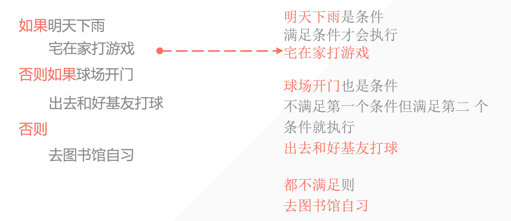
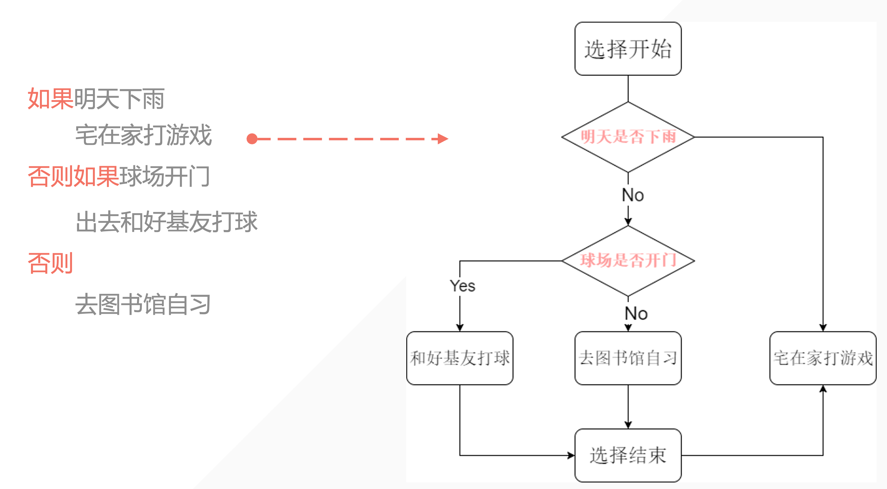
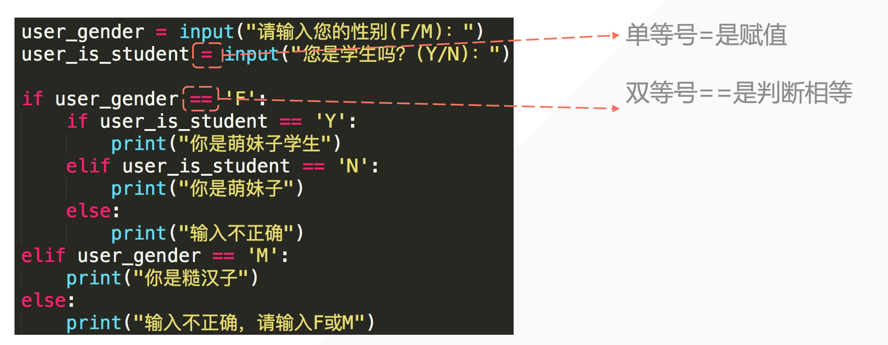

## 1. 缩进

Python 是使用 **<span style="color:orange">四个空格</span>**或者**<span style="color:orange">一个 Tab</span>**来表示缩进都可以，但**<span style="color:orange">不要混用</span>** 。

**相同缩进位置的代码表示他们是同一个代码块。**

```python
condition = True
while condition:
    a = 1
    if a < 10:
        print(f"a:>>>{a}")
```

> 混用会报错！

## 2. 条件判断






## 3. 例子：判断用户输入

```python
user_gender = input("请输入您的性别(F/M):")

if user_gender == "F":
    print("你是萌妹子")
elif user_gender == "M":
    print("你是糙汉子")
else:
    print("输入不正确，请输入 F 或 M")
```

- 如果收到的内容是 **<span style="color:orange">F</span>** 那么输出 **<span style="color:orange">你是萌妹子</span>**；
- 否则如果收到的内容是 **<span style="color:orange">M</span>** 那么输出 **<span style="color:orange">你是糙汉子</span>**；
- 如果 **<span style="color:orange">既不是 F 也不是 M</span>** 那么告诉用户 **<span style="color:orange">输错了</span>**；

## 4. 注意：判断使用双等号 ==



## 5. 判断用户输入的内容

```python
user_gender = input("请输入您的性别(F/M):")

if user_gender == "F":
    print("你是萌妹子")
elif user_gender == "M":
    print("你是糙汉子")
else:
    print("输入不正确，请输入 F 或 M")
```

- elif 就是 else if 的缩写；
- 条件判断会从第一个开始判断，直到有一个符合条件的就不继续往下；
- 如果没有 else 语句且前面条件都不符合则输出什么？——这段条件判断语句什么都不会输出。

## 6. 多重 if 语句

```python
user_gender = input("请输入您的性别 (F/M): ")
user_is_student = input("您是学生吗? (Y/N): ")

if user_gender == 'F':
    if user_is_student == 'Y':
        print("你是萌妹子学生")
    elif user_is_student == 'N':
        print("你是萌妹子")
    else:
        print("输入不正确")
elif user_gender == 'M':
    print("你是糙汉子")
else:
    print("输入不正确，请输入 F 或 M")
```

注意：不同层级的条件判断互不影响


## 7. if 小试牛刀

### 7.1 判断输入是否是奇数 or 偶数

```python
# 获取用户输入
number = int(input("请输入一个整数: "))

# 使用模运算符来判断奇数还是偶数
if number % 2 == 0:
    print(f"{number} 是偶数。")
else:
    print(f"{number} 是奇数。")
```

上面不是纯数字字符串会报错，我们如何优化代码呢？

```python
# 获取用户输入
number = input("请输入一个整数: ")

# 使用模运算符来判断奇数还是偶数
if number.isdigit():
    if number % 2 == 0:
        print(f"{number} 是偶数。")
    else:
        print(f"{number} 是奇数。")
else:
    print("不是纯数字")
```

但是还可以继续优化简洁一些。

嵌套会是程序逻辑变得复杂～

```python
# 获取用户输入
number = input("请输入一个整数: ")

# 使用模运算符来判断奇数还是偶数
if not number.isdigit():
    print("不是纯数字")
elif number % 2 == 0:
    print(f"{number} 是偶数。")
else:
    print(f"{number} 是奇数。")
```

### 7.2 最大数判断

编写一个程序，接收三个整数作为输入，并输出其中的最大值。

```python
a = int(input("输入第一个整数: "))
b = int(input("输入第二个整数: "))
c = int(input("输入第三个整数: "))

if a >= b and a >= c:
    print(f"最大的数是 {a}")
elif b >= a and b >= c:
    print(f"最大的数是 {b}")
else:
    print(f"最大的数是 {c}")
```

### 7.3 登录验证

设计一个程序，要求用户输入用户名和密码。如果用户名是 `admin` 且密码是 `123456`，则打印“登录成功”，否则打印“用户名或密码错误”。

```python
username = input("请输入用户名: ")
password = input("请输入密码: ")

if username == "admin" and password == "123456":
    print("登录成功")
else:
    print("用户名或密码错误")
```

### 7.4 基础条件判断：判断特定数

写一个 `if` 语句，如果 `a` 大于 `b` ，则打印 `"a is greater than b"`。


### 7.5 分数等级判定

编写一个程序，根据用户输入的分数（0-100），输出他们的等级。等级判定标准如下：
- 分数大于等于90：输出"A"
- 分数在80到89之间：输出"B"
- 分数在70到79之间：输出"C"
- 分数在60到69之间：输出"D"
- 分数小于60：输出"F"

请考虑使用 if 嵌套来处理边界情况，例如分数正好是 90 或 80。

### 7.6 奇偶数分级

编写一个程序，根据用户输入的整数，首先判断这个数字是正数、负数还是零。然后，进一步判断该数字是奇数还是偶数（仅当数字为正数或负数时）。输出应该是这样的形式："正奇数", "负偶数" 等。

### 7.7 年份分类

编写一个程序，根据用户输入的年份，判断该年份是平年还是闰年。闰年的条件如下：
- 如果年份能被4整除但不能被100整除，或者能被400整除，则是闰年。

如果是闰年，程序还需要进一步判断该年份是不是一个世纪年（即是否能被100整除）。输出应包括年份是平年、闰年还是世纪闰年。


