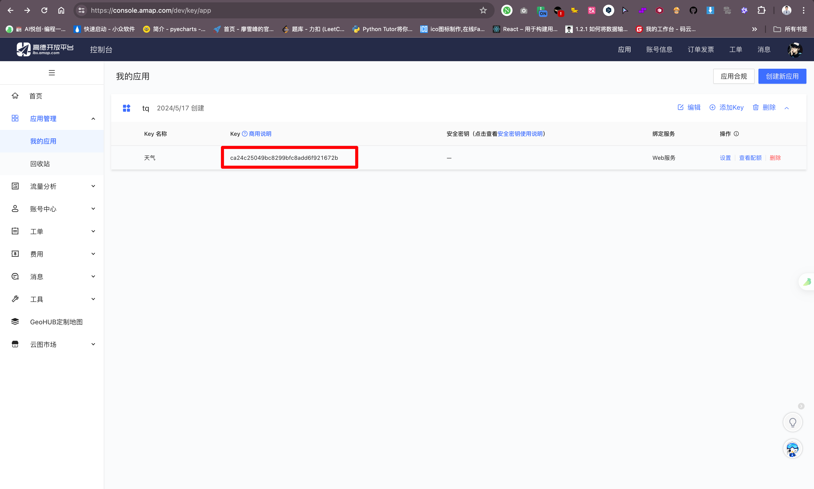
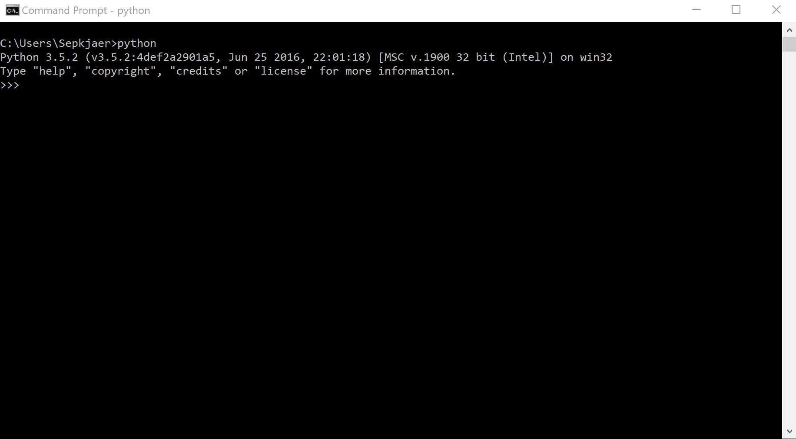

## 1. 项目介绍

**"简易聊天机器人：命令行交互式对话系统"** 的具体功能描述，你可以按照以下方式进行：

1. **问候语处理**:
   - 聊天机器人能识别用户的问候语（如“hello”，“hi”），并以友好的方式回应，创建一个温馨的对话开端。

2. **时间查询**:
   - 当用户询问当前时间时，机器人能够提供精确到秒的当前时间。这个功能使用 Python 的 `datetime` 模块实现。

3. **日期查询**:
   - 用户可以请求当前日期信息，机器人将返回格式化的日期，如“May 17, 2024”。这也是利用 `datetime` 模块来实现。

4. **简单的天气概述**:
   - 尽管机器人目前还不能提供实时的天气数据，但可以回应一个简单的、预设的天气相关回答，如“看起来今天是个好天气！”。

5. **未知请求的处理**:
   - 当用户的输入未被识别或无法理解时，机器人会提示用户用不同的方式或询问其他问题。

6. **会话结束功能**:
   - 用户可以通过输入“quit”来结束与机器人的对话。这是通过检测特定的退出命令实现的。

这些功能描述为用户提供了关于聊天机器人能做什么的清晰视图，并且展示了项目的互动性和扩展性。

## 2. 初步版本

::: code-tabs

@tab ZH-Code

```python
import datetime

def chatbot_response(message):
    message = message.lower()
    if "你好" in message or "hello" in message:
        return "你好！有什么可以帮你的吗？"
    elif "时间" in message:
        now = datetime.datetime.now()
        return f"现在的时间是 {now.strftime('%H:%M:%S')}。"
    elif "日期" in message:
        today = datetime.date.today()
        return f"今天的日期是 {today.strftime('%Y年%m月%d日')}。"
    elif "天气" in message:
        return "我还不能实时获取数据，但看起来今天是个好天气！"
    else:
        return "对不起，我没有理解你的意思。你能换个方式问吗？"

def main():
    print("欢迎使用聊天机器人！输入 '退出' 来结束对话。")
    while True:
        user_input = input("你：")
        if user_input.lower() == "退出":
            break
        response = chatbot_response(user_input)
        print(f"机器人：{response}")

if __name__ == "__main__":
    main()
```

@tab EN-Code

```python
import datetime

def chatbot_response(message):
    message = message.lower()
    if "hello" in message or "hi" in message:
        return "Hello! How can I help you today?"
    elif "time" in message:
        now = datetime.datetime.now()
        return f"The current time is {now.strftime('%H:%M:%S')}."
    elif "date" in message:
        today = datetime.date.today()
        return f"Today's date is {today.strftime('%B %d, %Y')}."
    elif "weather" in message:
        return "I'm not able to fetch real-time data yet, but it looks like a nice day!"
    else:
        return "I'm sorry, I didn't understand that. Can you try asking something else?"

def main():
    print("Welcome to ChatBot! Type 'quit' to exit.")
    while True:
        user_input = input("You: ")
        if user_input.lower() == "quit":
            break
        response = chatbot_response(user_input)
        print(f"ChatBot: {response}")

if __name__ == "__main__":
    main()
```

:::

## 3. 添加天气☁️

上面的天气☁️功能，目前是如下：

```python
You: weather
ChatBot: I'm not able to fetch real-time data yet, but it looks like a nice day!
```

接下来，我们要完善这个功能。使用高德的天气 API 来实现。

在正式开发之前，我们先按官方文档的教程来体验一下，在体验之前需要先注册：[https://lbs.amap.com](https://lbs.amap.com)，自行注册和实名认证。

接着创建应用，创建应用之后就可以获取到密钥。详细教程参考：[https://lbs.amap.com/api/webservice/guide/api/weatherinfo](https://lbs.amap.com/api/webservice/guide/api/weatherinfo)



按照官方操作文档来最终得到下面的链接：[https://restapi.amap.com/v3/weather/weatherInfo?city=110101&key=ca24c25049bc8299bfc8add6f921672b](https://restapi.amap.com/v3/weather/weatherInfo?city=110101&key=ca24c25049bc8299bfc8add6f921672b)

接下来，编写成函数代码方便调用，下面是目前的完整项目代码：

::: code-tabs

@tab Step 1

```python
import requests

import json

# Load the JSON data from the file we saved earlier
with open('./AMap_adcode_citycode.json', 'r', encoding='utf-8') as file:
    city_data = json.load(file)


# Function to search for city adcode with precise and fuzzy matching
def search_city_adcode(city_name):
    # Precise matching
    precise_matches = [entry for entry in city_data if entry['中文名'] == city_name]
    if precise_matches:
        return precise_matches[0]['adcode']

    # Fuzzy matching
    fuzzy_matches = [entry for entry in city_data if city_name in entry['中文名']]
    # Limit to top 6 closest matches based on the length of the city name in the entries
    fuzzy_matches_sorted = sorted(fuzzy_matches, key=lambda x: abs(len(x['中文名']) - len(city_name)))
    top_fuzzy_matches = fuzzy_matches_sorted[:6]

    return {entry['中文名']: entry['adcode'] for entry in top_fuzzy_matches}


def format_weather_report(weather_data):
    report = (
        f"省份：{weather_data['province']}\n"
        f"城市：{weather_data['city']}\n"
        f"地区代码：{weather_data['adcode']}\n"
        f"天气：{weather_data['weather']}\n"
        f"温度：{weather_data['temperature']}°C\n"
        f"风向：{weather_data['winddirection']}\n"
        f"风力：{weather_data['windpower']}\n"
        f"湿度：{weather_data['humidity']}%\n"
        f"报告时间：{weather_data['reporttime']}"
    )
    return report


def weather_api(city, key='ca24c25049bc8299bfc8add6f921672b'):
    """
    My Key: ca24c25049bc8299bfc8add6f921672b
    Docs: https://lbs.amap.com/api/webservice/guide/api/weatherinfo
    """
    # if isinstance(city_data, dict):
    #     city_data =
    url = "https://restapi.amap.com/v3/weather/weatherInfo?city={city}&key={key}".format(city=city, key=key)
    # print(url)
    html = requests.get(url).json()
    # print(*html['lives'])
    # print(len(html['lives']))
    return html['lives'][0]


def main():
    text = input('请输入的城市:>>>')
    city_data = search_city_adcode(text)
    print(city_data)
    # city_id = '110000'
    if isinstance(city_data, dict):
        city_id = input('请输入查询到的城市 ID:')
    else:
        city_id = city_data
        print(f'查询到城市{text}的 ID 为: {city_id}')
    data_dict = weather_api(city_id)
    print(format_weather_report(data_dict))


if __name__ == '__main__':
    main()
# import datetime
#
#
# def chatbot_response(message):
#     message = message.lower()
#     if "hello" in message or "hi" in message:
#         return "Hello! How can I help you today?"
#     elif "time" in message:
#         now = datetime.datetime.now()
#         return f"The current time is {now.strftime('%H:%M:%S')}."
#     elif "date" in message:
#         today = datetime.date.today()
#         return f"Today's date is {today.strftime('%B %d, %Y')}."
#     elif "weather" in message:
#         return "I'm not able to fetch real-time data yet, but it looks like a nice day!"
#     else:
#         return "I'm sorry, I didn't understand that. Can you try asking something else?"
#
#
# def main():
#     print("Welcome to ChatBot! Type 'quit' to exit.")
#     while True:
#         user_input = input("You: ")
#         if user_input.lower() == "quit":
#             break
#         response = chatbot_response(user_input)
#         print(f"ChatBot: {response}")
#
#
# if __name__ == "__main__":
#     main()
```

@tab Step 2

```python
import requests
import datetime
import json


# Function to search for city adcode with precise and fuzzy matching
def search_city_adcode(city_name):
    # Load the JSON data from the file we saved earlier
    with open('./AMap_adcode_citycode.json', 'r', encoding='utf-8') as file:
        city_data = json.load(file)
    # Precise matching
    precise_matches = [entry for entry in city_data if entry['中文名'] == city_name]
    if precise_matches:
        return precise_matches[0]['adcode']

    # Fuzzy matching
    fuzzy_matches = [entry for entry in city_data if city_name in entry['中文名']]
    # Limit to top 6 closest matches based on the length of the city name in the entries
    fuzzy_matches_sorted = sorted(fuzzy_matches, key=lambda x: abs(len(x['中文名']) - len(city_name)))
    top_fuzzy_matches = fuzzy_matches_sorted[:6]

    return {entry['中文名']: entry['adcode'] for entry in top_fuzzy_matches}


def format_weather_report(weather_data):
    report = (
        f"省份：{weather_data['province']}\n"
        f"城市：{weather_data['city']}\n"
        f"地区代码：{weather_data['adcode']}\n"
        f"天气：{weather_data['weather']}\n"
        f"温度：{weather_data['temperature']}°C\n"
        f"风向：{weather_data['winddirection']}\n"
        f"风力：{weather_data['windpower']}\n"
        f"湿度：{weather_data['humidity']}%\n"
        f"报告时间：{weather_data['reporttime']}"
    )
    return report


def weather_api(city, key='ca24c25049bc8299bfc8add6f921672b'):
    """
    My Key: ca24c25049bc8299bfc8add6f921672b
    Docs: https://lbs.amap.com/api/webservice/guide/api/weatherinfo
    """
    # if isinstance(city_data, dict):
    #     city_data =
    url = "https://restapi.amap.com/v3/weather/weatherInfo?city={city}&key={key}".format(city=city, key=key)
    # print(url)
    html = requests.get(url).json()
    # print(*html['lives'])
    # print(len(html['lives']))
    return html['lives'][0]


def get_user_text():
    text = input('请输入的城市:>>>')
    city_data = search_city_adcode(text)
    print(city_data)
    # city_id = '110000'
    if isinstance(city_data, dict):
        city_id = input('请输入查询到的城市 ID:')
    else:
        city_id = city_data
        print(f'查询到城市{text}的 ID 为: {city_id}')
    return city_id


def chatbot_response(message):
    message = message.lower()
    if "hello" in message or "hi" in message or "你好" in message:
        return "Hello! How can I help you today?"
    elif "time" in message or "时间" in message:
        now = datetime.datetime.now()
        return f"The current time is {now.strftime('%H:%M:%S')}."
    elif "date" in message or "日期" in message:
        today = datetime.date.today()
        return f"Today's date is {today.strftime('%B %d, %Y')}."
    elif "weather" in message or "天气" in message:
        # return "I'm not able to fetch real-time data yet, but it looks like a nice day!"
        city_id = get_user_text()
        data_dict = weather_api(city_id)
        return format_weather_report(data_dict)
    else:
        return "I'm sorry, I didn't understand that. Can you try asking something else?"


def main():
    print("Welcome to ChatBot! Type 'quit' to exit.")
    while True:
        user_input = input("You: ")
        if user_input.lower() == "quit":
            break
        response = chatbot_response(user_input)
        print(f"ChatBot: {response}")


if __name__ == '__main__':
    main()
```

:::


## 4. 添加花样字体回复



安装这个 art 库，使用如下命令：

```python
pip install art
```

安装完成后，可以使用如下代码体验一下：

```python
In [1]: from art import *

In [2]: art_1=art("coffee") # return art as str in normal mode

In [3]: print(art_1)
c[_]

In [4]: art_2=art("woman",number=2) # return multiple art as str

In [5]: print(art_2)
▓⚗_⚗▓ ▓⚗_⚗▓

In [6]: art("coffee", number=3, space=5)
Out[6]: 'c[_]     c[_]     c[_]'

In [7]: art("random") # random 1-line art mode
Out[7]: ':-)'

In [8]: art("random") # random 1-line art mode
Out[8]: '>:-I'

In [9]: art("random") # random 1-line art mode
Out[9]: '#=='

In [10]: art("rand")   # random 1-line art mode
Out[10]: "<-|-'_'-|->"

In [11]: art(22,number=1) # raise artError
---------------------------------------------------------------------------
artError                                  Traceback (most recent call last)
Cell In[11], line 1
----> 1 art(22,number=1)

File ~/anaconda3/lib/python3.11/site-packages/art/art.py:163, in art(artname, number, space, __detailed_return)
    149 """
    150 Return 1-line art.
    151 
   (...)
    160 :return: ascii art as str
    161 """
    162 if not isinstance(artname, str):
--> 163     raise artError(ART_TYPE_ERROR)
    164 if not isinstance(number, int):
    165     raise artError(NUMBER_TYPE_ERROR)

artError: The 'artname' type must be str.
```

接下来直接对接我们的项目，加入 art 的实现：

```python {1,19-20}
import art


def chatbot_response(message):
    message = message.lower()
    if "hello" in message or "hi" in message or "你好" in message:
        return "Hello! How can I help you today?"
    elif "time" in message or "时间" in message:
        now = datetime.datetime.now()
        return f"The current time is {now.strftime('%H:%M:%S')}."
    elif "date" in message or "日期" in message:
        today = datetime.date.today()
        return f"Today's date is {today.strftime('%B %d, %Y')}."
    elif "weather" in message or "天气" in message:
        # return "I'm not able to fetch real-time data yet, but it looks like a nice day!"
        city_id = get_user_text()
        data_dict = weather_api(city_id)
        return format_weather_report(data_dict)
    elif 'art' in message:
        print(art.text2art(message.replace('art', '')))
    else:
        return "I'm sorry, I didn't understand that. Can you try asking something else?"
```

更多参考下面链接：

- Art 官网文档：[https://www.ascii-art.site/](https://www.ascii-art.site/)
- Github 仓库：[https://github.com/sepandhaghighi/art](https://github.com/sepandhaghighi/art)


## 5. 更多功能尽情期待😚～


欢迎关注我公众号：AI悦创，有更多更好玩的等你发现！

::: details 公众号：AI悦创【二维码】


:::

::: info AI悦创·编程一对一

AI悦创·推出辅导班啦，包括「Python 语言辅导班、C++ 辅导班、java 辅导班、算法/数据结构辅导班、少儿编程、pygame 游戏开发」，全部都是一对一教学：一对一辅导 + 一对一答疑 + 布置作业 + 项目实践等。当然，还有线下线上摄影课程、Photoshop、Premiere 一对一教学、QQ、微信在线，随时响应！微信：Jiabcdefh

C++ 信息奥赛题解，长期更新！长期招收一对一中小学信息奥赛集训，莆田、厦门地区有机会线下上门，其他地区线上。微信：Jiabcdefh

方法一：[QQ](http://wpa.qq.com/msgrd?v=3&uin=1432803776&site=qq&menu=yes)

方法二：微信：Jiabcdefh

:::


