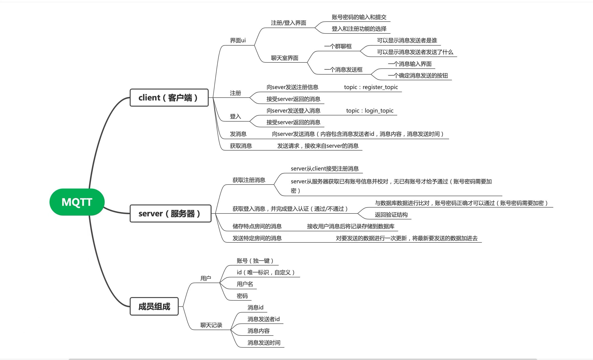
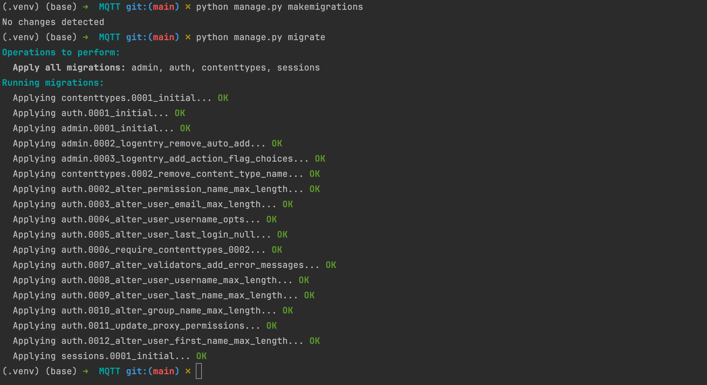

## 1. 项目需求

### 1.1 Client「客户端」

1. 界面 UI：
    1. 注册/登陆界面
        1. 账号密码的输入和提交
        2. 登陆和注册功能的功能选择
    2. 聊天室界面
        1. 一个群聊框
            1. 可以显示消息发送者是谁
            2. 可以显示消息发送者发送了什么
        2. 一个消息发送框
            1. 一个消息输入界面
            2. 一个确定消息发送的按钮
2. 注册：
    1. 向 server 发送注册信息「`topic: register_topic`」
    2. 接受 server 返回的消息
3. 登陆：
    1. 向 server 发送登陆消息「`topic: login_topic`」
    2. 接受 server 返回的消息

Due：2024年6月8日之前

## 2. 项目开发

### 2.1 Client「客户端」

#### 2.1.1 创建 Django 项目

```bash
pip install django
django-admin startproject MQTT
cd MQTT
django-admin startapp AuthApp
```

::: info 参考英文项目名称

1. **AuthApp** - 简洁明了，"Auth" 是 "Authentication"（身份验证）的缩写，常用于相关的应用。

2. **UserPortal** - 表示这是用户进入系统的门户。

3. **AccessControl** - 强调的是访问控制的功能。

4. **IdentityManager** - 管理用户身份的应用。
5. **SecureAccess** - 强调安全性和访问控制。
6. **LoginSystem** - 直接描述了应用的主功能。

:::

#### 2.1.2 设计模型和数据库迁移

- FilePath：`MQTT/AuthApp/models.py`

在你的应用的 `models.py` 文件中定义用户模型（如果不使用 Django 自带的用户模型）：

```python
from django.db import models
from django.contrib.auth.models import AbstractUser


# Create your models here.

class User(AbstractUser):
    # 这里使用 Django 内置的 AbstractUser 作为基类，可以继承它的所有属性和方法
    # 如果需要添加额外的用户属性，可以在这里定义新的字段
    pass
```

然后运行迁移命令来创建数据库表：

```bash
python manage.py makemigrations
python manage.py migrate
```



#### 2.1.3 创建视图和表单

- FilePath：`MQTT/AuthApp/views.py`

在 `views.py` 中创建登录和注册的视图：

```python
from django.contrib.auth import login, authenticate
from django.contrib.auth.forms import UserCreationForm, AuthenticationForm
from django.shortcuts import render, redirect

def register(request):
    if request.method == 'POST':
        form = UserCreationForm(request.POST)
        if form.is_valid():
            form.save()  # 保存用户信息到数据库
            username = form.cleaned_data.get('username')
            raw_password = form.cleaned_data.get('password1')
            user = authenticate(username=username, password=raw_password)  # 验证用户信息
            login(request, user)  # 登录用户
            return redirect('home')  # 重定向到首页
    else:
        form = UserCreationForm()  # 如果不是POST请求，创建一个空表单
    return render(request, 'register.html', {'form': form})

def login_view(request):
    if request.method == 'POST':
        form = AuthenticationForm(request, data=request.POST)
        if form.is_valid():
            username = form.cleaned_data.get('username')
            password = form.cleaned_data.get('password')
            user = authenticate(username=username, password=password)  # 验证用户信息
            if user is not None:
                login(request, user)  # 登录用户
                return redirect('home')  # 重定向到首页
            else:
                return redirect('login')  # 登录失败，重定向到登录页面
    else:
        form = AuthenticationForm()  # 如果不是POST请求，创建一个空表单
    return render(request, 'login.html', {'form': form})
```

#### 2.1.4 设计 URLs

- FilePath：`MQTT/AuthApp/urls.py`

在 `urls.py` 中添加对应的路径，在设置之前需要在 Django 项目的 APP 中手动新建 `urls.py` 文件。

```python
from django.urls import path
from .views import register, login_view

urlpatterns = [
    path('register/', register, name='register'),  # 注册页面URL
    path('login/', login_view, name='login'),  # 登录页面URL
]
```

- FilePath：`MQTT/MQTT/urls.py`

```python {18,22}
"""
URL configuration for MQTT project.

The `urlpatterns` list routes URLs to views. For more information please see:
    https://docs.djangoproject.com/en/4.2/topics/http/urls/
Examples:
Function views
    1. Add an import:  from my_app import views
    2. Add a URL to urlpatterns:  path('', views.home, name='home')
Class-based views
    1. Add an import:  from other_app.views import Home
    2. Add a URL to urlpatterns:  path('', Home.as_view(), name='home')
Including another URLconf
    1. Import the include() function: from django.urls import include, path
    2. Add a URL to urlpatterns:  path('blog/', include('blog.urls'))
"""
from django.contrib import admin
from django.urls import path, include

urlpatterns = [
    path("admin/", admin.site.urls),
    path("accounts/", include("AuthApp.urls"))
]
```

#### 2.1.5 创建前端模板

在应用目录下创建 `templates` 文件夹，并在其中创建 `register.html` 和 `login.html` ：

```html
<!-- register.html -->
<form method="post">
    
    {{ form.as_p }}
    <button type="submit">Register</button>
</form>

<!-- login.html -->
<form method="post">
    
    {{ form.as_p }}
    <button type="submit">Login</button>
</form>
```

这样，基本的注册和登录功能就可以工作了。后面可以根据具体需求调整和优化 UI 界面及功能细节。


欢迎关注我公众号：AI悦创，有更多更好玩的等你发现！

::: details 公众号：AI悦创【二维码】


:::

::: info AI悦创·编程一对一

AI悦创·推出辅导班啦，包括「Python 语言辅导班、C++ 辅导班、java 辅导班、算法/数据结构辅导班、少儿编程、pygame 游戏开发」，全部都是一对一教学：一对一辅导 + 一对一答疑 + 布置作业 + 项目实践等。当然，还有线下线上摄影课程、Photoshop、Premiere 一对一教学、QQ、微信在线，随时响应！微信：Jiabcdefh

C++ 信息奥赛题解，长期更新！长期招收一对一中小学信息奥赛集训，莆田、厦门地区有机会线下上门，其他地区线上。微信：Jiabcdefh

方法一：[QQ](http://wpa.qq.com/msgrd?v=3&uin=1432803776&site=qq&menu=yes)

方法二：微信：Jiabcdefh

:::


