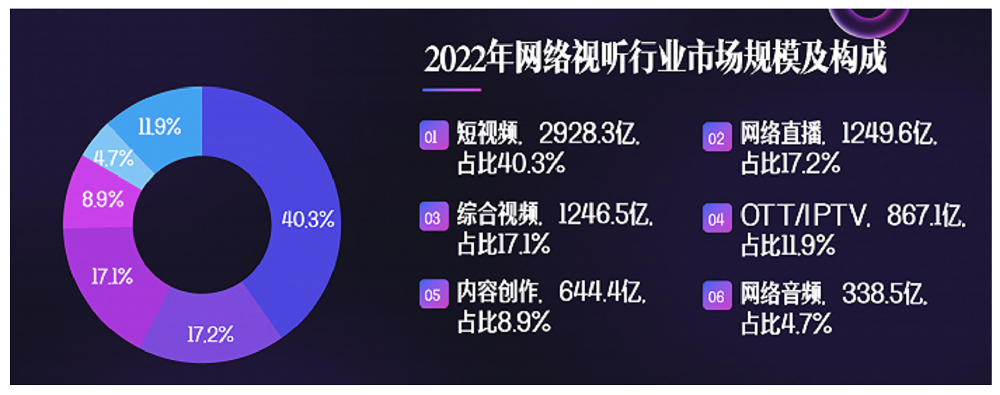
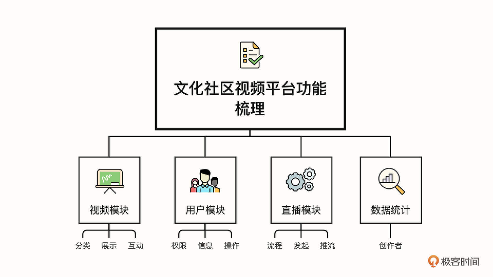
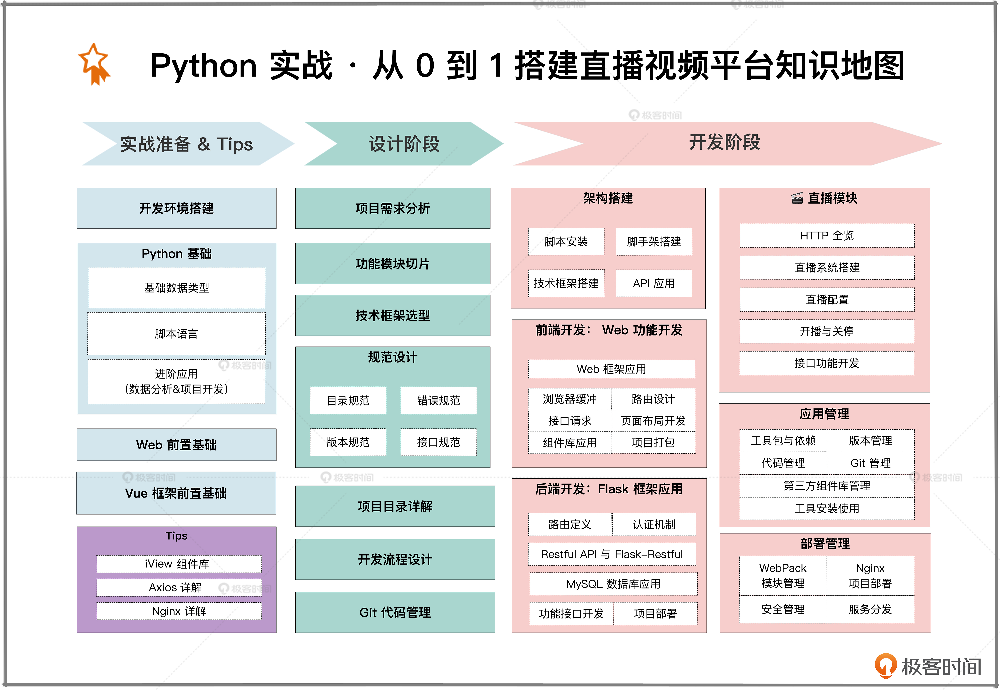

你好，我是悦创。

## 1. Python 有哪些优势？

在我看来，Python 是我们拓宽技术广度，提升技术实力的强力助攻。

一方面，**Python 上手丝滑，便捷友好。**

接触到 Python，即是意外，也是惊喜。我早年做前端的时候，因为开发效率比较高，常常需要等后端接口开发的同学，于是我提出替他分担一些后端模块开发的工作，在这样的机会下就接触到了 Python。

当时的体感非常有趣—— Python 没有 Java 那么“重”，整个的语法和 JS 又很相似。当时能独立完成用户模块功能的开发，离不开 Python 的功劳。

另一方面，**Python 生态非常完善，应用很广泛。**

就拿近期非常火的 ChatGPT 来说吧，它宣告着人工智能更上了一个台阶，而人工智能主要的开发语言就是 Python。

此外，几乎所有大中型互联网企业都在使用 Python 完成各种各样的工作，Python 的落地场景涵盖 Web 应用开发、自动化运维、网络爬虫、游戏开发、数据分析等等，社区的发展也是蒸蒸日上。

因此，借助这门语言来漫游技术世界，你会接触到各种实用工具、见识丰富多样的项目，快速拓宽自己的视野。

## 2. 技术学习最容易踩哪些坑？

不过，单纯学习 Python 语言，还是无法让我们直接提升技术能力。我的技术能力就是从大量的项目和不断试错的过程中积累起来的，所以作为“过来人”，我觉得最高效的学习方法就是在实战中历练。

虽然现在的技术资料已经很丰富了，但如果东一榔头、西一棒子地盲目学习，很容易晕头转向，越学越迷茫。哪怕一时死记硬背了某些知识，还是无法知其所以然，很容易“边学边忘”。

很多技术想要吃透，必须在应用过程中深刻体会，才能知道很多“背后的门道”。比如说在技术选型时，框架如何与项目需求匹配、框架能够满足哪些功能开发，这些都是需要在开发前期深思熟虑、做足准备的。

项目实践除了能巩固知识、把零散知识串联起来，还能锻炼我们的工程思维，这些经验都会成为你未来求职、晋升的铺垫。这里我想提醒你的是，传统单一类型的项目还是很难让我们脱颖而出。所以我们更有必要花精力尝试不同类型的项目，实现质的成长。

接下来，我就和你聊聊我对这门课程的设计，以及你能从中收获什么。

## 3. 我是如何设计这门课程的

课程里最有特色的就是全程围绕项目实践来进行。项目选择上，我也是颇费了一番心思，最终确定带你一起做一个在线视频平台。之所以选择做这样一个项目，而不是带你做一个“管理后台”或“用户管理”的初级项目，主要是从**精度和广度**考虑的。

近几年国内视频平台热度很高，视频平台成为风口上的行业，短视频、中视频和长视频百花齐放。人们可以通过视频快速获取自己需要的内容，这种模式比其他媒介更加高效、便捷、更前沿。肥沃的流量背后是巨大的利润，也意味着相关人才的强烈需求。

> 《2023 中国网络视听发展研究报告》显示，截至 2022 年 12 月，我国网络视听用户规模达 10.40 亿，超过即时通讯（10.38 亿），成为第一大互联网应用。其中，短视频领域市场规模为 2928.3 亿，占比为 40.3%，是产业增量的主要来源；其次是网络直播领域，市场规模为 1249.6 亿，占比为 17.2%，成为拉动网络视听行业市场规模的重要力量。

我们的时间精力都很宝贵，学习的时候更要关注投入产出比。只有在线视频直播平台这样的项目，才能更加充分地锻炼、提升我们的技术实力，最终实现出来也更有成就感。

这个项目里，前端我们前端采用主流 Vue 框架，告别传统陈旧 Web 框架，同时还纳入了当下前沿的 Element 组件库，它具备更高效的开发能力。后端框架选用 Flask，这是一个轻量易上手的框架。这些框架更加热门、技术含金量也更高。

相信这个从 0 到 1 造轮子的过程，能让你受益匪浅。一旦掌握，不光是课程里的项目，日常 Web 开发例如 CRM、数据中台、小程序等等应用，凡是与 Python 后端开发相关的项目，你应对起来都会游刃有余。

项目中涵盖更多元的应用场景，还加入了时下流行的直播模块。我还特意录了一个小视频，演示我们要实现的平台长什么样、有什么功能，你可以看看后面这个视频，做进一步了解。

**视频以后添加，略。**

接下来我们一起来了解各个篇章的内容。

### 3.1 课程前导篇

课程遵循由浅入深的原则，前导篇我会带你一起做一个预热，带你了解 Python 和 Vue 的基础知识。这个部分我安排了很多代码实例供你练习，还会提供很多我亲测有效的技术学习方法。

学完这个部分，你将初步体验到 Python 和 Vue 的魅力。如果你是新手，前导篇有助于你消除心理负担、更轻松地跟上后续的进阶学习。如果你是老手，也可以借此查漏补缺、巩固知识。

### 3.2 前端实战篇

这个篇章我们会完成架构设计和前端模块开发。我们会从需求分析开始，逐一梳理平台的功能有哪些、如何设计模块。这有助于你锻炼工程思维，学会如何根据实际业务选择匹配的框架。

之后，我们会按照架构设计搭建 Vue 框架、设计路由、应用 Element 组件库和数据可视化 ECharts 工具，一步步完成功能模块开发、项目打包与优化。学完这个部分，你就掌握了 Vue 框架的开发能力和第三方组件库的应用能力，二者结合，即可快速实现前端需求开发。

### 3.3 后端实战篇

后端实战部分，整体的设计逻辑和前端模块相似。从代码设计到具体功能的模块接口开发的关键环节都有涉及，核心知识点包括 Flask 项目搭建、正则匹配路由、异常捕获、Flask-RESTful 开发实践、Flask 认证机制，还有数据库的应用。

深度体验独立搭建和后端开发的完整链路以后，你将掌握 Python 后端开发的核心技能。换句话说，就是具备了项目后端开发从 0 到 1 的能力，能够灵活应用框架技术来应对应对多种类型的项目需求。

### 3.4 直播模块篇

直播模块核心是整个项目里最有特色的部分，我会带你实现一个小负载的直播应用。

麻雀虽小，五脏俱全，这个应用涵盖了平台直播系统后台搭建、HLS 协议直播、推拉流、串流码与控制器以及直播功能的完整实现。这部分能让我们在前后端技术开发实现的基础上，再做一次飞跃，让我们这次项目开发实践的体验更加丰富多维，拓展你的技术领域，丰富项目经验，也为你后续钻研直播开发打好基础。

### 3.5 总结篇

复盘有助于我们巩固学习效果，提炼学习方法。整个项目开发完成以后，我还会带你总结回顾，沉淀经验，同时也会和你聊聊全栈工程师职业发展的路线和建议。

我把课程里的重要环节和知识点整理成了一张知识导图，供你参考。

整个课程学完以后，你会收获 Python 项目开发的完整体验，掌握前后端和数据库应用的核心技术。除了技术方面的收获，我还会和你分享很多实操经验和分析推导方法，帮助你系统提升业务理解、分析能力，这样不但能让你向独立开发的道路更进一步，还能培养你未来自学高级架构的能力。

最后，我再分享几条学习这门课程的建议吧。如果你能应用和坚持下去，学习的效果一定会更好。

**第一，保持“寻根究底”的深挖心态。** 学习的时候只停留在应用层看似轻松，但却会错过很多深层次的探索过程，很多时候这种探索能让我们得到更有价值的东西。

**第二，坚持动手练习。** 课程的实操项目只用眼睛看是无法真正理解的，一定要跟着我勤加练习，这样才能扎实地掌握。相信我，坚持下来，这个过程中你会有意想不到的收获感和喜悦感。

最后就是**不给自己设限，勤于思考**。这里的思考不只是理解技术，还包括准确深刻地理解业务，并通过记笔记、做总结等方式记录自己的所思所得。这不但有助于我们日常提升技术实力，还能在面试里成为重要加分项。总之，你的总结思考能力越强，在技术道路上你就会走得越快越稳，事半功倍。

我希望这门课程不仅能帮你提升技术深度和广度，还能帮你掌握不同开发语言学习和技能提升的实用方法，让你具备广阔视野，探索更多可能。最后，祝我们都能在技术领域上越走越远，勇攀高峰。

一起玩转视频平台，在实战中精进技术，学习之旅即将开启，一起加油吧！

## 4. Question

::: info 问一下这个项目怎么取舍是用 vue 还是 react

Vue 和 React 的选择可以根据几个维度来考虑：

1、从上手难易程度上，Vue 的学习应用更加平缓一些，对于新手来说很容易上手，React 相对来说有一点门槛，因为它的 API 比较复杂，对新手不太友好，所以对大家学习前端 Vue 框架较为合适。 

2、如果项目迭代周期较快的，大型的、复杂的、响应式的网站或应用程序，选择 React 更适合，Vue 更适合中小型项目，并且系统开发较为稳定。视频平台的整体功能架构还是非常稳定的。 

3、从市面上的岗位需求角度考虑，也是考虑到技术人才的需求，Vue 的需求量要比 React 更大，之后对于大家的择业也能提供实质性的帮助。 这也是我在项目中选择 Vue 的一些核心原因，期望对你有帮助。

:::

::: info 老师您好，之前看到课表，终于等到了，期望能跟着老师学习。去年也是自学了Python和Vue，自己也仿着简书用Flask写了一个小网站部署在IIS上( ugetread.top)，也尝试用写了Django写了一半CRM系统，权限控制用的v–if来控制。接下来能跟老师来继续加强学习。也同时想问一下老师目前相关的工作机会是怎样的，对于想转行的人来说也想听听老师的想法

作者回复: 感谢同学的信任和选择，也看的出你的努力，也有自己的职业规划，这一点非常的优秀。Python 的岗位需求在 2022 年依然位居各技术岗位前列，在大数据、人工智能、Web 开发和游戏开发等领域都有很大的需求，我建议稳扎稳打，从后端开发作为学习切入，提升语言应用能力，在未来还是有很多的岗位选择，我们一起加油。

:::

::: info 请问老师，在企业里面用 python 做 web 后端的多吗？

作者回复: 这个比较多的，尤其一些期望快速开发的 Web 项目，用 Python 做接口开发，应用在 Web 开发这个场景是非常多的。

:::

::: info 老师，前端用 flutter 怎么看😂

作者回复: 作为 UI 框架，在开源之后发展势头比较迅速，也有很多的企业在应用。它的优势在移动端更突出，当然 web 应用也是ok的。但是，它的学习成本微微有点高，需要理解它的核心原理才行，它的 UI 逻辑使用命令式语法，其次它本身的 UI 结构不能一目了然。

:::

::: info 老师你这个项目包括手机端吗？就是那种视频都能上滑下滑切换的功能怎么开发呀？

作者回复: 同学，你好，这个项目里面是包含手机端的实现的，以及针对不同的终端设备，我们如何控制页面的适配，这部分是有的。对于视频能上下切换的功能，主要的实现方法是前端通过对滑动区域的显示和隐藏，以及滑动操作的JS事件处理进行监听处理，以及对滑动区域变化的计算，从而来实现滑动视频。 后端是通过对数据的获取和更新，还有就是视频的加载和播放，同时也需要对滑动区域的计算，整体组合应用，实现滑动更新视频，期望对你有帮助。

:::

::: info 为什么不考虑使用 flask2.0 或之后的版本呢?而且在 flask2.0 开始支持 asyncio了...对性能提升很大.课程中的版本有点低啊,老师

作者回复: 感谢建议，这个课程技术是核心的部分，同时我也是考虑通过这个课程帮助大家建立项目从0到1的实战视思维能力，我们通过技术架构的学习，培养大家对技术架构的学习能力。

:::

欢迎关注我公众号：AI悦创，有更多更好玩的等你发现！

::: details 公众号：AI悦创【二维码】

:::

::: info AI悦创·编程一对一

AI悦创·推出辅导班啦，包括「Python 语言辅导班、C++ 辅导班、java 辅导班、算法/数据结构辅导班、少儿编程、pygame 游戏开发」，全部都是一对一教学：一对一辅导 + 一对一答疑 + 布置作业 + 项目实践等。当然，还有线下线上摄影课程、Photoshop、Premiere 一对一教学、QQ、微信在线，随时响应！微信：Jiabcdefh

C++ 信息奥赛题解，长期更新！长期招收一对一中小学信息奥赛集训，莆田、厦门地区有机会线下上门，其他地区线上。微信：Jiabcdefh

方法一：[QQ](http://wpa.qq.com/msgrd?v=3&uin=1432803776&site=qq&menu=yes)

方法二：微信：Jiabcdefh

:::

