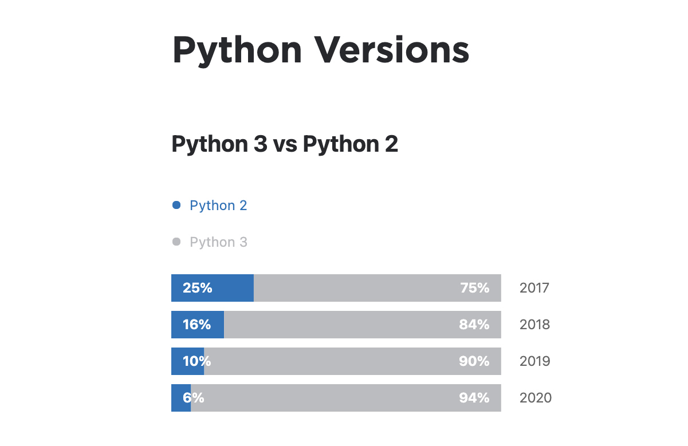
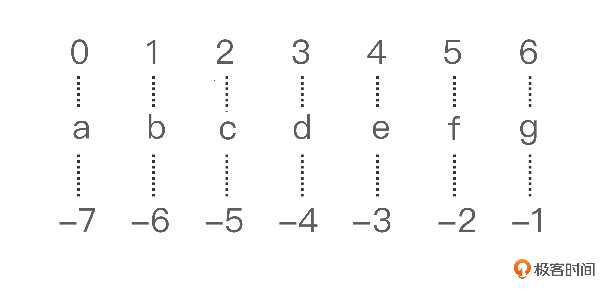
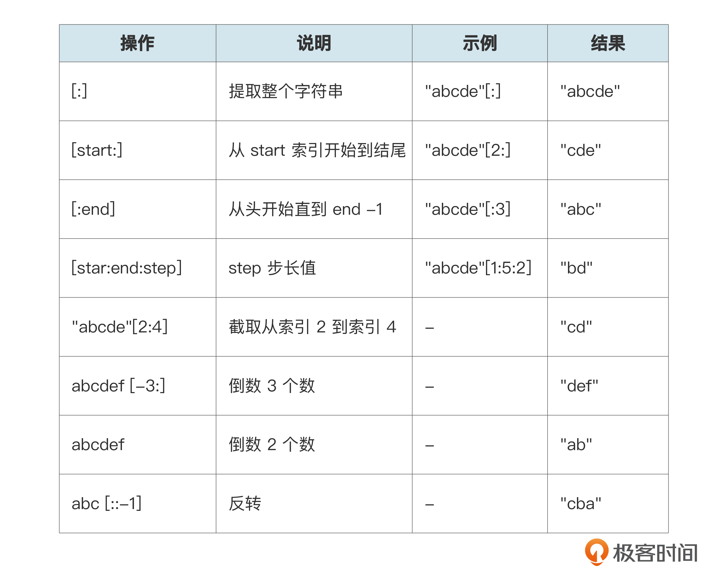
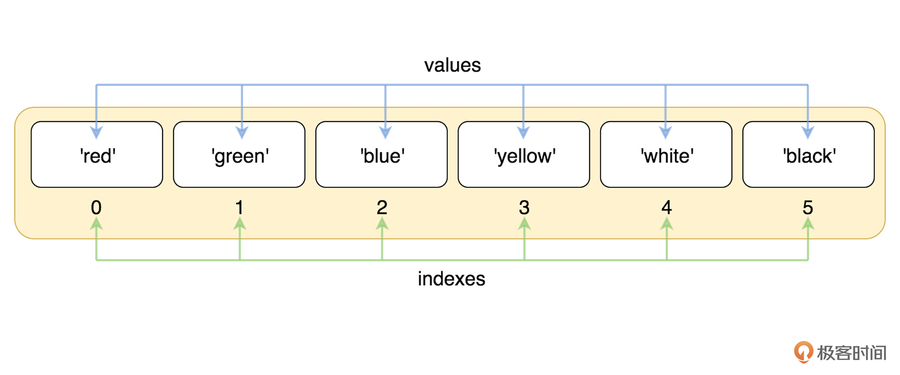
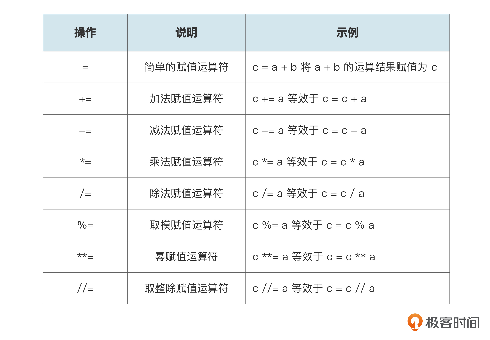
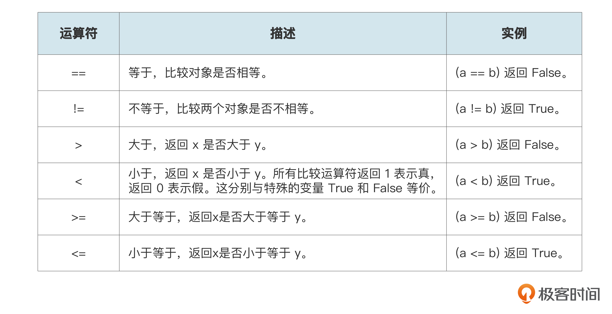
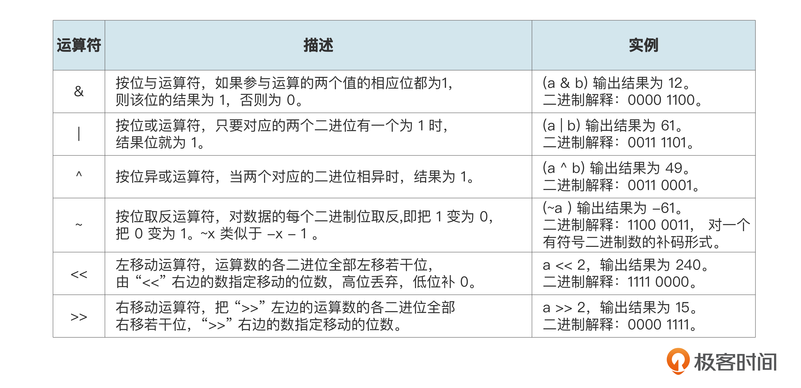
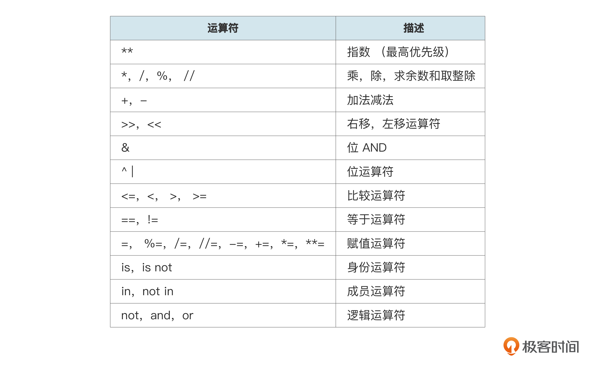
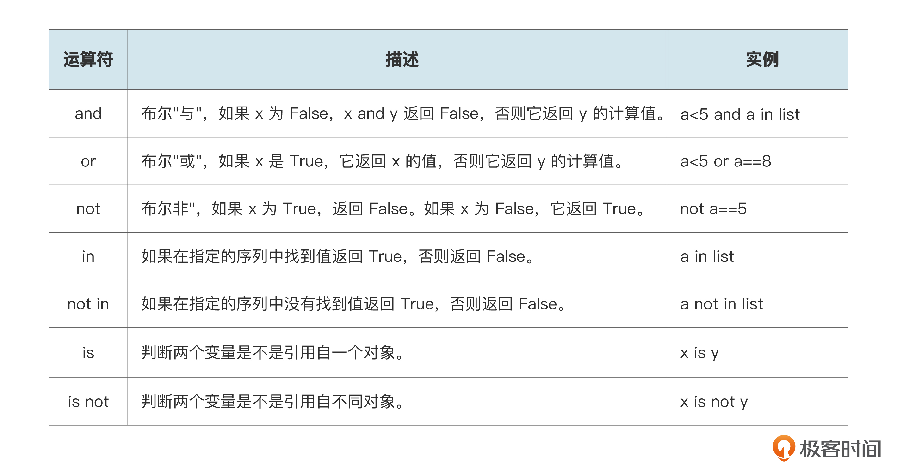

你好，我是悦创。

Python 的语法简单易学、用途广泛，可以说是当下最火的一门语言。它被广泛地应用在数据分析、爬虫、自动化办公、后端开发、自动化测试、人工智能等领域，可以说上天入地，无所不能。

所以说，我们入门了 Python，就等于拿到了开启很多知识的金钥匙。这节课，我们就来入门 Python。今天要学的内容比较多，但是不要担心，只要你跟着我把学习思路整理好，掌握起来还是非常容易的。

## 1. 初识 Python

我们先简单了解一下 Python。

Python 是由 Guido van Rossum 于八十年代末和九十年代初，在荷兰国家数学和计算机科学研究所设计出来的。Python 的设计具有很强的可读性，相比其他编程语言经常使用英文关键字，以及在编写上使用的一些标点符号，Python 的语法结构更有特色。



目前 Python 常用的版本有 2.X 和 3.X。3 在 2 的基础上去繁从简，做了改进。不过，目前使用 Python 2 的开发人员也越来越少了，所以我们只学习 Python 3 就可以了。

Python 的语法非常简洁，下面我们尝试用 Python 输出一句话 “`Hello, Python`”，感受一下它的语法。

```python
#!/usr/bin/Python3
print ("Hello, Python!")
```

可以看到，我们很轻松就完成了一条输出语句，而且我们可以在控制台看到输出的语句。

是不是感觉使用起来比较简单?

现在我们对 Python 有了基本的认识，但是如果想深入学习和应用 Python，我们就需要学习 Python 的几大核心模块。

1. Python 基础数据类型
2. Python 的脚本语言
3. Python 数据分析
4. Python 后端开发（包括后端框架 Flask、Django 等等）

## 2. Python 基础数据类型

我们先从 Python 基础数据类型开始了解，这是学习一门编程语言最基础的内容。

### 2.1 六个标准的数据类型

**Python3 中有六个标准的数据类型，分别是：数字、字符串、列表、元组、集合、字典。**

#### 2.1.1 Number（数字）

Python 中的数字有四种类型：整数、布尔型、浮点数和复数。

- int（整数），例如 1、2、3。
- bool（布尔型），包括 True 和 False 两个值，分别代表真和假。举个例子：张三是不是男生？答案要么是真，要么是假。你只要知道 True 代表真，False 代表假就可以，后面我们会通过代码来表示一些条件的真和假。
- float（浮点数），如 1.23。
- complex（复数），如 1 + 2j、 1.1 + 2.2j。

#### 2.1.2 String（字符串）

多个字符组合在一起就是字符串。现在我们定义一个最简单的字符串。

```python
str="hello"
print(str)
```

字符串由多个字符组成，为了方便找到每一个字符，Python 会默认给它们序号。这个序号就叫做“索引”。正序是从 `0` 开始依次 `+1`，倒序是从最后一个字符开始，由 `-1` 开始依次递减。



那么如果需要在字符串中截取一个片段要如何操作呢？

我们可以在字符串后面加上中括号`[]`，并指明是从哪个索引到哪个索引，两个数字用 “`:`” 连接就可以了。

这里还有一个口诀：**含头不含尾**。例如：`str[3:6]`就表示，str 这个字符串中从索引为 3 到索引为 6（不含）的字符形成的新字符串。

当开始的索引为 `0`，结束的索引为字符串的最大索引 `+1` 时，这种情况可以直接忽略。



我们趁热打铁，通过下面的测试输出练习一下，看看结果是什么样的。

```python
str="abcdefg"
print(str[1:])
print(str[:5])
print(str[1:5])
print(str[-4:])
print(str[-2:-6])
print(str[::-1])
```

#### 2.1.3 List（列表）

那如果我们想把多个元素排放在一起该用什么表示呢？举个例子，彩虹的颜色有赤橙黄绿青蓝紫，应该用什么数据类型表示呢？这时候我们就要用到一个新的数据结构——列表。

在 Python 中，我们可以用一对方括号把元素放在一起，元素之间用逗号分隔就像下面这样。

`["赤", "橙", "黄", "绿", "青", "蓝", "紫"]`

这样，一个列表就出现了。列表中的每个值都有对应的位置值，我们也称之为索引，第一个索引是 0，第二个索引是 1，依此类推。

列表的数据项不需要是相同的类型。举几个例子：

```python
list1 = ['Google', 'baidu', 1997, 2000]
list2 = [1, 2, 3, 4, 5 ]
list3 = ["a", "b", "c", "d"]
```

前面我们举的彩虹那个例子里，数据结构图和代码是后面这样。



```python
#!/usr/bin/Python3

list = ['red', 'green', 'blue', 'yellow', 'white', 'black']
print( list[0] )
print( list[1] )
print( list[2] )
#更新元素
list[2]='pink'
print(list[2] )
print ("原始列表 : ", list)
del list[2]
print ("删除后 : ", list)
print('red' in list)
```

#### 2.1.4 Tuple（元组）

Python 的元组与列表类似，不同之处在于，元组的元素不能修改。元组使用的是小括号  `( )`，列表使用的是方括号 `[ ]`。

要创建元组也很简单，只需要在括号中添加元素，并用逗号隔开即可。

```python
tup = (1, 2, 3, 4, 5 )
```

通常，元组用来存储一组相关的信息，例如它可以存储纬度和经度。

```python
location = (13.4125, 103.866667)
print("Latitude:", location[0])
print("Longitude:", location[1])
```

#### 2.1.5 Set（集合）

集合是一个包含唯一元素的，可变和无序的集合数据类型。集合的一个用途是快速删除列表中的重复项。当我们想要表述一组不能重复的数据时，就可以用到集合。

```python
fruits = {'apple', 'orange', 'apple', 'pear', 'orange', 'banana'}
>>> print(fruits)                      # 这里演示的是去重功能
{'orange', 'banana', 'pear', 'apple'}
>>> 'orange' in fruits                 # 快速判断元素是否在集合内
True
>>> 'crabgrass' in fruits
False
```

#### 2.1.5 Dictionary（字典）

字典是可变数据类型，其中存储的是唯一键到值的映射。

字典的每个键值对  `key-value` 用冒号 “`:`” 分隔，每个对之间用逗号分隔，整个字典被放在花括号  `{}` 中，格式如下。

```python
d = {key1 : value1, key2 : value2, key3 : value3 }
```

举个例子，我们用字典来表示一下张三同学的个人信息。

```python
zhangsan={
  "name":"zhangsan",
  "age":"17",
  "height":"180",
  "weight":"80kg"
}
#给字典添加元素
zhangsan["city"]="BeiJing"
#获取字典的元素
print(zhangsan.get("age"))
```

### 2.2 数据类型的判断和转换

数据类型的判断，主要用于对未知数值的数据类型不确时，我们需要判断数据类型之后才能对值进行处理，那怎么让 Python 告诉我们呢？

我们可以借助 `type()` 检查元素是什么数据类型。

```python
>>> type(4)
int
>>> type(3.7)
float
>>> type('this')
str
>>> type(True)
bool
>>> type(123)
<class 'int'>
>>> type(12.3)
<class 'float'>
>>> type("abc")
<class 'str'>
>>> type([1,2,3])
<class 'list'>
>>> type((1,2,3))
<class 'tuple'>
>>> type({1,2,3})
<class 'set'>
>>> type({'a':123})
<class 'dict'>
```

好了，掌握了判断数据类型的方法之后，我们再一起来学习一下数据类型的转换。数据转换在日常开发中使用频次也是非常高的，我们先来了解一下隐式类型转换和显示类型转换。

#### 2.2.1 隐式类型转换

我们对两种不同类型的数据做运算，例如整数类型和浮点型运算，这时候我们需要把整数转换为浮点型，避免数据丢失。

#### 2.2.2 显式类型转换

在显式类型转换中，用户会将对象的数据类型转换为所需的数据类型。**我们使用 int()、float()、str() 等预定义函数来执行显式类型转换。**

```python
int() 强制转换为整型：
x = int(1)   # x 输出结果为 1
y = int(2.8) # y 输出结果为 2
z = int("3") # z 输出结果为 3
#float() 强制转换为浮点型：
x = float(1)     # x 输出结果为 1.0
y = float(2.8)   # y 输出结果为 2.8
z = float("3")   # z 输出结果为 3.0
w = float("4.2") # w 输出结果为 4.2
#str() 强制转换为字符串类型：
x = str("s1") # x 输出结果为 's1'
y = str(2)    # y 输出结果为 '2'
z = str(3.0)  # z 输出结果为 '3.0'
```

如果前面的 `int()`、`float()`、`str()` 是预定义函数，那下面三个（list，set，dict）是哪一类呢？下面我们一起来看一下。

`list()`：将序列转换为一个列表。`list()` 可以将字符串、元组、字典、集合转化为列表。

```python
>>> list('abc')
['a', 'b', 'c']
>>> list((1,2,3))
[1, 2, 3]
>>> list({1,2,3})
[1, 2, 3]
>>> list({'a':1,'b':2})
['a', 'b']
```

`set()`：转换为可变集合。可以将字符串、列表、元组、字典转化为集合。

```python
>>> set('abc')
{'c', 'b', 'a'}
>>> set([1,2,3])
{1, 2, 3}
>>> set((1,2,3))
{1, 2, 3}
>>> set({'a':1,'b':2})
{'b', 'a'}
```

`dict()`：创建一个字典。字典必须是一个（key, value）元组序列。

```python
>>>dict()                   # 创建空字典
{}
>>> dict(a='a', b='b', t='t')#传入关键字
{'a': 'a', 'b': 'b', 't': 't'}

#传入2个元素的元组列表，元组的第一个元素代表key,第二个元素代表value
>>> dict([('one', 1), ('two', 2)]) 
{'two': 2, 'one': 1}
```

list、dict、set 都属于可变数据类型，它们的内容可以随着函数的执行发生变化，而不可变数据类型的则不行。

了解了 Python 的 6 种基本数据类型之后，我们就可以用 Python 来编写代码了。

## 3. Python 的脚本语言

Python 编程的功能十分强大，我们要由浅入深地学习。我们先来看一个 Python 最基本的功能：用 Python 进行运算。

### 3.1 Python 运算符

常用的运算符大致可以分为算术运算符、赋值、比较和逻辑运算符、二进制与位运算符还有其它运算符。

#### 3.1.1 算术运算符

算术运算符，顾名思义，就是在程序中进行数字运算，有加、减、乘、除等，通过运算求得结果。你可以对照后面例子看一下。

```python
>>> 5 + 4  # 加法
9
>>> 4.3 - 2 # 减法
2.3
>>> 3 * 7  # 乘法
21
>>> 2 / 4  # 除法，得到一个浮点数
0.5
>>> 2 // 4 # 除法，得到一个整数
0
>>> 17 % 3 # 取余
2
>>> 2 ** 5 # 乘方
32
```

现在，让我们尝试用 Python 进行简单的运算。假设我的语文成绩是 86，数学成绩是 72，英语成绩是 90，那么三科的平均分是多少呢？

计算过程如下，是不是挺简单的？

```python
print((86+72+90)/3)
>>>82.6666666666667
```

#### 3.1.2 赋值与比较

在给变量命名时，变量名称的命名方式是全部使用小写字母，并用下划线区分单词。

我们来看看后面的命名方式是否正确。

```python
my height = 58
MYLONG = 40
MyLat = 105
```

很明显，前面例子是不太建议采用的，正确的命名方式如下。

```python
my_height = 58
my_lat = 40
my_long = 105
```

多个变量同时赋值时，代码如下。

```python
x = 3
y = 4
z = 5
#等同于
x, y, z = 3, 4, 5 
```

我们再来看下赋值运算符。



示例如下，你也可以自己出题来练习。

```python
a=5
a+=10
print(a) #15
b=10
b-=1
print(b) #9
c=2
c*=7
print(c) #14
d=10
d/=5
print(d) #2
e=13
e%=5
print(e) #3
f=3
f**=2
print(f) #9
g=17
g//=5
print(g) #3
```

再来看变量的比较。



示例如下，你也可以试着自己做做练习。

```python
print(3>5) 
>>> False
a=3
b=3
print(a == b)
>>> True
c=2
print(a >= c) 
>>> True
```

#### 3.1.3 二进制与位运算符 *

二进制与位运算符的规则如下。



#### 3.1.4 其它运算符与优先级问题

我们学数学都知道乘法优先于加减法。那么在同时有很多个运算符号的情况下，Python 的处理顺序是什么样的呢？

总体顺序如下。其中，身份运算符、成员运算符和逻辑运算符等一下我们会讲到。




按照这个优先级规则，我们通过下面的练习来体会一下执行过程。

```python
a = 20
b = 10
c = 15
d = 5
 
e = (a + b) * c / d       #( 30 * 15 ) / 5
print "(a + b) * c / d 运算结果为：",  e
 
e = ((a + b) * c) / d     # (30 * 15 ) / 5
print "((a + b) * c) / d 运算结果为：",  e
 
e = (a + b) * (c / d);    # (30) * (15/5)
print "(a + b) * (c / d) 运算结果为：",  e
 
e = a + (b * c) / d;      #  20 + (150/5)
print "a + (b * c) / d 运算结果为：",  e
>>>
(a + b) * c / d 运算结果为： 90
((a + b) * c) / d 运算结果为： 90
(a + b) * (c / d) 运算结果为： 90
a + (b * c) / d 运算结果为： 50
```

不过，虽然 Python 运算符有优先顺序，但我仍然不建议你过分依赖它，因为这会降低程序的可读性。所以在写代码时，我们尽量不要让表达式太复杂。如果表达式确实很复杂，你可以把它分成几个步骤。尝试不依赖优先级规则，而是使用“`()`”来控制表达式的执行顺序。

### 3.2 控制流

当我们使用 Python 语言编写程序时，根据一些实际业务需求，就需要改变语句流的执行顺序，这时候就离不开 Python 的控制流语句，来控制代码执行的逻辑，这就是我们下面要讲的控制流语句。

#### 3.2.1 条件控制 if

我们先通过浅显易懂的伪代码来体会一下 if 语句的用法。

现在假设我们要给同学们分组，会唱歌的同学到第一组练习唱歌，会跳舞的同学到第二组练习跳舞，这两个都不会的同学在座位上写作业。

```python
if 会唱歌:
    练习唱歌
elif 会跳舞:
    练习跳舞
else 
    在座位上写作业
```

通过伪代码，相信你对这个用法已经理解了。我们再练习巩固一下，假设有 a，b 两个数字，请你用 Python 打印出他们的大小关系。

建议你自行尝试后，再对照后面的参考答案。

```python
a=3
b=5

if a<b:
    print("a<b")
elif a==b:
    print("a==b")
else:
    print("a>b")
```

除了比较大小，条件判断也很常用，我画了一张表格帮你梳理相关运算符。



其中，and、or、not 是逻辑运算符，in、not in 是成员运算符，is、is not 是身份运算符。下面我们看看相应的例子。

**先来看逻辑运算符 and、or 和 not。**

```python
a=True
b=False
print(a and b)
print(a or b)
print(not a)
```

举个例子，现在小明要参加高考，那么他能考上什么学校呢？

```python
xiaoming={
  "hukou":"Beijing",   #北京户口
  "score":400,         #考了400分
  "type":"特长生",      #是特长生
  "shenfen":"校长的儿子" #校长的儿子
}
if(xiaoming.get("score")>=600 or xiaoming.get("type")=="特长生" ):
    print("小明可以上985")
elif(xiaoming.get("hukou")=="BeiJing" and xiaoming.get("score")>=480):
    print("小明可以上清华")
elif(xiaoming.get("score")>=480):
    print("小明可以上本科")
elif(xiaoming.get("score")>=200):
    print("职业技术学院欢迎您！")     
elif(not xiaoming.get("shenfen")=="校长的儿子"):
    print("挖掘机技术哪家强，中国山东找蓝翔！")        
```

我们一起梳理一下这个例子。首先我们知道了小明的信息：`"hukou": "Beijing"`、`"score": 400`、`"type": "特长生"`、`"shenfen":  "校长的儿子"`。

下面的 if 语句主要根据多个条件来判断小明是否满足上大学的要求。第一个 if，如果小明的分数大于等于 600，或者小明是特长生，那就可以上 985，两个条件满足一个即可。接下来的几层判断也是一样的逻辑。

**再来看下成员运算符 in 和 not in**。成员运算符用于判断序列中有没有某个元素，比如数组中有没有数字 10？

你也可以仿照下面这个例子练习一下。

```python
a = 1
b = 22
list = [10, 12, 22, 41, 1 ];
 
if ( a in list ):
   print "列表list中有a"
else:
   print "列表list中不包含a"
 
if ( b not in list ):
   print "b不在列表list里面"
else:
   print "b在列表list中"
>>>
1 - 列表list中有a
2 - b在列表list中
```

**最后，我们再看看身份运算符 is 和 is not。**

身份运算符用来判断两个变量的内存地址是否一致。`==` 用于判断数值是否相等。

我们再来做个小练习。

```python
data1 = "124323454"
data2 = '2'
 
if ( data1 is data2 ):
   print "data1和data2包含相同的元素"
else:
   print "data1和data2不包含相同的元素"
 
if ( data1 is not data2 ):
   print "data1和data2不包含相同的元素"
else:
   print "data1和data2包含相同的元素"
 
>>>
1 - data1 和 data2 有相同的标识
2 - data1 和 data2 有相同的标识
```

### 3.3 循环语句 for 和 while

当我们要重复地把一件事做好几次，比如我要洗 10 件衣服，做 4 个菜，在代码中，就叫做循环。我们最常用的循环语句就是 for 循环和 while 循环。

#### 3.3.1 for 循环

循环语句 for 用来遍历可迭代对象，**可迭代对象是每次可以返回其中一个元素的对象，包括列表、元组、字典、字符串和集合。**

在 for 循环语句中，break 表示终止循环，continue 表示跳过循环的一次迭代。

```python
list=[1,2,3,4,5]
#打印数组的每个元素
for l in list:
    print(l)
#打印数组的每个元素，如果当前元素是3就退出循环
for l in list:
    print(l)
    if l == 3 :
        print("退出循环")
        break;

#求数组中的奇数和                
sum = 0
for l in list:
    if l%2 == 0:
        print("当前元素是偶数，不加它，看下一个")
        continue;
     else:
         sum+=l
```

#### 3.3.2 while 循环

while 循环和 for 循环的区别是，for 循环用于已知要循环几次的情况，而 while 是不知道要循环几次的。它只知道达到设定条件就要继续循环，不满足条件时就会停止循环。

和 for 循环一样，在 while 循环语句中，break 表示终止循环， continue 表示跳过循环的一次迭代。

```python
while 判断条件(condition)：
    执行语句(statements)……
```

下面是一个用 while 循环求 1 到 100 的和的示例。

```python
sum = 0
counter = 1
while counter <= 100:
    sum = sum + counter
    counter += 1

print(sum)
```

### 3.4 函数

现在我们已经能初步写出代码了，但是如果有些代码要重复使用，比如我想给班里每个同学计算平均成绩，那是不是要每个同学都要算一遍呢?

举个例子。

```python
zhangsan= (75+85+60)/3
lisi=(50+72+68)/3
wangwu...
```

这时候，我们还有一个更好的办法，那就是函数。

**函数是组织好的，可重复使用的，用来实现单一或相关联功能的代码段。**

我们先尝试定义一个求两数之中最大值的函数。

函数代码块以  def 关键词开头，后接函数标识符名称和圆括号  `()`，括号里面是传入的参数。里面同一级别的代码块必须保持相同的缩进。

```python
def avg(chinese, math,english):
    return chinese + math + english / 3
    
print(avg(72, 83, 81))
```

```python
#!/usr/bin/Python3
 
def max(a, b):
    if a > b:
        return a
    else:
        return b
 
a = 4
b = 5
print(max(a, b))                                       
```

如果某个参数不传，可以使用我们设定好的默认值。比如下面的例子，在参数不传递的情况下我们默认年龄是 35。

```python
def printinfo( name, age = 35 ):
   print ("名字: ", name)
   print ("年龄: ", age)
   
printinfo("peter")
```

Python 中还有一些已经定义好的函数，叫做内置函数。下面我们就来了解一些常用的内置函数。

#### 3.4.1 range() 函数

用于创建不可变的数字序列。它有三个参数，必须都为整数，分别是“start，stop，step”。其中 start 默认等于 0，step 默认等于 1。

range 函数的表达式为：`range(start=0,stop,step=1)`。

举个实际的例子，`range(4)` 代表从 0 开始到 4（不含）结束，间隔为 1 的所有元素。

```python
print(list(range(4)) #[0, 1, 2, 3]
#从1开始到10结束，间隔为2的所有元素
print(list(range(1, 10, 2)) #[1, 3, 5, 7, 9]
```

你可以使用  range 和  for 循环重复某个操作。

```python
# 循环3次输出"Hello"
for i in range(3):
    print("Hello!")
```

#### 3.4.2 数学相关函数

还有一些常用的数学函数，通过这些函数可以快速实现计算，帮我们告别冗杂的代码。

- `abs()`：返回绝对值。
- `divmod()`：返回商和余数。
- `round()`：四舍五入。
- `pow(a, b)`：求 a 的 b 次幂, 如果有三个参数，则求完次幂后对第三个数取余。
- `sum()`：求和。
- `min()`：求最小值。
- `max()`：求最大值。

```python
print(abs(-5))  # 绝对值：5
print(divmod(13,2)) # 求商和余数：(6,1)
print(round(3.50))   # 五舍六入：3
print(round(3.51))   #4
print(pow(5,2,3))  # 如果给了第三个参数，表示最后取余:1，整个计算过程是5**2%3取余
print(sum([1,2,3,4,5,6,7,8,9,10]))  # 求和：55
print(min(3,2,5,19,6,3))  #求最小值：2
print(max(3,5,12,8,5,11))  #求最大值：12                
```

#### 3.4.3 进制相关函数

Python 进制转换函数是 Python 中一种非常重要的函数，它可以帮助我们将进制之间的数字转换成另一个进制的数字。比如，将十进制转换成二进制，将十六进制转换成十进制等。下面我们来看几个应用。

- `bin(x)`：将一个整数 X 转换成二进制字符串，以“0b”开头。
- `oct(x)`：将一个整数 X 转换成八进制字符串，以“0o”开头。
- `hex(x)`：将一个整数 X 转换成十六进制字符串，以“0x”开头。

```python
print(bin(10))  # 二进制:0b1010
print(hex(10))  # 十六进制:0xa
print(oct(10))  # 八进制:0o12
```

#### 3.4.4 和数据结构相关的函数

和数据结构相关的函数又主要分为两类：**字符串相关的函数和可迭代对象相关的函数。**

我们先来看字符串相关的函数。

- `lower()`，将字符串的所有字符都转换为小写字符。

```python
>>> str1 = "aaBBccEEff"
>>> str1
'aaBBccEEff'
>>> str1.lower()                  ## 将字符串中的所有字符都转换为小写字符
'aabbcceeff'
```

- `upper()`，将字符串中所有字符都转换为大写字符。

```python
>>> str1 = "aaBBccEEff"
>>> str1
'aaBBccEEff'
>>> str1.upper()                ## 将字符串中的所有字符都转换为大写字母
'AABBCCEEFF'
```

- `count()`，统计字符串中指定字符出现的次数。

```python
>>> str1 = "aabbaaccdddb"
>>> str1.count("a")               ## 统计指定字符在字符串中出现的次数
4
>>> str1.count("a", 3)             ## 从索引为3的位置检索
2
>>> str1.count("a", 0, 3)          ## 指定范围
2
```

- `startswith()`，判断字符串是否以指定字符开头。

```python
>>> str1 = "abcd"
>>> str1
'abcd'
>>> str1.startswith("a")            ## 判断字符串是否以指定字符开头
True
>>> str1.startswith("x")
False
```

- `endswith()`，判断字符串是否以指定字符结尾。

```python
>>> str1 = "abcd"
>>> str1
'abcd'
>>> str1.endswith("d")               ## 判断字符串是否以指定字符结尾
True
>>> str1.endswith("b")
False
>>> str1.endswith("b", 0, 2)         ## 可以指定检索的范围
True
```

- `find()`，查找字符串中指定的字符。

```python
>>> str1 = "abcderabed"
>>> str1
'abcderabed'
>>> str1.find("b")           ## 查找字符串中的指定字符， 并返回索引
1
>>> str1.find("d")
3
>>> str1.find("x")           ## 当字符串中不存在该字符串时， 返回-1
-1
>>> str1.find("b", 3)        ## 可以指定查找的范围,从索引为3的字符开始向后查找
7
```

- `index()`，返回字符串中指定字符的索引。

```python
>>> str1 = "abcderabed"
>>> str1
'abcderabed'
>>> str1.index("c")                      ## 返回匹配的索引
2
>>> str1.index("a", 3)                   ## 可以指定查找的范围
6
>>> str1.index("x")                      ## 当字符串中不存在该字符时， 返回异常
Traceback (most recent call last):
  File "<stdin>", line 1, in <module>
ValueError: substring not found
```

- `replace()`，将字符串中的字符替换为指定的字符。

```python
>>> str1 = "abcdabcdabcd"
>>> str1.replace("a", "W")             ## 将字符串中a替换为W
'WbcdWbcdWbcd'
>>> str1.replace("a", "W", 1)           ## 可以指定替换的次数
'Wbcdabcdabcd'
```

- `strip()`，删除字符串两边的所有空白或者指定字符。

```python
>>> test1 = "  abc  "
>>> test1.strip()              ## 删除字符串两边的空白
'abc'
>>> test2 = "xxyyyzzzx"        ## 指定删除的字符
>>> test2.strip("x")
'yyyzzz'
```

接下来我们再看下可迭代对象相关的函数。

我们前面讲过，列表、元组、字典、字符串和集合都是可迭代对象，所以这些数据类型都可以使用下面的函数。

- `len()`，返回一个对象中的元素的个数。

```python
lst = [5,7,6,12,1,13,9,18,5]
print(lst.len())
```

- `sort()` /`sorted()`，对可迭代对象做排序操作。

```python
lst = [5,7,6,12,1,13,9,18,5]
lst.sort()  # sort是list里面的一个方法
print(lst)  #[1, 5, 5, 6, 7, 9, 12, 13, 18]
ll = sorted(lst) # 内置函数，返回给你一个新列表  新列表是被排序的
print(ll)  #[1, 5, 5, 6, 7, 9, 12, 13, 18]
l2 = sorted(lst,reverse=True)  #倒序
print(l2)  #[18, 13, 12, 9, 7, 6, 5, 5, 1]
```

- `zip()`：将可迭代的对象作为参数，将对象中对应的元素打包成一个元组，然后返回由这些元组组成的列表。如果各个迭代器的元素个数不一致，则返回的列表长度与最短的对象相同。

比如后面这个例子，通过 for 循环和 zip 方法，我们就完成了值的一一匹配。

```python
lst1 = [a, b, c, d, e, f]
lst2 = ['1', '2', '3', '4', '5', '6']
lst3 = ['one', 'two', 'three', 'four', 'five', 'six']
print(zip(lst1, lst1, lst3))  #<zip object at 0x00000256CA6C7A88>
for el in zip(lst1, lst2, lst3):
    print(el)
# (a, '1', 'one')
# (b, '2', 'two')
# (c, '3', 'three')
# (d, '4', 'four')
# (e, '5', 'five')
# (f, '6', 'six')
```

- `filter()`，用来筛选的函数，它的语法是：`fiter(function, Iterable)`。

在 filter 中，会自动的把 iterable（可迭代对象）中的元素传递给 function，然后根据 function 返回的 True 或者 False 来判断是否保留此项数据。

```python
def func(i):    # 判断奇数
    return i % 2 == 1
lst = [1,2,3,4,5,6,7,8,9]
l1 = filter(func, lst)  #l1是迭代器
print(l1)  #<filter object at 0x000001CE3CA98AC8>
print(list(l1))  #[1, 3, 5, 7, 9]
```

- `map()`，会根据提供的函数对指定序列做映射（lambda），它的语法是：`map(function, iterable)`。

我们可以对可迭代对象中的每一个元素进行映射，分别去执行 function。后面这个案例会让你对 map 有个全面的理解。

```python
def f(i):  
    return i
lst = [1,2,3,4,5,6,7,]
it = map(f, lst) # 把可迭代对象中的每一个元素传递给前面的函数进行处理，处理的结果会返回成迭代器print(list(it))  #[1, 2, 3, 4, 5, 6, 7]
```

### 3.5 引入模块

在 Python 中模块的应用非常多，包括大量的第三方模块，以及自己封装好的模块。怎么引入模块呢？其实非常简单，我们只需要两步走：安装和引用。

先执行命令 `$ pip install + 要安装的第三方库名`，安装要用到的第三方库。

然后在自己的文件中引用，应用语句有 `import`、`from……import`，下面来看一下详细的使用。

#### 3.5.1 import 语句

想使用 Python 源文件，只需在另一个源文件里执行 import 语句即可，语法如下。

```python
import module1[, module2[,... moduleN]
```

#### 3.5.2 from … import 语句

Python 的 from 语句可以让你把一个指定的部分从模块中导入到当前命名空间里，语法如下。

```python
from modname import name1[, name2[, ... nameN]]
```

例如，要导入模块 fibo 的 fib 函数，可以使用如下语句。

```python
>>> from fibo import fib, fib2
>>> fib(500)
1 1 2 3 5 8 13 21 34 55 89 144 233 377
```

#### 3.5.3 from … import * 语句

当然，我们还可以把一个模块的所有内容全部导入到当前的命名空间，只需使用如下声明。

```python
from modname import *
```

## 4. 总结

恭喜你完成今天的学习，我们来做个总结。入门 Python，首先要了解它的数据类型和脚本语言。

数据类型这部分是你必须要掌握的，这在我们编程应用时是最基础也是最核心的内容。我们需要明白不同数据类型的表达式、应用场景，结合实例来练习，你掌握的速度会更快。

在 Python 脚本语言应用模块，我们是从基本的运算符入手的。运算符可以为我们解决很多的运算需求，除去基本的算术运算符，逻辑运算符的使用也非常多。在后边的项目实现中，我们需要做大量的条件判断处理，这一定是离不开逻辑运算符的。同时你也要清晰掌握运算符的优先级，这样才能更加全面地应用运算符。

接着我们讲了控制流的应用。控制流和逻辑运算的差异在于，控制流是应用在更上层领域的，它的判断条件是多样的，涉及的应用更全面。只有学会应用控制流，你才能写出逻辑更加清晰的程序。

到了函数模块，我们可以将整体切割成两大类，一类是自定义函数，另一类是内置函数。自定义函数完全根据功能需求来自定义名称、参数、方法，更加灵活。内置函数，就像“工具”一样，我们不需要再自己从 0 编写逻辑和实现过程，直接用现成的即可，这可以大大提升我们的开发效率。

这节课我们主要学习了 Python 的基础部分，带你入门。不过如果想让自己对 Python 不仅仅停留在之前的概念阶段，在课后一定要自己动手去练习，让自己掌握得更加扎实。

下节课我们要学习 Python 的高阶部分，一起来揭晓 Python 的数据分析利器，学习我们在项目开发中常用的框架。所以，下节课一定不能错过，让我们持续探索 Python 的奥秘吧！

## 5. 思考题

学完这节课，请你思考下面这个问题。你知道 Python 内置函数 split 和 replace 有什么区别吗？

欢迎你在评论区留下你的看法，我们下节课见！


欢迎关注我公众号：AI悦创，有更多更好玩的等你发现！

::: details 公众号：AI悦创【二维码】


:::

::: info AI悦创·编程一对一

AI悦创·推出辅导班啦，包括「Python 语言辅导班、C++ 辅导班、java 辅导班、算法/数据结构辅导班、少儿编程、pygame 游戏开发」，全部都是一对一教学：一对一辅导 + 一对一答疑 + 布置作业 + 项目实践等。当然，还有线下线上摄影课程、Photoshop、Premiere 一对一教学、QQ、微信在线，随时响应！微信：Jiabcdefh

C++ 信息奥赛题解，长期更新！长期招收一对一中小学信息奥赛集训，莆田、厦门地区有机会线下上门，其他地区线上。微信：Jiabcdefh

方法一：[QQ](http://wpa.qq.com/msgrd?v=3&uin=1432803776&site=qq&menu=yes)

方法二：微信：Jiabcdefh

:::


