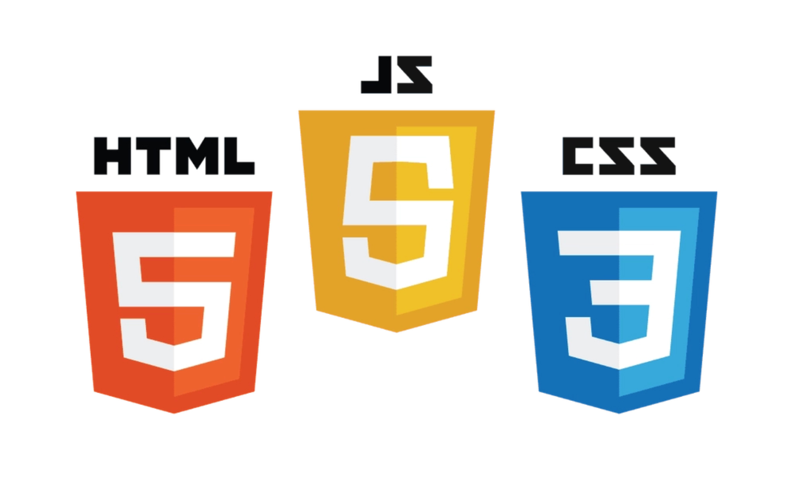
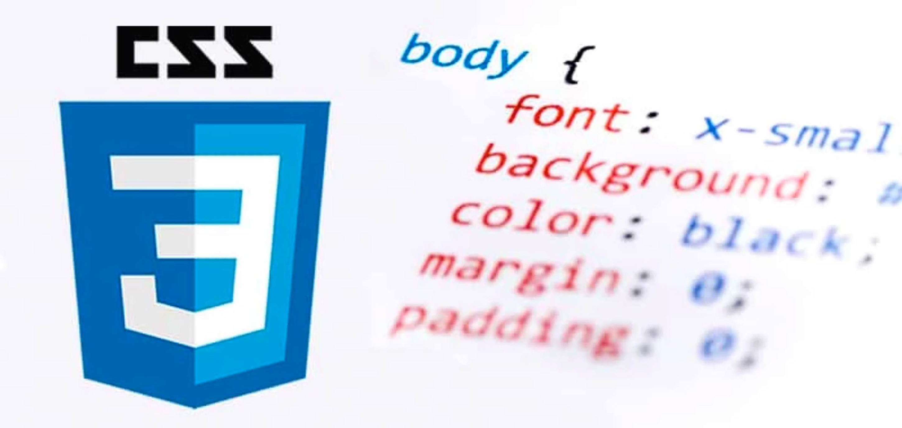
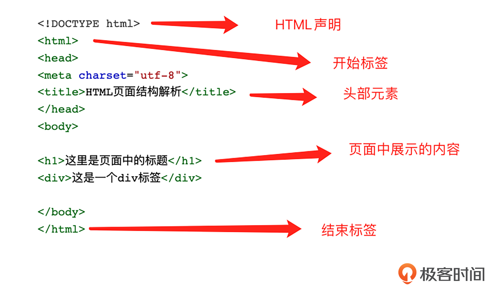
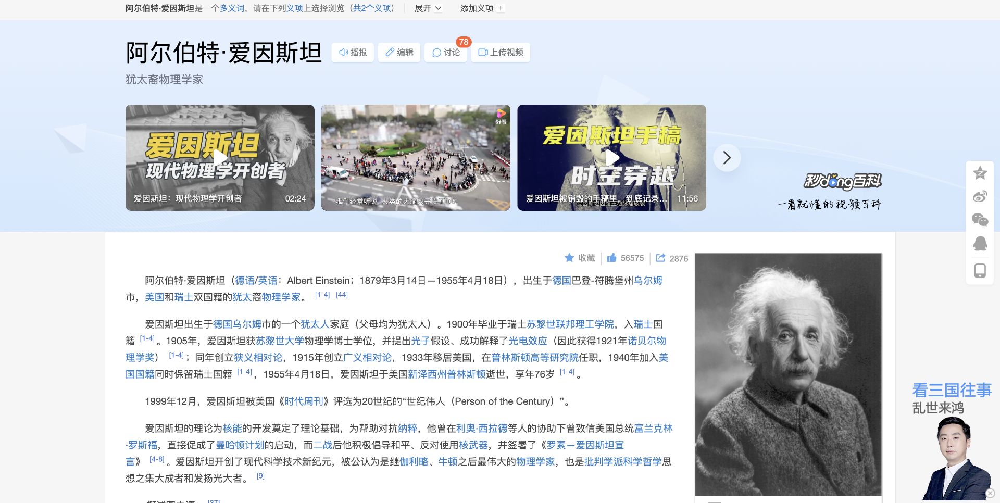
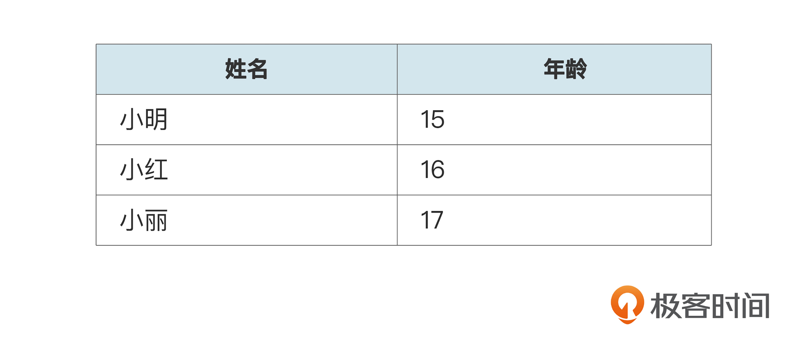
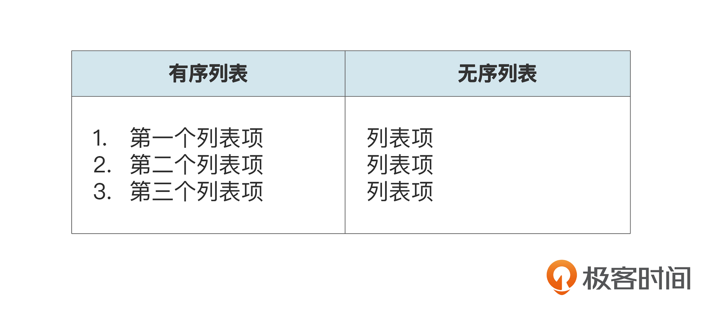
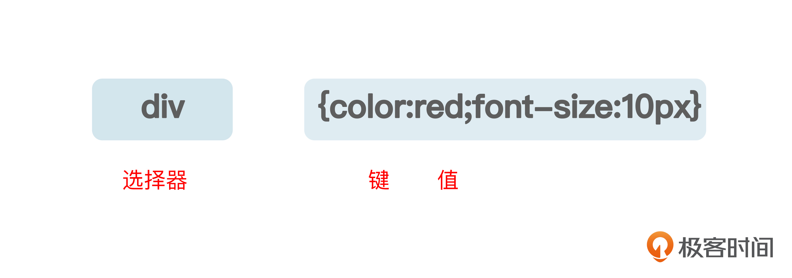
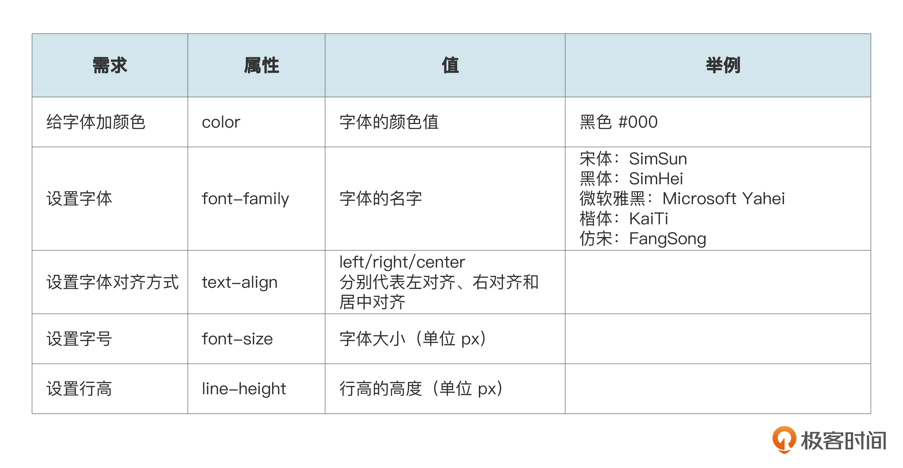
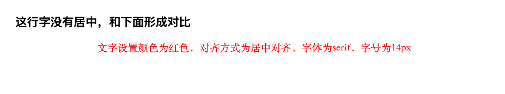
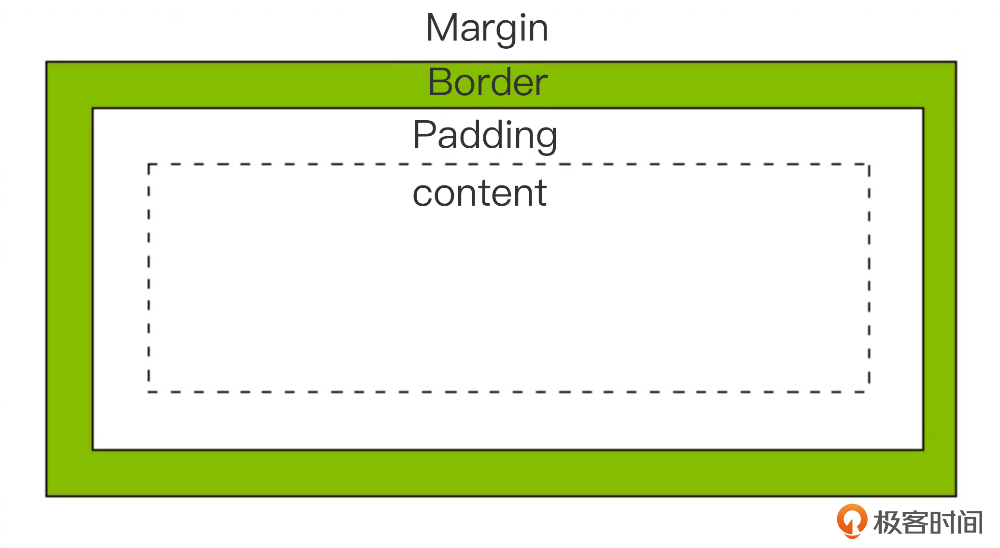

你好，我是悦创。

我们每个人都浏览过无数个 Web 网页，只要打开浏览器里面就有无数网站，每一个网站又由很多个网页组成。

网页的起源要追溯到 1989 年，CERN（欧洲粒子物理研究所）的一个小组提交了一个针对 Internet 的新协议和一个使用该协议的文档系统，该小组将这个新系统命名为 World Wide Web，它的目的是让全球的科学家能够利用 Internet 交流自己的工作文档。



这个新系统允许 Internet 上任意一个用户，从众多文档服务计算机的数据库中搜索和获取文档。1990 年末，这个新系统的基本框架已经在 CERN 的一台计算机上开发实现了。1991 年，这个系统移植到了其他计算机平台并正式发布。

经历了几十年的发展，网页的功能越来越丰富和强大，对于互联网企业来说，网页更是必不可少的。像企业的官网、网页端项目、公司内部管理系统都是常见的网页项目。

想要学习网页前端开发，就需要学习一些前端相关的技术和知识。前端必知必会的核心技术大致可以分为五大块，分别是：

- HTML
- CSS
- JavaScript
- 框架：Vue、React 等
- 打包工具：Webpack、Vite 等

## 1. 前端核心技术模块

### 1.1 HTML

网页最核心的技术就是 HTML 了。我们看到的网页其实就是由 HTML 这种编程语言描述出来的。

HTML 由标签组成，通过标签，我们可以在网页中插入文字、图片、链接、音频、视频等元素，进而描述网页。和 Windows 一样，随着技术的发展，HTML 经历了多次版本更新。后面我还会带你用 HTML 实现一个自己的网页。

### 1.2 CSS

但是，只知道 HTML 还远远不够，组成网页要有三板斧，分别是 HTML、CSS、JavaScript。我们接着就来看下这第二板斧：CSS。



之前我们说过，随着 HTML 的不断发展，人们对 HTML 的要求也越来越高，希望它更加丰富、美观，于是 CSS 就诞生了。

CSS 的官方定义是，层叠样式表（英文全称：Cascading Style Sheets），它是一种用来表现 HTML 的计算机语言。通俗地讲，如果 HTML 是搭建网页的砖瓦的话，那 CSS 就是涂料和装饰，它可以装饰 HTML 里的各种标签元素。

### 1.3 JavaScript

但只有好看的网页仍然不够，人们还想给网页添加一些动态效果。比如常见的可以点击的按钮，页面上可以滚动的图片等等。这时候，我们就需要 JavaScript 了。它的简称是 JS，是一种轻量级的编程语言，主要作用是给网站添加动态效果，也可用作数据请求处理。

### 1.4 框架

学会了前面这些技术之后，其实你就已经可以去实现网站了。至于框架则是用来简化我们工作的工具。什么是框架呢？

框架是可复用的设计构件，每个框架都规定了其应用的结构，应用框架更加关注的是软件的设计高可用和对应系统设计的弹性。框架的优势就是本身帮开发者集成当量的模块和组件，供我们选用，以完成对应的系统开发，这能极大地提高开发者的开发效率和质量。

例如你想要写一个网页，只需要通过代码告诉框架你要一个什么网页（你有什么数据，有什么配置，需要网页上有什么……），框架就会帮你管理这个网页的很多事情，最后给你呈现出一个你要的网页。

准确来说，前端框架指的是用来简化网页设计的框架。开发网页时有很多重复工作，引入框架并按规定好的代码结构编排，不但能够降低开发成本、便于分配资源，控制和延展网页也更轻松。

目前主流的前端框架有 Vue 和 React，这两个框架在企业中的应用都非常广泛。

### 1.5 打包工具

除了框架，打包工具也是开发者的必备武器了，那它到底解决了什么问题呢？

浏览器文件是不会被编译的，并且它支持有限，所以在前端开发过程中，模块打包是非常重要的一块内容。

常用的模块打包工具有 webpack、Parcel、Brow 等，你可能还听过 Vite，它是一种全新的前端构建工具，它类似于 webpack + webpack-dev-server 的组合。所以，综合来看，模块打包工具极大地优化了前端开发者的开发体验，在项目实践环节我们会重点学习。

## 2. 核心技术演练

光说不练假把式，接下来我们就通过练习逐一了解一下各个核心模块。

### 2.1 HTML

你可以复制这段代码，动手写一个自己的网页。

```html
<!DOCTYPE html>
<html>
<head>
    <meta charset="utf-8">
    <title>基础网页</title>
</head>
<body>
    <h1>标题内容</h1>
    <p>文字段落</p>
</body>
</html>
```

这段代码可以实现一个简单的 HTML 页面，下面的图片是对上方代码的拆解，你能清晰地看到页面的整体结构以及不同的块级。核心部分就是 body，主要用来展示页面内容。需要明确的是，、、这几个标签必须存在。



让我们来看看都有哪些常用的 html 标签。

我们先来了解一个使用率较为高的标签——标题字号，这个标签和 Word 中的标题字号一样，我们开发单页面或者小程序相关页面时，那就可以直接通过 H1-H6 来控制内容层级，你不需要再使用 CSS 的 font-size 来控制字体大小，这样能一步到位。

```html
<h1>我是一级标题</h1>
<h2>我是二级标题</h2>
<h3>我是三级标题</h3>
<h4>我是四级标题</h4>
<h5>我是五级标题</h5>
<h6>我是六级标题</h6>
```

网页中经常要出现一段文字，比如首页上要介绍产品等等。当我们要写一段文字的时候，就要使用 p 标签。为了控制换行，中间还要用到 br 标签。

```html
<p>我是一段文字我是一段文字<br>这里换行了哦！我是一段文字我是一段文字</p>
```

当页面中点击文字需要跳转到其他链接时，就要用到 a 标签。比如百度百科里面蓝色的词都是一个链接，点击之后会跳转到这个词的百度百科。



```html
<a href="https://www.baidu.com/">百度一下你就知道</a>
```

我们想要在页面中插入图片时，则要使用 img 标签。比如上图中这个网页要插入爱因斯坦的照片，就要用到 img 标签。

```html

```

页面里也经常会用到表格，这时就要使用 table 标签，每一行用 tr 标签表示，表头的每一个格子用 th 标签，其他行中的每一个格子用 td 标签表示。

比如要显示一个展示姓名和年龄的表格。



那么 HTML 代码就是后面这样。

```html
<table border="1">
    <tr>
        <td>row 1, cell 1</td>
        <td>row 1, cell 2</td>
    </tr>
    <tr>
        <td>row 2, cell 1</td>
        <td>row 2, cell 2</td>
    </tr>
</table>
```

当我们需要在页面里用列表罗列同一类事物的时候，比如今天的课程有哪些、去超市要买的购物清单等等，就需要用到有序列表 ol 标签或无序列表 ul 标签。需要标注 1234 序号的，就用 ol 有序列表，没有序号、都是同一级别的就用无序列表 ul。每一个列表项用 li 标签，后面是具体的实现代码。



```html
<!-->无序列表</-->
<ul>
    <li>列表项</li>
    <li>列表项</li>
    <li>列表项</li>
</ul>
<!-->有序列表</-->
<ol>
    <li>第一个列表项</li>
    <li>第二个列表项</li>
    <li>第三个列表项</li>
</ol>
```

### 2.2 区块元素：div

它是用来划分一个区块的标签。可以分块展示页面内的布局，这就需要用 div 来划分区域。

```html
<div style="background-color:yellow">
    第一区块
</div>
<div style="background-color:red">
    第二区块
</div>
```

还有一些其他的标签，例如表单相关的标签、音频视频标签等，这里就不一一列举了。像[菜鸟 HTML 教程](https://www.runoob.com/html/html-tutorial.html)、[W3school](https://www.w3school.com.cn/html/index.asp) 这些网站都有很多 HTML 标签，如果你有兴趣可以课后去学习。

### 2.3 CSS

前面我们说过，CSS 是给 HTML 做装饰的一门语言，那么它究竟都能怎么装饰呢？我们这就来一探究竟。



需要修改文字的样式时，我们需要用到装饰文本的相关样式，如颜色、对齐方式、字体、字号、行高等。具体的对应关系你可以参考后面的表格。



后面是具体代码示例。

```css
/*给页面上的段落文字设置颜色为红色，对齐方式为居中对齐，字体为serif，字号为14px*/
p {
    color:red;
    text-align:center;
    font-family:serif;
    font-size:14px;
}
```

展示出来就是后面这样。



CSS 除了可以装饰文本，还能装饰超链接标签，也就是 a 标签。a 标签就是超链接标签，默认字体为蓝色，当我们需要更改链接在不同状态下的颜色时，可以在 a 标签后面加上状态。

在 a 之后加上`:link` 表示未访问链接时，`:visited` 表示已访问链接时，`:hover` 表示鼠标移动到链接上悬停时，`:active` 表示鼠标点击时。

这些状态下可以各自设置链接的颜色，你可以参考后面的代码示例。

```css
在a之后加上:link表示未访问链接时，
:visited表示已访问链接时，
:hover表示鼠标移动到链接上悬停时，
:active表示鼠标点击时。
这些状态下可以各自设置链接的颜色：
a:link {color:#000000;}      /* 未访问链接*/
a:visited {color:#00FF00;}  /* 已访问链接 */
a:hover {color:#FF00FF;}  /* 鼠标移动到链接上 */
a:active {color:#0000FF;}  /* 鼠标点击时 */
```

当我们想划分区块时，还可以设置区块的宽、高、内边距、边框、外边距。



```css
/* 给这个区块设置为 宽300px，边框25px绿色，内边距25px，外边距25px*/
div {
    width: 300px;
    border: 25px solid green;
    padding: 25px;
    margin: 25px;
}
```

有没有觉得很神奇呢？

其实所有 HTML 元素都是可以用 CSS 来装饰的。包括但不限于背景色、字体、文字颜色、文字大小、元素的边框、外间距、内间距等等。[菜鸟 CSS 教程](https://www.runoob.com/css/css-tutorial.html) 网站和书籍《CSS 世界》都是不错的学习资源。

### 2.4 JavaScript

JavaScript 主要是用来做数据的动效。JS 动效也是网页中非常常见的，比如图片轮播、点击之后弹出弹窗、请求后端接口、提交表单、弹出小广告，这些功能都能用 JS 动效实现。

为了带你见识一些 JS 的动态效果，我们先来写一个 hello world。首先输入后面的代码。

```javascript
console.log("hello world")
```

然后点击 h1 的文本，这时候我们就会发现，点击之后更改文本内容，内容也变成了“动效实现”。

```html
<!DOCTYPE html>
<html>
<head>
    <meta charset="utf-8">
    <title>JS动效</title>
</head>
<body>
    <h1 onclick="changetext(this)">点击文本，查看动效!</h1>

</body>
<script>
    function changetext(id){
        id.innerHTML="动效实现!";
    }
</script>
</html>
```

### 2.5 弹窗

弹窗是我们经常应用到的组件效果，它是通过 JS 的 alert 方法实现的。

像是一些操作提示、表单数据提交、信息处理等等都可以用到弹窗。弹窗一方面提升了用户体验，另一方面也会提高开发效率，我们不需要再单独开发页面，通过弹窗就能解决需求。

接下来我们再尝试一个简单的小案例，实现网页上的小弹窗。

```html
<!DOCTYPE html>
<html>
<head>
    <meta charset="utf-8">
    <title>这是一个弹窗</title>
</head>
<body>
    <h1 onclick="showAlert()">点击触发弹窗</h1>
</body>
<script>
    function showAlert(){
        alert("在这里你看到弹窗了")
    }
</script>
</html>
```

当然，JavaScript 的功能也非常强大，远不止于此，更多的功能等待你的探索。像[菜鸟 js 教程](https://www.runoob.com/js/js-tutorial.html)，[w3cschool](https://www.w3cschool.cn/javascript/) 网站，还有《JavaScript 权威指南（第 5 版）》这本书也都是不错的学习资料。

## 3. 框架 Vue、React 等

说完语言，我们再来看看框架。最常用的前端框架包括 Vue 和 React。Vue 框架诞生于 2014 年，它的作者是中国人尤雨溪（江苏无锡人）。

[Vue](https://cn.vuejs.org/) 可以构建交互式的 Web 界面的库，是一个构建数据驱动的 Web 界面渐进式框架。近年来 Vue 越来越受欢迎了。从 GitHub 的趋势看，虽然 Angular 和 React 也都是非常优秀的前端框架，但是 Vue 已经排在第一位，达到了 13 万的 Star。

[React](https://react.docschina.org/) 是起源于 Facebook 的内部项目，因为该公司对市场上所有 JavaScript MVC 框架都不满意，就决定自己写一套，用它来架设 Instagram 的网站。这个架构做出来以后，他们发现这套东西很好用，就在 2013 年 5 月开源了。

目前，不管是 BAT 大厂，还是创业公司，Vue 和 React 都有着广泛的应用，相关技术原理也成为了面试中的必考知识点。可以说，对于任何一个前端工程师来说，Vue 和 React 都是一门必修课。

## 4. 打包工具 Webpack、Vite 等

我们最后来看看打包工具，最具代表性的打包工具包括 Webpack、Vite 等。

[Webpack](https://webpack.docschina.org/) 是一个前端资源加载 / 打包工具。它会根据模块的依赖关系进行分析，然后将这些模块按照指定的规则生成对应的静态资源文件。

[Vite](http://www.fenovice.com/doc/vitejs/guide/) 的定位是下一代前端开发与构建工具，它能显著改善前端开发体验。使用 Vite 进行开发至少会比使用 Webpack 快 10 倍左右。但它的缺点是生态不如 Webpack 成熟，相信以后会越来越完善。

## 5. 前端学习建议

这些课上我提到的技术都是企业中主流的核心技术，希望能帮你梳理好学习方向。最后我再分享一些编程学习方法。

第一，入门时期多在网上搜教程，跟着课程写代码，多练习，一定要自己去实现。

第二，看一些知名的前端书籍，多看官方文档，跟着学习。

第三，在 GitHub 上搜索一些项目，看一些好的代码并跟着练习。我列出了一些推荐链接，供你参考。

- [https://lhammer.cn/You-need-to-know-css/#/zh-cn/](https://lhammer.cn/You-need-to-know-css/#/zh-cn/)
- [https://less.bootcss.com/](https://less.bootcss.com/)
- [https://github.com/Summer-andy/chrome-extensions-searchReplace](https://github.com/Summer-andy/chrome-extensions-searchReplace)
- [https://github.com/VincentGarreau/particles.js](https://github.com/VincentGarreau/particles.js)

最后，你还可以尝试看一些好的网站，然后自己仿照它去实现一个一模一样的。

## 6. 总结

课程到这里就接近尾声啦，我们回顾一下这节课的内容。

为了让你对前端知识模块有个整体认识，我们梳理了前端学习要重点关注的内容，核心就是 HTML、CSS、JavaScript、框架打包工具这五大模块，这能让你对自己的学习有个全面规划。

之后我们结合一些简单的案例应用，依次探索了这五个模块。主要是帮你明确这些工具的用法、适合去解决哪些问题。HTML 的常见标签、CSS 的常见属性和通过 JS 添加事件这几部分，你在课后要着重练习。

最后我还带你了解了前端的两大主流框架——Vue 和 React。熟悉这些框架，明确如何选用合适的框架来提高我们的开发效率，这也是一名研发工程师的必备能力。

## 7. 思考题

后面是一段 HTML 代码，呈现的内容就是有 p 标签的“变化前 - 1”，还有一个按钮写着“文本变换”，点击网页上的按钮，让 p 标签里的文字变成“变化后 -2”，这里就是让你再次应用一下 JS 动效，快来试试吧！

```html
<!DOCTYPE html>
<html>
<head>
    <meta charset="utf-8">
    <title>动效小测试</title>
</head>
<body>
    <p>变化前-1</p>
    <button>文本变换</button>
</body>
</html>
```

欢迎你在留言区和我交流互动，如果这节课对你有帮助，也推荐你分享给身边的朋友。


欢迎关注我公众号：AI悦创，有更多更好玩的等你发现！

::: details 公众号：AI悦创【二维码】


:::

::: info AI悦创·编程一对一

AI悦创·推出辅导班啦，包括「Python 语言辅导班、C++ 辅导班、java 辅导班、算法/数据结构辅导班、少儿编程、pygame 游戏开发」，全部都是一对一教学：一对一辅导 + 一对一答疑 + 布置作业 + 项目实践等。当然，还有线下线上摄影课程、Photoshop、Premiere 一对一教学、QQ、微信在线，随时响应！微信：Jiabcdefh

C++ 信息奥赛题解，长期更新！长期招收一对一中小学信息奥赛集训，莆田、厦门地区有机会线下上门，其他地区线上。微信：Jiabcdefh

方法一：[QQ](http://wpa.qq.com/msgrd?v=3&uin=1432803776&site=qq&menu=yes)

方法二：微信：Jiabcdefh

:::


