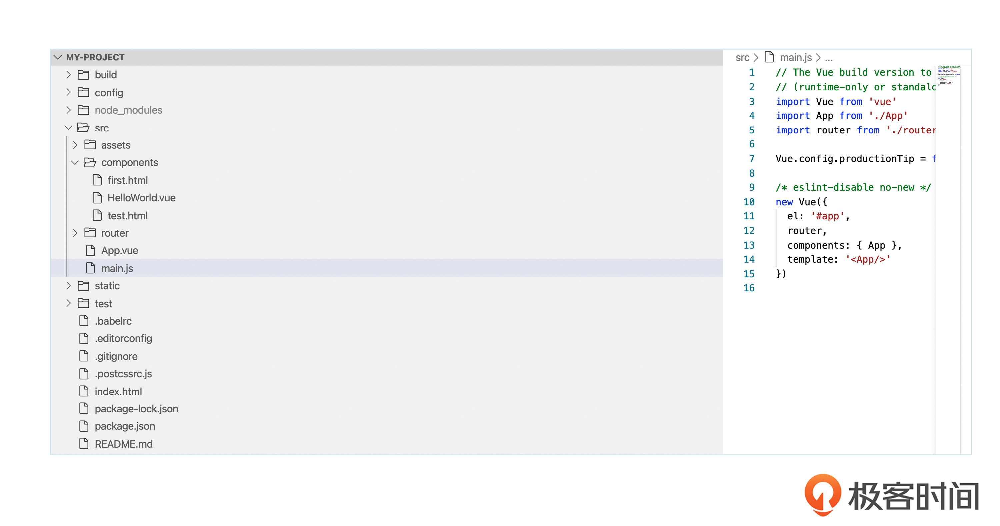
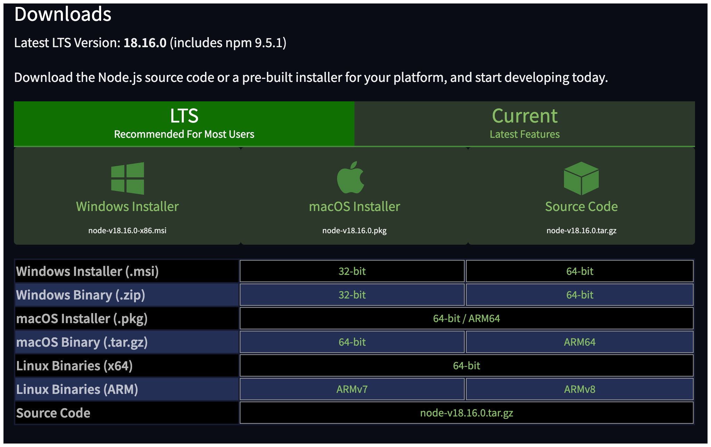
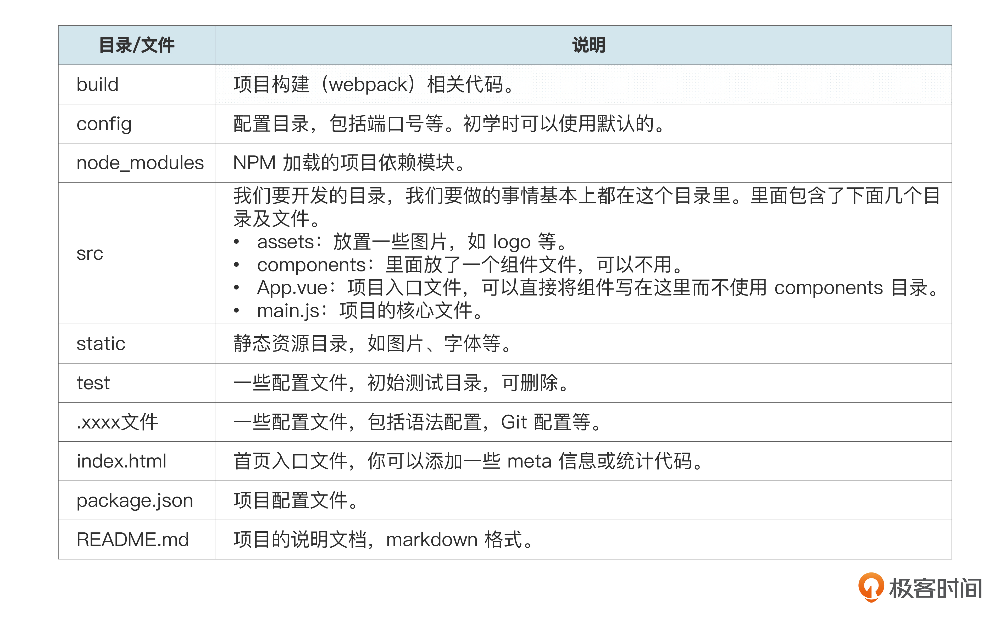
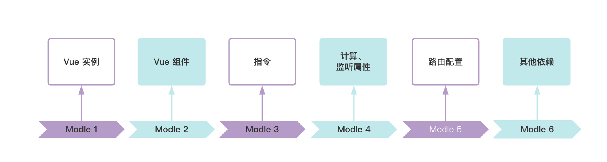
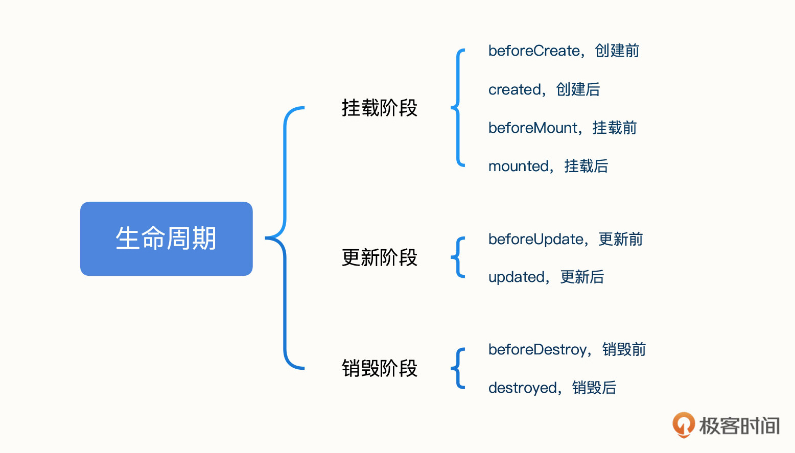
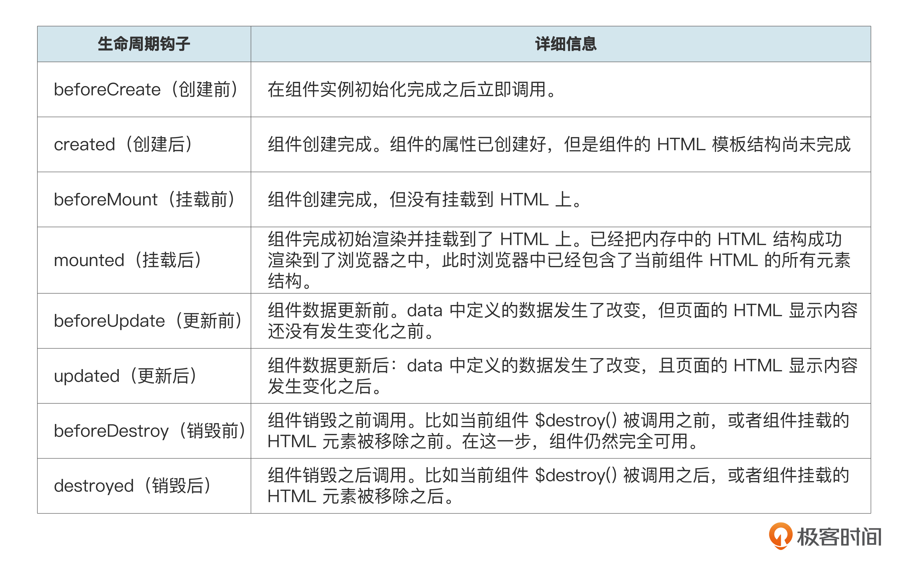
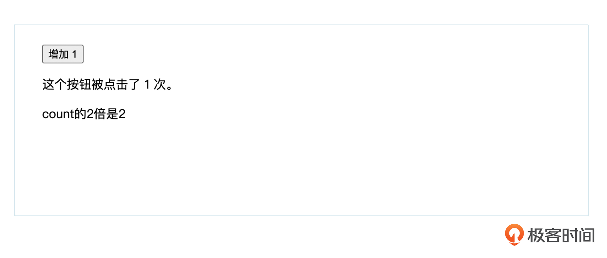
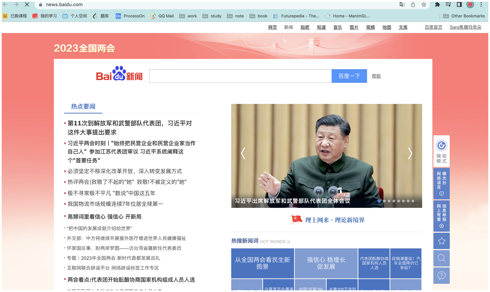
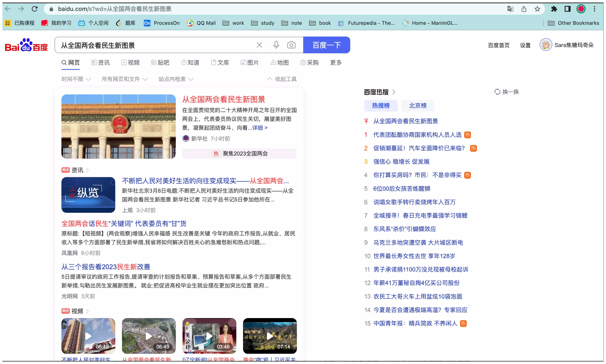

你好，我是悦创。

相信想要学习前端的你一定听说过 Vue 框架。

Vue 和 React 都是 Web 前端工程师必学必会的框架，在企业中有着广泛的应用。这节课我们就来揭开 Vue 的神秘面纱，一起来看看 Vue 里必须掌握的知识点，以及怎样学习 Vue 才更加高效。


Vue 是一款用于构建用户界面的 JavaScript 框架。它基于标准 HTML、CSS 和 JavaScript 构建，并提供了一套声明式的、组件化的编程模型。无论是简单还是复杂的界面，Vue 都可以胜任，可以说是我们高效开发用户界面的一大利器。

Vue 有三个核心特性。

- 声明式渲染：Vue 基于标准 HTML 拓展了一套模板语法，方便我们以声明式描述最终输出的 HTML 和 JavaScript 状态之间的关系。
- 响应性：Vue 会自动跟踪 JavaScript 状态，并在它发生变化时响应式地更新 DOM。
- 双向数据绑定：JS 数据的变化会被自动渲染到页面上，Vue 还可以自动获取页面上发生变化的表单数据，并更新到 JS 数据中。

了解 Vue 的核心特性还远远不够，要真正认识 Vue，我们还需要了解 Vue 的项目框架。

## 1. 目录结构

我们这就来看看 Vue 的目录包含哪些内容，它们的用途又是什么。

下面是 Vue-cli 脚手架项目目录，也是我们课程开发中用的标准框架。



通过脚手架的搭建，我们可以快速地实现开发。在脚手架搭建过程中，首先保证你的本地是有配置安装 Node.js 的环境，Node.js 就是运行在服务端的 JavaScript。是一个基于 Chrome JavaScript 运行时建立的一个平台。是一个事件驱动 I/O 服务端 JavaScript 环境，基于 Google 的 V8 引擎，V8 引擎执行 Javascript 的速度非常快，性能非常好。下面我也给你写了安装的地址：

下载地址：[https://nodejs.org/en/download/](https://nodejs.org/en/download/)

你直接根据自己电脑的系统，直接下载 LTS 稳定版本就可以了。



在 Node.js 安装成功之后，我们还需要使用到一个工具，也就是 NPM。NPM 是随同 NodeJS 一起安装的包管理工具，能解决 NodeJS 代码部署上的很多问题，常见的使用场景有以下几种。

1. 允许用户从 NPM 服务器下载别人编写的第三方包到本地使用。
2. 允许用户从 NPM 服务器下载并安装别人编写的命令行程序到本地使用。
3. 允许用户将自己编写的包或命令行程序上传到 NPM 服务器供别人使用。

安装好 Node.js 之后，NPM 就会自动安装好。安装好之后，打开控制台，输入 `npm -v` 命令，命令行显示 npm 版本，这时候就代表安装成功。

接下来，我们快看看 vue-cli2.5 怎样安装搭建。

第一步：自己在本地创建一个项目文件，再使用 Mac 在终端文件目录下执行命令，Windows 在通过 cmd 在对应文件目录下执行命令。

```shell
# 全局安装 vue-cli
$ cnpm install --global vue-cli
# 创建一个基于 webpack 模板的新项目
$ vue init webpack my-project
# 这里需要进行一些配置，默认回车即可
This will install Vue 2.x version of the template.

#Project name：项目名称，此处你可以选择更改，直接按下回车键，自动默认为初始输入的项目名称test-project
#Project description：项目描述，自己输入
#Author：项目开发人员
#Vue build:项目构建模式，默认即可，按下回车
#Install vue-router：项目是否安装vue路由，选择yes，进行安装
#Use ESLint to lint your code：是否选择ESLint开发验证功能，新手选择no
#Set up unit tests：是否开启单元测试，建议选择y，在后期开发中一定会用到的
```

完成前面的步骤之后，我们进入项目，安装并运行后面的命令。

```shell
cd my-project
cnpm install //这一步用于安装项目依赖和工具包，是必须执行的，否则项目无法启动
npm run dev //这是启动命令，在对应的项目路径下执行就可以
 DONE  Compiled successfully in 4388ms //看到这个信息就代表安装成功了

> Listening at http://localhost:8080 //在浏览器中访问这个地址
```

这样我们的脚手架就搭建成功了。下面我用表格的形式目录里梳理了每个文件的作用，供你参考。



了解了 Vue 的目录结构及其作用之后，我们就可以进一步学习 Vue 的核心技术了。

## 2. Vue 必备学习知识点

你可以先看一下 Vue 的知识地图，一共有六个部分。



虽然看着有点多，但不用担心，跟着我的讲解和示例代码，你很快就能理解。

### 2.1 Vue 实例

要使用 Vue，我们首先要实例化 Vue 来声明一个 Vue 应用。具体语法格式如下。

```vue
var vm = new Vue({
  // 选项
})
```

下面我们来看一个实例化 Vue 的例子。

```html
<div id="app">
    <p>{{message}}</p>
</div>
<script type="text/javascript">
    var vm = new Vue({
        el: '#app',
        data: {
            message: "我的第一个Vue应用"
        },
        methods: {
            printMessage: function() {
                console.log(this.message)
            }
        }
    })
</script>
```

可以看到，在 Vue 构造器中有一个 el 参数，它是要挂载的 HTML 元素的 id。上面实例的 id 为 app。

接下来的 data 用于初始化数据，methods 用于定义函数方法，Vue 通过使用 `{{}}` 将 js 定义的数据显示在了 HTML 中。

### 2.2 Vue 组件

每个 Vue 应用又由很多个 Vue 组件组成。一般来说，每个页面都是应用的一个组件，页面中需要被重复用的的部分也会单独拆分成一个组件。

#### 2.2.1 模版语言

我们一般会将 Vue 组件定义在一个单独的  `.vue` 文件中，叫做单文件组件。

Vue 的单文件组件分为三块：

- template 标签中是模版，用来写 HTML；
- script 标签中写的是 js，负责定义数据和方法；
- style 标签中写的是 CSS，负责给模版中的 HTML 添加样式。

```html
<template>
<div id="MyComponent">
  <h1>{{title}}</h1>
  <p>我有{{count}}个苹果</p>
</div>
</template>    
<script>
export default {
    name: 'MyComponent',
    data(){
    //这里定义数据
      return{
        title:"啦啦啦啦啦"
        count: 1
      }
  },
  methods:{
    //这里定义方法
    printHello(){
      console.log("hello")
    }
  }
}
</script>
<style lang="css" scoped>
p{
  font-size:12px;
}
</style>
```

组件之间可以进行嵌套，比如组件 A 要引用组件 B，可以把组件 B 的文件引进来，并在组件 A 的 components 中加入组件 B。

举个实际的例子，一个项目中很多地方都需要用到日历选择组件。为了提升开发效率，日历选择这个功能就要单独定义成一个组件。比如预约下单页里需要用到日历选择组件，具体的代码实现如下。

```html
<template>
  <h1>Here is a child component!</h1>
  <DatePicker />
</template>
<script>
import DatePicker from './DatePicker.vue'
export default {
  components: {
    DatePicker
  }
}
</script>
```

#### 2.2.2 组件通信

引用其他组件时，如果两个组件之间的数据需要被对方知道，我们就需要组件之间的通信了。比如当前页面是 A 组件，它引用了 B 组件。A 组件需要知道 B 组件中定义的数据，那么它们就需要通信。

我们沿用前面日历的例子，当前页面是订单预约组件，里面用到了日历选择组件，用户在日历选择器中选择了哪一天是日历选择组件中定义的数据。现在订单预约页面需要下单完成预约，这时它就要知道用户到底选择了哪一天，通信需求就产生了。

#### 2.2.3 生命周期

除了组件的模板语言和通信，我们还要了解 Vue 组件完整的生命周期，它指的是创建组件、初始化数据、编译模板、挂载 DOM、渲染、更新、再次渲染、卸载等一系列过程。在这些过程的前后我们都要执行相应的方法，这些方法就叫做钩子函数。

如下图所示，Vue 组件的生命周期中有 8 个常用的钩子函数（音频里我对每个函数做了更详细的讲解，你可以仔细听一下）。






为了让你进一步理解这些函数，我为你准备了相关代码。运行之后，你就能看到生命周期钩子函数的执行先后顺序。

```js
export default {
  beforeCreate() {
    console.log(`the vue is beforeCreate.`)
  },
  created() {
    console.log(`the vue is created.`)
  },
  beforeMount() {
    console.log(`the vue is beforeMount.`)
  },
  mounted() {
    console.log(`the vue is mounted.`)
  },
  beforeUpdate() {
    console.log(`the vue is beforeUpdate.`)
  },
  updated() {
    console.log(`the vue is updated.`)
  },
  beforeDestroy() {
    console.log(`the vue is beforeDestroy.`)
  },
  destroyed() {
    console.log(`the vue is destroyed.`)
  }
}
```

### 2.3 指令

在我们的日常开发过程中，使用 Vue 指令的频次还是非常高的，它是我们应用 Vue 必不可少的模块。Vue 的指令可以帮助我们巧妙地完成一些需求，同时也可以优化代码。那指令到底是什么？有什么功能呢？

指令是 Vue 为开发者提供的模板语法，它可以辅助开发者渲染页面的基本结构，完成相关数据的处理工作。Vue 官网是这样定义的。

> 一个指令的本质是模板中出现的特殊标记，让处理模板的库知道需要对这里的 DOM 元素进行一些对应的处理。

指令的前缀是默认的  v-，Vue 中常见的指令包括后面几种。

- v-if
- v-show
- v-for
- v-bind
- v-on
- v-model

#### 2.3.1 v-if

如果我们想对是否存在 HTML 元素进行条件判断，就可以使用 v-if 指令。如果条件是 true 则元素存在，若条件是 false 则移除这个元素。我们经常把它用在组件的隐藏和显示上。

v-if 指令具体又包括 v-if ，v-else-if , v-else。我们通过一个简单的案例来学习应用一下它。

```html
<div id="app">
    <div v-if="type === 'A'">
      A
    </div>
    <div v-else-if="type === 'B'">
      B
    </div>
    <div v-else-if="type === 'C'">
      C
    </div>
    <div v-else>
      Not A/B/C
    </div>
</div>
    
<script>
new Vue({
  el: '#app',
  data: {
    type: 'C'
  }
})
</script>
```

程序中的 “type” 值，是在 data 中定义的值，初始化为 “C”，在上面这段程序中，我们通过 v-if 来判断 type 的值，以此控制最终显示在界面上的 div 是哪一个。

第一个 div 的意思就是：“如果 type 的值等于 A，就展示对应的内容 A”。第二个同理：“如果 type 等于 B，就展示内容 B”，第三个 div 也是如此。最后一个 v-else 代表的含义是：“如果以上三种情况都不满足，那么就展示内容 Not A/B/C”。

#### 2.3.2 v-show

与 v-if 较为相似的就是 v-show。当我们需要根据条件来控制是否展示某元素时，经常会使用 v-show 指令。它初始化的值就是 true 或 false，如果为 true，则表示展示元素，如果为 false，就直接不展示元素。后面的案例就体现了这种思想。

```html
<div id="app">
    <div v-show="show">
      lalalalala
    </div>
</div>
    
<script>
new Vue({
  el: '#app',
  data: {
    show: true
  }
})
</script>
```

#### 2.3.3 v-for

在元素需要循环展示的时候，我们会选择使用 v-for 指令。v-for 的核心思想就是用 for 循环遍历元素。在后面这个案例中，students 数组中包含三个 name，那我们在元素展示的时候，就不需要一个一个地去写了，直接通过 v-for 就可以遍历 students 中的所有元素，同时内容也会全部呈现在页面上。

```html
<div id="app">
  <ol>
    <li v-for="s in students">
      {{ s.name }}
    </li>
  </ol>
</div>
 
<script>
new Vue({
  el: '#app',
  data: {
    students: [
      { name: 'zhangsan' },
      { name: 'lisi' },
      { name: 'wangwu' }
    ]
  }
})
</script>
```

#### 2.3.4 v-bind

当页面上 HTML 标签的属性需要用到 data 里定义的数据时，我们就需要用 v-bind 指令将数据的值拼接到属性里了。示例如下。这时候的 class 是一个动态值，我们需要判断 isActive 的值来决定最终 class 是 active 还是 default，从而控制呈现样式。

```html
<div id="app">
  div v-bind:class="{ isActive?'active':'default' }"></div>
</div>
 
<script>
new Vue({
  el: '#app',
  data: {
    isActive: true
  }
})
</script>
```

v-bind 也可以省略，我们可以直接用冒号 “`:`” 代表“`v-bind:`”。

#### 2.3.5 v-on

v-on 的指令呢，主要用于给元素绑定事件监听器。最常见的应用场景就是与 button 相结合，绑定它的 click 事件，只有这样我们点击时才会触发相应的方法。

下面这个案例主要是做了一个小的测试，我们每次点击都会让 counter 的值加 1。当然，你也可以直接给 click 绑定一个方法，然后在点击按钮的时候触发它，从而实现相关操作。

```html
<div id="app">
  <button v-on:click="counter += 1">增加 1</button>
  <p>这个按钮被点击了 {{ counter }} 次。</p>
</div>
 
<script>
new Vue({
  el: '#app',
  data: {
    counter: 0
  }
})
</script>
```

v-on 还可以更简略地用 @来表示，这样我们不需要写全 v-on 也能绑定和触发点击事件。

```html
<div id="app">
  <button @click="counter += 1">增加 1</button>
  <p>这个按钮被点击了 {{ counter }} 次。</p>
</div>
```

#### 2.3.6 v-model

v-model 指令可以在表单控件元素上创建双向数据绑定。

这里的意思是，对于一些可输入或可选择的表单控件，当用户在页面上操作时，data 属性的值会跟着变化；当 data 属性的值发生变化时，页面上显示的内容也会同时变化。

```html
<div id="app">
  <p>input 元素：</p>
  <input v-model="message" placeholder="编辑我……">
  <p>消息是: {{ message }}</p>
    
  <p>textarea 元素：</p>
  <p style="white-space: pre">{{ message2 }}</p>
  <textarea v-model="message2" placeholder="多行文本输入……"></textarea>
</div>
 
<script>
new Vue({
  el: '#app',
  data: {
    message: '输入框的内容',
    message2: '多行文本框的内容'
  }
})
</script>
```

### 2.4 计算、监听属性

此外，我们还必须要了解计算和监听属性。我们会在很多场景使用计算和监听，例如系统中的消息提示，需要在检测到值的变化时就通知用户。我们一起来看看计算和监听属性的具体应用。

#### 2.4.1 compute 计算属性

当我们通过对已在 data 里定义好的值进行计算监听的时候，就可以通过 compute 计算出我们想要得到的新的值的结果。这里要注意的就是，最终得到的值不可以在 data 中初始化定义。

这么说有点抽象，我们结合案例来理解。我们依然通过 click 事件来触发 count 加 1 的操作。这里我们对 doubleCount 进行计算，它是 count 的 2 倍。可以看到，通过 compute 的监听计算，当 count 的值发生变化时，doubleCount 自动变为了 count 的 2 倍。

```html
<template>
<div id="app">
  <button @click="count += 1">增加 1</button>
  <p>这个按钮被点击了 {{ count }} 次。</p>
  <!-->使用由compute计算得出的变量：doubleCount<-->
  <p>count的2倍是{{doubleCount}}</p>
</div>
</template>
<script>
export default {
  data() {
    return {
      count:1
    }
  },
  computed: {
    // 每当 count 改变时，这个函数就会执行
    doubleCount() {
      return count*2
    }
  }
}
</script>
```

执行结果如下。



#### 2.4.2 watch 监听属性

watch 用于值的监听，它与 compute 的不同之处在于，它监听的值必须要在 data 中进行初始化，才能通过 watch 来响应 data 数据的变化。

下面这个案例监听的是 count 的变化。当 count 的值大于 10 时，会在控制台打印“count 超过 10 了”。在 watch 监听方法内，newValue 代表 count 最新的值，oldValue 表示的是最初始的值，这样就能够及时监听值的变化，执行后续操作了。

```html
<template>
<div id="app">
  <button @click="count += 1">增加 1</button>
  <p>这个按钮被点击了 {{ count }} 次。</p>
</div>
</template>
<script>
export default {
  data() {
    return {
      count:1
    }
  },
  watch: {
    // 每当 count 改变时，这个函数就会执行
    count(newValue, oldValue) {
      if (newValue>10) {
        console.log("count超过10了")
      }
    }
  }
}
</script>
```


### 2.5 路由配置

要想全面使用 Vue，路由配置也是必须要掌握的。

为了让你明确路由是什么，我举个例子。当我们打开一个网站，经常会跳转到其他的页面。“路由”的作用就是控制页面的地址和显示页面的关系。比如百度新闻 [news.baidu.com](https://news.baidu.com/) 是一个网站，页面中会有很多可以点击的新闻。



比方说，点击热搜新闻词下的“从全国两会看民生新图景”就会来到一个新的页面，地址是 [https://www.baidu.com/s?wd=从全国两会看民生新图景](https://www.baidu.com/s?wd=从全国两会看民生新图景)。



点击其他词条也是一样的效果，都会跳转到一个新的页面。

这些网址和要显示的网页之间的一一对应关系，就是由前端开发人员配置的，而这个操作就叫做路由配置。简单概括一下路由配置的流程：先定义一个网址，然后再配置这个网址对应的网页。那么用户只要打开这个网址，就会看到我们配置好的网页了。

### 2.6 Vue 整合其他依赖

Vue 作为一个可拓展的框架，还可以和第三方依赖一起整合使用。比如常见的依赖有 UI 组件库 element-UI；发送 HTTP 请求的依赖 Axios 等等。它具有非常强大的整合能力，给我们的开发工作提供了极大的便利，让我们可以用优质的代码开发更全面的项目。

具体如何引入第三方依赖，之后我们在项目实践环节展开。这里你先了解结合项目开发，在恰当的时候使用第三方依赖，能够提高开发效率就可以了。

## 3. Vue 学习指南

学到这里，我相信你已经对 Vue 有了更为深入的认识。如果在学完这个专栏之后，你还想学习更多 Vue 相关的知识，应该从哪里入手呢？我给你推荐一些学习方法。

- 要学习一个新框架，最权威的肯定是[官方文档](https://cn.vuejs.org/)，我们可以直接在官网上学习，先按照步骤照着示例代码写个最简单的 demo。
- 但是有时官方文档不够详细，或者我们不能完全看懂某些知识点，这时就需要借助其他书籍和课程来学习和补充了。我推荐你看看《Vue.js 设计与实现》这本书。
- 最后，我们还可以尝试开发一个自己的项目，或者打开 [GitHub](https://github.com/)，搜一些相关项目，对照着自己实现一下。一个复杂的多页面项目会应用到前面所讲的所有核心知识点。这个过程会加深你对知识的理解，帮助你具备能从 0 到 1 去做项目的能力。

当然，在我们后面的课程中，我也会带着你更详细地学习 Vue 的核心知识，掌握在真实的项目中使用 Vue 的方法。

## 4. 总结

我们来回顾一下这节课的重点。这节课我们初步了解了 Vue，学习了 Vue 的核心特点和设计理念。Vue 是一款用于构建用户界面的 JavaScript 框架，它可以帮助我们高效地开发一些平台，整体的学习成本也比较低。我们重点关注了 Vue 的三大核心特性：声明式渲染、响应性、双向数据绑定。

学习 Vue，我们可以从 Vue 项目的目录结构入手，这是我们必须要掌握的模块。只有牢记各个文件目录，在实战环节我们才能更加熟练地应用 Vue，更高效地搭建项目工程。

Vue 必备的知识点包括 Vue 实例、组件、指令、计算与监听、路由配置、整合其他依赖这几个核心模块。

其中组件是开发工程中使用最多的；生命周期能够控制整个页面执行的“节奏”，这样针对不同的业务需求，可以分逻辑执行；指令在整个开发过程中起着非常巧妙的作用，不管是 DOM 的操作还是数据处理，指令都能巧妙地解决功能需求。

计算监听属性也是开发过程中的一把“利器”，不管是实现单个组件监控，还是多组件数据联动，都可以通过计算属性来解决问题，它在我们后续的项目实战中也会有很多应用，到时我们再深入探讨。此外，这节课提到的路由模块，之后前端实战篇我还会专门带你掌握它的应用，敬请期待。

虽然这节课把 Vue 实战时最核心的部分都覆盖到了，但如果你想进一步扩展自己的知识版图，不妨参考我分享的学习方法课后继续深挖。

## 5. 思考题

Vue 采用了 MVVM 架构思想的框架，你知道什么是 MVVM 吗？

欢迎你在留言区和我交流互动，也推荐你把这节课分享给更多朋友。


欢迎关注我公众号：AI悦创，有更多更好玩的等你发现！

::: details 公众号：AI悦创【二维码】


:::

::: info AI悦创·编程一对一

AI悦创·推出辅导班啦，包括「Python 语言辅导班、C++ 辅导班、java 辅导班、算法/数据结构辅导班、少儿编程、pygame 游戏开发」，全部都是一对一教学：一对一辅导 + 一对一答疑 + 布置作业 + 项目实践等。当然，还有线下线上摄影课程、Photoshop、Premiere 一对一教学、QQ、微信在线，随时响应！微信：Jiabcdefh

C++ 信息奥赛题解，长期更新！长期招收一对一中小学信息奥赛集训，莆田、厦门地区有机会线下上门，其他地区线上。微信：Jiabcdefh

方法一：[QQ](http://wpa.qq.com/msgrd?v=3&uin=1432803776&site=qq&menu=yes)

方法二：微信：Jiabcdefh

:::


